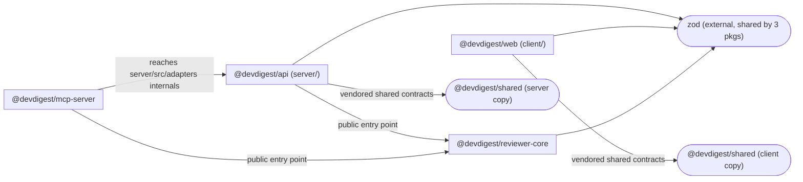

# Dependency Checker

Audit dependencies at two levels — **external** (npm packages per `package.json`) and **internal** (cross-package/module imports via TypeScript path aliases, since this repo is not a monorepo) — and report a graph, sizes, and prioritized, actionable findings.

Always run all four steps below and produce all four output sections. A dependency report with a graph but no prioritization, or findings with no severity, is incomplete.

---

## Scope

| Package | npm name | Path | package.json |
|---|---|---|---|
| API server | `@devdigest/api` | `server/` | `server/package.json` |
| Web client | `@devdigest/web` | `client/` | `client/package.json` |
| Reviewer core | `@devdigest/reviewer-core` | `reviewer-core/` | `reviewer-core/package.json` |
| E2E tests | `@devdigest/e2e` | `e2e/` | `e2e/package.json` |
| MCP server | `@devdigest/mcp-server` | `mcp-server/` | `mcp-server/package.json` |
| Shared contracts (vendored) | `@devdigest/shared` | `server/src/vendor/shared/` **and** `client/src/vendor/shared/` | alias only, no own package.json |
| UI kit (vendored) | `@devdigest/ui` | `client/src/vendor/ui/` | alias only, client-only |

`@devdigest/shared` is **vendored twice** (copied into both `server/` and `client/`, not symlinked) — check whether the two copies have drifted apart; that's a real finding, not a false positive. Per root `CLAUDE.md`, `server/src/vendor/shared/` is do-not-touch without coordination — never propose editing it directly, only flag drift.

Internal dependencies are **not** `workspace:*` entries — they are TypeScript path aliases (each package's `tsconfig.json` `paths`) and relative imports crossing package boundaries. Treat "internal dependency" and "external npm dependency" as separate analyses; do not conflate them in the graph or the size table.

If `e2e/` (or any package) has no `node_modules` installed, don't guess its size — report it as skipped in the Scope section of the output instead.

---

## Step 1 — Discover dependencies

**External, per package:** read each `package.json`'s `dependencies` and `devDependencies`. Note version, and flag if a package appears in more than one `package.json` with different major versions (version drift).

**Internal, per package:** grep each package's `tsconfig.json` for `paths`, then grep `src/` for imports matching those aliases or relative paths that cross a package boundary. Record the direction of each edge (importer → imported) and count occurrences to gauge coupling strength. Pay special attention to whether an alias resolves to another package's **public entry point** (e.g. `../reviewer-core/src/index.ts`) or reaches into that package's internals (e.g. a path alias or relative import landing inside another package's `src/` subfolders, bypassing its `index.ts`) — the latter is a coupling red flag, not just a data point.

**For every internals-reach edge found above, also check whether it's covered by CI.** An alias that bypasses a public entry point is only a compile-time risk if something actually compiles against it; grep `.github/workflows/` for a job that runs the *importing* package's typecheck/tests. If no workflow exercises the importer, a breaking change on the producer side can merge without ever running the code that depends on it — that's a bigger risk than the alias itself, and a package with no CI workflow at all (not just no job matching this edge) is worth calling out on its own even before considering coupling.

**Also watch for hand-duplicated constants across a coupling boundary** — a value (model name, default path, magic string, timeout) copied into two or more packages instead of imported from a shared source, typically flagged only by a comment like "keep in sync with X". Grep for such comments near literals on both sides of an edge you've already mapped; a value enforced by a comment has the same drift risk as an unpinned version range and belongs in the findings the same way.

Do not count devDependencies used only for tooling (vitest, eslint, tsc, prettier) as architectural dependencies in the graph — list them separately in the size table if relevant to size, but exclude them from the Mermaid diagram to keep it readable.

---

## Step 2 — Draw the dependency graph

Produce one Mermaid `flowchart LR` (see the `mermaid-diagram` skill for syntax if needed) with:

- One subgraph per package in scope, labeled with the package name from the table above
- Edges between packages for internal (alias) dependencies, labeled with the alias or a short description (e.g. `shared contracts`, `reaches into server/src/adapters`)
- External dependencies only included if they are large (>5MB unpacked) or shared across ≥2 packages — draw these as a single shared node (e.g. `zod`) with edges to each consuming package, not one node per package
- Do not draw edges for transitive dependencies — only direct imports

Example shape:



If the graph would exceed ~20 nodes, collapse leaf packages with only one edge into a "misc" note rather than omitting them silently — state what was collapsed.

---

## Step 3 — Size breakdown

For each package, produce a table of its heaviest **direct** dependencies by installed size. Get sizes with:

```bash
du -sh <package>/node_modules/<dep-name> 2>/dev/null
```

or, if `node_modules` isn't installed for a package, report "not installed — run the install command for that package to size it" rather than guessing.

Table format, one per package, sorted descending by size:

| Dependency | Version | Installed size | Used by (files) | devDependency? |
|---|---|---|---|---|
| `next` | 15.x | 120M | `client/src/app/**/*.tsx` | no |

Then a **repo-wide total**: sum of `node_modules` size per package (`du -sh <package>/node_modules`), and call out the single largest dependency across the whole repo.

---

## Step 4 — Prioritize findings and give recommendations

Classify every finding into exactly one severity tier. Do not invent additional tiers.

| Tier | Criteria |
|------|----------|
| **P0 — Fix soon** | Circular internal dependency; a package importing directly from another package's `src/` internals instead of its public entry point/alias (e.g. `mcp-server` reaching into `server/src/adapters/*`), **especially if that importing package has no CI workflow covering it at all** (check `.github/workflows/` — no workflow means the break is only caught if a human remembers to run the importer's typecheck/tests locally); a dependency with a known critical CVE (only claim this if you actually checked, e.g. via `npm audit`, don't guess); the two vendored `@devdigest/shared` copies (`server/` vs `client/`) have diverged in a way that could cause contract mismatches |
| **P1 — Should address** | Version drift (same package, different majors, across packages); a heavy dependency (>20MB) used for a trivial subset of its functionality; an unused dependency (declared but no matching import found); a constant or config value hand-duplicated across a package boundary with only a comment (not an import) enforcing that the copies match |
| **P2 — Worth considering** | A devDependency that could be a peerDependency/optional; duplicate functionality across two different packages solving the same problem (e.g. two date libraries); tooling-only package installed in a package that doesn't need it |
| **Info** | Notable but not actionable — e.g. "reviewer-core intentionally has zero runtime deps per its build constraint"; "@devdigest/shared is intentionally vendored, not symlinked, per project convention" |

For each finding: state the tier, the exact package(s)/file(s) involved, why it matters, and one concrete recommended action (e.g. "replace X with Y", "remove unused Z from server/package.json", "route mcp-server's access to adapters through a public export instead of a relative path into server/src"). Do not give vague advice like "consider optimizing dependencies" — every recommendation must name a specific dependency or file.

If a finding requires a destructive or hard-to-reverse action (removing a dependency, force-resolving a version, touching `server/src/vendor/shared/`), flag it as a **recommendation to confirm with the user**, not something to execute directly.

---

## Output Report

Structure the final output in exactly this order, with these headings:

1. **Scope** — which packages were analyzed, and any that were skipped (with reason, e.g. no `node_modules` installed)
2. **Dependency Graph** — the Mermaid diagram from Step 2
3. **Size Breakdown** — per-package tables from Step 3, plus the repo-wide total and largest offender
4. **Findings & Priorities** — findings grouped by tier (P0 → P1 → P2 → Info), each with package/file, reason, and one concrete recommendation
5. **Summary** — 3-5 bullet takeaways a developer can act on today, ordered by tier

Do not omit a section even if empty — state "none found" explicitly so the report reads as complete rather than partial.

<!-- CI trigger test: harness-evals workflow (skill tier) -->
