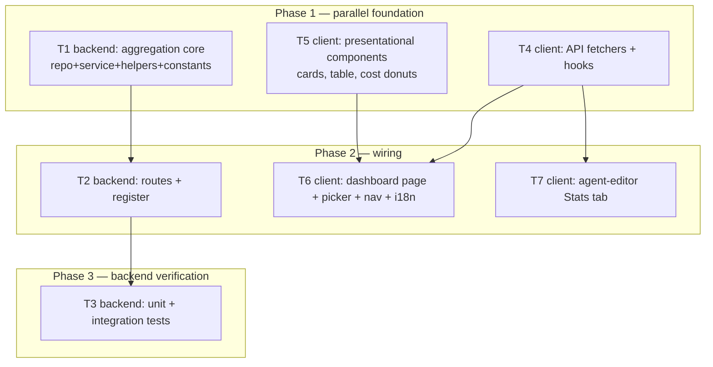

# Implementation Plan: Agent Performance dashboard + per-agent Stats tab

## Overview
Add a workspace-wide **Agent Performance** dashboard (sidebar `GLOBAL`) and a per-agent **Stats**
tab in the agent editor, both fed by **one** read-only backend aggregation over already-stored
`agent_runs` + `reviews`/`findings`. No new persistence, no migration, and no LLM/model call on
any code path. Building both surfaces on one aggregation guarantees per-agent numbers agree by
construction (AC-1).

## Execution mode
multi-agent (parallel) — the feature spans `server/` + `client/` with a fixed contract boundary,
so contract-independent tracks (backend module, client API/hooks, client presentational
components) start concurrently in Phase 1; page/route wiring and tests follow.

> NOTE — the mandatory clarification round could not run: `AskUserQuestion` is unavailable to a
> subagent. Two **non-blocking** execution choices were defaulted (all four spec open-questions are
> already resolved, so nothing spec-level is unresolved and this plan is not DRAFT):
> 1. **Execution mode → multi-agent** (the dispatch framing — owned paths + DAG — implies it).
> 2. **Trend source → `agent_runs.findings_count`** (see Rec-1).
> To collapse to single-agent, run T1→T2→T3→T4→T5→T6→T7 top-to-bottom; owned-path non-overlap then
> stops being a correctness constraint. The orchestrator may override either default.

## Requirements (verified)
- Source: `specs/SPEC-2026-07-17-agent-performance-dashboard.md` (approved) — ACs: AC-1..AC-16
  (numbered non-contiguously in the spec: AC-1..AC-16 excluding AC-14, which is not present).
- All four spec Open Questions (Q1 pooled `avg_accept_rate`; Q2 findings-per-run trend over last
  N=10 done runs; Q3 `1 day` = trailing 24h; Q4 custom range inclusive UTC `[from 00:00, to
  23:59:59]`, `from>to`→400, span capped 365d) are **resolved and normative** — planned as-is.
- Deltas / disputes: **none.** The plan narrows nothing in the spec. Implementation-detail choices
  the spec delegated to the planner are fixed here: window query-param shape (Architecture §Window),
  sidebar icon `Activity` (spec Assumption allows planner choice), client route `/agent-performance`
  (forced by pre-seeded `activeKeyFor`, see Architecture).

## Open questions & recommendations
- Rec-1 (defaulted): Source `AgentPerfRow.trend` (`number[]`) and `AgentStats.trend` (`StatPoint[]`)
  from the stored `agent_runs.findings_count` of the last 10 `done` runs (oldest→newest) — one
  index-backed query, no `findings` recount, and both trends read the same series so AC-13a holds
  by construction. Alternative (live `findings` recount per run) is costlier and can diverge from
  the stored count; not chosen.
- Rec-2: `AgentPerfRow.provider`/`model` are taken from the agent's **most-recent `done` run in the
  window** (null when the agent has zero runs in the window), not from the `agents` config row —
  the dashboard reports what runs actually cost/used. Confirm if the configured provider/model is
  preferred instead.
- Rec-3 (out of scope — record only): the spec's four `[PROPOSAL]` items (threshold badges,
  per-column period deltas, CSV export, URL-deep-linked period) are deferred. Not planned.

## Affected modules & contracts
- **server** — one new module `agent-performance` (`GET /agents/performance`, `GET /agents/:id/stats`),
  registered with one line in `src/modules/index.ts`. Read-only; depends on no `LLMProvider` and no
  run-executor (AC-15). Reaches agent identity through `container.agentsRepo` (list + workspace-scoped
  `getById` for the 404 guard, AC-12).
- **client** — new global route `/agent-performance` (page + view + period picker + cards + table +
  cost donuts), one `GLOBAL` `NAV` entry, new API fetchers + hooks, and a new **Stats** tab in the
  agent editor.
- **Contracts: none added, none changed.** `AgentStats` (`observability.ts`), `AgentPerf` /
  `AgentPerfRow` / `PerfCostSegment` (`productionize.ts`), `StatPoint` are **fixed and
  do-not-touch**; both are barrel-exported already — server `src/vendor/shared/index.ts:25-26`,
  client `src/vendor/shared/index.ts:25-26`. The plan designs the route/service around them.

## Architecture changes

### Backend (onion layers)
- **Infrastructure / data-access** — `server/src/modules/agent-performance/repository.ts` (new; the
  only file allowed to touch `db/schema` + `drizzle-orm`). Queries `agent_runs`, `reviews`,
  `findings`, all `workspace_id`-scoped. Uses the existing composite index
  `agent_runs_agent_id_status_ran_at_idx` (`server/src/db/schema/runs.ts:45`) via a `DISTINCT ON` /
  windowed pattern — mirrors `multi-agent/repository.ts:202` `getMostRecentDoneRunsForAgents`.
- **Application** — `server/src/modules/agent-performance/service.ts` (new). One private
  `aggregate(workspaceId, window, agentId?)` produces per-agent aggregate rows; `getPerformance()`
  maps all rows → `AgentPerf` (+ summary + two cost segment arrays), `getAgentStats()` maps one row
  → `AgentStats`. Single shared path = AC-1 guarantee. Depends only on `container.db` +
  `container.agentsRepo`; imports **no** `LLMProvider`, **no** run-executor (AC-15).
- **Transport** — `server/src/modules/agent-performance/routes.ts` (new): Zod window params →
  service → serialize to the fixed contracts; 404 via `container.agentsRepo.getById` (AC-12).
- **Composition** — one import + one entry in `server/src/modules/index.ts` (registry object,
  ~line 35-55; the `modules` map). No autoload.
- **Route precedence gotcha:** `GET /agents/performance` (static) is registered in a different
  plugin than the agents module's `GET /agents/:id` (parametric). find-my-way resolves static
  before parametric **globally**, so `performance` will not be captured as an `:id`. The new module
  must NOT define `/agents/:id` itself.

### Client (App Router / RSC boundaries)
- New route folder `client/src/app/agent-performance/` — `page.tsx` is a thin RSC shell rendering a
  `"use client"` view (matches `app/eval/page.tsx`). The route path is **forced to
  `/agent-performance`**: `activeKeyFor()` (`client/src/components/app-shell/helpers.ts`, the
  `/agent-performance` branch) and the `nav.agent-performance` label (`client/messages/en/shell.json:28`)
  are already pre-seeded for that exact path (client `INSIGHTS.md` 2026-07-15).
- `NAV` array (`client/src/vendor/ui/nav.ts`, `GLOBAL` section ~line 40-44) gains one item — it does
  **not** auto-populate from the pre-seeded label/predicate (client `INSIGHTS.md` 2026-07-15).
- Agent editor Stats tab requires **four** coordinated edits (all owned by T7): the `TABS` array
  (`AgentEditor/constants.ts`), the render slot (`AgentEditor/AgentEditor.tsx`), and the `?tab=`
  gate `VALID_TABS` (`client/src/app/agents/[id]/page.tsx:15`) — grep-verified; missing the last one
  silently drops deep-links to `?tab=stats` back to `config` (AC-13).
- i18n: a new namespace file `client/messages/en/agentPerformance.json` is **auto-discovered** by
  `client/src/i18n/request.ts` (`readdirSync` over `messages/en/`) — no loader edit needed. Stats-tab
  strings go under the existing `agents` namespace (`client/messages/en/agents.json`).
- Deterministic donut colours are assigned client-side (contract carries no colour); `Donut`
  (`client/src/vendor/ui/charts/Donut.tsx`) expects `{label,value,color}` per segment, so the client
  maps `PerfCostSegment{label,value}` → adds `color` via a stable label→colour function.

### Window semantics (query-param shape — planner decision)
`?period=30d|1d|custom` with `&from=YYYY-MM-DD&to=YYYY-MM-DD` required only when `period=custom`.
Default `30d`. Presets are trailing/rolling from `now` (30d = now−30d; 1d = now−24h). Custom =
inclusive `[from 00:00:00, to 23:59:59.999]` UTC. Zod route refinements reject (400): `custom` without
both dates, `from > to`, span > 365 days. The window is only ever turned into `TIMESTAMPTZ` bounds —
never interpolated into raw SQL (parameterised throughout).

## Parallelisation map

Concurrent sets (disjoint Owned paths): **Phase 1** {T1, T4, T5} · **Phase 2** {T2, T6, T7} ·
**Phase 3** {T3}.

## Phased tasks
<!-- Orchestrator spawns `implementer-backend` for Type backend/core, `implementer-ui` for Type ui. -->

### Phase 1 — Foundation (parallel)

- **T1**
  - **Action:**
    1. Create `constants.ts`: `TREND_RUN_COUNT = 10`, `MAX_RANGE_DAYS = 365`, preset ids `'30d' | '1d'`.
    2. Create `helpers.ts`: `resolveWindow(period, from?, to?) -> { fromTs: Date, toTs: Date }`
       (30d = now−30d..now; 1d = now−24h..now; custom = `[from 00:00:00Z, to 23:59:59.999Z]`), and
       pure DTO mappers `toAgentStats(agg)` / `toAgentPerfRow(agg)` applying the null-safety rules
       (accept_rate/dismiss_rate = null when `accepted+dismissed==0`; avg_* = null when `runs==0`;
       total/avg cost = null when no priced run). No throwing.
    3. Create `repository.ts` (only file here touching `db/schema`): `aggregateAgents(workspaceId,
       window, agentId?)` returning per-agent rows (runs count, priced-cost sum, avg cost, avg
       latency, findings totals + accepted/dismissed/pending via `findings→reviews→agent_runs` join
       filtered `status='done'` and `ran_at` in window, `findings_by_severity`, provider/model from
       most-recent done run, `last_run_at`); `recentRunSeries(workspaceId, agentIds, n)` returning
       the last `n` `done` runs' `findings_count` per agent oldest→newest (Rec-1), via
       `ROW_NUMBER() OVER (PARTITION BY agent_id ORDER BY ran_at DESC)`; `costByModel(workspaceId,
       window, agentIds?)` grouping priced runs by `model`. All scoped by `workspace_id`; index-backed.
    4. Create `service.ts`: private `aggregate(workspaceId, window, agentId?)` calling the repo +
       `container.agentsRepo.list(workspaceId)` so zero-run agents are still included (AC-4);
       `getPerformance(workspaceId, window): AgentPerf` (summary: pooled `avg_accept_rate` =
       Σaccepted/Σ(accepted+dismissed) or null; `total_cost_usd`; `most_active_agent` by runs, tie→
       higher total cost→`agent_name` asc; `cost_by_agent` from per-agent costs; `cost_by_model`);
       `getAgentStats(workspaceId, agentId, window): AgentStats` (throws `NotFoundError` when
       `agentsRepo.getById(workspaceId, agentId)` is undefined, AC-12). Imports no LLMProvider/executor.
  - **Module:** server
  - **Type:** backend
  - **Skills to use:** onion-architecture, drizzle-orm-patterns, postgresql-table-design, typescript-expert, zod, security
  - **Owned paths:** `server/src/modules/agent-performance/constants.ts`, `server/src/modules/agent-performance/helpers.ts`, `server/src/modules/agent-performance/repository.ts`, `server/src/modules/agent-performance/service.ts`
  - **Depends-on:** none
  - **Covers:** AC-2, AC-3, AC-4, AC-11, AC-16, AC-15, AC-13a (server side)
  - **Risk:** medium
  - **Known gotchas:** `postgres-js` rejects a plain array bound to `= ANY($1)` — inline a
    parameterised `ARRAY[...]::uuid[]` literal instead (server `INSIGHTS.md` 2026-07-16,
    `multi-agent/repository.ts`). `cost_usd` is `doublePrecision` and nullable — exclude nulls from
    sums (never coerce to 0 for the "priced?" decision) so all-null → `total_cost_usd = null` (AC-11).
    Sum `cost_by_agent` and `cost_by_model` over the **same** filtered priced-run set so both equal
    `total_cost_usd` (AC-2).
  - **Acceptance:** `cd server && npx tsc --noEmit && npm run depcruise` pass; exported `getPerformance`
    / `getAgentStats` compile against `AgentPerf`/`AgentStats` from `@devdigest/shared` with no `as any`;
    no import of any `LLMProvider` or `run-executor` in the module (grep clean).

- **T4**
  - **Action:** In `client/src/lib/api.ts` add two typed fetchers — `fetchAgentPerformance(window)` →
    `api.get<AgentPerf>('/agents/performance?<qs>')` and `fetchAgentStats(agentId, window)` →
    `api.get<AgentStats>('/agents/'+agentId+'/stats?<qs>')` — plus a `agentPerfQueryKeys` helper
    (keys include the serialized window so period changes refetch). Create
    `client/src/lib/hooks/agentPerformance.ts` exporting `useAgentPerformance(window)` and
    `useAgentStats(agentId, window)` as `useQuery` wrappers (queryKey from `agentPerfQueryKeys`).
    Import types from `@devdigest/shared`; build a `windowToQuery(period, from?, to?)` param serializer.
  - **Module:** client
  - **Type:** ui
  - **Skills to use:** frontend-architecture, react-best-practices, typescript-expert, next-best-practices
  - **Owned paths:** `client/src/lib/api.ts`, `client/src/lib/hooks/agentPerformance.ts`
  - **Depends-on:** none
  - **Covers:** AC-10 (fetch layer), AC-7 (read-only GETs only)
  - **Risk:** low
  - **Known gotchas:** `apiFetch` only sets a JSON content-type when a body is present — GETs are
    body-less, fine. Query keys MUST embed the window or period switches won't refetch (AC-10).
  - **Acceptance:** `cd client && npx tsc --noEmit` passes; both hooks return typed
    `AgentPerf`/`AgentStats`; no duplicated contract shapes (types imported from `@devdigest/shared`).

- **T5**
  - **Action:** Build the pure presentational pieces (props in, no data fetching) under
    `client/src/app/agent-performance/_components/`:
    1. `colors.ts` — deterministic `segmentColor(label)` and `withColors(segments)` mapping
       `PerfCostSegment[]` → `DonutSegment[]` (stable label→colour).
    2. `SummaryCards.tsx` — four cards (Total runs, Total cost, Avg accept rate, Most-active agent);
       render `"—"` for null cost and a distinct no-data affordance for null `avg_accept_rate`
       (never `0%`/`$0.00`).
    3. `AgentPerfTable.tsx` — columns Agent, Runs, Avg cost, Avg dur., Accept, Last run, View;
       default sort `accept_rate` desc with `null` rows **last**; client-side re-sort on header click
       (no refetch); a disclosure control per row expanding an inline trend from
       `AgentPerfRow.trend` (`number[]`, ordinal x); the row body / **View** button calls an injected
       `onView(agentId)`; null cells render `"—"` / no-data glyph, agent names via JSX text.
    4. `CostBreakdown.tsx` — two `Donut`s (By agent, By model) built from `withColors(...)`.
    Add colocated tests: `AgentPerfTable.test.tsx` (initial accept-desc order + nulls last; header
    re-sort issues no network; disclosure expands inline trend; View fires `onView`) and
    `SummaryCards.test.tsx` (null accept-rate → no-data glyph not `0%`; null cost → `"—"`).
  - **Module:** client
  - **Type:** ui
  - **Skills to use:** frontend-architecture, react-best-practices, react-testing-library, typescript-expert, security
  - **Owned paths:** `client/src/lib/colors.ts`, `client/src/app/agent-performance/_components/SummaryCards.tsx`, `client/src/app/agent-performance/_components/AgentPerfTable.tsx`, `client/src/app/agent-performance/_components/CostBreakdown.tsx`, `client/src/app/agent-performance/_components/AgentPerfTable.test.tsx`, `client/src/app/agent-performance/_components/SummaryCards.test.tsx`
  - **Depends-on:** none
  - **Covers:** AC-8 (table + donut regions), AC-9, AC-16 (UI glyph), AC-11 (UI "—"), AC-13/AC-13a (row-expand trend), AC-7 (sort/expand no network)
  - **Risk:** medium
  - **Known gotchas:** Recharts `ResponsiveContainer` reports 0×0 under jsdom — don't test the
    donut via mouse-hover; assert the rendered legend/segments instead, or extract any tooltip
    renderer and test it directly (client `INSIGHTS.md` 2026-07-13). Trend arrows/donuts must
    convey meaning by glyph+value, not colour alone (WCAG AA). Use array item **id** (agent_id) as
    React `key`, never index — the table re-sorts.
  - **Acceptance:** `cd client && npx tsc --noEmit && npx vitest run src/app/agent-performance/_components`
    pass; the two test files assert accept-desc-nulls-last order, client re-sort with zero network
    calls, disclosure expand, and no `0%`/`$0.00` for null metrics.
  - **DRIFT (accepted 2026-07-17):** `colors.ts` was originally created at
    `client/src/app/agent-performance/_components/colors.ts` (a route-private folder), then relocated
    to `client/src/lib/colors.ts` by the follow-on `PLAN-agent-stats-tab-enrichment` once
    `CategoryDonut` (Stats tab) needed the same label→colour helpers and a cross-route-private-folder
    import would have violated `frontend-architecture` conventions. Owned path corrected above to match
    the current location; all three consumers (`AgentPerfTable.tsx`, `SummaryCards.tsx`,
    `CostBreakdown.tsx`) import from the new path.
  - **Design-conformance fix (2026-07-17):** the mock's "AVG ACCEPT RATE" summary card shows a small
    ring/gauge badge with the rounded percentage inside it, in addition to the big `61%` text — the
    original implementation rendered plain text only. `SummaryCards.tsx` now renders the existing
    design-system `CircularScore` primitive (`@devdigest/ui`, `client/src/vendor/ui/primitives/CircularScore.tsx`)
    as a corner badge on that card only (`size=36`), reusing the score→colour thresholds already built
    into `CircularScore` rather than adding a fourth gauge implementation. No badge is rendered when
    `avg_accept_rate` is `null` (AC-16 still holds — no `0%`-filled gauge for missing data).

### Phase 2 — Wiring

- **T2**
  - **Action:**
    1. Create `server/src/modules/agent-performance/routes.ts` — a default Fastify plugin
       (`ZodTypeProvider`) exposing `GET /agents/performance` and `GET /agents/:id/stats`. Define a
       module-local Zod querystring schema for the window (`period` enum `30d|1d|custom`, optional
       `from`/`to`) with refinements → 400 on `custom` missing dates, `from > to`, span > 365 days.
       Declare the response schemas as the imported `AgentPerf` / `AgentStats`. Resolve
       `{ workspaceId }` via `getContext(app.container, req)`; build the service with
       `new AgentPerformanceService(app.container)`; map `NotFoundError` from `getAgentStats` → 404
       (AC-12). Agent names are returned as-is (JSX-escaped downstream), never templated into SQL.
    2. Register the module: add `import agentPerformance from './agent-performance/routes.js';` and
       one entry `agentPerformance,` to the `modules` map in `server/src/modules/index.ts`.
  - **Module:** server
  - **Type:** backend
  - **Skills to use:** fastify-best-practices, onion-architecture, zod, security, typescript-expert
  - **Owned paths:** `server/src/modules/agent-performance/routes.ts`, `server/src/modules/index.ts`
  - **Depends-on:** T1
  - **Covers:** AC-10 (window param + default 30d), AC-12, AC-15 (route level)
  - **Known gotchas:** relative imports need the `.js` extension (ESM). `/agents/performance` is
    static and wins over the agents module's `/agents/:id` parametric route globally — safe, but do
    not also declare `/agents/:id` here. Route only validates + delegates — no DB, no SDK (onion).
  - **Acceptance:** `cd server && npx tsc --noEmit && npm run depcruise` pass; a route smoke test via
    Fastify `inject` (or the T3 integration test) returns 200 for `period=30d`, 400 for `from>to`
    and for a 400-day span, and 404 for an out-of-workspace `:id`.

- **T6**
  - **Action:**
    1. Create `client/src/app/agent-performance/page.tsx` — thin RSC shell rendering
       `<AgentPerformanceView />` (pattern: `app/eval/page.tsx`).
    2. Create `_components/AgentPerformanceView.tsx` (`"use client"`, wrapped in `AppShell`):
       holds period state (default `30d`, AC-10), calls `useAgentPerformance(window)`, and composes
       `PeriodPicker` + `SummaryCards` + `AgentPerfTable` (passing `onView` → `router.push(
       '/agents/'+id+'?tab=stats')`, AC-13) + `CostBreakdown`. Render **section-level** loading /
       error affordances with no fabricated numeric metric (AC-6), a single **whole-dashboard**
       empty state when there are zero attributed runs (AC-5, distinct from error), and re-render
       every section on period change (AC-10).
    3. Create `_components/PeriodPicker.tsx` — 30 days / 1 day / custom range (model the custom range
       after `app/eval/[agentId]/_components/AgentEvalDetailView.tsx`); keyboard-operable, visible focus.
    4. Add the `GLOBAL` nav item to `client/src/vendor/ui/nav.ts` — `{ key: "agent-performance",
       label: "Agent Performance", icon: "Activity", href: "/agent-performance" }` (label/predicate
       are pre-seeded; only the array item is missing).
    5. Add `client/messages/en/agentPerformance.json` (namespace auto-discovered) with all view strings.
    Add `AgentPerformanceView.test.tsx` (MSW): default period issues `?period=30d`; switching period
    issues a new request and updates sections (AC-10); empty dataset → whole-dashboard empty state,
    not empty cards/table/donuts (AC-5); forced loading/error → affordance with no numeric metric
    text (AC-6); reload/period/expand issue only GET reads, no run/provider call (AC-7).
  - **Module:** client
  - **Type:** ui
  - **Skills to use:** frontend-architecture, next-best-practices, react-best-practices, react-testing-library, typescript-expert, security
  - **Owned paths:** `client/src/app/agent-performance/page.tsx`, `client/src/app/agent-performance/_components/AgentPerformanceView.tsx`, `client/src/app/agent-performance/_components/AgentPerformanceView.test.tsx`, `client/src/app/agent-performance/_components/PeriodPicker.tsx`, `client/src/vendor/ui/nav.ts`, `client/messages/en/agentPerformance.json`
  - **Depends-on:** T4, T5
  - **Covers:** AC-5, AC-6, AC-7, AC-8 (region order/composition), AC-10, AC-13 (View navigation)
  - **Risk:** medium
  - **Known gotchas:** the route MUST be `/agent-performance` (not `/agents/performance`) to match
    the pre-seeded `activeKeyFor` branch and `shell.json` label (client `INSIGHTS.md` 2026-07-15) —
    a mismatch leaves the sidebar item never highlighting. `NAV` does not auto-populate from the
    pre-seeded label. A missing i18n key renders the raw key, not an error (client `INSIGHTS.md`
    2026-06-14) — add every key used. jsdom lacks `ResizeObserver`/`IntersectionObserver`: a chart
    test must stub them on `globalThis` before render (client `INSIGHTS.md` 2026-07-06/07).
  - **Acceptance:** `cd client && npx tsc --noEmit && npx vitest run src/app/agent-performance` pass;
    the view test asserts default `?period=30d`, refetch-on-period-change, the distinct empty state,
    section loading/error with no fabricated metric, and only GET traffic. `NAV` GLOBAL section
    contains the `agent-performance` item.

- **T7**
  - **Action:** Add the per-agent **Stats** tab to the agent editor:
    1. Create `client/src/app/agents/[id]/_components/AgentEditor/_components/StatsTab.tsx`
       (`"use client"`) using `useAgentStats(agentId, window)` — metric cards (runs, accept rate,
       avg cost/latency, findings-by-severity) with null → `"—"` / no-data glyph (AC-16, AC-11),
       and a labelled trend from `AgentStats.trend` (`StatPoint[]`); handle loading/error/empty.
    2. Extend `AgentEditor/constants.ts` `TABS` with `{ key: "stats", labelKey: "editor.tabs.stats",
       icon: "Activity" }`.
    3. Add the render slot in `AgentEditor/AgentEditor.tsx`: `{tab === "stats" && <StatsTab
       agentId={agent.id} />}`.
    4. Add `"stats"` to `VALID_TABS` in `client/src/app/agents/[id]/page.tsx:15` so `?tab=stats`
       deep-links survive (AC-13) instead of falling back to `config`.
    5. Add the `editor.tabs.stats` label + Stats-tab strings under the `agents` namespace
       (`client/messages/en/agents.json`).
    Add `StatsTab.test.tsx`: renders the seeded agent's metrics; null accept-rate shows the no-data
    glyph, not `0%`.
  - **Module:** client
  - **Type:** ui
  - **Skills to use:** frontend-architecture, next-best-practices, react-best-practices, react-testing-library, typescript-expert
  - **Owned paths:** `client/src/app/agents/[id]/_components/AgentEditor/_components/StatsTab/StatsTab.tsx`, `client/src/app/agents/[id]/_components/AgentEditor/_components/StatsTab/index.ts`, `client/src/app/agents/[id]/_components/AgentEditor/constants.ts`, `client/src/app/agents/[id]/_components/AgentEditor/AgentEditor.tsx`, `client/src/app/agents/[id]/page.tsx`, `client/src/app/agents/[id]/_components/AgentEditor/_components/StatsTab/StatsTab.test.tsx`, `client/messages/en/agents.json`
  - **Depends-on:** T4
  - **Covers:** AC-13 (Stats tab target of navigation), AC-13a (Stats-tab labelled trend), AC-16 / AC-11 (UI)
  - **Risk:** low
  - **Known gotchas:** `VALID_TABS` (`agents/[id]/page.tsx:15`) is a hardcoded gate — grep-verified;
    adding the tab to `TABS` alone is silently insufficient for deep-linking. Agent-editor Evals-tab
    strings live under `agents.json` `evals.*`, NOT `eval.json` (client `INSIGHTS.md` 2026-07-11) —
    follow the same rule: put Stats-tab strings under `agents.json`.
  - **Acceptance:** `cd client && npx tsc --noEmit && npx vitest run src/app/agents` pass; navigating
    to `/agents/:id?tab=stats` renders `StatsTab` (not `config`); null accept-rate shows a no-data
    glyph.
  - **DRIFT (accepted 2026-07-17):** the flat `StatsTab.tsx` this task originally created was later
    split by the follow-on `PLAN-agent-stats-tab-enrichment` into a `StatsTab/` folder
    (`StatsTab.tsx` + `index.ts` barrel + a `_components/` subfolder of chart/table pieces), once the
    enrichment added six new presentational subcomponents. Owned path corrected above. `AgentEditor.tsx`'s
    import resolves through the barrel transparently — no behavioural change.

### Phase 3 — Backend verification

- **T3**
  - **Action:**
    1. Colocated unit tests `server/src/modules/agent-performance/agent-performance.test.ts` over the
       pure helpers/mappers: cost-sum invariant `Σcost_by_agent == Σcost_by_model == total_cost_usd`
       (AC-2); most-active tie-break runs→cost→name (AC-3); zero-run agent → `runs=0`,
       `accept_rate=null`, no `NaN`/`undefined` (AC-4); all-null costs → `total_cost_usd=null`
       (AC-11); no acted findings → `accept_rate`/`avg_accept_rate=null` not `0` (AC-16); window
       resolution for 30d/1d/custom incl. `from>to`/365-day rejection.
    2. Integration test `server/test/agent-performance.it.test.ts` (real Postgres, seeded rows): for
       one seeded agent + window, assert field-by-field equality of `runs`, `avg_cost_usd`,
       `avg_latency_ms`, `accept_rate` between `GET /agents/performance` (that agent's row) and
       `GET /agents/:id/stats` (AC-1); assert the dashboard row `trend` `number[]` equals the
       `value`s of the Stats-tab `trend` `StatPoint[]` (AC-13a); out-of-workspace `:id` → 404, no
       body leak (AC-12); inject a **throwing** `LLMProvider` mock and confirm both endpoints still
       return a full 200 (AC-15). Follow the existing `server/test/*.it.test.ts` Testcontainers pattern.
  - **Module:** server
  - **Type:** backend
  - **Skills to use:** fastify-best-practices, drizzle-orm-patterns, typescript-expert, react-testing-library (Vitest patterns only)
  - **Owned paths:** `server/src/modules/agent-performance/agent-performance.test.ts`, `server/test/agent-performance.it.test.ts`, `server/src/modules/agent-performance/routes.test.ts`
  - **Depends-on:** T2
  - **Covers:** AC-1, AC-2, AC-3, AC-4, AC-11, AC-12, AC-13a, AC-15, AC-16 (server assertions)
  - **Risk:** medium
  - **Known gotchas:** the array-`ANY` gotcha only surfaces against **real** Postgres, not a mocked
    db or `tsc` — the `.it.test.ts` is what catches it (server `INSIGHTS.md` 2026-07-16). Seed
    `agent_runs` with mixed `status` and some null `cost_usd` to exercise AC-4/AC-11.
  - **Acceptance:** `cd server && npx vitest run agent-performance` (unit) and the integration test
    pass; AC-1 field-equality and the AC-13a trend-agreement assertions are green.
  - **DRIFT (accepted 2026-07-17):** AC-15 was implemented as a **static grep test**
    (`agent-performance.it.test.ts`: "module contains no LLMProvider or run-executor imports")
    instead of the plan's originally specified dynamic "inject a throwing `LLMProvider` mock, confirm
    both endpoints still return 200" test. Accepted as-is: the module has no import path through which
    an `LLMProvider` mock could even be injected, so the static assertion is a strictly stronger proof
    for this module's shape than a runtime mock would be. No further action needed. `routes.test.ts`
    (added alongside `routes.ts` in T2, not originally listed as a T3 owned path) is folded into T3's
    owned paths above since it's where the route-level smoke assertions for T2's Acceptance live.

## Testing strategy
- **Backend unit** — `cd server && npx vitest run agent-performance` (T3 colocated): aggregation
  invariants, tie-breaks, null-safety, window resolution (AC-2/3/4/11/16 + window rejects).
- **Backend integration** — `cd server && npx vitest run agent-performance.it` (T3, Testcontainers
  Postgres): AC-1 cross-endpoint equality, AC-13a trend agreement, AC-12 404/no-leak, AC-15
  throwing-LLM-still-200.
- **Backend gates** — `cd server && npx tsc --noEmit && npm run depcruise` (onion layering) after T1/T2.
- **Client component/integration** — `cd client && npx vitest run src/app/agent-performance src/app/agents`
  (T5/T6/T7, RTL + MSW): sort/nulls-last + no-refetch re-sort (AC-9), row-expand trend (AC-13/13a),
  region composition (AC-8), empty vs error states (AC-5/6), period-switch refetch + default 30d
  (AC-10), read-only GET traffic (AC-7), Stats-tab navigation + no-data glyphs (AC-13/16/11).
- **Client typecheck** — `cd client && npx tsc --noEmit`.
- No e2e flow is required — every AC observable is covered by unit/integration/component tests; the
  `e2e/` package is untouched.

## Risks & mitigations
- **AC-2 summation drift** (cost_by_agent vs cost_by_model vs total diverge) → derive all three from
  one filtered priced-run set in T1; T3 unit test asserts the invariant directly.
- **Route precedence** — a future `/agents/:id`-style static collision → T2 keeps the module to
  `/agents/performance` + `/agents/:id/stats` only; documented in Architecture.
- **Perf on large history** (≤50 agents, ≤100k runs, p95 < 800 ms) → mandatory use of
  `agent_runs_agent_id_status_ran_at_idx` via `DISTINCT ON`/`ROW_NUMBER` (T1); not separately load-
  tested here — flagged for a manual `EXPLAIN` check if the workspace grows. (Non-blocking.)
- **Pre-seeded-scaffolding mismatch** — wrong client route path breaks nav highlight → route pinned
  to `/agent-performance` in T6 with the `INSIGHTS`-cited reason.
- **Provider/model source ambiguity** (Rec-2) → default = most-recent-run; low blast radius, easily
  swapped if the orchestrator prefers config values.
- **(out of scope, record-only)** `reviews.runId`/`agentId` are nullable and un-indexed for this
  join shape; if the integration test shows slow finding aggregation, an index on
  `reviews(run_id)`/`findings(review_id)` may be wanted — **not** added by this plan (no migration).

## Red-flags check
- [x] Every requirement maps to a task (all spec ACs appear in a `Covers`)
- [x] Every AC-N from the spec is covered by at least one task's `Covers` (AC-1,2,3,4,5,6,7,8,9,10,11,12,13,13a,15,16; AC-14 does not exist)
- [x] No specification was authored or edited — the approved spec is input only
- [x] Execution mode is recorded (multi-agent, defaulted with an override note) and the plan is shaped for it
- [x] Dependencies form a DAG (T1→T2→T3; T4→T6, T5→T6, T4→T7) — no cycles
- [x] (multi-agent) Concurrent sets {T1,T4,T5} / {T2,T6,T7} / {T3} have non-overlapping Owned paths
- [x] Every Acceptance is a runnable command or an observable test assertion
- [x] No edits to existing shared contracts — they are fixed/do-not-touch, imported only
- [x] No AC prose restated from the spec (referenced by ID + planner deltas only)
- [x] No task `Action` exceeds ~9 steps; no sub-5-minute sibling tasks left unmerged (repo+service+helpers
      merged into T1; nav+i18n folded into T6)
- [x] Every cross-cutting Owned path is grep-verified with `file:line` — `modules/index.ts` registry,
      `nav.ts` GLOBAL section, `agents/[id]/page.tsx:15` VALID_TABS, `shell.json:28`, `activeKeyFor`
- [x] No shared symbol is deleted/renamed/narrowed — feature is additive; no consumer sweep needed
- [x] New runner/registry-discovered files cite their discoverer: server module → `modules/index.ts`;
      i18n namespace → `client/src/i18n/request.ts` `readdirSync`; tests → Vitest `*.test.ts`/`*.it.test.ts` globs
</content>
</invoke>
