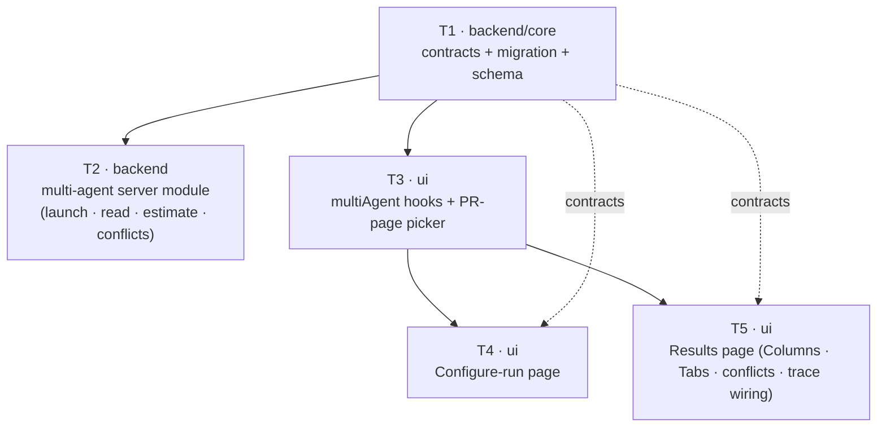

# Implementation Plan: Multi-Agent Review — live review by multiple agents in parallel

## Overview
Add the product surface for reviewing a PR with a chosen set of specialist agents at once: a PR-page
agent picker, a dedicated Configure-run page with pre-run time·cost estimates, a persistence/grouping
layer that gathers the per-agent fan-out under one parent record, deterministic cross-agent "Where
agents disagree" grouping, and a two-mode (Columns / Tabs) results page that links every agent surface
into the existing `RunTraceDrawer`. The parallel-execution engine, SSE/RunTrace engine, and the
multi-agent response contracts already exist and are reused unchanged — this feature is the surface on
top of them plus a thin server module (launch + read + estimate + conflict grouping).

## Execution mode
multi-agent (parallel) — fixed by the request. The plan is partitioned into **exactly 5 implementer
tasks** with non-overlapping `Owned paths`, run in three waves: `[T1] → [T2 ∥ T3] → [T4 ∥ T5]`. See
*Implementer-agent budget* for why this split.

## Implementer-agent budget (≤ 5 total — hard constraint)
Five implementer instances, one per task, chosen so related work is grouped into as few tasks as the
constraints allow while never leaving a task with a 10+-step monolithic `Action`:

- **T1 (backend/core) — foundation:** shared contracts (both vendor copies) + migration + schema. One
  task because both are small, foundational, backend-owned, and block everyone. Merging them avoids a
  second cold start for a sub-5-minute contract edit.
- **T2 (backend) — server module:** all server-side persistence, launch, read-assembly, estimate, and
  conflict grouping in one module. Kept as a single task because these pieces share `service.ts` /
  `repository.ts` / `routes.ts` (they would overlap owned paths if split, forcing a serial dependency
  anyway) — splitting would cost a cold start with no parallelism gain.
- **T3 (ui) — hooks + PR picker:** the new `multiAgent` hooks file plus the PR-page picker replacement.
  The hooks file is a dependency of T4 and T5, so it is created first and paired with the picker (its
  most-coupled consumer).
- **T4 (ui) — Configure-run page** and **T5 (ui) — Results page:** split from each other (and from T3)
  because folding all three client surfaces into one task produces a 10+-step `Action` (mandatory
  split signal), and because T4 and T5 own disjoint route directories so they run in parallel.

Waves: T1 first; then T2 (server) and T3 (client hooks+picker) in parallel; then T4 and T5 in parallel
once the hooks file (T3) and contracts (T1) exist. Client tasks depend on T1 (contracts) + T3 (hooks)
only — not on T2 — because their tests use MSW mocks, so they need no live server to reach green.

## Requirements (verified)
- Source: `specs/SPEC-2026-07-15-multi-agent-review.md` (Status: draft; zero outstanding
  `[NEEDS CLARIFICATION]`, all decisions confirmed 2026-07-15). ACs: AC-1 .. AC-28.
- Deltas / interpretations this plan makes explicit (not spec changes):
  - **D1 — pre-run summary line is client-derived.** AC-9's "max of durations / sum of costs" summary is
    computed client-side from the per-agent estimate list (matches the design source's `RunConfig`
    computing `estTime`/`estCost`), so the estimate endpoint returns only the per-agent list — the
    cheapest split per the "keep v1 minimal" posture.
  - **D2 — `conflicts` carries every cross-agent location group; "Show only conflicts" is a client
    filter.** The server returns one `Conflict` per file:line that ≥1 selected agent flagged, with a
    `take` for every selected agent (its severity, or `'ignored'` when it reviewed but did not flag).
    AC-17's toggle filters to mixed-stance groups in the client. This keeps AC-15/16/17/26 satisfied
    from one server computation.
  - **D3 — Tabs-mode finding detail reuses the existing per-PR reviews read** (`GET /pulls/:id/reviews`,
    already returning full `FindingRecord`s), filtered by `agent_run_id`/`agentId` client-side. No new
    detail endpoint (spec Contracts explicitly forbids one).

## Open questions & recommendations
- Q: none blocking — spec has no outstanding clarifications.
- Rec 1: **Do not add a global nav / command-palette entry for the Configure-run page in v1.** The spec
  requires only two entry points (the picker's "Configure agents…" link and post-launch navigation);
  adding a nav registry entry would be a shared-file edit across client tasks for no AC. Left out of
  scope; revisit if discoverability feedback warrants it.
- Rec 2: The estimate endpoint is a global one-row-per-agent lookup (AC-8). Recommend it lives in the
  new multi-agent module (not the agents module) so agent CRUD stays untouched and the whole
  multi-agent server surface is one cohesive, reviewable unit.
- Rec 3 (post-merge): consider the spec's own PROPOSAL to retire the 120s `ranAt` batch-window heuristic
  in `pulls/routes.ts` once this parent record exists — explicitly out of scope here, noted for later.

## Affected modules & contracts
- **server (`@devdigest/api`)** — new feature module `src/modules/multi-agent/` (service, repository,
  routes, conflict-grouping helper, estimate helper); one-line registration in `src/modules/index.ts`;
  schema addition in `src/db/schema/runs.ts` + one migration. Reuses `ReviewRunExecutor`
  (`src/modules/reviews/run-executor.ts`) and `ReviewRepository` for the fan-out — does not modify the
  reviews module.
- **client (`@devdigest/web`)** — new `src/lib/hooks/multiAgent.ts`; replace internals of the existing
  `RunReviewDropdown`; new route `src/app/multi-agent/configure/` (Configure-run page) and
  `src/app/multi-agent/[runId]/` (results page). Reuses `RunTraceDrawer` and `useRunEvents` unchanged,
  and `SafeMarkdown` for all untrusted agent text.
- **reviewer-core** — untouched (confirmed reuse boundary; it does not import the multi-agent
  contracts, so no consumer sweep is needed there).
- **e2e** — no task (engine is a fixed contract; no new flow spec required by any AC).
- **Contracts:** the response shapes (`MultiAgentRun`, `AgentColumn`, `AgentColumnFinding`, `Conflict`,
  `ConflictTake`) **already exist** in `contracts/observability.ts` (both vendor copies) — reused as-is,
  never redefined. **Two additive schemas** must be appended to that file in BOTH vendor copies:
  `MultiAgentRunRequest` (`{ agent_ids: string[] }`) and `AgentEstimate`
  (`{ agent_id, est_duration_ms: number|null, est_cost_usd: number|null, last_run_summary?: string }`).
  Explicit callout: this edits an existing shared file, but only by appending exports to the
  feature-owned (`A5`) contracts file — no existing export changes, and both copies stay in sync (R1).

## Architecture changes
- **DB (Infrastructure).** `server/src/db/schema/runs.ts`: add `agentIds` (`jsonb`/`text[]`,
  `not null`, the requested set) to the existing `multiAgentRuns` table, and add nullable
  `multiAgentRunId` (`uuid`, FK → `multi_agent_runs.id`, `on delete set null`) to `agentRuns`. One
  migration under `server/src/db/migrations/` + a `meta/_journal.json` entry. Both are **pure
  additions**, so `npm run db:generate` is safe (no column rename → no interactive TTY prompt per
  `server/CLAUDE.md`'s rename gate). Add an index on `agent_runs.multi_agent_run_id` (FK columns are not
  auto-indexed in PostgreSQL — `postgresql-table-design`).
- **Server module (Application + Infrastructure + Transport).** New onion-compliant module:
  `repository.ts` is the only DB-touching layer (parent insert, per-agent `agent_runs` insert with the
  FK, associated-runs/reviews/findings reads, the estimate one-row lookup); `service.ts` orchestrates
  launch (create parent → create N runs → fan out via reused `ReviewRunExecutor`) and read-assembly
  (build `AgentColumn[]`, compute conflicts, compute totals); `routes.ts` is Zod-validated wiring only.
  Best-effort degradation: estimate and conflict reads return empty/no-estimate rather than throw
  (server convention).
- **Client (RSC boundary).** Configure-run page and results page are interactive (checkboxes, live SSE,
  drawer) → their view components are `"use client"`; the route `page.tsx` shells stay server components
  that render the client view. All API access via `src/lib/hooks/multiAgent.ts` (TanStack Query),
  consistent with `hooks/reviews.ts`. All agent-authored text rendered through `SafeMarkdown`
  (`src/components/SafeMarkdown`), never the raw `@devdigest/ui` `Markdown` primitive (client INSIGHTS,
  2026-07-07). Any `trend`/sparkline widget gated `length >= 2` (client INSIGHTS, 2026-07-11).

## Parallelisation map

Wave 1: T1. Wave 2: T2 ∥ T3. Wave 3: T4 ∥ T5. (T4/T5 do not depend on T2 — client tests use MSW.)

## Phased tasks

### Phase 1 — Foundation (contracts + persistence)
- **T1**
  - **Action:**
    1. Append two additive Zod schemas to `contracts/observability.ts`: `MultiAgentRunRequest`
       (`{ agent_ids: z.array(z.string()).min(1) }`) and `AgentEstimate` (`agent_id`,
       `est_duration_ms: z.number().int().nullable()`, `est_cost_usd: z.number().nullable()`,
       `last_run_summary: z.string().nullish()`), each with its `z.infer` type export. Follow the
       existing file's `export const … = z.object({…}); export type … = z.infer<…>` convention.
    2. Make the identical addition in the **client** vendor copy
       `client/src/vendor/shared/contracts/observability.ts` (real copy, not a symlink — both barrels
       already re-export this file, so no barrel edit needed).
    3. In `server/src/db/schema/runs.ts`, add `agentIds` (`text('agent_ids').array().notNull()` or a
       `jsonb` string array, `not null`) to `multiAgentRuns`, and add nullable `multiAgentRunId`
       (`uuid('multi_agent_run_id').references(() => multiAgentRuns.id, { onDelete: 'set null' })`) to
       `agentRuns`. Add an index on the new FK column.
    4. Generate the migration with `npm run db:generate` (pure additions — safe) and confirm the new SQL
       file + the appended `meta/_journal.json` entry exist and apply with `npm run db:migrate`.
  - **Module:** server (+ shared contracts consumed by client)
  - **Type:** backend / core
  - **Skills to use:** `zod`, `drizzle-orm-patterns`, `postgresql-table-design`, `typescript-expert`
  - **Owned paths:** `server/src/vendor/shared/contracts/observability.ts`,
    `client/src/vendor/shared/contracts/observability.ts`, `server/src/db/schema/runs.ts`,
    `server/src/db/migrations/**` (the new SQL file + `meta/_journal.json`)
  - **Depends-on:** none
  - **Covers:** AC-11 (FK association column), and the contract surface enabling AC-8/AC-13/AC-28
  - **Risk:** medium (migration + two-copy contract sync)
  - **Known gotchas:** `db:generate` opens an interactive TTY prompt ONLY on column renames — these are
    additions, so it is safe (`server/CLAUDE.md`). Keep the two vendor `observability.ts` copies byte-for-
    byte identical for the new exports or the client typecheck diverges from the server's.
  - **Acceptance:** `cd server && npx tsc --noEmit` passes; `npm run db:migrate` applies the new
    migration cleanly; `grep -q "MultiAgentRunRequest" client/src/vendor/shared/contracts/observability.ts`
    and the server copy both match; `cd client && npx tsc --noEmit` passes.

### Phase 2 — Server module (runs in parallel with T3)
- **T2**
  - **Action:**
    1. Create `server/src/modules/multi-agent/repository.ts` (the only DB layer): insert a
       `multi_agent_runs` parent (workspace_id, pr_id, agent_ids); insert N `agent_runs` rows carrying
       `multiAgentRunId` (reuse the shape from `reviews/repository/run.repo.ts createAgentRun`, adding
       the FK); read associated runs + their `reviews`/`findings` for the read-assembly; and an estimate
       query = each agent's single most-recent `status='done'` `agent_runs` row (global, `duration_ms`,
       `cost_usd`) + that run's review `summary` for `last_run_summary`.
    2. Create `server/src/modules/multi-agent/conflicts.ts` (pure helper): group the run's findings by
       exact `file + ':' + start_line`; for each location with ≥1 finding emit a `Conflict` whose
       `takes` include EVERY selected agent — its `Severity` when it flagged there, else `'ignored'`
       (per D2). Deterministic, no DB access. Unit-tested in isolation.
    3. Create `server/src/modules/multi-agent/service.ts`: `launch(workspaceId, prId, agentIds)` →
       create parent, create N runs with the FK, fan out via a reused `ReviewRunExecutor` instance
       (`new ReviewRunExecutor(container, reviewRepo, agentsRepo)`), return `{ id, run_ids }`;
       `getRun(workspaceId, id)` → assemble `MultiAgentRun` (columns from associated runs+findings via
       `conflicts.ts` for the conflicts array; `total_cost_usd = Σ column costs`,
       `total_duration_ms = max column duration` per AC-28; a failed agent yields a `status:'failed'`
       column without failing the read, AC-14); `estimates(workspaceId)` → `AgentEstimate[]` (null when
       an agent has zero prior runs, AC-8).
    4. Create `server/src/modules/multi-agent/routes.ts` (Zod-validated, `fastify-type-provider-zod`):
       `POST /pulls/:id/multi-agent-run` (body `MultiAgentRunRequest`) → `service.launch`;
       `GET /multi-agent-runs/:id` → `service.getRun` (validate response against `MultiAgentRun`);
       `GET /agent-estimates` → `service.estimates`. Tight rate limit on the launch route (mirrors
       `reviews` `POST /pulls/:id/review`).
    5. Register the module: add one import + one entry to `server/src/modules/index.ts` (grep-verified
       registry — the `modules` record at `server/src/modules/index.ts`, no filesystem autoload).
    6. Add unit/integration tests: conflict grouping (exact-line, `'ignored'`, divergent-severity),
       estimate null-on-zero-runs, launch creates parent + associates runs, read totals (Σ cost /
       max duration), failed-agent column isolation.
    7. **Golden fixture (drift guard, see R7):** from the integration test's real response, serialize one
       realistic `MultiAgentRun` (2+ columns, ≥1 conflict group with an `'ignored'` take, one `failed`
       column) into `server/src/modules/multi-agent/__fixtures__/multi-agent-run.fixture.json`, and one
       realistic `AgentEstimate[]` (one priced, one `null`-estimate/cold-start agent) into
       `.../multi-agent/__fixtures__/agent-estimates.fixture.json`. Assert both validate via
       `MultiAgentRun.parse()` / `z.array(AgentEstimate).parse()` in the test. These become the literal
       source T4/T5 copy for their MSW mocks — not a re-authored shape (see T4/T5 Action, R7).
  - **Module:** server
  - **Type:** backend
  - **Skills to use:** `onion-architecture`, `fastify-best-practices`, `drizzle-orm-patterns`, `zod`,
    `typescript-expert`, `security`
  - **Owned paths:** `server/src/modules/multi-agent/**` (new), `server/src/modules/index.ts`
  - **Depends-on:** T1
  - **Covers:** AC-8, AC-10, AC-11, AC-12, AC-13, AC-14, AC-15, AC-16, AC-17 (server computation), AC-28
  - **Risk:** high (largest server surface; reuses cross-module executor)
  - **Known gotchas:** `ReviewRunExecutor.executeRuns` expects runs already created by the caller (see
    `reviews/service.ts:runReview`) — create the `agent_runs` rows (with the FK) first, then hand it
    `{ agent, runId }` jobs; fire-and-forget with a `.catch` logger like `runReview` does. Reach cross-
    module capability by importing the executor class from `reviews/run-executor.ts` and the
    `container.agentsRepo`/`ReviewRepository`, never another module's internal route. Estimate/conflict
    reads must degrade to empty, not throw (best-effort server convention). Run `npm run depcruise`
    before done — a new module→module edge is `warn`-tracked drift, keep it justified.
  - **Acceptance:** `cd server && npm test` green incl. the new multi-agent tests; `npx tsc --noEmit`
    passes; `npm run depcruise` reports no new `error`; a launch with 2 agent_ids creates exactly one
    `multi_agent_runs` row associating exactly 2 `agent_runs`; `GET /multi-agent-runs/:id` validates
    against `MultiAgentRun` with `total_duration_ms === max(columns.duration_ms)`; both
    `__fixtures__/*.fixture.json` files exist and parse against their Zod schemas.

### Phase 3 — Client hooks + PR-page picker (runs in parallel with T2)
- **T3**
  - **Action:**
    1. Create `client/src/lib/hooks/multiAgent.ts` (TanStack Query, `"use client"`, calling the generic
       `api.get/post` exactly like `hooks/reviews.ts` — do NOT add per-endpoint functions to
       `lib/api.ts`): `useAgentEstimates()` → `GET /agent-estimates` (`AgentEstimate[]`);
       `useLaunchMultiAgentRun()` → `POST /pulls/:id/multi-agent-run` (`MultiAgentRunRequest` →
       `{ id, run_ids }`); `useMultiAgentRun(runId)` → `GET /multi-agent-runs/:id` (`MultiAgentRun`).
       Reuse the existing `useRunEvents` for live status (do not reimplement SSE).
    2. Replace the internals of `RunReviewDropdown` (same trigger button/slot, AC-5): render a
       "Pick agents to run" checklist — one checkbox row per enabled agent (icon, name, per-agent time
       estimate from `useAgentEstimates`, the SAME source the Configure page uses, AC-1). Add a
       "Select all"/"Clear" control that flips every checkbox and its own label (AC-5a). Remove the old
       "Run all / run one" binary toggle entirely.
    3. Primary run action (AC-2): enabled while ≥1 checked; label "Run `<AgentName>`" at N=1 → launches
       the existing single-agent path (`useRunReview({ agentId })`, no parent record); label
       "Run multi-agent review (N)" at N≥2 → `useLaunchMultiAgentRun` then `router.push` to
       `/multi-agent/<id>` (AC-3).
    4. Add a "Configure agents…" affordance that navigates to
       `/multi-agent/configure?prId=<current>` (AC-4).
    5. Update/extend `RunReviewDropdown.test.tsx` for: checklist renders per enabled agent with estimate
       label; select-all toggles; N=1 label+single-path; N≥2 label+multi-launch+navigate; configure
       link navigates.
  - **Module:** client
  - **Type:** ui
  - **Skills to use:** `react-best-practices`, `next-best-practices`, `frontend-architecture`,
    `react-testing-library`, `typescript-expert`
  - **Owned paths:** `client/src/lib/hooks/multiAgent.ts` (new),
    `client/src/app/repos/[repoId]/pulls/[number]/_components/RunReviewDropdown/**`
  - **Depends-on:** T1
  - **Covers:** AC-1, AC-2, AC-3, AC-4, AC-5, AC-5a
  - **Known gotchas:** the existing `useRunReview` single-agent path and endpoint stay untouched (AC-2
    N=1 fallback must NOT create a parent record). `RunReviewDropdown` is `"use client"`; keep it so.
    The per-agent estimate label must be identical in source to the Configure page's (AC-1) — both read
    `useAgentEstimates`; format money via `lib/cost.ts formatCost` (null → "—", not "$0").
  - **Acceptance:** `cd client && npm test src/app/repos/[repoId]/pulls/[number]/_components/RunReviewDropdown`
    green; picker shows one checkbox row per enabled agent with an estimate label; toggling to exactly 1
    agent shows "Run <name>" and calls the single-agent path; 2+ shows "Run multi-agent review (N)" and
    navigates to `/multi-agent/<id>`; `npx tsc --noEmit` passes.

### Phase 4 — Configure-run page (runs in parallel with T5)
- **T4**
  - **Action:**
    1. Create the route `client/src/app/multi-agent/configure/page.tsx` (server-component shell reading
       `searchParams.prId`) rendering a `"use client"` view under `_components/ConfigureRunView/`.
    2. PR selection: preselect the PR from `?prId` (AC-4); while none selected show the empty-state
       placeholder in the "Agents to run" step and keep the run button disabled (AC-6).
    3. When a PR is selected, render one card per available agent (icon, name, that agent's most-recent
       run summary from `AgentEstimate.last_run_summary` as a one-line description rendered via
       `SafeMarkdown`/inert, and its time·cost estimate) (AC-7). Show the explicit no-estimate indicator
       (not a fabricated number) when `est_duration_ms`/`est_cost_usd` are null (AC-8).
    4. Pre-run summary line (AC-9): time = **max** of checked agents' `est_duration_ms`, cost = **sum**
       of checked agents' `est_cost_usd`, labeled "parallel fan-out"; updates as checkboxes change
       (client-derived per D1).
    5. "Run multi-agent review (N)" always launches via `useLaunchMultiAgentRun` for any N≥1 (including
       N=1 — always creates a parent record, AC-10/AC-11) and navigates to `/multi-agent/<id>`.
    6. Add `ConfigureRunView.test.tsx` (MSW): empty-state + disabled button with no PR; cards populate
       after PR select; no-estimate indicator for a zero-run agent; summary line max/sum; launch+navigate.
       **Golden fixture (R7):** the MSW handler for `GET /agent-estimates` returns T2's committed
       `agent-estimates.fixture.json` copied byte-identical into
       `client/src/app/multi-agent/configure/__fixtures__/agent-estimates.fixture.json` — do not
       hand-author an independent estimate object; T2 lands before this task starts (wave 2 → wave 3), so
       the real fixture is available to copy.
  - **Module:** client
  - **Type:** ui
  - **Skills to use:** `react-best-practices`, `next-best-practices`, `frontend-architecture`,
    `react-testing-library`, `security`, `typescript-expert`
  - **Owned paths:** `client/src/app/multi-agent/configure/**`
  - **Depends-on:** T3 (hooks), T1 (contracts)
  - **Covers:** AC-6, AC-7, AC-8 (display), AC-9, AC-10
  - **Known gotchas:** summary-line time is `max`, NOT sum (AC-9) — a common inversion; cost is sum.
    Any sparkline/trend widget must gate `length >= 2` (client INSIGHTS 2026-07-11). `last_run_summary`
    is untrusted agent text → `SafeMarkdown`/inert only (AC-18 posture applies here too). This page's
    N=1 launch MUST use the multi-agent endpoint (parent record), unlike the picker.
  - **Acceptance:** `cd client && npm test src/app/multi-agent/configure` green; with no PR the run
    button is disabled and the empty state shows; after PR select each agent card shows summary +
    estimate (or the no-estimate indicator); the summary line equals `max(duration)` / `sum(cost)`;
    activating run navigates to `/multi-agent/<id>`; `npx tsc --noEmit` passes; the MSW estimate mock is
    byte-identical to T2's committed `agent-estimates.fixture.json` (diff check, not just visual match).

### Phase 5 — Results page (runs in parallel with T4)
- **T5**
  - **Action:**
    1. Create the route `client/src/app/multi-agent/[runId]/page.tsx` (server-component shell) rendering
       a `"use client"` `MultiAgentResultsView/` that reads `useMultiAgentRun(runId)` and switches
       between Columns and Tabs modes.
    2. Run header (AC-22): PR number/title, "N selected agents · parallel", "fan-out via worktrees",
       total time (`max` of column durations) and total cost (`sum` of column costs) from the response.
    3. Columns mode (AC-19): one column per `AgentColumn` — header with icon, name, time·cost, a 0–100
       score circle color-coded by severity, and a running/complete/failed status indicator conveyed
       with `role="status"`/text, not color alone (non-functional a11y). List each column's findings
       (severity icon, title, `file:start_line`) + a findings count (AC-21). Live status: subscribe via
       `useRunEvents(run_ids)` and update each column running→complete/failed with no manual refresh
       (AC-20); on a completed run with no live stream, render persisted final statuses.
    4. "View trace" wiring (AC-21, AC-26a, AC-27): every column and every tab has a working "View trace"
       control that mounts the **existing** `RunTraceDrawer` with that column's `run_id`
       (`agentName`, `prNumber`, `running` derived from status; `findings` from the per-PR reviews read).
       Import the drawer unchanged from
       `.../pulls/[number]/_components/RunTraceDrawer`; do not modify it.
    5. Tabs mode (AC-23/AC-24/AC-25): one tab per agent showing its score; selecting a tab shows the
       agent summary card (score, one-line verdict, "View trace", time·cost) and that agent's full
       finding cards. Source full finding detail (rationale, suggestion, confidence, end_line, category)
       from the existing `GET /pulls/:id/reviews` read (`usePrReviews`) filtered by `agent_run_id`/agent
       (D3 — no new endpoint). Non-focused findings collapse to title + file:line + confidence until
       expanded. Action row offers Accept, Dismiss, Learn, Turn into eval case, Reply — routing
       Accept/Dismiss/Learn/Reply through the existing `useFindingAction` and "Turn into eval case"
       through the existing eval-case draft flow (`POST /findings/:id/eval-case` + modal); "Learn" is a
       wired-but-inert hook.
    6. "Where agents disagree" block (AC-26): render `MultiAgentRun.conflicts` below the finding list in
       BOTH modes; each group lists one entry per selected agent including explicit "did not flag" rows
       (`ConflictTake.verdict === 'ignored'`) styled distinctly (AC-16); a "Show only conflicts" toggle
       filters to mixed-stance groups (AC-17); an all-unanimous run yields an empty, non-error state.
    7. Render ALL agent-authored text (finding titles, notes, verdicts, descriptions, suggested-fix,
       conflict notes) via `SafeMarkdown`/inert — never the raw `Markdown` primitive (AC-18).
    8. Add `MultiAgentResultsView.test.tsx` (MSW): N columns render with score+status; live SSE flips a
       column running→complete; "View trace" opens the drawer with the right run id; Tabs mode expands a
       finding + shows the action row; "Where agents disagree" shows a "did not flag" row and the
       "Show only conflicts" filter hides unanimous groups; injected markup in a note renders inert.
       **Golden fixture (R7):** the MSW handler for `GET /multi-agent-runs/:id` returns T2's committed
       `multi-agent-run.fixture.json` copied byte-identical into
       `client/src/app/multi-agent/[runId]/__fixtures__/multi-agent-run.fixture.json` — this is the
       primary drift guard (this task renders the richest shape: columns, conflicts, `'ignored'` takes,
       a failed column). Do not hand-author an independent mock object for the primary render test; only
       the SSE-transition and inert-markup tests may use a minimal derived variant.
  - **Module:** client
  - **Type:** ui
  - **Skills to use:** `react-best-practices`, `next-best-practices`, `frontend-architecture`,
    `react-testing-library`, `security`, `typescript-expert`
  - **Owned paths:** `client/src/app/multi-agent/[runId]/**`
  - **Depends-on:** T3 (hooks), T1 (contracts)
  - **Covers:** AC-13 (render), AC-16, AC-17 (render), AC-18, AC-19, AC-20, AC-21, AC-22, AC-23, AC-24,
    AC-25, AC-26, AC-26a, AC-27
  - **Known gotchas:** `RunTraceDrawer` is imported UNCHANGED (its props are `runId, agentName?,
    prNumber?, findings?, running?, onClose` — see `RunTraceDrawer.tsx:19`); this task only constructs
    those props per column/tab. Total time is `max`, total cost is `sum` (AC-22/AC-28) — do not sum
    durations. Status must not be color-only (a11y). Untrusted text → `SafeMarkdown` only (AC-18). A
    length-1 trend into any sparkline crashes — gate `length >= 2` (client INSIGHTS 2026-07-11).
  - **Acceptance:** `cd client && npm test src/app/multi-agent/[runId]` green; N columns render with
    score + status; a simulated SSE event flips a column to complete without refresh; "View trace" opens
    `RunTraceDrawer` with the correct run id; Tabs mode expands a finding and shows the 5-action row;
    "Show only conflicts" hides unanimous groups and keeps "did not flag" groups; markup in a note is
    inert; `npx tsc --noEmit` passes; the primary MSW mock is byte-identical to T2's committed
    `multi-agent-run.fixture.json` (diff check, not just visual match).

## Testing strategy
- **Server (T1, T2)** — `cd server && npm test` (vitest): unit tests for `conflicts.ts` (exact-line
  grouping, `'ignored'` takes, divergent severity), estimate null-on-zero-runs, and integration tests
  for launch (parent + N associated runs), read-assembly totals (`Σ` cost / `max` duration), and
  failed-agent column isolation. Typecheck `npx tsc --noEmit`. Layer gate `npm run depcruise`. Apply
  migration `npm run db:migrate`.
- **Client (T3, T4, T5)** — `cd client && npm test` (vitest + RTL + MSW): flow tests per surface as in
  each task's Acceptance. Mock the multi-agent endpoints at the network layer (MSW); simulate SSE for
  the live-status test. Typecheck `npx tsc --noEmit`.
- **Cross-cutting** — both `npx tsc --noEmit` runs must pass with the two vendor `observability.ts`
  copies in sync. (These commands are for the implementers to run — not run by the planner.)
- **Golden fixtures (R7)** — T2 commits `multi-agent-run.fixture.json` / `agent-estimates.fixture.json`
  from its own integration test; T4/T5 copy them byte-identical as their primary MSW response instead of
  hand-authoring the shape, so client tests can't silently diverge from what the server actually returns.
- **Integration checkpoint (R8)** — one manual smoke pass against the real (not MSW-mocked) server after
  T1–T5 all land, before `pr-self-review`/push — see *Integration checkpoint* section below.

## Risks & mitigations
- **R1 — two-copy shared contract drift.** The client vendor `observability.ts` is a real copy, not a
  symlink; an addition to one without the other diverges the typecheck. → T1 owns BOTH files and its
  Acceptance greps both; keep the appended exports identical.
- **R2 — cross-module coupling (multi-agent → reviews executor).** Reusing `ReviewRunExecutor` adds a
  module→module edge that `dependency-cruiser` tracks as `warn` drift. → Import only the executor class
  and `container.agentsRepo`/`ReviewRepository` (never another module's route/internal); run
  `npm run depcruise` and keep zero new `error`. Justified: the executor IS the fixed reuse boundary.
- **R3 — `executeRuns` contract mismatch.** It executes caller-created runs; creating runs in the wrong
  order or without the FK breaks association (AC-11). → Mirror `reviews/service.ts:runReview`: create
  `agent_runs` (with `multiAgentRunId`) first, then hand `{ agent, runId }` jobs; fire-and-forget with a
  `.catch` logger.
- **R4 — untrusted-text XSS in the new surfaces.** Columns, conflict cards, and detail cards render
  LLM-derived text from PR content. → `SafeMarkdown`/inert everywhere (AC-18); covered by an explicit
  "markup renders inert" test in T5.
- **R5 — AC-9/AC-22/AC-28 max-vs-sum inversion.** Easy to sum durations by mistake. → Called out in
  T2/T4/T5 gotchas and asserted in tests (`total_duration_ms === max`, summary time `=== max`).
- **R6 — `db:generate` TTY hang.** Only triggers on renames; these are additions. → T1 uses
  `db:generate` for the pure additions and verifies the journal entry.
- **R7 — client/server contract-shape drift (added per review).** T4/T5's MSW mocks are hand-authored
  independently of T2's real server output; because T4/T5 don't depend on T2 (client tests use MSW, not a
  live server — see Parallelisation map), a shape T2 actually returns could silently diverge from what
  T4/T5 render against, surviving every per-task green run and only surfacing after merge. → T2 commits
  two golden fixtures (`multi-agent-run.fixture.json`, `agent-estimates.fixture.json`) serialized from its
  own integration test and validated against the Zod contracts; T4/T5 copy them byte-identical as their
  primary MSW response instead of re-authoring the shape (same "keep two copies manually in sync"
  convention already used for R1's dual contract file, just for test fixtures instead of source). This
  does not require a live server or a new task — T2 lands in wave 2, before T4/T5 start in wave 3, so the
  real fixture is available to copy by the time they need it.
- **R8 — no integration smoke before merge (added per review).** All five tasks can go green without the
  real client ever having talked to the real server once — a bug in the wiring itself (route path, SSE
  event shape, response envelope) rather than in the payload shape (R7 covers that) would not be caught by
  any per-task Acceptance. → see *Integration checkpoint* below.

## Red-flags check
- [x] Every requirement maps to a task (AC-1..AC-28 all appear in a `Covers` line)
- [x] Every AC-N from the spec is covered by at least one task's `Covers`
- [x] No specification was authored or edited — the spec is input; only this plan file was written
- [x] Execution mode recorded (multi-agent) and the plan is shaped for it (waves, disjoint owned paths)
- [x] Dependencies form a DAG (T1→T2; T1→T3; T3→T4; T3→T5) — no cycles
- [x] Concurrent tasks have non-overlapping Owned paths (T2∥T3 disjoint; T4∥T5 disjoint route dirs)
- [x] Every Acceptance is measurable (named tests / commands / observable behavior)
- [x] Shared-contract edit is additive-only and explicitly called out (R1) — no existing export changed
- [x] No AC prose restated from the spec (IDs + deltas only)
- [x] No task `Action` has 10+ numbered steps; no sub-5-minute sibling tasks left unmerged
- [x] Cross-cutting Owned paths grep-verified: `server/src/modules/index.ts` registry (read this session),
      `RunTraceDrawer` props at `RunTraceDrawer.tsx:19`, `multiAgentRuns`/`agentRuns` at
      `server/src/db/schema/runs.ts:8,44`
- [x] Deleted/narrowed shared symbols: none (all contract changes are additive; no consumer sweep owed)
- [x] New runner/registry-discovered files cite their discoverer: server module registered in
      `server/src/modules/index.ts` (static registry, no autoload); client routes discovered by Next.js
      App Router file convention (`app/**/page.tsx`); migration discovered via `meta/_journal.json`
- [ ] R7: T4/T5's primary MSW mocks are byte-identical copies of T2's committed golden fixtures, not
      independently hand-authored shapes (checked in each task's Acceptance)
- [ ] R8: the manual Integration checkpoint pass was run against the real server before push/PR

## Integration checkpoint (added per review — not a 6th implementer task, not counted against the cap)
After waves 1–3 all land (T1–T5 each individually green), run one manual end-to-end smoke pass **before**
`pr-self-review` / push, addressing R8 (no task in this plan ever runs the real client against the real
server):
1. Start the dev server and client (`/run` or the project's normal dev workflow).
2. From a real PR page, open the new picker, check 2+ agents, launch, and follow the navigation to the
   results page.
3. Confirm live: columns transition running → complete via the real SSE stream (not simulated), "View
   trace" opens the real `RunTraceDrawer` with real trace data, "Where agents disagree" renders from real
   findings, and the totals line matches `max(duration)` / `sum(cost)` on the real response.
4. If anything here diverges from what the per-task tests assumed, fix the mismatch and re-diff the R7
   golden fixtures against the real response before proceeding.
This is a one-time manual gate, not a new automated test — it exists because T4/T5 are intentionally built
and tested against MSW mocks with no live-server dependency (see Parallelisation map), so nothing else in
this plan exercises the real client-server wire once.

## Suggested follow-up review agents (informational — not part of the DAG, not counted against the 5-implementer cap)
After the 5 implementer tasks land, the user may optionally run a review pass before merge. These are
offered as choices — pick one, both, or neither:

- **`architecture-reviewer` ("Architect")** — five-phase read of the new `multi-agent` server module and
  the client/server boundary: layer violations (repository-only DB access, the reuse edge into
  `ReviewRunExecutor`), coupling, the untrusted-text security surface (AC-18), data consistency of the
  parent↔runs association (AC-11), and read-time totals (AC-28). Catches structural/coupling/security-
  surface issues that tests do not. CRITICAL/HIGH findings block merge.
- **`/code-review` or `/pr-self-review` ("Reviewer")** — the standard pre-push gate on the diff:
  correctness bugs (the max-vs-sum inversions, the N=1 parent-record fork, failed-agent isolation),
  reuse/simplification opportunities, and the project gate (typecheck, tests, lint,
  `dependency-cruiser`). Catches functional bugs and gate failures on the concrete change set.

