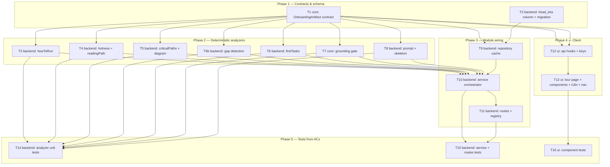

# Implementation Plan: Onboarding Generator

> **Revision note (post staff-engineer review):** Amended after the cross-model (GPT-5, repo access)
> review returned REQUEST CHANGES with all findings triaged and accepted. Changes folded in:
> gap-detection now has a real fact source (new **T6b** `analyzers/gaps.ts` + collection in T10);
> the shared schema uses **`.max()` caps only, no `.min()`** with happy-path minimums enforced as
> service-layer assertions; T10 re-parses the artifact through the shared schema **after grounding,
> before cache upsert**; the client renders a **"Generate tour" first-visit state** (no auto-POST);
> T13 owns nav discoverability (`vendor/ui/nav.ts`); T8 defines explicit non-JS/degraded skeleton
> fallback rules; hotness is **bounded to reading-path top-N** with path-scoped log + 90-day filter;
> plus the T9 tenancy/legacy-row, T11 GET-vs-POST rate-limit, T16 a11y, and AC-21 link-construction
> clarifications. See per-task Actions and the Traceability matrix.

## Overview
Generate a per-repo **Onboarding Tour** with exactly five sections (Architecture overview, Critical
paths, How to run locally, Guided reading path, First tasks). Structural facts are collected
deterministically through `container.repoIntel` and the cloned repo; **exactly one** structured LLM
call renders them as prose. The result is cached by `(repoId, headSha)`, degrades to an honest
deterministic skeleton, and is rendered by a new client page under Workspace. Sourced from
`specs/SPEC-2026-07-07-onboarding-generator.md` (approved, 23 EARS ACs).

## Execution mode
**multi-agent (parallel)** — chosen and mandated by the caller: tasks are typed (backend / core / ui)
for dispatch to `implementer-backend` / `implementer-ui`, grouped into phases with **non-overlapping
Owned paths** and an explicit dependency DAG so independent tasks run concurrently on the same branch.
The onboarding module is greenfield, so most implementation files are new and naturally disjoint; the
few shared touch-points (vendored contracts, schema, module registry, client `api.ts`, i18n, nav) are
each owned by exactly one task.

## Requirements (verified)
Restated from the spec's EARS acceptance criteria (AC-1..AC-23). Each is checkable and mapped to a
task in the Traceability matrix below.
- R1 (AC-1): Onboarding request for an indexed repo returns an artifact with all five sections populated.
- R2 (AC-2/AC-3): Exactly ONE structured LLM call per fresh generation; fact collection incurs zero LLM cost.
- R3 (AC-4/AC-5): Reading path ordered by `rank = pagerank × (1 + hotness)`; hotness from local `git log`
  over a 90-day window, degrading to `0` when history is unavailable, still rank-ordered.
- R4 (AC-6): Grounding gate discards any file/package/service the model names that is not in the fact set.
- R5 (AC-7): All third-party repo text is prompt-wrapped as untrusted data, never as instructions.
- R6 (AC-8/AC-9): Degraded/absent index → deterministic skeleton + honest "degraded" badge; LLM failure →
  skeleton + "narrative unavailable" flag; prior cache never corrupted; never an empty result.
- R7 (AC-10): How-to-run derived deterministically from lockfile → package manager, `package.json`
  scripts, `docker-compose` services, `.env.example` variable names; works fully with the LLM off.
- R8 (AC-11): Architecture diagram collapses candidates above the 5–8 node cap into one overflow node.
- R9 (AC-12): Critical paths = 5–8 file-kind entries, each with a one-line rationale + open-file link;
  non-file entries rejected.
- R10 (AC-13): 2–3 First tasks from genuinely detected gaps (path, rationale, pattern pointer,
  complexity); omitted with an honest message when no gap exists — never fabricated.
- R11 (AC-14/AC-15): Cache keyed by `(repoId, headSha)` — same SHA returns cache with no LLM call, SHA
  change regenerates; Regenerate forces a fresh generation regardless of cache.
- R12 (AC-16): Concurrent requests for one repo serialize via a per-repo lock — at most one LLM charge,
  identical result to both callers.
- R13 (AC-17): > 10 generation requests/minute per repo → 429.
- R14 (AC-18): No onboarding model selected → 422 with an actionable message, never a silent default.
- R15 (AC-19): Each fresh generation logs a structured line carrying `costUsd`.
- R16 (AC-20..AC-23): Client renders five collapsible cards + sticky scroll-spy nav + header (repo name,
  files-indexed, last-refreshed) + Regenerate/Share; Open opens the source file in a new tab; copy places
  command text / internal URL on the clipboard; First-task cards expose no navigation link.

## Open questions & recommendations
No requirement gaps block planning — the spec resolved all six clarifications with the user. The
following are **implementation decisions and flags**; all ten original flags plus the review findings
were verified by the staff-engineer review and accepted. They do not modify the spec.

- **Rec / flag (client route collision):** `client/src/app/onboarding/` **already exists** and is the
  *Add-repository* wizard (`AddRepoView`). The tour must NOT reuse it. Tour placed at
  `client/src/app/repos/[repoId]/onboarding/page.tsx` (mirrors `repos/[repoId]/conventions` and
  `repos/[repoId]/pulls`). Verified: `client/src/app/onboarding/page.tsx:1`.
- **Rec / flag (i18n namespace collision):** `client/messages/en/onboarding.json` **already exists**
  (add-repo wizard strings). The tour uses a NEW namespace file `client/messages/en/onboardingTour.json`
  so it does not clobber the wizard's strings.
- **Rec / flag (nav discoverability + active-state collision):** the nav registry
  `client/src/vendor/ui/nav.ts` uses `:repoId`-templated hrefs (e.g. `conventions`). A tour nav item must
  be added, and the active-key resolver tightened so the add-repo wizard at `/onboarding` does NOT
  highlight the tour item (see T13). Verified: `client/src/vendor/ui/nav.ts:25-34,71`.
- **Rec / flag (existing shared `Onboarding` contract):** `server|client/src/vendor/shared/contracts/
  knowledge.ts` already exports a **minimal, unused** `Onboarding` that does NOT match the spec's richer
  shape. The plan **adds a new contract file** `contracts/onboarding.ts` exporting `OnboardingArtifact`
  rather than editing the placeholder. The old `Onboarding` is left in place as dead/superseded —
  recommend a follow-up to delete it. **Explicit callout:** this is the shared-contract boundary; we ADD,
  never edit.
- **DECISION (schema caps — accepted, not re-litigated):** the single shared `OnboardingArtifact` schema
  carries **`.max()` caps only and NO `.min()`**, because AC-8 degraded skeletons legitimately have
  0-entry sections and `.min()` would reject them. Section minimums (criticalPaths ≥ 5, readingPath ≥ 3,
  firstTasks ≥ 2 unless honestly omitted) are enforced as **service-layer assertions on the happy path
  only** (fully-indexed + LLM-success). See T1, T8, T10.
- **Rec / flag (hotness source placement + bounding):** the `container.repoIntel` facade exposes NO
  commit-frequency method. The GitClient port provides `log(repo, path?)` → `GitCommit[] { sha, message,
  author, date }` (`vendor/shared/adapters.ts:198,260`) but with **no date window** — a repo-wide call is
  unbounded. Decision: compute hotness **only for reading-path candidates** (top-N from
  `getTopFilesByRank`), using **path-scoped** `log` calls with the **90-day filter applied in
  `hotness.ts`**. No shared-adapter edit needed. See T4/T10.
- **Rec / flag (feature-model 422):** `resolveFeatureModel(...)` **silently falls back** to a registry
  default (`settings/feature-models.ts:51`), which would violate AC-18. Use
  `getFeatureModelOverride(...)` (returns `undefined` when unset) and throw `ValidationError` (→ 422) when
  it is `undefined`. Baked into T10/T11.
- **Rec / flag (per-repo rate limit, POST only):** `@fastify/rate-limit` keys by client IP by default.
  AC-17 requires *per-repo* limiting → a `keyGenerator` returning `req.params.repoId` on the **POST
  generate route only** (never on GET fetch — reads must stay cheap and un-throttled). See T11.
- **Rec / flag (per-repo lock is in-process):** AC-16's lock is an in-memory `Map<repoId, Promise>` and
  only serializes within a single server instance. Local-first / single-instance DevDigest satisfies
  AC-16; multi-instance would need a shared lock — noted as a scaling limit.
- **Rec (cache interpretation + tenancy):** the `onboarding` table keeps `repoId` as PK (one row per
  repo); an additive `head_sha` column is added. Cache hit = stored `head_sha === currentHead(repo)`;
  fresh generation upserts the single row. A **NULL `head_sha`** (legacy row) counts as a **cache miss →
  regenerate**. The table has **no `workspace_id`**, so every read/upsert first verifies workspace
  ownership via `RepoRepository.getById(workspaceId, repoId)` (filters `repos.workspaceId`) before
  touching `onboarding`. See T9/T10.

## Affected modules & contracts
- **server** — new feature module `modules/onboarding/` (routes/service/repository + `analyzers/`
  pure helpers, incl. `gaps.ts`); one additive line in `modules/index.ts`; additive `head_sha` column on
  the `onboarding` table (`db/schema/context.ts`) + one additive migration.
- **client** — new tour page `app/repos/[repoId]/onboarding/` + `_components/`; new hooks
  `lib/hooks/onboarding.ts` + fetchers/query-keys in `lib/api.ts`; new i18n namespace; a nav item +
  active-key tightening in `vendor/ui/nav.ts`.
- **reviewer-core** — **no change** (its `groundFindings` is diff-line based and does not fit; the
  onboarding grounding gate is a distinct pure helper local to the module).
- **Contracts:** ADD `contracts/onboarding.ts` (`OnboardingArtifact` + `Node`/`Edge`/section schemas)
  to **both** vendored mirrors (`server/src/vendor/shared/`, `client/src/vendor/shared/`) in lock-step;
  re-export from each `contracts` barrel. No existing contract is edited. The `onboarding`
  `FeatureModelId` already exists in `contracts/platform.ts` — no change there.

## Architecture changes
- `server/src/modules/onboarding/routes.ts` — Transport (Fastify plugin, ZodTypeProvider). `GET
  /repos/:repoId/onboarding` (fetch cache), `POST /repos/:repoId/onboarding` (`{ force?: boolean }`,
  generate). Per-repo `keyGenerator` rate limit on POST only (AC-17); 422 (no model) and 429 mapped here.
- `server/src/modules/onboarding/service.ts` — Application layer. Orchestrates fact gathering
  (`container.repoIntel.*` facade + `container.git` clone reads + `container.conventionsRepo`), degrade
  decisions, gap collection, per-repo lock, the single `container.llm(provider).completeStructured` call,
  grounding, `OnboardingArtifact.parse()` re-validation, `costUsd` logging, cache. Depends on interfaces
  via `container` only — no adapter/SDK imports.
- `server/src/modules/onboarding/repository.ts` — Infrastructure. Only file allowed to touch
  `db/schema` for the `onboarding` table (read/upsert by `repoId`, comparing `head_sha`).
- `server/src/modules/onboarding/analyzers/*.ts` — pure deterministic helpers (Application-pure): no
  I/O beyond values passed in (clone reads / conventions / git log are done by the service and passed as
  data). Unit-testable in isolation against AC observables.
- `client/src/app/repos/[repoId]/onboarding/page.tsx` — RSC shell; interactive pieces under
  `_components/` are `"use client"` (collapsible cards, scroll-spy, clipboard, blob links, first-visit
  generate state).

## Phased tasks

### Phase 1 — Contracts & schema (T1, T2 run concurrently)

- **T1**
  - **Action:** Add a new contract file `contracts/onboarding.ts` exporting `OnboardingArtifact` (Zod)
    matching the spec's shape: `repoName`, `filesIndexed`, `generatedAt`, `headSha`, `degraded?`,
    `degradedReason?`, `narrativeUnavailable?`, and `sections` = `architecture` (`overview`, `style`
    enum, `diagram { nodes: Node[]; edges: Edge[] }` with `Node = { id; label; kind:
    'file'|'package'|'service'|'overflow' }`, `Edge = { from; to; label? }`), `criticalPaths`
    (`Array<{file, rationale, link}>`), `howToRun` (`Array<{step, command}>`), `readingPath`
    (`Array<{file, rationale, link}>`), `firstTasks?` (`Array<{title, suggestedPath, gapType,
    rationale, patternPointer, complexity}>`). Export inferred types. Re-export from each `contracts`
    barrel / `index.ts`. **Apply section caps as `.max()` ONLY — NO `.min()`** (criticalPaths `.max(8)`,
    readingPath `.max(5)`, firstTasks `.max(3)`): the single shared schema must also validate AC-8
    degraded skeletons, which legitimately carry 0-entry sections, so a `.min()` would wrongly reject
    them. Happy-path minimums are enforced in T10, not in the schema. **Edit both vendor mirrors in
    lock-step** and do not touch the existing `Onboarding` placeholder.
  - **Module:** shared contracts (server + client) · **Type:** core
  - **Skills to use:** `zod`, `typescript-expert`
  - **Owned paths:** `server/src/vendor/shared/contracts/onboarding.ts`,
    `client/src/vendor/shared/contracts/onboarding.ts`,
    `server/src/vendor/shared/index.ts`, `client/src/vendor/shared/index.ts`
  - **Depends-on:** none
  - **Covers:** AC-1, AC-11, AC-12, AC-13 (contract shape/caps); underpins all
  - **Risk:** medium
  - **Known gotchas:** vendored shared is **two hand-maintained copies, not auto-synced** — the only
    legitimate diffs are comments; adding to one without the other breaks the other package's typecheck
    (`server/INSIGHTS.md` 2026-06-14). This is a `do-not-touch-without-coordination` path — additive only.
    Do NOT add `.min()` caps (see Action) — the degraded skeleton must pass the same schema.
  - **Acceptance:** `cd server && npx tsc --noEmit` and `cd client && npx tsc --noEmit` both pass;
    `OnboardingArtifact` importable from `@devdigest/shared` in both packages; a 0-entry-sections skeleton
    object `.parse()`s successfully.

- **T2**
  - **Action:** Add a nullable additive `headSha` column (`head_sha text`) to the `onboarding` table in
    `db/schema/context.ts`; keep `repoId` as PK. Generate the migration with `npm run db:generate`
    (pure addition — the rename gate does NOT apply). Verify the generated SQL is `ALTER TABLE ... ADD
    COLUMN` only and that `_journal.json` advanced by one entry.
  - **Module:** server · **Type:** backend
  - **Skills to use:** `drizzle-orm-patterns`, `postgresql-table-design`
  - **Owned paths:** `server/src/db/schema/context.ts`, `server/src/db/migrations/` (new migration
    file + its `_journal.json`/meta entry only)
  - **Depends-on:** none
  - **Covers:** AC-14 (storage side)
  - **Known gotchas:** `db:generate` opens an interactive TTY prompt ONLY on renames; this is a pure
    addition, so it is safe (`server/CLAUDE.md` migration rename gate). Do not hand-edit prior migrations.
  - **Acceptance:** migration file exists with an additive `ADD COLUMN head_sha`; `cd server && npx tsc
    --noEmit` passes; schema import compiles.

### Phase 2 — Deterministic analyzers (T3–T8 run concurrently; all depend on T1, none on each other)

- **T3**
  - **Action:** Implement `analyzers/howToRun.ts` — a pure function that takes parsed clone facts
    (lockfile name → package manager, `package.json` scripts, `docker-compose` service names,
    `.env.example` variable **names**) and returns ordered `howToRun` steps. Works from whatever exists
    (package.json scripts at minimum); reads only variable names, never `.env` values. The service (T10)
    performs the actual clone reads via `container.git.readFile` and passes raw text in — keep this
    helper I/O-free so it runs identically in degraded and LLM-off modes.
  - **Module:** server · **Type:** backend
  - **Skills to use:** `typescript-expert`, `security` (never read `.env` secret values)
  - **Owned paths:** `server/src/modules/onboarding/analyzers/howToRun.ts`
  - **Depends-on:** T1
  - **Covers:** AC-10
  - **Known gotchas:** none
  - **Acceptance:** unit-covered in T14 (`analyzers/howToRun.test.ts`); `tsc --noEmit` passes.

- **T4**
  - **Action:** Implement `analyzers/hotness.ts` + `analyzers/readingPath.ts`. `hotness`: given a map of
    `path → GitCommit[]` (path-scoped `container.git.log`, produced by the service **only for the
    reading-path candidate set**, i.e. top-N from `getTopFilesByRank`) and the 90-day window, filter
    commits to the window **inside `hotness.ts`**, compute commit frequency per file, normalize to a
    hotness score; missing/empty history ⇒ `0`. Document the candidate cap `N` as a module constant
    (e.g. `HOTNESS_CANDIDATE_MAX`) so the git-log fan-out is bounded and never repo-wide. `readingPath`:
    given pagerank rows (`getFileRank`/`getTopFilesByRank`) and the hotness map, order by
    `rank = pagerank × (1 + hotness)` and emit 3–5 `{file, rationale, link}` entries. The `link` is
    constructed server-side from `repo.fullName` + `headSha` (see T10) — the analyzer receives those as
    inputs, it does not fetch them. Pure functions.
  - **Module:** server · **Type:** backend
  - **Skills to use:** `typescript-expert`
  - **Owned paths:** `server/src/modules/onboarding/analyzers/hotness.ts`,
    `server/src/modules/onboarding/analyzers/readingPath.ts`
  - **Depends-on:** T1
  - **Covers:** AC-4, AC-5, AC-21 (link construction from fullName + headSha)
  - **Known gotchas:** `GitCommit.date` is a string — parse before windowing (`adapters.ts:198`).
    `git.log` has no built-in date window, so the 90-day filter lives in `hotness.ts` and the service must
    only call `log` path-scoped for the bounded candidate set — never a repo-wide history walk. Reading
    path cap is 3–5 (distinct from the 5–8 critical-paths cap).
  - **Acceptance:** unit-covered in T14 — with hotness varied on top-N candidates the order differs from
    pure-pagerank order (AC-4); a no-history input still yields an ordered path (AC-5); a windowing fixture
    proves commits older than 90 days are excluded from the score; `tsc` passes.

- **T5**
  - **Action:** Implement `analyzers/criticalPaths.ts` + `analyzers/architecture.ts`.
    `criticalPaths`: from `container.repoIntel.getCriticalPaths` chains + rank facts, emit 5–8
    **file-kind** entries each with a one-line rationale and an open-file link (link built server-side
    from `repo.fullName` + `headSha`, passed in by T10); reject any non-file (e.g. service) entry.
    `architecture`: build diagram `{nodes, edges}` and, when candidate nodes exceed the 5–8 cap,
    deterministically collapse the surplus into a single `kind:'overflow'` node. Pure functions.
  - **Module:** server · **Type:** backend
  - **Skills to use:** `typescript-expert`
  - **Owned paths:** `server/src/modules/onboarding/analyzers/criticalPaths.ts`,
    `server/src/modules/onboarding/analyzers/architecture.ts`
  - **Depends-on:** T1
  - **Covers:** AC-11, AC-12, AC-21 (link construction from fullName + headSha)
  - **Known gotchas:** `getCriticalPaths` returns `string[][]` chains and is `[]` when the index is
    degraded/disabled (`repo-intel/service.ts:666`) — handle empty input as a valid (skeleton) case.
  - **Acceptance:** unit-covered in T14 — 12 candidate nodes → ≤ 8 nodes + 1 overflow (AC-11); output
    contains only file-kind entries with rationale + link and rejects a seeded service entry (AC-12).

- **T6b**
  - **Action:** Implement `analyzers/gaps.ts` — **pure** deterministic gap-detection heuristics that,
    given fact inputs the service collects, return a list of detected gaps (each `{ gapType, path,
    patternPointer, evidence }`). Heuristics (advisory, deterministic): (a) **missing test** — a
    top-ranked source file with no sibling/`__tests__` test file; (b) **missing doc** — a public/exported
    symbol or top-level module with no doc coverage; (c) **missing convention pattern** — a file that
    diverges from accepted convention samples. Emit `[]` when nothing is genuinely detected — never
    invent a gap. Keep I/O-free: the service (T10) supplies the raw inputs (top-ranked files +
    file-existence map from clone checks + accepted conventions), and `gaps.ts` only decides. `firstTasks`
    (T6) formats gaps into 2–3 tasks; `gaps.ts` is the detection source that makes AC-13 genuine rather
    than synthetic.
  - **Module:** server · **Type:** backend
  - **Skills to use:** `typescript-expert`
  - **Owned paths:** `server/src/modules/onboarding/analyzers/gaps.ts`
  - **Depends-on:** T1
  - **Covers:** AC-13 (detection source)
  - **Known gotchas:** the facade exposes `getConventionSamples(repoId, n)` and rank helpers; accepted
    conventions come via `container.conventionsRepo` — both are collected by T10 and passed in, so this
    file stays pure. Do not fabricate a gap to satisfy the 2–3 target — an empty detection is valid and
    drives the honest-omission path.
  - **Acceptance:** unit-covered in T14 — a fixture with a top-ranked source file lacking a test yields a
    `missing_test` gap; a fully-covered fixture yields `[]`; `tsc` passes.

- **T6**
  - **Action:** Implement `analyzers/firstTasks.ts` — from the detected gaps produced by `gaps.ts` (T6b),
    emit 2–3 tasks each with `title`, `suggestedPath`, `gapType`, `rationale`, `patternPointer`,
    `complexity`. When the gap list is empty, return an "omitted" signal with an honest message — never
    fabricate a task. Pure function (consumes gaps, emits formatted tasks).
  - **Module:** server · **Type:** backend
  - **Skills to use:** `typescript-expert`
  - **Owned paths:** `server/src/modules/onboarding/analyzers/firstTasks.ts`
  - **Depends-on:** T1
  - **Covers:** AC-13 (formatting + honest omission)
  - **Known gotchas:** the detection lives in T6b `gaps.ts`; this file must not re-derive gaps or invent
    them — a zero-length gap list maps to the honest-omission signal, not a placeholder task.
  - **Acceptance:** unit-covered in T14 — an empty gap list omits First tasks with an honest note and
    invents nothing; a non-empty gap list yields 2–3 well-formed tasks; `tsc` passes.

- **T7**
  - **Action:** Implement `analyzers/grounding.ts` — the mandatory grounding gate: given the LLM-proposed
    artifact and the deterministically collected fact set (known files, packages, services), discard any
    referenced file/package/service absent from the fact set before the artifact is returned. Pure,
    deterministic, no I/O. Do **not** reuse reviewer-core `groundFindings` (diff-line based, wrong fit).
  - **Module:** server · **Type:** core (pure)
  - **Skills to use:** `typescript-expert`, `security`
  - **Owned paths:** `server/src/modules/onboarding/analyzers/grounding.ts`
  - **Depends-on:** T1
  - **Covers:** AC-6
  - **Known gotchas:** none
  - **Acceptance:** unit-covered in T14 — a stubbed hallucinated reference is stripped while fact-based
    entries remain (AC-6); `tsc` passes.

- **T8**
  - **Action:** Implement `analyzers/prompt.ts` + `analyzers/skeleton.ts`. `prompt`: build the single
    structured user message, wrapping every repo-authored region (README/CLAUDE.md prose, `package.json`
    content, `.env.example` names, file extracts) with `wrapUntrusted` from `platform/prompt.js` as data,
    never instructions. `skeleton`: assemble a deterministic `OnboardingArtifact` from available facts
    only (used for degraded and LLM-failure paths), setting `degraded`/`degradedReason` or
    `narrativeUnavailable` as instructed by the caller. **Define the non-JS / degraded fallback rules
    explicitly:** when `getIndexState` is degraded/absent and the import graph is empty, build
    graph-dependent sections from **directory/entrypoint heuristics** — top-level directories as
    architecture nodes and `README` + package-manifest entrypoints (`package.json`/equivalent) as the
    reading/critical seeds — while How-to-run still comes fully from T3. Sections that have no available
    facts render as empty arrays (valid under the no-`.min()` schema) with the degraded badge set. Pure
    functions.
  - **Module:** server · **Type:** backend
  - **Skills to use:** `security`, `typescript-expert`
  - **Owned paths:** `server/src/modules/onboarding/analyzers/prompt.ts`,
    `server/src/modules/onboarding/analyzers/skeleton.ts`
  - **Depends-on:** T1
  - **Covers:** AC-7, AC-8
  - **Known gotchas:** server code uses `platform/prompt.js`'s `wrapUntrusted` (as `intent/service.ts:3`
    does), NOT the reviewer-core copy. The skeleton must `.parse()` under the shared schema even with
    0-entry sections (no `.min()` — see T1).
  - **Acceptance:** unit-covered in T14 — the prompt payload delimits each untrusted region (AC-7); the
    skeleton is a valid non-empty (5-section) artifact with the degraded flag set even for a non-JS repo
    with an empty import graph, and passes `OnboardingArtifact.parse()` (AC-8); `tsc` passes.

### Phase 3 — Module wiring (sequential: T9 ∥ nothing new, then T10, then T11)

- **T9**
  - **Action:** Implement `repository.ts` — the only file touching the `onboarding` table. `read(repoId)`
    returns the stored artifact + `head_sha`; `upsert(repoId, artifact, headSha)` writes the single row.
    Cache-hit logic (`stored.head_sha === currentHead`) lives in the service; the repository is pure
    persistence. **Tenancy:** the `onboarding` table has no `workspace_id`, so `read`/`upsert` must be
    called only after the service has verified repo ownership via `RepoRepository.getById(workspaceId,
    repoId)` — document this contract at the repository boundary (the repository itself is repo-keyed).
    **Legacy row:** a row with a **NULL `head_sha`** must be treated by the service as a **cache miss →
    regenerate** (state this explicitly in the read contract), never as a corrupt read.
  - **Module:** server · **Type:** backend
  - **Skills to use:** `drizzle-orm-patterns`, `onion-architecture`
  - **Owned paths:** `server/src/modules/onboarding/repository.ts`
  - **Depends-on:** T1, T2
  - **Covers:** AC-14 (storage), AC-9 (prior cache left uncorrupted on failure — upsert only on success)
  - **Known gotchas:** the table was previously write-less — this task adds its first writes; a
    `head_sha`-less legacy row must be tolerated on read and surfaced as a miss. Tenancy is enforced one
    layer up (repos table) because `onboarding` carries no `workspace_id`.
  - **Acceptance:** compiles; exercised by T15 integration tests (cache hit/miss by SHA; NULL head_sha →
    regenerate).

- **T10**
  - **Action:** Implement `service.ts` orchestrator. (1) Resolve + **tenancy-check** the repo via
    `RepoRepository.getById(workspaceId, repoId)` (repos-table `workspaceId` filter) before any
    `onboarding` access; thread the explicit `repoId`. (2) Gather facts deterministically:
    `container.repoIntel.getIndexState/getFileRank/getTopFilesByRank/getCriticalPaths` + clone reads via
    `container.git.readFile`, current head via `container.git.currentHead`, **path-scoped**
    `container.git.log` **only for the bounded reading-path candidate set** (top-N), accepted conventions
    via `container.conventionsRepo` + `getConventionSamples`, and clone file-existence checks for gap
    detection — **zero LLM calls in this stage** (AC-3). (3) Build the gap inputs and call `gaps.ts`
    (T6b) → `firstTasks.ts` (T6). (4) Decide degrade: if index degraded/absent, build the skeleton (T8)
    with the explicit non-JS/degraded fallback rules + degraded badge and return (AC-8). (5) Resolve the
    onboarding model via `getFeatureModelOverride(container, workspaceId, 'onboarding')`; if `undefined`,
    throw `ValidationError` (→422) — never `resolveFeatureModel` (AC-18). (6) Per-repo lock: an in-memory
    `Map<repoId, Promise<Artifact>>` so concurrent calls await one in-flight generation (AC-16). (7)
    Cache: unless `force`, if `stored.head_sha === currentHead` (and non-NULL) return cache with no LLM
    call; else make **exactly one** `container.llm(provider).completeStructured<OnboardingArtifact>` call
    (AC-2). (8) Run the grounding gate (T7) on the result (AC-6). (9) **Re-validate the grounded artifact
    with `OnboardingArtifact.parse()` BEFORE the cache upsert** — this is the trust boundary for
    untrusted-derived LLM output, mirroring `intent/service.ts:117-121`; a parse failure (malformed
    structured output) is treated like an LLM failure → return the skeleton + `narrativeUnavailable` and
    leave the prior cache intact. (10) Enforce **happy-path section minimums** here (criticalPaths ≥ 5,
    readingPath ≥ 3, firstTasks ≥ 2 unless honestly omitted) as service-layer assertions — the schema has
    no `.min()`. (11) On LLM error, return skeleton + `narrativeUnavailable`, prior cache intact (AC-9).
    (12) Log a structured line with `costUsd` from the LLM result (AC-19). (13) Upsert the successful,
    re-parsed artifact via T9. Compose the analyzers (T3–T8) for the deterministic sections; construct all
    open-file `link`s server-side from `repo.fullName` + `headSha` and pass them into the analyzers. No
    adapter/SDK imports — interfaces via `container`.
  - **Module:** server · **Type:** backend
  - **Skills to use:** `onion-architecture`, `fastify-best-practices`, `security`, `typescript-expert`
  - **Owned paths:** `server/src/modules/onboarding/service.ts`
  - **Depends-on:** T3, T4, T5, T6b, T6, T7, T8, T9
  - **Covers:** AC-1, AC-2, AC-3, AC-8, AC-9, AC-13 (genuine collection), AC-14, AC-15, AC-16, AC-18,
    AC-19, AC-21 (link construction)
  - **Known gotchas:** resolving "the workspace's repo" without an explicit `repoId` and `ORDER BY` is
    heap-order nondeterministic — always thread the explicit `repoId`, else `ORDER BY createdAt`
    preferring a repo whose clone `stat()`s (`server/INSIGHTS.md` 2026-07-07). `getFeatureModelOverride`
    (not `resolveFeatureModel`) is the AC-18 path. Fact collection must never throw — degrade each failing
    fact to empty/zero (AC-5, AC-8). `git.log` must be called path-scoped for the bounded candidate set
    only — never repo-wide. The post-grounding `.parse()` is mandatory (trust boundary).
  - **Acceptance:** compiles; behaviours verified by T15 (LLM count 1 on fresh, 0 on SHA-match, 1 on
    force; NULL head_sha → regenerate; two parallel → 1 identical result; missing model → 422; malformed
    structured output → skeleton + cache unchanged; a real gap fixture yields First tasks; `costUsd` in
    the structured log).

- **T11**
  - **Action:** Implement `routes.ts` (default Fastify plugin, `ZodTypeProvider`): `GET
    /repos/:repoId/onboarding` (fetch cache; not-found when nothing generated) and `POST
    /repos/:repoId/onboarding` (body `{ force?: boolean }`, generate). Resolve `{ workspaceId }` via
    `getContext(app.container, req)`. Apply `config: { rateLimit: { max: 10, timeWindow: '1 minute',
    keyGenerator: (req) => req.params.repoId } }` **on the POST generate route ONLY** — GET fetch stays
    un-throttled so cached reads stay cheap (AC-17). Map the service's no-model `ValidationError` to 422
    (AC-18). Validate params/body/response with the shared contract. Register the module in
    `modules/index.ts` (one import + one registry entry).
  - **Module:** server · **Type:** backend
  - **Skills to use:** `fastify-best-practices`, `zod`, `onion-architecture`
  - **Owned paths:** `server/src/modules/onboarding/routes.ts`, `server/src/modules/index.ts`
  - **Depends-on:** T10
  - **Covers:** AC-17, AC-18 (transport mapping), AC-1 (endpoint surface)
  - **Known gotchas:** register static/literal path segments before `/:param` routes or Fastify matches
    the literal as the param and returns 422 (`server/INSIGHTS.md` 2026-06-18). Default `@fastify/
    rate-limit` keys by IP — the `keyGenerator` is what makes AC-17 *per-repo*, and it must be attached
    to POST generate only, not GET fetch.
  - **Acceptance:** app boots with the module registered; T15 asserts the 11th POST/min → 429, GET
    un-throttled, and missing-model → 422.

### Phase 4 — Client (T12 then T13; both can start once T1 lands, in parallel with backend phases 2–3)

- **T12**
  - **Action:** Add TanStack Query hooks `lib/hooks/onboarding.ts` — `useOnboarding(repoId)` (GET) and
    `useGenerateOnboarding(repoId)` / regenerate mutation (POST `{ force }`), with stable query keys
    (e.g. `['onboarding', repoId]`) and cache invalidation on generate. Distinguish a not-found/empty
    cache (first visit) from an error so the page can render the generate state (see T13). Add the
    fetchers/keys to `lib/api.ts` (reuse `apiFetch`). Type everything against `OnboardingArtifact` from
    `@devdigest/shared` — never hand-duplicate.
  - **Module:** client · **Type:** ui
  - **Skills to use:** `react-best-practices`, `frontend-architecture`, `next-best-practices`, `typescript-expert`
  - **Owned paths:** `client/src/lib/hooks/onboarding.ts`, `client/src/lib/api.ts`,
    `client/src/lib/hooks/index.ts`
  - **Depends-on:** T1
  - **Covers:** AC-1, AC-14, AC-15 (client data path)
  - **Known gotchas:** `apiFetch` only sets a JSON content-type when a body is present — a body-less POST
    is fine (`lib/api.ts` header comment). All API access + query keys belong in `lib/` per project rule.
  - **Acceptance:** `cd client && npx tsc --noEmit` passes; hooks importable and typed; the hook exposes a
    distinguishable "no tour yet" state.

- **T13**
  - **Action:** Build the tour page `app/repos/[repoId]/onboarding/page.tsx` (RSC shell) + `_components/`
    (`"use client"` where interactive): five collapsible cards (Architecture, Critical paths, How to run,
    Reading path, First tasks), a sticky "on this page" scroll-spy nav, and a header with repo name,
    files-indexed count, and last-refreshed time, plus Regenerate and Share controls (AC-20).
    **First-visit flow:** when GET returns 404/empty cache, render a non-empty **"Generate tour"** state
    that POSTs generation **on explicit user interaction only** — NOT an auto-POST on mount (avoids
    un-consented LLM spend and a naked 422 when no model is selected). Open on a Critical-paths/Reading-
    path entry renders an external blob link with `target="_blank"` (AC-21). Copy on a How-to-run command
    writes the command to the clipboard; Share copies the internal onboarding URL (AC-22). First-task
    cards render path/rationale/pattern/complexity with **no href or navigation handler** (AC-23). Reuse
    `client/src/components/SafeMarkdown/` for narrative bodies. Add a new i18n namespace
    `messages/en/onboardingTour.json` (do not reuse `onboarding.json`); no hardcoded strings. **Nav
    discoverability:** add a nav item to `client/src/vendor/ui/nav.ts` (`{ key: "onboarding-tour", label:
    "Onboarding", icon, href: "/repos/:repoId/onboarding" }`) and **tighten the active-key resolver** so
    the add-repo wizard at `/onboarding` does NOT highlight the tour item (e.g. require
    `pathname.includes("/repos/") && pathname.endsWith("/onboarding")`); mirror the edit to any lockstep
    vendor copy if one exists (verified today: `vendor/ui` is client-only, single copy). Meet WCAG 2.1 AA:
    keyboard-operable cards/nav, degraded badge conveyed by text/ARIA not colour alone.
  - **Module:** client · **Type:** ui
  - **Skills to use:** `frontend-architecture`, `react-best-practices`, `next-best-practices`, `security`, `typescript-expert`
  - **Owned paths:** `client/src/app/repos/[repoId]/onboarding/` (page + `_components/`),
    `client/messages/en/onboardingTour.json`, `client/src/vendor/ui/nav.ts`
  - **Depends-on:** T1, T12
  - **Covers:** AC-20, AC-21, AC-22, AC-23; plus first-visit generate state and nav discoverability
  - **Known gotchas:** `/onboarding` and `messages/en/onboarding.json` already belong to the add-repo
    wizard — use the `repos/[repoId]/onboarding` route and the `onboardingTour` namespace, and make the
    nav active-key logic path-specific so the two `/onboarding`-suffixed routes do not cross-highlight
    (`vendor/ui/nav.ts:71` `resolveHref` templates `:repoId`). Relative-import depth from
    `repos/[repoId]/onboarding/_components/` is deep and routinely undercounted — copy a neighbour's
    import depth instead of counting (`client/INSIGHTS.md` 2026-07-05). Blob-in-new-tab precedent:
    `BlastTab` opens `githubBlobUrl` in a new tab. Do NOT auto-POST on mount.
  - **Acceptance:** covered by T16; `cd client && npx tsc --noEmit` passes; page renders the five cards
    when data exists and the "Generate tour" state when the cache is empty.

### Phase 5 — Tests derived from the spec's ACs (test oracle = AC observables, NOT the implementation)

> Per the caller's directive, analyzer and service tests are written by `test-writer` from the spec's
> acceptance criteria, using each AC's `_(observable: …)_` clause as the oracle — not reverse-engineered
> from the code. These tasks own only test files, so they never collide with implementation owned paths.

- **T14**
  - **Action:** Unit tests for the pure analyzers, one `*.test.ts` per helper, asserting the AC
    observables directly: AC-4/AC-5 (reading order vs pure-pagerank; no-history still ordered; **90-day
    windowing fixture** proving stale commits are excluded), AC-6 (hallucinated ref stripped), AC-7
    (untrusted regions delimited), AC-8 (skeleton valid + degraded flag, incl. a **non-JS / empty-import-
    graph degraded fixture** exercising the directory/entrypoint fallback), AC-10 (howToRun populated with
    LLM off), AC-11 (12 → ≤8 + overflow), AC-12 (file-only 5–8 with rationale+link), AC-13 (`gaps.ts`
    detects a genuine missing-test gap; a covered fixture yields `[]`; `firstTasks` omits honestly on an
    empty gap list).
  - **Module:** server · **Type:** backend
  - **Skills to use:** `typescript-expert`
  - **Owned paths:** `server/src/modules/onboarding/analyzers/*.test.ts`
  - **Depends-on:** T3, T4, T5, T6b, T6, T7, T8
  - **Covers:** AC-4, AC-5, AC-6, AC-7, AC-8, AC-10, AC-11, AC-12, AC-13
  - **Acceptance:** `cd server && npx vitest run src/modules/onboarding/analyzers` is green.

- **T15**
  - **Action:** Integration tests for service + routes using the no-DB smoke pattern (mock `db` +
    full `RepoIntel` mock + injected `llm` mock via `ContainerOverrides`), asserting: AC-1 (5 sections),
    AC-2 (LLM count = 1 fresh), AC-3 (no LLM in fact stage), AC-8 (degraded repo → skeleton+flag), AC-9
    (forced LLM error → skeleton + narrativeUnavailable, prior cache unchanged **and** malformed
    structured output that fails `OnboardingArtifact.parse()` → skeleton returned, cache unchanged),
    AC-13 (a **genuine gap fixture** — top-ranked source file missing a test — yields non-empty First
    tasks, proving detection is real, not synthetic; a covered fixture omits honestly), AC-14 (2nd request
    same SHA → LLM 0; SHA change → new call; **NULL head_sha legacy row → regenerate**), AC-15 (force →
    LLM 1), AC-16 (two parallel → LLM 1 identical), AC-17 (11th POST/min → 429; GET un-throttled), AC-18
    (no model → 422), AC-19 (structured log carries `costUsd`).
  - **Module:** server · **Type:** backend
  - **Skills to use:** `fastify-best-practices`, `typescript-expert`
  - **Owned paths:** `server/src/modules/onboarding/service.test.ts`,
    `server/src/modules/onboarding/routes.test.ts`
  - **Depends-on:** T10, T11
  - **Covers:** AC-1, AC-2, AC-3, AC-8, AC-9, AC-13 (service-level genuine detection), AC-14, AC-15,
    AC-16, AC-17, AC-18, AC-19
  - **Known gotchas:** the injected `RepoIntel` mock must implement **all** interface methods or `tsc`
    fails; `buildApp` connects to postgres lazily so a minimal mock `db` needs no real Postgres
    (`server/INSIGHTS.md` 2026-07-05).
  - **Acceptance:** `cd server && npx vitest run src/modules/onboarding` is green.

- **T16**
  - **Action:** Component tests (RTL + Vitest, MSW for the API) asserting AC-20 (five cards + scroll-spy
    nav + header fields + Regenerate/Share), AC-21 (entry renders an external blob link with
    `target=_blank`), AC-22 (clipboard holds command text / internal URL), AC-23 (First-task card exposes
    no href or navigation handler), the **first-visit "Generate tour" state** (empty cache → generate
    affordance rendered, no auto-POST; POST fires only on user click), and **baseline a11y** per the NFR:
    keyboard expand/collapse on cards, nav focus management, and the degraded badge accessible by
    name/ARIA (not colour-only).
  - **Module:** client · **Type:** ui
  - **Skills to use:** `react-testing-library`
  - **Owned paths:** `client/src/app/repos/[repoId]/onboarding/_components/*.test.tsx`
  - **Depends-on:** T13
  - **Covers:** AC-20, AC-21, AC-22, AC-23 (+ first-visit flow, a11y baseline)
  - **Acceptance:** `cd client && npx vitest run src/app/repos/[repoId]/onboarding` is green.

## Traceability matrix (AC → task → test → commit)
The `plan-verifier` walks this row by row. `commit` is a placeholder filled during implementation.

| AC | Task(s) | Test (name / location) | Commit |
|----|---------|------------------------|--------|
| AC-1  | T1, T10, T11 | `routes.test.ts › returns artifact with 5 non-empty sections` | `<pending>` |
| AC-2  | T10 | `service.test.ts › exactly one LLM call per fresh generation` | `<pending>` |
| AC-3  | T10 | `service.test.ts › fact-collection stage records zero LLM invocations` | `<pending>` |
| AC-4  | T4 | `analyzers/readingPath.test.ts › varied hotness reorders vs pure pagerank` | `<pending>` |
| AC-5  | T4 | `analyzers/hotness.test.ts › no git history → hotness 0; 90-day window excludes stale commits; path still ordered` | `<pending>` |
| AC-6  | T7 | `analyzers/grounding.test.ts › strips reference absent from fact set` | `<pending>` |
| AC-7  | T8 | `analyzers/prompt.test.ts › delimits repo text as untrusted regions` | `<pending>` |
| AC-8  | T8, T10 | `analyzers/skeleton.test.ts › non-JS empty-graph degraded → valid skeleton (dir/entrypoint fallback) + degraded flag`; `service.test.ts › degraded index → skeleton + degraded flag` | `<pending>` |
| AC-9  | T10, T9 | `service.test.ts › LLM error OR malformed structured output → skeleton + narrativeUnavailable, cache intact` | `<pending>` |
| AC-10 | T3 | `analyzers/howToRun.test.ts › populated with LLM stubbed off` | `<pending>` |
| AC-11 | T5 | `analyzers/architecture.test.ts › 12 nodes → ≤8 + 1 overflow node` | `<pending>` |
| AC-12 | T5 | `analyzers/criticalPaths.test.ts › 5–8 file-only entries, rejects service` | `<pending>` |
| AC-13 | T6b, T6, T10 | `analyzers/gaps.test.ts › detects genuine missing-test gap; covered fixture → []`; `analyzers/firstTasks.test.ts › empty gap list omits honestly`; `service.test.ts › real gap fixture yields First tasks (genuine detection)` | `<pending>` |
| AC-14 | T9, T10 | `service.test.ts › same SHA → LLM 0; SHA change → regenerate; NULL head_sha → regenerate` | `<pending>` |
| AC-15 | T10 | `service.test.ts › force → LLM count 1 regardless of cache` | `<pending>` |
| AC-16 | T10 | `service.test.ts › two concurrent requests → LLM 1, identical result` | `<pending>` |
| AC-17 | T11 | `routes.test.ts › 11th POST within a minute → 429; GET un-throttled` | `<pending>` |
| AC-18 | T10, T11 | `routes.test.ts › missing onboarding model → 422 with message` | `<pending>` |
| AC-19 | T10 | `service.test.ts › structured log line carries costUsd` | `<pending>` |
| AC-20 | T13 | `_components/OnboardingTour.test.tsx › five cards + nav + header + controls; first-visit generate state; a11y baseline` | `<pending>` |
| AC-21 | T13 (link via T4/T5/T10) | `_components/*.test.tsx › Open renders external blob link target=_blank (link = fullName + headSha)` | `<pending>` |
| AC-22 | T13 | `_components/*.test.tsx › copy command / share URL writes clipboard` | `<pending>` |
| AC-23 | T13 | `_components/*.test.tsx › First-task card exposes no href/nav handler` | `<pending>` |

## Testing strategy
- **Backend unit (analyzers):** `cd server && npx vitest run src/modules/onboarding/analyzers` — pure
  functions, no DB/LLM. Oracle = AC observables (T14).
- **Backend integration (service+routes):** `cd server && npx vitest run src/modules/onboarding` — no-DB
  smoke pattern with mock `db`, full `RepoIntel` mock, injected `llm` mock via `ContainerOverrides`;
  asserts LLM-call counts, cache/SHA behaviour (incl. NULL head_sha), lock, malformed-output re-parse,
  genuine gap detection, 422/429, `costUsd` log (T15).
- **Client component:** `cd client && npx vitest run src/app/repos/[repoId]/onboarding` — RTL + MSW,
  user-flow assertions on cards/nav/header/controls/clipboard/links, first-visit generate state, a11y
  baseline (T16).
- **Typecheck (every task's gate):** `cd server && npx tsc --noEmit`; `cd client && npx tsc --noEmit`.
- **Onion gate (backend, before declaring done):** `cd server && npm run depcruise` — must not introduce
  a new `error` (service imports only via `container`; only `repository.ts` touches `db/schema`).

## Risks & mitigations
- **Client route collision** (`/onboarding` = add-repo wizard) → place the tour at
  `repos/[repoId]/onboarding`; verified against `client/src/app/onboarding/page.tsx`.
- **i18n namespace collision** (`onboarding.json` exists) → use a new `onboardingTour.json` namespace.
- **Nav active-state collision** (both `/onboarding` and `…/repos/:id/onboarding` end in `onboarding`) →
  path-specific active-key logic in `vendor/ui/nav.ts` (T13).
- **AC-13 had no fact source** (RepoIntel exposes no gap-detection method) → new pure `gaps.ts` (T6b) with
  deterministic heuristics fed by the service from `repoIntel` rank helpers + clone file-existence checks
  + `conventionsRepo`/`getConventionSamples`; a service-level genuine-detection test guards it (T15).
- **`.min()` caps would reject degraded skeletons** → schema is `.max()`-only; happy-path minimums are
  service-layer assertions (T10). Decision accepted, not re-litigated.
- **Malformed LLM structured output could poison the cache** → T10 re-parses with `OnboardingArtifact.parse()`
  after grounding and before upsert (trust boundary, mirrors `intent/service.ts:117-121`); failure →
  skeleton + cache unchanged (T15).
- **Un-consented LLM spend / naked 422 on first visit** → client renders a "Generate tour" state that
  POSTs only on user interaction, never auto-POST on mount (T13/T16).
- **Unbounded git-log fan-out** → hotness computed only for the bounded reading-path candidate set with
  path-scoped `log` + a documented `HOTNESS_CANDIDATE_MAX`; 90-day filter in `hotness.ts` (T4).
- **Existing minimal `Onboarding` shared contract** with a different shape → ADD `OnboardingArtifact`
  in a new file rather than editing the placeholder (respects the do-not-touch-vendored rule); flag the
  old export as dead for a follow-up removal. Explicit callout: no existing contract is edited.
- **Feature-model silent default** (`resolveFeatureModel`) would break AC-18 → use
  `getFeatureModelOverride` + 422 on `undefined`.
- **Rate limit keyed by IP by default** → per-repo `keyGenerator` on the POST generate route only (AC-17).
- **In-process per-repo lock** only serializes within one server instance → acceptable for local-first
  single-instance DevDigest; a multi-instance deployment would need a shared lock (scaling limit, flagged).
- **Tenancy: `onboarding` has no `workspace_id`** → the service verifies ownership via
  `RepoRepository.getById(workspaceId, repoId)` before any onboarding read/upsert (T9/T10).
- **Cache-key interpretation** (`repoId` PK + additive `head_sha`, single row upsert; NULL head_sha =
  miss) vs a composite-key multi-row cache → confirmed acceptable in review; chosen reading matches "one
  additive column on the write-less table."
- **Vendored shared drift** (two hand-maintained copies) → T1 edits both mirrors in lock-step; typecheck
  in both packages is the gate.
- **`getCriticalPaths`/rank facts empty when index degraded** → analyzers treat empty input as a valid
  skeleton case; fact collection never throws (degrade to empty/zero), satisfying AC-5/AC-8.
- **Non-JS/TS repos have no import graph** → T8 defines explicit directory/entrypoint fallback rules;
  How-to-run still works fully (AC-8, AC-10); covered by a T14 non-JS degraded fixture and the degrade
  path in T10.

## Red-flags check
- [x] Every requirement (AC-1..AC-23) maps to a task (see Traceability matrix)
- [x] Every AC-N from the spec is covered by at least one task's `Covers`
- [x] AC-13 has a genuine fact source (T6b `gaps.ts` + T10 collection) and a service-level detection test
      (T15), not just synthetic formatter coverage
- [x] No specification was authored or edited — the approved spec was taken as input; the only file
      written is this plan under `docs/plans/`
- [x] Execution mode recorded (multi-agent) and the plan is shaped for it (typed tasks, phases,
      non-overlapping Owned paths, DAG)
- [x] Dependencies form a DAG (no cycles) — see the Mermaid graph
- [x] Concurrent tasks have non-overlapping Owned paths (T1/T2; T3–T8 incl. T6b; T12 vs backend; test
      tasks own only `*.test.*` files)
- [x] Every Acceptance is measurable (a runnable command or an AC observable)
- [x] Shared schema uses `.max()` only (no `.min()`) so degraded skeletons validate; minimums enforced in
      the service on the happy path
- [x] LLM output re-validated with `OnboardingArtifact.parse()` after grounding, before cache upsert
- [x] No edits to existing shared contracts — `OnboardingArtifact` is added as a NEW file; the existing
      `Onboarding` placeholder is left untouched (explicit callout in Risks/Recommendations)
