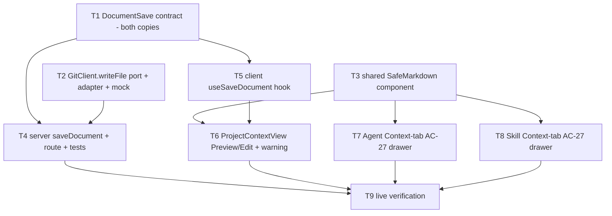

# Implementation Plan: Project Context — In-app Editing & Context-tab Preview Drawer

## Overview
Two amendments to the already-shipped Project Context Folder feature (branch `lesson/05`).
**Delta 1** adds in-app editing of a discovered `.md` document from the Project Context page
(Preview/Edit toggle, a new confined server save endpoint, post-save consistency, ephemerality
warning). **Delta 2** upgrades the Agent/Skill editor Context-tab Preview action from a
plain-text inline panel to the AC-27 dismissible drawer that renders **sanitized markdown**,
reusing the Project Context page's `SafeMarkdown` renderer. The base feature (discovery, attach,
run-time injection, trace visibility, Project Context page) is already implemented and is **not**
re-planned here.

## Execution mode
multi-agent (parallel) — specified by the caller (parallel implementers, non-overlapping owned
paths, dependency DAG). Work is grouped into phases; contracts + the shared `SafeMarkdown`
component + the `writeFile` port land first so server and UI work fan out in parallel with strictly
non-overlapping `Owned paths`.

## Requirements (verified)
Restated from `specs/SPEC-2026-07-07-project-context-folder.md` (amended 2026-07-07). Only the two
deltas are in scope.

**Delta 1 — In-app editing (Project Context page only):**
- R1 (AC-28): The selected-document pane presents a **Preview / Edit** toggle; Edit shows a
  plain-text editor, Preview renders sanitized markdown (AC-21). Edit is offered **only** on the
  Project Context page — the Context-tab drawer stays preview-only.
- R2 (AC-29): Switching to Edit loads the document's current content through the **same confined
  read boundary** as Preview (existing `GET …/preview`).
- R3 (AC-30): A **new** server endpoint writes the submitted content back to the clone worktree
  file, confining the path with the **same** rules as attach/read (`guardPath`): `.md` only, under a
  configured root folder, no `..`/absolute, resolved real path (symlinks) inside the clone; reject
  and write nothing otherwise. Workspace-scoped; repo resolved server-side (like preview).
- R4 (AC-31): After a successful save, subsequent Preview, token estimate/byte size, and run-time
  injection reflect the saved content **until the next repo resync** (`git fetch` + `reset --hard`
  discards it — accepted option (a) ephemeral). Attachments store paths only; both Preview and
  run-time injection already re-read the file, so no re-attach is needed.
- R5 (AC-32): A save is rejected (no partial write, on-disk file unchanged) when the clone is
  missing, the target is unwritable/I-O errors, or the path fails confinement.
- R6 (AC-33): While the pane is in Edit mode, a visible warning states the edit is clone-local and
  may be overwritten on the next sync.
- R7 (contract): A new **Document save** contract shape added to **both** hand-synced vendored
  copies (client + server).

**Delta 2 — Context-tab Preview drawer:**
- R8 (AC-27, amended AC-20): On Agent and Skill editor → Context tab, a row's Preview action opens a
  dismissible drawer/panel showing filename, parent path, a close control, and **sanitized rendered
  markdown** (AC-21 — identical rendering to the Project Context page, not inert plain text).
  Activating Preview on another row switches the drawer content; the close control (or re-activating
  the same row) dismisses it.
- R9 (investigation): Diagnose why the current preview "does not visibly open" and fix it as part of
  the AC-27 drawer.

## Open questions & recommendations
No blocking clarifications — the spec's Decisions section resolves persistence (option (a)
ephemeral), confinement reuse (`guardPath`), and the AC-27 drawer shape. `AskUserQuestion` was not
used per the caller's instruction; the items below are recommendations/notes, not blockers.

- **Rec (new port surface — writeFile):** the `GitClient` port exposes `readFile` but **no**
  `writeFile` (`server/src/vendor/shared/adapters.ts:261`); the service comment forbids raw `fs` in
  the service (`service.ts:194`). The save therefore needs one net-new, **additive**,
  **server-only** port method `writeFile(repo, path, content)` + adapter impl + mock (T2). This is
  the single new infrastructure surface; not a cross-package contract break (the client does not
  consume ports).
- **Rec (no-partial-write, AC-32):** implement `writeFile` in the adapter as **write-to-temp +
  rename within the same directory** so a mid-write crash cannot leave a partial file. A bare
  `fs.writeFile` truncates-then-writes and can leave a partial file on crash.
- **Rec (SafeMarkdown reuse):** `SafeMarkdown` is private to the Project Context page's
  `_components/`. Both Context tabs (different routes) must render the same sanitized markdown for
  AC-27, so **promote** it to shared `client/src/components/SafeMarkdown/` (frontend-architecture:
  second consumer → promote; avoids a cross-route `_components` import and a duplicated renderer).
- **Rec (save route shape):** use `PUT /project-context/documents` with body `{ path, content,
  repoId? }` (writing content to an existing resource). Distinct HTTP method from the existing
  `GET /project-context/documents`, so no Fastify route-order collision. **T4 (server) and T5
  (hook) must use this identical path string** — coordinate via this plan, not a shared file.
- **Rec (guardPath + edit-only scope):** `guardPath` requires the target to already exist (realpath
  rejects a missing file). This correctly limits the save to **already-discovered** docs and rejects
  new-file creation — which matches the AC scope (create/upload/delete remain out of scope). No
  change to `guardPath` is needed or wanted.

## Reference comparison (instructor branch `lesson-5-lab/sdd-finish`)
The reference implementation of both deltas was reviewed (repo `burnjohn/dev-digest`, branch
`lesson-5-lab/sdd-finish`) and each divergence was resolved deliberately:

**Adopted from the reference:**
- **Vendor `Drawer` for the Context-tab preview (T7/T8):** the ref presents the preview as a
  right-side overlay `Drawer` from `@devdigest/ui` (title = filename, subtitle = parent path,
  backdrop click closes). Our client vendors the same kit component
  (`client/src/vendor/ui/kit/Drawer.tsx`, precedent: RunTraceDrawer et al.). A fixed overlay also
  moots the "opens below the fold" placement bug for good.
- **Edit-mode UX details (T6):** pane tab state resets to Preview whenever the selected document
  changes; save status is announced via an `aria-live="polite"` region ("Saving…" / "Saved"
  auto-clearing after ~2.5 s / "Save failed: {message}"); the ephemerality warning is a
  `role="alert"` element rendered only while in Edit mode; the Save button is loading/disabled only
  while the request is in flight.
- **Instant cache write on save (T5):** on success, `setQueryData` the saved `{ path, content }`
  into the preview query in addition to invalidating, so the Preview tab updates without a refetch
  flash.

**Rejected (our plan is stricter or spec-compliant where the ref is not):**
- **Direct `fs.writeFile` in a module helper (ref `documents.ts`):** our service convention forbids
  raw `fs` (`service.ts:194`) and our reads already go through the `GitClient` port — we keep the
  additive `git.writeFile` port (T2). The ref also skips temp+rename; we keep it (AC-32 no-partial-write).
- **Ref's loose write guard:** `assertInsideCloneForWrite` only blocks traversal/symlink escape — it
  allows writing **any** in-tree file (`src/app.ts`) and even creating new files. Our `guardPath`
  (.md-only, root-folders-only, must-exist) is required by AC-30 and stays.
- **Ref's route/contract shape** (`PUT /repos/:id/project-context/document`, field `text`): doesn't
  fit our existing route family (`GET /project-context/documents[...preview]`) or our
  `DocumentPreview.content` naming. We keep `PUT /project-context/documents` + `{ path, content, repoId? }`.
- **Ref's `Markdown` renderer:** no `isSafeHref` — `javascript:` links render live, violating AC-21.
  All preview surfaces use our `SafeMarkdown` (T3).
- **Ref skips discovery invalidation after save** (token estimate goes stale, violating AC-31) and
  **has no Skill Context-tab preview at all** (AC-27 requires both tabs). T5's dual invalidation and
  T8 stay.

## Affected modules & contracts
- **server / `project-context`** — `service.ts` (add `saveDocument`), `routes.ts` (add the save
  route), `service.test.ts` (save tests). `guardPath`/`constants` reused unchanged.
- **server / adapters** — additive `GitClient.writeFile` port method + `SimpleGitClient` impl +
  `adapters/mocks.ts` mock.
- **client** — `ProjectContextView.tsx` (Preview/Edit toggle + warning + save wiring), a new shared
  `components/SafeMarkdown/`, both editor `ContextTab.tsx` (AC-27 drawer), the `project-context.ts`
  hook (add `useSaveDocument`), and message files.
- **reviewer-core / run-executor** — **no change**. Run-time injection already re-reads the file via
  `container.git.readFile`, so AC-31 (edited content reflected in runs until resync) is satisfied by
  the base feature; verified, not modified.
- **Contracts:** add `DocumentSave` to the existing `contracts/project-context.ts` in **both**
  vendored copies (`server/src/vendor/shared/`, `client/src/vendor/shared/`). The barrel `index.ts`
  already re-exports the whole file (`DocumentPreview` is importable today), so **no `index.ts`
  edit** is required. No existing contract is edited. The `GitClient.writeFile` port edit is a
  server-only additive method — called out, not a cross-package break.

## Architecture changes
- New Application method `ProjectContextService.saveDocument(workspaceId, path, content, repoId?)`
  mirroring `previewDocument`: resolve repo (workspace-scoped, same resolution as preview) →
  `guardPath` confine → `container.git.writeFile` → return `{ path, content }` (`DocumentPreview`
  shape). Discriminated-union result so the route returns 422 on rejection.
- New Transport route `PUT /project-context/documents` (Zod body from the new `DocumentSave`
  contract) in the existing `project-context/routes.ts`.
- New Infrastructure port method `writeFile` on `GitClient`, implemented behind the port in
  `SimpleGitClient` (temp+rename), mocked in `adapters/mocks.ts`. The service never touches raw `fs`.
- New shared client component `client/src/components/SafeMarkdown/` (`src/components/<Name>/` +
  `index.ts` barrel convention), consumed by the Project Context page and both Context tabs.
- Client-only: Preview/Edit toggle + ephemerality warning in `ProjectContextView`; AC-27 drawer in
  both `ContextTab.tsx` (replacing the inline `<pre>` panel), built on the vendor kit `Drawer` from
  `@devdigest/ui` — a fixed right-side overlay, always immediately visible.

## Phased tasks

Concurrency: **Phase 1** {T1, T2, T3} all parallel. **Phase 2** {T4, T5} parallel. **Phase 3**
{T6, T7, T8} parallel. **Phase 4** T9.

### Phase 1 — Contract, port, shared component (all parallel)

- **T1 — `DocumentSave` contract (both vendored copies)**
  - **Action:** Add a `DocumentSave` Zod schema + inferred type to the existing
    `contracts/project-context.ts`, **identically** in the server and client copies: request shape
    `{ path: string (min 1), content: string, repoId?: string uuid }`. The response reuses the
    existing `DocumentPreview` (`{ path, content }`) — do not add a new response type. Do **not**
    edit `index.ts` (the barrel already re-exports the file) and do **not** touch any other contract.
  - **Module:** server + client · **Type:** backend
  - **Skills to use:** `zod`, `typescript-expert`
  - **Owned paths:** `server/src/vendor/shared/contracts/project-context.ts`,
    `client/src/vendor/shared/contracts/project-context.ts`
  - **Depends-on:** none · **Covers:** contract prerequisite for AC-30, AC-32
  - **Risk:** low · **Known gotchas:** the two vendored copies are hand-synced and must stay
    byte-identical except comments (`server/INSIGHTS.md` 2026-06-14); relative imports carry `.js`.
  - **Acceptance:** `cd server && npx tsc --noEmit` and `cd client && npx tsc --noEmit` both pass;
    `DocumentSave` is importable from `@devdigest/shared` in both packages.

- **T2 — `GitClient.writeFile` port + adapter + mock (server-only, additive)**
  - **Action:** Add `writeFile(repo: RepoRef, path: string, content: string): Promise<void>` to the
    `GitClient` interface in `adapters.ts` (next to `readFile`). Implement it in `SimpleGitClient`
    as a confined write into the clone: join `clonePathFor(repo)` + `path`, write via a **temp file
    in the same directory then rename** (no-partial-write, AC-32), UTF-8. Add the method to the
    `GitClient` mock in `adapters/mocks.ts` (in-memory write is fine for tests). The adapter does not
    re-validate confinement — the service's `guardPath` is the gate — but must not follow a symlink
    out of the clone (rely on the guard's realpath check upstream; do not add `..` handling here).
  - **Module:** server · **Type:** backend
  - **Skills to use:** `onion-architecture` (filesystem write behind a port), `typescript-expert`, `security` (A01/A08 write surface)
  - **Owned paths:** `server/src/vendor/shared/adapters.ts`,
    `server/src/adapters/git/simple-git.ts`, `server/src/adapters/mocks.ts`
  - **Depends-on:** none · **Covers:** AC-30 (write mechanism), AC-32 (no partial write)
  - **Risk:** medium · **Known gotchas:** `readFile` uses `join(clonePathFor(repo), path)` — mirror
    it; temp+rename must stay within the same dir so the rename is atomic on the same filesystem; the
    mock must implement the full interface or `tsc` fails.
  - **Acceptance:** an adapter/unit test writes and reads back content for a valid path; `tsc
    --noEmit` passes; the mock satisfies `GitClient`.

- **T3 — Shared `SafeMarkdown` component (promotion)**
  - **Action:** Create `client/src/components/SafeMarkdown/SafeMarkdown.tsx` + `index.ts` barrel,
    containing the **same** sanitized renderer currently in
    `client/src/app/project-context/_components/SafeMarkdown.tsx` (react-markdown, no `rehype-raw`,
    `isSafeHref` blocking `javascript:`/`data:`). This is a purely **additive** new file — do **not**
    edit `ProjectContextView` or delete the old file here (that repoint is T6, which owns
    `ProjectContextView.tsx`). Export `SafeMarkdown` from the barrel for `@/components/SafeMarkdown`.
  - **Module:** client · **Type:** ui
  - **Skills to use:** `frontend-architecture` (promote-on-second-consumer, `src/components/<Name>/` + barrel), `react-best-practices`, `security` (AC-21)
  - **Owned paths:** `client/src/components/SafeMarkdown/**`
  - **Depends-on:** none · **Covers:** AC-21 (shared renderer for AC-27), enables AC-27, AC-28
  - **Risk:** low · **Known gotchas:** keep the renderer identical (no `rehype-raw`) — `vendor/ui`
    `Markdown` is NOT safe for untrusted content (`client/INSIGHTS.md` 2026-07-07); the `@/components`
    alias exists (RunCostBadge precedent).
  - **Acceptance:** `SafeMarkdown` importable via `@/components/SafeMarkdown`; a unit/RTL render of
    content containing `<script>` and a `javascript:` link renders inert; `cd client && npx tsc
    --noEmit` passes.

### Phase 2 — Server save + client hook (parallel)

- **T4 — `saveDocument` service + `PUT` route + server tests**
  - **Action:** In `project-context/service.ts` add `saveDocument(workspaceId, candidatePath,
    content, repoId?)`: resolve the repo with the **same** logic as `previewDocument` (explicit
    `repoId` else oldest-clone fallback, workspace-scoped), reject with a reason when no repo/clone
    (AC-32); run `guardPath(candidatePath, clonePath)` (AC-30); on success call
    `container.git.writeFile(repoRef, guard.path, content)` inside try/catch, returning
    `{ ok: true, document: { path: guard.path, content } }`, or `{ ok: false, reason }` on
    write/confinement failure (AC-32, no partial write). In `routes.ts` add
    `PUT /project-context/documents` (Zod body = `DocumentSave` from T1); on `!ok` throw
    `ValidationError(reason)`. Add server tests (extend `service.test.ts`): valid save writes the file
    and echoes content; rejects `../../etc/passwd`, `/etc/hosts`, `src/app.ts`, a symlink escaping the
    clone, a missing clone, and a write error — each leaving the file unchanged.
  - **Module:** server · **Type:** backend
  - **Skills to use:** `fastify-best-practices`, `onion-architecture`, `zod`, `security`, `typescript-expert`
  - **Owned paths:** `server/src/modules/project-context/service.ts`,
    `server/src/modules/project-context/routes.ts`,
    `server/src/modules/project-context/service.test.ts`
  - **Depends-on:** T1, T2 · **Covers:** AC-29 (read boundary reused — no change), AC-30, AC-31
    (server writes real file so re-read reflects it), AC-32
  - **Risk:** medium · **Known gotchas:** the service must call `container.git.writeFile`, never raw
    `fs` (`service.ts:194` convention); `guardPath` runs BEFORE the write; route path must be exactly
    `PUT /project-context/documents` to match the T5 hook; reuse the preview repo-resolution verbatim
    (the heap-order nondeterminism fix in `server/INSIGHTS.md` 2026-07-07 applies).
  - **Acceptance:** `cd server && npm test` — valid save writes+echoes; every confinement/missing-
    clone/unwritable case is rejected with the on-disk file intact and no partial write; `npx tsc
    --noEmit` passes. (Onion boundary verified by inspection — the `depcruise` script does not exist,
    `server/INSIGHTS.md` 2026-07-07.)

- **T5 — `useSaveDocument` client hook**
  - **Action:** Add `useSaveDocument()` to `client/src/lib/hooks/project-context.ts`: a
    `useMutation` calling `api.put<DocumentPreview>('/project-context/documents', { path, content,
    repoId })` (matching T4's route). On success: (1) `setQueryData` the returned `{ path, content }`
    into the preview query so the Preview tab updates instantly (adopted from the reference
    implementation), then (2) invalidate the preview query
    (`projectContextKeys.preview(path, repoId)`) **and** the discovery query
    (`["project-context-documents"]`) so Preview, token estimate, and byte size re-read the saved
    content (AC-31). Keep the existing hooks unchanged.
  - **Module:** client · **Type:** ui
  - **Skills to use:** `react-best-practices` (mutations/invalidation), `frontend-architecture`, `typescript-expert`
  - **Owned paths:** `client/src/lib/hooks/project-context.ts`
  - **Depends-on:** T1 · **Covers:** data layer for AC-30, AC-31
  - **Risk:** low · **Known gotchas:** all API access goes through `lib/api` (`api.put`, no ad-hoc
    fetch); invalidate BOTH preview and discovery keys so size/tokens refresh (AC-31).
  - **Acceptance:** `cd client && npx tsc --noEmit` passes; `useSaveDocument` importable; on success
    it invalidates the preview + discovery queries.

### Phase 3 — Client UI (all parallel)

- **T6 — Project Context page Preview/Edit toggle + ephemerality warning**
  - **Action:** In `ProjectContextView.tsx`: (1) repoint the `SafeMarkdown` import to
    `@/components/SafeMarkdown` and **delete** the old
    `client/src/app/project-context/_components/SafeMarkdown.tsx`; (2) add a **Preview / Edit** toggle
    to the selected-document pane (two tabs) — Preview keeps the current `SafeMarkdown` render; Edit
    shows a plain-text `<textarea>` seeded from `preview.content` (the same read boundary, AC-29),
    with local editable state (AC-28); (3) add a **Save** action calling `useSaveDocument` (T5) with
    `{ path: selectedPath, content, repoId }`; (4) while in Edit mode, show a visible ephemerality
    **warning** (AC-33) e.g. "Edits are local to the review clone and may be overwritten on the next
    sync"; (5) after a successful save, rely on the hook's cache write + invalidation so
    Preview/token/size reflect the saved content (AC-31). UX details (adopted from the reference
    implementation): reset the pane's tab state to **Preview whenever the selected document
    changes**; render the warning as a `role="alert"` element **only** while in Edit mode; announce
    save status in an `aria-live="polite"` region — "Saving…" / "Saved" (auto-clear after ~2.5 s) /
    "Save failed: {message}" — and make the Save button loading/disabled **only** while the request
    is in flight. Add strings to `messages/en/project-context.json`. Icon-only controls
    carry `aria-label`s. Edit affordance appears **only here**, never in the Context-tab drawer.
  - **Module:** client · **Type:** ui
  - **Skills to use:** `react-best-practices` (derive-don't-store; Edit buffer is the only local state), `next-best-practices`, `frontend-architecture`, `security` (AC-21 preview), `react-testing-library`
  - **Owned paths:** `client/src/app/project-context/_components/ProjectContextView.tsx`,
    `client/src/app/project-context/_components/SafeMarkdown.tsx` (removed here),
    `client/messages/en/project-context.json`,
    `client/src/app/project-context/_components/ProjectContextView.test.tsx`
  - **Depends-on:** T3, T5 · **Covers:** AC-28, AC-29, AC-31, AC-33 (T4 is the runtime save target —
    see note)
  - **Owned-path note:** this is the only Phase-3 task touching `ProjectContextView.tsx`; T3 (Phase 1)
    only **creates** the shared component and never edits this file, so there is no concurrent writer.
  - **Runtime note:** RTL tests mock the network (via the hook), so T6 needs only T3 + T5 to compile
    and go green; a live save round-trip additionally requires T4 (covered in T9).
  - **Risk:** medium · **Known gotchas:** client tests use `fireEvent`, NOT
    `@testing-library/user-event` (`client/INSIGHTS.md` 2026-07-06); i18n missing key renders the raw
    key; keep the Edit buffer the sole `useState`, derive everything else.
  - **Acceptance:** RTL test — the pane shows Preview/Edit tabs; switching to Edit shows a textarea
    seeded with the current content and the ephemerality warning; editing + Save calls the save hook
    with the new content; switching back to Preview shows the (invalidated) sanitized render; the
    warning is absent in Preview mode. `cd client && npx tsc --noEmit` passes.

- **T7 — Agent editor Context-tab AC-27 drawer**
  - **Action:** In the agent `ContextTab.tsx` replace the inline `<pre>` preview panel with an AC-27
    **dismissible drawer** built on the vendor kit `Drawer` from `@devdigest/ui`
    (`client/src/vendor/ui/kit/Drawer.tsx` — adopted from the reference implementation; existing
    precedent: RunTraceDrawer, ComposeReviewDrawer). The `Drawer` is a fixed right-side overlay, which
    also eliminates the current "does not visibly open" placement bug (panel appended below the full
    doc list). Configure it with (a) `title` = document **filename**, `subtitle` = **parent path**;
    (b) the body rendered via the shared `SafeMarkdown` (T3) — **sanitized markdown**, never
    `vendor/ui` `Markdown` and not `<pre>` plain text (AC-21); (c) content switching when another
    row's Preview is activated; (d) dismissal via the close control, backdrop click, or re-activating
    the same row; (e) optionally a footer with the folder-kind badge and "≈ N tokens". Keep the
    existing `useDocumentPreview` wiring and `previewPath` state. Add/keep any
    labels under the `context.*` namespace in `messages/en/agents.json`.
  - **Module:** client · **Type:** ui
  - **Skills to use:** `react-best-practices`, `frontend-architecture`, `security` (AC-21 inert render), `react-testing-library`
  - **Owned paths:**
    `client/src/app/agents/[id]/_components/AgentEditor/_components/ContextTab/ContextTab.tsx`,
    `client/messages/en/agents.json`,
    `client/src/app/agents/[id]/_components/AgentEditor/_components/ContextTab/ContextTab.test.tsx`
  - **Depends-on:** T3 · **Covers:** AC-20 (amended Preview behavior), AC-21, AC-27
  - **Risk:** medium · **Known gotchas:** the current panel renders after the whole unattached-docs
    list inside `maxWidth:580`, so it opens off-screen (the reported "does not visibly open") — the
    fixed-overlay `Drawer` removes that class of bug, but confirm at runtime; the vendor `Drawer` is
    presentation-only (pass `SafeMarkdown` output as children — do **not** use `vendor/ui` `Markdown`,
    unsafe for untrusted content); tests use `fireEvent`.
  - **Acceptance:** RTL test — clicking Preview on a row opens a drawer titled with the filename and
    showing its parent path + sanitized rendered markdown; a fixture with `<script>`/`javascript:`
    renders inert; clicking another row swaps content; the close control (and re-clicking the same
    row) hides the drawer. `cd client && npx tsc --noEmit` passes.

- **T8 — Skill editor Context-tab AC-27 drawer**
  - **Action:** Symmetric to T7 for the skill `ContextTab.tsx`: replace the inline plain-text preview
    with the AC-27 dismissible drawer built on the vendor kit `Drawer` from `@devdigest/ui` (filename
    title, parent-path subtitle, close control + backdrop dismiss, sanitized `SafeMarkdown` body,
    switch-on-other-row). Note the reference implementation has **no** skill-tab preview at all — this
    task is net-new versus the ref, required by AC-27. Preserve the existing `DocRow`/preview state
    pattern and the SERIALIZES-AS block. Labels under the `context.*` namespace in
    `messages/en/skills.json`.
  - **Module:** client · **Type:** ui
  - **Skills to use:** `react-best-practices`, `frontend-architecture`, `security` (AC-21 inert render), `react-testing-library`
  - **Owned paths:**
    `client/src/app/skills/[id]/_components/SkillEditor/_components/ContextTab/ContextTab.tsx`,
    `client/messages/en/skills.json`,
    `client/src/app/skills/[id]/_components/SkillEditor/_components/ContextTab/ContextTab.test.tsx`
  - **Depends-on:** T3 · **Covers:** AC-20 (amended Preview behavior), AC-21, AC-27
  - **Risk:** medium · **Known gotchas:** same off-screen-placement cause and `SafeMarkdown` reuse as
    T7; keep the SERIALIZES-AS block untouched; tests use `fireEvent`.
  - **Acceptance:** RTL test — Preview opens a drawer with filename + parent path + sanitized markdown;
    switches on another row; closes; XSS content renders inert. `cd client && npx tsc --noEmit` passes.

### Phase 4 — Live verification

- **T9 — Live verification (edit round-trip + drawer)**
  - **Action:** No new product code. (1) On the Project Context page, select a discovered doc, toggle
    to Edit (confirm the ephemerality warning shows), change the content, Save; confirm Preview, the
    "≈ N tokens" figure, and byte size reflect the saved content, and that a subsequent review run
    injecting that path injects the edited content (AC-31) — no re-attach. (2) Attempt a save that
    fails confinement / against a missing clone and confirm rejection with the file unchanged (AC-32).
    (3) On both the Agent and Skill Context tabs, activate Preview and confirm the AC-27 drawer opens
    visibly with filename + parent path + sanitized markdown, switches on another row, and dismisses.
    Record observations as evidence.
  - **Module:** server + client (integration) · **Type:** backend
  - **Skills to use:** `security`, `typescript-expert`
  - **Owned paths:** none (verification only)
  - **Depends-on:** T4, T6, T7, T8 · **Covers:** AC-30, AC-31, AC-32, AC-27 (live)
  - **Risk:** medium · **Known gotchas:** a running dev server does NOT auto-apply migrations — N/A
    here (no schema change), but if any new endpoint 500s, that is a separate operational check; the
    save write is clone-local and a repo resync will discard it (expected, AC-31).
  - **Acceptance:** the edit round-trip reflects saved content in Preview/tokens/size and in a run's
    injection; a confinement/missing-clone save is rejected with the file intact; both Context-tab
    drawers open visibly with sanitized markdown and switch/dismiss correctly.

## Testing strategy
- **Server:** `cd server && npm test` — T2 write/read-back; T4 save happy-path + every rejection
  (`../../etc/passwd`, `/etc/hosts`, `src/app.ts`, symlink escape, missing clone, unwritable → file
  unchanged, no partial write). Typecheck `cd server && npx tsc --noEmit`. Onion boundary verified by
  source inspection (the `depcruise` script does not exist — `server/INSIGHTS.md` 2026-07-07).
- **Client:** `cd client && npm test` (Vitest + RTL, **`fireEvent`** — no `user-event`) — T3
  SafeMarkdown inert-render; T6 Preview/Edit toggle + warning + save-hook call + invalidation; T7/T8
  drawer open/switch/dismiss + sanitized-markdown + XSS-inert. Typecheck `cd client && npx tsc
  --noEmit`.
- **No migration** — this delta adds no DB schema.
- **reviewer-core untouched** — its tests must stay green (`cd reviewer-core && npm test`).

## Risks & mitigations
- **AC-27 root cause unconfirmed at plan time:** the preview is state-wired and does render, so the
  most likely "does not visibly open" cause is **panel placement** (appended below a long doc list,
  off-screen). → The AC-27 drawer redesign (visible placement + switch + sanitized markdown) fixes it
  regardless; the implementer must still confirm the runtime cause (T7/T8 gotchas).
- **New write surface (A01/A08):** the save endpoint is the feature's only on-disk mutation → reuse
  `guardPath` before every write (T4), keep it workspace-scoped with server-side repo resolution, and
  reject non-confined/missing/unwritable targets; writes go through the port, never raw `fs`.
- **Partial write (AC-32):** a crash mid-write could corrupt a doc → adapter writes temp+rename (T2).
- **New port method (writeFile):** additive, server-only → adapter impl + mock in lock-step; called
  out, no cross-package break.
- **Two vendored contract copies:** `DocumentSave` must be added to both identically (T1) or the
  client build drifts from the server (`server/INSIGHTS.md` 2026-06-14).
- **Shared SafeMarkdown import edge:** must stay the no-`rehype-raw` renderer; `vendor/ui` `Markdown`
  is unsafe for untrusted content (`client/INSIGHTS.md` 2026-07-07).
- **Out of scope (record only):** new-file creation/upload/deletion, DB-durable edits, commit/push on
  save, Edit mode in the Context-tab drawer, per-document token breakdown — all deferred per the
  spec's Non-goals/Decisions. `guardPath`'s existing-file requirement naturally blocks new-file saves.

## Red-flags check
- [x] Every requirement maps to a task (R1–R9 → T1–T9; AC-27..AC-33 + amended AC-20 covered)
- [x] Every amended AC is covered by at least one task's `Covers` (AC-20, AC-21, AC-27, AC-28, AC-29,
      AC-30, AC-31, AC-32, AC-33)
- [x] No specification was authored or edited — the amended spec is input; only this plan was written
- [x] Execution mode is recorded (multi-agent, parallel) and the plan is shaped for it (phases + DAG)
- [x] Dependencies form a DAG (no cycles — see mermaid graph)
- [x] Concurrent tasks have non-overlapping Owned paths (Phase 1 {T1,T2,T3}; Phase 2 {T4,T5};
      Phase 3 {T6,T7,T8} — distinct files + message namespaces; T3 creates the shared component and
      never edits `ProjectContextView.tsx`, which T6 owns exclusively)
- [x] Every Acceptance is measurable (test name, command result, or observable behavior)
- [x] No edits to existing shared contracts without a callout (`DocumentSave` added to the existing
      project-context contract in both copies; `RunTrace` untouched; `GitClient.writeFile` is an
      additive, server-only port method, called out)
