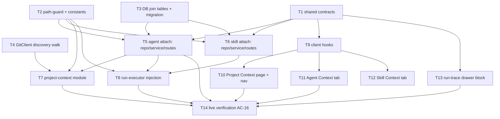

# Implementation Plan: Project Context Folder

## Overview
Make any markdown file under a repo's `specs`/`docs`/`insights` folders *attachable* to review
agents and skills, then resolve → read → inject those documents at run time into reviewer-core's
already-wired untrusted `## Project context` prompt slot — turning existing repo knowledge into
review signal with **zero new LLM calls**. Cross-package: server (discovery, persistence, run-time
injection) + client (Project Context screen, editor Context tabs, run-trace visibility).
reviewer-core is consumed **unchanged**.

## Execution mode
multi-agent (parallel) — chosen by the caller. Implementer agents run concurrently on the same
branch, so the plan groups work into phases with a strict dependency DAG and **non-overlapping
`Owned paths`** between any tasks that can run at once. Contracts and foundations land first so
backend and UI work can fan out in parallel.

## Requirements (verified)
Restated from `specs/SPEC-2026-07-07-project-context-folder.md` (26 EARS criteria, all open
questions resolved). Grouped:

- **Discovery** — R-DISC (AC-1..AC-4): list `**/{specs,docs,insights}/**/*.md` from the repo clone
  with path/parent/name/folder-kind/size, stat-only (no content read), empty state on missing clone,
  cap at 500 with a truncation flag.
- **Attach** — R-ATT (AC-5..AC-9): persist ordered document-**path** lists per agent and per skill
  (workspace-scoped, order survives reload); reject non-`.md`/out-of-root/escaping paths at attach
  time; store paths only (no text); report "used by N agents".
- **Injection at run time** — R-RUN (AC-10..AC-16): assemble agent docs then enabled-skill docs,
  dedup by normalized path (first wins); read each from the PR's clone; confine to clone root; skip
  missing/unsafe (best-effort, never fail the run); truncate per-doc at 20k chars; drop past a 40k
  total budget; pass resolved strings into reviewer-core `specs`; a violating PR yields a finding
  that references the attached spec.
- **Run visibility** — R-VIS (AC-17, AC-18, AC-25): populate `specs_read` (post dedup/skip) with a
  block-level token total; empty when none injected; run-trace drawer shows an expandable, **inert**
  "Project context — attached specs (untrusted)" block from the existing `prompt_assembly.specs`.
- **UI** — R-UI (AC-19..AC-24, AC-26): Project Context nav item under WORKSPACE with a two-pane
  screen (list + sanitized markdown Preview + "used by N agents" badge + per-row/pane "≈ N tokens" +
  attach/detach control reusing the same write endpoints); Agent & Skill Context tabs styled like the
  Skills tab (drag handle, checkbox, filename, parent path, folder-kind badge, Preview, filter, token
  total + untrusted note); Skill tab "SERIALIZES AS" client-side preview.

Nothing here rests on an unconfirmed answer — the spec's Decisions section resolves multi-repo
scope (single-repo scan), trace granularity (block-level total), and caps (20k/40k).

## Open questions & recommendations
- Q: none blocking — the spec has no open questions and the caller confirmed execution mode.
- **Rec (flagged gap — port surface):** the spec's provenance says discovery scans the clone "via
  the existing git/clone read boundary", but the `GitClient` port (`vendor/shared/adapters.ts`) only
  exposes `readFile` — it has **no directory-walk method**. Discovery therefore needs one net-new,
  **additive** port method (e.g. `listDocs(repo, opts)`), implemented in `SimpleGitClient` + the test
  mock. This is the single new infrastructure surface the spec glosses over. Captured as T4 and
  called out under Risks. Server-only port copy — not a cross-package contract change.
- **Rec (AC-3 empty-state wording):** discovery is stat-only and independent of the repo-intel index,
  so the empty-state `reason` should reflect *clone missing / unsynced*, not "not indexed" (which
  belongs to repo-intel). Minor; implementers should phrase the reason accordingly.
- **Rec (persistence shape):** store attachments as `(<owner>_id, path, order)` with `PK(owner_id,
  path)` — documents are repo files, not DB entities. Add a secondary index on `path` so the AC-9
  "used by N agents" count (`WHERE path = ? → COUNT`) is index-backed.
- **Rec (Project Context page repo scoping):** the page sits under WORKSPACE (not a repo-scoped
  route). Per the single-repo-scan decision it resolves the **active repo** (via the client's
  `repo-context`) and scans that clone. Surface the active repo in the discovery request.

## Affected modules & contracts
- **server / `project-context` (new module)** — discovery walk + confinement + preview; discovery
  service, routes, constants, path-guard.
- **server / `agents`, `skills`** — new ordered document-attachment persistence (repository + service
  + routes), reusing the `agent_skills` join precedent.
- **server / `reviews` (run-executor)** — assemble + confine-read + cap + inject documents into the
  `specs` input; populate `specs_read`. Mirrors the existing `linkedSkills → skillBodies → { skills }`
  flow (`run-executor.ts:206-235`).
- **server / `db`** — two new join tables `agent_documents`, `skill_documents`; migration via
  `npm run db:generate`.
- **server / adapters** — additive `GitClient` discovery-walk method + `SimpleGitClient` impl + mock.
- **client** — new Project Context page + nav item; Agent & Skill editor Context tabs; run-trace
  drawer block; TanStack Query hooks.
- **reviewer-core** — **no change** (verified: `PromptParts.specs?: string[]` +
  `wrapUntrusted` + `INJECTION_GUARD` render `## Project context` at `prompt.ts:47,100-135`; threaded
  through `reviewPullRequest` at `review/run.ts:61,137`; `specs_read` / `prompt_assembly.specs` already
  in the `RunTrace` contract at `trace.ts:43,89`).
- **Contracts:** add one **new** file `contracts/project-context.ts` to **both** vendored copies
  (`server/src/vendor/shared/`, `client/src/vendor/shared/`) with a matching `index.ts` export line —
  `DiscoveredDocument`, `DiscoveryResponse`, `DocumentAttachment` (ordered paths), `DocumentPreview`.
  **No existing contract is edited** — `RunTrace` already carries `specs_read` and
  `prompt_assembly.specs`. The `GitClient` port edit (T4) is a server-only, additive method — called
  out, not a cross-package break.

## Architecture changes
- New onion **feature module** `server/src/modules/project-context/` (Application: `service.ts`;
  Transport: `routes.ts`; own `constants.ts` + `path-guard.ts`), registered statically in
  `server/src/modules/index.ts`.
- Discovery filesystem walk lives behind the **`GitClient` port** (Infrastructure), never called as a
  raw `fs` walk from the service — the service consumes `container.git.listDocs(...)`.
- Path confinement (`.md`-only, root-folder-only, reject `..`/absolute, symlink real-path within
  clone) is a pure helper in `path-guard.ts`, applied at **attach time** (agents/skills services) and
  again at **read/run time** (run-executor) — defense in depth (AC-8 + AC-13).
- Run-time assembly + caps live in a new `reviews/context-loader.ts` (Application), keeping
  `run-executor.ts` thin, mirroring `diff-loader.ts`.
- New client route segment `client/src/app/project-context/`; new editor `ContextTab` under each
  editor's `_components/`; `"use client"` only where interactivity requires it.

## Phased tasks



Concurrency: **Phase 1** {T1, T2, T3, T4} all parallel. **Phase 2** {T5, T6} parallel; T7 after T5.
**Phase 3** T8 (after T5, T6). **Phase 4** T9, then {T10, T11, T12, T13} parallel. **Phase 5** T14.

### Phase 1 — Contracts & foundations (all parallel)

- **T1 — Shared contracts (new file, both vendored copies)**
  - **Action:** Add `contracts/project-context.ts` defining Zod schemas + inferred types:
    `DiscoveredDocument` (`path`, `parent_path`, `name`, `folder_kind` enum `specs|docs|insights`,
    `size_bytes`, `est_tokens`, `used_by_agents`), `DiscoveryResponse`
    (`{ documents, truncated, reason? }`), `DocumentAttachment` (`{ paths: string[] }` ordered),
    `DocumentPreview` (`{ path, content }`). Export both schema and type; add one `export *` line to
    each `index.ts`. Write the file **identically** in the server and client copies (hand-synced).
    Do **not** touch `RunTrace` — its `specs_read` / `prompt_assembly.specs` already exist.
  - **Module:** server + client · **Type:** backend
  - **Skills to use:** `zod`, `typescript-expert`
  - **Owned paths:** `server/src/vendor/shared/contracts/project-context.ts`,
    `server/src/vendor/shared/index.ts`, `client/src/vendor/shared/contracts/project-context.ts`,
    `client/src/vendor/shared/index.ts`
  - **Depends-on:** none · **Covers:** contract prerequisite for AC-1, AC-5, AC-6, AC-9, AC-19..AC-24, AC-26
  - **Risk:** low · **Known gotchas:** relative imports carry `.js`; the two vendored copies must
    stay byte-identical or the client build drifts from the server contract.
  - **Acceptance:** `cd server && npx tsc --noEmit` and `cd client && npx tsc --noEmit` both pass;
    `DiscoveredDocument` and `DiscoveryResponse` are importable from `@devdigest/shared` in both
    packages.

- **T2 — Path-guard + config constants**
  - **Action:** Add `constants.ts` (`CONTEXT_ROOT_FOLDERS = ['specs','docs','insights']`,
    `MAX_DISCOVERED_FILES = 500`, `PER_DOC_CHAR_CAP = 20_000`, `TOTAL_BLOCK_CHAR_CAP = 40_000`; all
    server-config-tunable) and a pure `path-guard.ts` exposing a confinement function: accept a
    repo-relative candidate + clone root, reject non-`.md`, reject any path not under a
    `CONTEXT_ROOT_FOLDERS` segment, reject `..`/absolute, and require the **resolved real path**
    (symlink-followed) to stay inside the clone root. Return a normalized POSIX path or a typed
    rejection. Cover with unit tests including `../../etc/passwd`, `/etc/hosts`, `src/app.ts`, and a
    symlink escaping the clone.
  - **Module:** server · **Type:** backend
  - **Skills to use:** `security` (A01/A05 path confinement), `typescript-expert`, `onion-architecture` (pure helper, no I/O beyond `realpath`)
  - **Owned paths:** `server/src/modules/project-context/constants.ts`,
    `server/src/modules/project-context/path-guard.ts`,
    `server/src/modules/project-context/path-guard.test.ts`
  - **Depends-on:** none · **Covers:** AC-8, AC-13 (helper), config for AC-4, AC-14, AC-15
  - **Risk:** medium · **Known gotchas:** confinement must compare **real** (symlink-resolved) paths,
    not lexical ones; a lexical-only check is bypassable via symlink (AC-13).
  - **Acceptance:** `path-guard.test.ts` passes; each traversal/absolute/symlink case returns a
    rejection and every legit `specs|docs|insights/**/*.md` returns a normalized path.

- **T3 — DB join tables + migration**
  - **Action:** Add `agentDocuments` to `schema/agents.ts` and `skillDocuments` to `schema/skills.ts`:
    columns `agent_id|skill_id uuid NOT NULL REFERENCES … ON DELETE CASCADE`, `path text NOT NULL`,
    `order integer NOT NULL DEFAULT 0`, `PK(owner_id, path)`, plus a secondary index on `path` (for
    the AC-9 count). Re-export from the `schema.ts` barrel. Generate the migration with
    `npm run db:generate` (never hand-write SQL).
  - **Module:** server · **Type:** backend
  - **Skills to use:** `drizzle-orm-patterns`, `postgresql-table-design`
  - **Owned paths:** `server/src/db/schema/agents.ts`, `server/src/db/schema/skills.ts`,
    `server/src/db/schema.ts`, `server/src/db/migrations/**` (generated only)
  - **Depends-on:** none · **Covers:** persistence for AC-5, AC-6, AC-7, AC-9
  - **Risk:** medium · **Known gotchas:** `path` is the entity key (documents are files, not rows) —
    use `text`, not `varchar`; PK must lead with the owner id so the FK is index-covered; add the
    explicit `path` index for the count query.
  - **Acceptance:** `npm run db:generate` emits a migration adding both tables; `npx tsc --noEmit`
    passes; migration applies cleanly against a scratch DB.

- **T4 — GitClient discovery-walk method (additive port + adapter + mock)**
  - **Action:** Add an additive `listDocs(repo, opts)` method to the `GitClient` interface returning
    `{ path, sizeBytes }[]` for `.md` files found via a bounded recursive walk of the clone (honoring
    `EXCLUDED_DIRS`-style skips, a max-files cap), **stat-only** (no content read). Implement it in
    `SimpleGitClient` (walk `clonePathFor(repo)`), and add the mock in `adapters/mocks.ts`. This is a
    **server-only** additive port change — call it out; the client does not consume ports.
  - **Module:** server · **Type:** backend
  - **Skills to use:** `onion-architecture` (filesystem I/O behind a port), `typescript-expert`, `security` (walk must not follow symlinks out of the clone)
  - **Owned paths:** `server/src/vendor/shared/adapters.ts`,
    `server/src/adapters/git/simple-git.ts`, `server/src/adapters/mocks.ts`
  - **Depends-on:** none · **Covers:** AC-2 (stat-only), AC-4 (cap), enables AC-1
  - **Risk:** medium · **Known gotchas:** discovery is stat-only — read `size` from `stat`, never open
    file bodies; cap the walk so a huge repo can't stall (p95 < 2s, AC-2); do not descend symlinked
    directories that leave the clone.
  - **Acceptance:** an adapter/unit test over a fixture clone returns only `.md` entries with sizes;
    `npx tsc --noEmit` passes; the mock satisfies the interface.

### Phase 2 — Persistence & discovery module

- **T5 — Agent-side attachment (repository + service + routes)**
  - **Action:** In `agents/repository.ts` add `documentsForAgent(agentId)` (ordered paths),
    `setDocuments(agentId, paths[])` (delete-all + insert with `order = index`, mirroring `setSkills`
    at `repository.ts:229`), and `usedByAgentsCount(path)` (COUNT over `agent_documents`). In
    `agents/service.ts` add the attach orchestration that validates every incoming path via T2's
    path-guard against the workspace repo clone before persisting (AC-8). In `agents/routes.ts` add
    `GET /agents/:id/documents` and `POST /agents/:id/documents` (Zod params/body/response from T1),
    registered after the existing static routes and before `/:id`-style catch-alls. Add tests for
    set→get order round-trip and a rejected bad path.
  - **Module:** server · **Type:** backend
  - **Skills to use:** `drizzle-orm-patterns`, `fastify-best-practices`, `onion-architecture`, `zod`, `security`
  - **Owned paths:** `server/src/modules/agents/repository.ts`,
    `server/src/modules/agents/service.ts`, `server/src/modules/agents/routes.ts`,
    `server/src/modules/agents/*.test.ts`
  - **Depends-on:** T1, T2, T3 · **Covers:** AC-5, AC-7, AC-8, AC-9
  - **Risk:** medium · **Known gotchas:** routes declare params/body/response via
    `fastify-type-provider-zod`; register document routes without shadowing existing `/agents/:id/*`
    (static-before-param, skills-routes precedent); the service, not the route, calls the guard.
  - **Acceptance:** `GET` after `PUT`/`POST` returns identical paths in identical order; attaching
    `../../etc/passwd` / `/etc/hosts` / `src/app.ts` returns a validation error and persists nothing;
    attaching to 2 agents makes `usedByAgentsCount` read 2; module tests + `npx tsc --noEmit` pass.

- **T6 — Skill-side attachment (repository + service + routes)**
  - **Action:** Symmetric to T5 for skills: `documentsForSkill` / `setDocuments` in
    `skills/repository.ts`, path-guard-validated attach in `skills/service.ts`, and
    `GET|POST /skills/:id/documents` in `skills/routes.ts` (static-before-`:id/restore` etc). Tests
    for skill set→get order round-trip and rejected path.
  - **Module:** server · **Type:** backend
  - **Skills to use:** `drizzle-orm-patterns`, `fastify-best-practices`, `onion-architecture`, `zod`, `security`
  - **Owned paths:** `server/src/modules/skills/repository.ts`,
    `server/src/modules/skills/service.ts`, `server/src/modules/skills/routes.ts`,
    `server/src/modules/skills/*.test.ts`
  - **Depends-on:** T1, T2, T3 · **Covers:** AC-6, AC-7, AC-8
  - **Risk:** medium · **Known gotchas:** same static-before-param ordering; keep the write "replace
    the whole ordered set" semantics identical to the agent side so the shared client hook is uniform.
  - **Acceptance:** skill `GET` after `POST` returns paths in order; bad path rejected; tests +
    `npx tsc --noEmit` pass.

- **T7 — Project-context discovery module (service + routes + registration)**
  - **Action:** New `project-context/service.ts`: discovery via `container.git.listDocs(...)` (T4),
    then map each entry to `DiscoveredDocument` — derive `folder_kind` from the nearest matching
    ancestor folder, compute `est_tokens` with `approxTokens` (`adapters/tokenizer/index.ts:21`,
    `ceil(size/4)`), fill `used_by_agents` via `container.agentsRepo.usedByAgentsCount(path)` (T5),
    apply the 500 cap → `truncated` flag, and return the empty-list + `reason` degraded response when
    the clone is missing/unsynced (AC-3). Add a `preview(repoRef, path)` that guard-validates (T2)
    then reads the file (raw markdown) for `DocumentPreview`, rejecting confinement failures (AC-8).
    New `routes.ts`: `GET …/documents` (discovery) and `GET …/documents/preview` (query-param path),
    resolving the active/target repo; register the module in `server/src/modules/index.ts`.
  - **Module:** server · **Type:** backend
  - **Skills to use:** `fastify-best-practices`, `onion-architecture`, `zod`, `security`, `typescript-expert`
  - **Owned paths:** `server/src/modules/project-context/service.ts`,
    `server/src/modules/project-context/routes.ts`,
    `server/src/modules/project-context/service.test.ts`,
    `server/src/modules/index.ts`
  - **Depends-on:** T1, T2, T4, T5 · **Covers:** AC-1, AC-2, AC-3, AC-4, AC-9 (surfacing)
  - **Risk:** medium · **Known gotchas:** discovery must never throw on a missing clone — degrade to
    `{ documents: [], truncated: false, reason }` (AC-3); reach agents only through
    `container.agentsRepo` (cross-module via container, not a direct module import); preview reads one
    validated file, never a walk.
  - **Acceptance:** against a fixture clone the discovery response matches a manual
    `find … -name '*.md'` under the root folders (a `.md` outside them and a non-`.md` inside are
    absent — AC-1); a >500-file fixture returns exactly 500 + `truncated: true` (AC-4); an unsynced
    repo returns the empty state with a `reason` (AC-3); preview of a confined path returns content and
    of an escaping path returns a rejection (AC-8); tests + `npx tsc --noEmit` pass.

### Phase 3 — Run-time injection

- **T8 — Run-executor Project-context injection**
  - **Action:** New `reviews/context-loader.ts`: given the agent + its enabled linked skills
    (`agentsRepo.linkedSkills` filtered by `enabled && !injectionDetected`, precedent at
    `run-executor.ts:206-209`) and their attached paths (T5/T6 repos), assemble agent-docs-first then
    skill-docs (skill order, then doc order), **dedup by normalized path (first wins)** (AC-10); for
    each path re-validate via T2 guard against the **PR's** clone and read via `container.git.readFile`
    — skip missing/unsafe/non-UTF-8 (AC-12/AC-13), truncate any doc over `PER_DOC_CHAR_CAP` with an
    explicit marker (AC-14), and stop adding once `TOTAL_BLOCK_CHAR_CAP` is reached, dropping the
    remainder (AC-15); return `{ specs: string[], specsRead: string[], skipped, truncated, dropped }`.
    Wire into `run-executor.ts`: pass `...(specs.length ? { specs } : {})` into `reviewPullRequest`
    (mirroring `{ skills }` at `run-executor.ts:235`), set `specs_read: specsRead` on the trace
    (replacing the `specs_read: []` at `run-executor.ts:311,461`), and log skips/truncations/drops to
    the run log.
  - **Module:** server · **Type:** backend
  - **Skills to use:** `onion-architecture`, `typescript-expert`, `security`, `zod`
  - **Owned paths:** `server/src/modules/reviews/context-loader.ts`,
    `server/src/modules/reviews/run-executor.ts`,
    `server/src/modules/reviews/context-loader.test.ts`
  - **Owned-path note:** T8 is the **only** task touching `run-executor.ts` — no concurrent writer.
  - **Depends-on:** T2, T5, T6 · **Covers:** AC-10, AC-11, AC-12, AC-13, AC-14, AC-15, AC-17, AC-18
  - **Known gotchas (from `server/INSIGHTS.md` — context enrichment is best-effort):** a document
    read must **never** fail the run — on any unreadable/unsafe/oversize doc, skip-and-log and
    continue; when the assembled set is empty, pass no `specs` so `prompt_assembly.specs` stays `null`
    and behavior is identical to today (AC-18). reviewer-core is unchanged — it wraps + guards.
  - **Acceptance:** `context-loader.test.ts` proves: a doc on both agent + skill appears once at its
    agent position (AC-10); a deleted path is skipped, logged, and absent from `specsRead` while the
    run still completes (AC-12); a symlink-escaping path is refused (AC-13); a >20k doc is truncated
    with a marker (AC-14); many large docs inject a within-budget prefix and log dropped paths (AC-15);
    a run with no docs yields `specs_read: []` and `specs: null` (AC-18). `npx tsc --noEmit` +
    `cd server && npm run depcruise` pass.

### Phase 4 — Client

- **T9 — Client TanStack Query hooks**
  - **Action:** New `lib/hooks/project-context.ts` with `api.get/put`-based hooks + query keys:
    `useDiscoveredDocuments(repoId)`, `useDocumentPreview(path)`, `useAgentDocuments(agentId)` /
    `useSetAgentDocuments(agentId)`, `useSkillDocuments(skillId)` / `useSetSkillDocuments(skillId)`,
    each keyed and invalidating siblings (so an attach from the page reflects on the editor tab and
    the "used by N agents" count — AC-24). Add the `export *` line to `lib/hooks/index.ts`. Types come
    from T1's client contract.
  - **Module:** client · **Type:** ui
  - **Skills to use:** `react-best-practices` (data fetching in hooks), `frontend-architecture`, `typescript-expert`
  - **Owned paths:** `client/src/lib/hooks/project-context.ts`, `client/src/lib/hooks/index.ts`
  - **Depends-on:** T1 · **Covers:** data layer for AC-5, AC-6, AC-9, AC-19..AC-24, AC-26
  - **Risk:** low · **Known gotchas:** all API access + query keys go through the project's `api`
    client and hooks (no ad-hoc `fetch`); after a set-mutation invalidate the discovery query so
    `used_by_agents` refreshes.
  - **Acceptance:** `cd client && npx tsc --noEmit` passes; hooks importable; query keys unique.

- **T10 — Project Context page + nav + attach control**
  - **Action:** New route `app/project-context/page.tsx` + `_components/` two-pane screen: left = the
    discovered list (filter, folder-kind badge, per-row "≈ N tokens" from `est_tokens` — AC-26), right
    = selected document pane with name, "used by N agents" badge, **sanitized** markdown Preview (use
    the existing `vendor/ui/primitives/Markdown` primitive; verify it does not enable raw-HTML/`rehype-raw`
    so `<script>`/`javascript:` render inert — AC-21), a "≈ N tokens" figure, and an attach/detach
    control listing workspace agents & skills as checkboxes that call the T9 set-hooks (append on
    attach) — AC-24. Render the AC-3 empty state (not an error). Add the WORKSPACE nav item in
    `vendor/ui/nav.ts` (between "Onboarding Tour" and the SKILLS LAB section, e.g. icon `FileText`).
    Strings in a new `messages/en/project-context.json` (next-intl, no hardcoded copy). `aria-label`s
    on icon-only buttons; filter results via `aria-live` (AC accessibility).
  - **Module:** client · **Type:** ui
  - **Skills to use:** `next-best-practices` (RSC boundary; `"use client"` only for the interactive panes), `react-best-practices`, `frontend-architecture`, `security` (sanitized preview), `react-testing-library`
  - **Owned paths:** `client/src/app/project-context/**`, `client/src/vendor/ui/nav.ts`,
    `client/messages/en/project-context.json`
  - **Depends-on:** T1, T9 · **Covers:** AC-3, AC-19, AC-21, AC-24, AC-26
  - **Risk:** medium · **Known gotchas:** nav labels in `nav.ts` are literal strings (not i18n) —
    match the file's existing shape; `next-intl` `useTranslations` for the screen; resolve the active
    repo from `lib/repo-context` for the discovery call.
  - **Acceptance:** RTL test — the page renders the list, filters it, selects a doc showing preview +
    "used by N agents" + token figure, and toggling an agent checkbox calls the set-hook; a preview
    fixture containing `<script>` / a `javascript:` link renders inert (AC-21); empty-repo fixture
    shows the empty state (AC-3). `npx tsc --noEmit` passes.

- **T11 — Agent editor Context tab**
  - **Action:** New `AgentEditor/_components/ContextTab/` styled like `SkillsTab` (drag handle using
    `⠿` — **no `GripVertical` icon exists**; checkbox; filename; parent path; folder-kind badge;
    Preview action; "Filter documents…" search — AC-20); footer shows the estimated token total for
    the current selection + a note it is injected as an untrusted `## Project context` block (AC-22).
    Register the tab: add `{ key: "context", labelKey: "editor.tabs.context", icon: … }` to
    `AgentEditor/constants.ts` `TABS`, render `{tab === "context" && <ContextTab agentId={agent.id} />}`
    in `AgentEditor.tsx`, and add `"context"` to `VALID_TABS` in `agents/[id]/page.tsx`. Uses T9
    hooks. Strings under `messages/en/agents.json`.
  - **Module:** client · **Type:** ui
  - **Skills to use:** `react-best-practices`, `frontend-architecture`, `next-best-practices`, `react-testing-library`
  - **Owned paths:**
    `client/src/app/agents/[id]/_components/AgentEditor/_components/ContextTab/**`,
    `client/src/app/agents/[id]/_components/AgentEditor/AgentEditor.tsx`,
    `client/src/app/agents/[id]/_components/AgentEditor/constants.ts`,
    `client/src/app/agents/[id]/page.tsx`,
    `client/messages/en/agents.json`
  - **Depends-on:** T1, T9 · **Covers:** AC-5 (UI), AC-20, AC-22
  - **Risk:** medium · **Known gotchas:** the tab-registration sync points are three files
    (`constants.ts` TABS, `AgentEditor.tsx` render switch, `page.tsx` VALID_TABS) — miss one and the
    tab 404s to `config`; reuse the Skills-tab DnD/checkbox pattern rather than inventing one.
  - **Acceptance:** RTL test — the Context tab lists candidate documents, filters them, toggles an
    attach checkbox (persists via hook), reorders via drag, and shows the token total + untrusted
    note; navigating `?tab=context` renders it. `npx tsc --noEmit` passes.

- **T12 — Skill editor Context tab + "SERIALIZES AS"**
  - **Action:** New `SkillEditor/_components/ContextTab/` mirroring T11's row/interaction pattern for
    skills (AC-20, AC-22), plus a read-only **"SERIALIZES AS"** block computed entirely client-side
    from the selection: a `## Project context` heading followed by the ordered attached paths as a
    bullet list (`- specs/public-api.md`), updating live as the selection changes (AC-23). Register the
    tab in `SkillEditor.tsx` (`TABS` array + render switch) and add `"context"` to `VALID_TABS` in
    `skills/[id]/page.tsx` (SkillEditor keeps its `TABS` inline in `SkillEditor.tsx` — verify and edit
    there, not a separate constants file). Uses T9 skill hooks. Strings under `messages/en/skills.json`.
  - **Module:** client · **Type:** ui
  - **Skills to use:** `react-best-practices` (derive, don't store the SERIALIZES-AS preview), `frontend-architecture`, `next-best-practices`, `react-testing-library`
  - **Owned paths:**
    `client/src/app/skills/[id]/_components/SkillEditor/_components/ContextTab/**`,
    `client/src/app/skills/[id]/_components/SkillEditor/SkillEditor.tsx`,
    `client/src/app/skills/[id]/page.tsx`,
    `client/messages/en/skills.json`
  - **Depends-on:** T1, T9 · **Covers:** AC-6 (UI), AC-20, AC-22, AC-23
  - **Risk:** medium · **Known gotchas:** SkillEditor's tab list is inline in `SkillEditor.tsx`
    (`const TABS = [...]` at `SkillEditor.tsx:10`) and `VALID_TABS` is in `skills/[id]/page.tsx:16` —
    both must gain `"context"`; the SERIALIZES-AS block is **derived** each render from selection (no
    `useState` mirror, no backend call).
  - **Acceptance:** RTL test — attaching `specs/public-api.md` renders a "SERIALIZES AS" block listing
    that path under `## Project context`, updating as the selection changes (AC-23); token total +
    untrusted note shown (AC-22). `npx tsc --noEmit` passes.

- **T13 — Run-trace drawer "Project context" block (AC-25)**
  - **Action:** In `RunTraceDrawer/_components/TraceBody/TraceBody.tsx` add, within the Prompt-assembly
    section, an expandable "Project context — attached specs (untrusted)" block shown only when
    `prompt_assembly.specs` is non-null; render its **verbatim** text as inert preformatted/plain text
    (a `<pre>`, never markdown/HTML) so the untrusted `<untrusted source="spec-N">…` content cannot
    execute in the drawer. Add the label to whichever message namespace `TraceBody` already consumes
    (verify: `runs` vs `prReview`) and own only that file. No contract/back-end change — reads the
    existing field.
  - **Module:** client · **Type:** ui
  - **Skills to use:** `react-best-practices`, `security` (inert render of untrusted text), `react-testing-library`
  - **Owned paths:**
    `client/src/app/repos/[repoId]/pulls/[number]/_components/RunTraceDrawer/_components/TraceBody/TraceBody.tsx`,
    plus the single message file `TraceBody` already imports (verify before editing; must not be a file
    owned by T10/T11/T12 — expected `messages/en/runs.json` or `prReview.json`, both non-overlapping)
  - **Depends-on:** T1 (contract already has the field) · **Covers:** AC-25 (and surfaces AC-17/AC-18)
  - **Risk:** low · **Known gotchas:** must render inert — do **not** pass `prompt_assembly.specs`
    through the Markdown primitive; a `<pre>{specs}</pre>` keeps it non-executable (AC-25).
  - **Acceptance:** RTL test — a trace fixture with `prompt_assembly.specs` containing
    `<untrusted source="spec-0">…</untrusted>` renders an expandable block showing that verbatim text
    with no script execution; a `null` fixture renders no block. `npx tsc --noEmit` passes.

### Phase 5 — Live verification

- **T14 — Live verification of AC-16 (violating PR → spec-referencing finding)**
  - **Action:** End-to-end verification (no new product code): (1) discover documents on the Project
    Context page for a test repo; (2) attach an invariant document (e.g. one stating "the `api/`
    module must not import `db/` directly") to a review agent — via the Context tab or the page attach
    control; (3) run a review against a PR that violates that invariant; (4) confirm the reviewer
    produces a finding that quotes/paraphrases the rule (AC-16), that the run trace's `specs_read`
    lists the injected path with a token total (AC-17), and that the drawer's "Project context" block
    shows the verbatim injected text (AC-25). Record the observed finding + trace as evidence.
  - **Module:** server + client (integration) · **Type:** backend
  - **Skills to use:** `security`, `typescript-expert`
  - **Owned paths:** none (verification only — no source ownership; may add a scripted check under
    `e2e/` only if the implementer chooses, coordinating so it does not overlap other tasks)
  - **Depends-on:** T5, T7, T8, T10, T11, T13 · **Covers:** AC-16, AC-17, AC-25 (live)
  - **Risk:** medium · **Known gotchas:** requires configured provider credentials for a real review
    run; the assertion is "produces a finding **referencing** the rule", not an exact string match —
    judge on rule reference, per the spec's observable.
  - **Acceptance:** the violating-PR review yields a finding referencing the attached spec; the trace
    shows the spec path in `specs_read` with a non-zero token total; the drawer block shows the
    injected text. Evidence captured in the task report.

## Testing strategy
- **Server unit/integration:** `cd server && npm test` — covers T2 path-guard cases, T3 migration
  round-trip, T4 walk fixture, T5/T6 attach set→get + rejection, T7 discovery (match `find`, cap,
  empty state, preview), T8 context-loader (dedup, skip, truncate, drop, empty). Typecheck:
  `cd server && npx tsc --noEmit`. Architecture gate: `cd server && npm run depcruise` (0 new errors).
- **Client component:** `cd client && npm test` (Vitest + RTL) — T10 page (list/filter/preview/attach/
  empty/XSS-inert), T11 agent Context tab, T12 skill Context tab + SERIALIZES-AS, T13 trace block.
  Typecheck: `cd client && npx tsc --noEmit`.
- **Migration:** `cd server && npm run db:generate` produces the migration; apply against a scratch DB.
- **Live e2e (T14):** manual/scripted review run against a violating PR; assert finding + `specs_read`
  + drawer block.
- reviewer-core is untouched — its existing tests must remain green (`cd reviewer-core && npm test`).

## Risks & mitigations
- **New port surface (T4):** discovery needs a `GitClient.listDocs` method the spec did not name →
  add it as an **additive, server-only** port method with adapter + mock; called out explicitly, no
  cross-package contract break.
- **Path-traversal / symlink escape (AC-8/AC-13):** attacker-influenceable paths → confine at both
  attach (T5/T6) and read/run (T8) time using T2's **real-path** guard; unit-tested traversal cases.
- **Untrusted document content:** injected text and the drawer preview are repo-controlled → prompt
  path goes through reviewer-core's existing `wrapUntrusted` + `INJECTION_GUARD` (unchanged); browser
  preview is sanitized (T10, AC-21); the trace block renders inert `<pre>` (T13, AC-25).
- **Best-effort run reads:** a bad document must never fail a run → T8 skips-and-logs, mirroring the
  documented "context enrichment is best-effort" rule in `server/INSIGHTS.md`.
- **Message-file / tab-registration collisions:** parallel UI tasks own **distinct** message
  namespaces (`project-context`/`agents`/`skills`/`runs|prReview`) and distinct tab-sync files → no
  overlap; T13 must verify its namespace before editing.
- **Out of scope (record only, do not build):** auto-selection of specs per PR, indexing/chunking/
  embedding, create/upload/edit/delete of repo docs, coverage ring, per-document token breakdown,
  "used by N skills" count, stale-attachment badge, keyboard-accessible DnD upgrade — all deferred
  per the spec's Non-goals/Proposals.

## Red-flags check
- [x] Every requirement maps to a task (AC-1..AC-26 covered across T1–T14; see per-task `Covers`)
- [x] Every AC-N from the spec is covered by at least one task's `Covers`
- [x] No specification was authored or edited — the spec is input; only this plan file was written
- [x] Execution mode is recorded (multi-agent, parallel) and the plan is shaped for it (phases + DAG)
- [x] Dependencies form a DAG (no cycles — see mermaid graph)
- [x] Concurrent tasks have non-overlapping Owned paths (Phase 1 {T1,T2,T3,T4}; Phase 2 {T5,T6};
      Phase 4 {T10,T11,T12,T13} — each owns distinct files/dirs/message namespaces)
- [x] Every Acceptance is measurable (test name, command result, or observable behavior)
- [x] No edits to existing shared contracts without an explicit callout (RunTrace untouched; new
      `project-context.ts` added to both copies; `GitClient.listDocs` is an additive server-only port
      method, called out)
```
