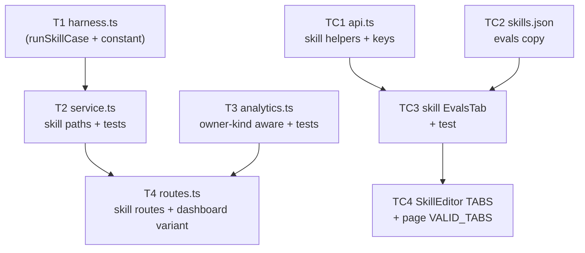
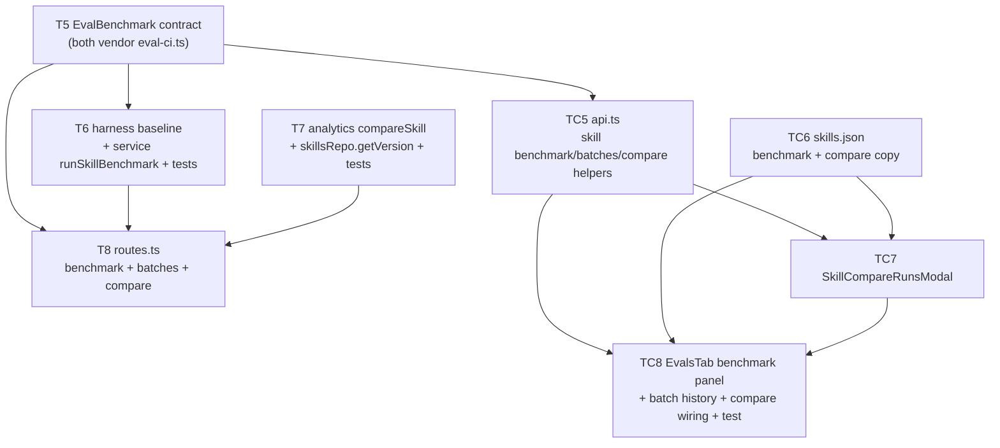

# Implementation Plan: Evals tab on the Skill editor
> Status: READY (v1 shipped) · AMENDMENT READY (Benchmark & Compare Runs — awaiting go-ahead)
> Date: 2026-07-11 · Amendment: 2026-07-12
> Spec: specs/SPEC-2026-07-11-skill-evals-tab.md (approved v1 · amendment approved 2026-07-12)
>
> **v1 tasks T1–T4 / TC1–TC4 are shipped, reviewed (architecture-reviewer + plan-verifier PASS),
> live-verified, and passed `pr-self-review` — this file leaves them byte-unchanged.** The
> amendment (AC-20 – AC-34) is appended as a new section at the end (tasks T5–T8 / TC5–TC8) and is
> purely additive; do not renumber or re-edit the v1 tasks. Implementation of the amendment is ON
> HOLD until the user confirms it is safe (an unrelated feature is in flight on this branch).

## Overview
Add an "Evals" tab to the Skill editor, mirroring the Agent editor's Evals tab, and extend the
existing `eval` module so a skill's `body` is run against its eval cases under a **fixed reference
harness** and scored by the unmodified deterministic scorer. No DB migration and no shared-contract
change are required — `eval_cases.owner_kind='skill'` is already a valid enum value and every
`Eval*` contract is owner-kind generic (verified against current code). The work extends existing
files in `server/src/modules/eval/` (service, analytics, routes; **repository is unchanged**), adds
one small server file (the harness), and adds a client Skill-editor tab + skill-scoped `api.ts`
helpers.

## Execution mode
multi-agent (parallel) — **confirmed.** This is a cross-module feature (server + client) with a
clean DAG and strictly non-overlapping owned paths; the server core (harness) and analytics can
start in parallel, and the client tasks parallelise against unchanged contracts.

## Requirements (verified)
- Source: `specs/SPEC-2026-07-11-skill-evals-tab.md` (approved) — ACs: AC-1..AC-19.
- Both prior open questions are resolved in the spec and treated as settled: an `injectionDetected`
  skill under eval is **refused** (AC-18, hard 4xx, no `eval_runs` row); the fixed harness model is
  **not pinned** ("any configured provider available via `container.llm(provider)`").
- **No contract change and no migration** — re-verified against live code: `EvalRepository.listCases`
  already takes `ownerKind` (`server/src/modules/eval/repository.ts:22-37`); `latestRunPerCase` /
  `batchRunsWithExpectedForOwner` / `runsForBatch` / `recentRuns` filter by `ownerId` only; every
  `Eval*` schema in `contracts/eval-ci.ts` + `contracts/knowledge.ts` is owner-kind generic.

### Deltas / disputes (things this plan narrows or flags)
- **D1 — `EvalCaseModal` "reused as-is" is only cosmetically true for skills.** The shared modal
  fetches its edit-mode last-run status line via the **agent** route:
  `useQuery({ queryKey: evalQueryKeys.cases(initial.owner_id), queryFn: () => fetchEvalCases(initial.owner_id) })`
  (`client/src/components/EvalCaseModal/EvalCaseModal.tsx:225-227`). For a skill case `owner_id` is a
  skill id, so it calls `GET /agents/{skillId}/eval-cases`, which returns `[]` (the service filters
  `ownerKind='agent'`) — **graceful, no error**, but the persisted last-run line silently won't show
  for skill cases (an in-modal "Run case" fresh result still shows). **Decision (assumed default —
  confirm): accept this cosmetic degradation and keep `EvalCaseModal` byte-unchanged**, honouring the
  spec's "reused as-is". Alternative (not taken): a small owner-kind branch inside the modal — would
  add a task touching `EvalCaseModal.tsx` and require re-verifying the existing agent EvalsTab/modal
  tests. See Risks.
- **D2 — `service.listCases` and `analytics.dashboard`/`resolveAlert` signatures change (additive
  param), not just internals.** The spec says these become "owner-kind aware"; concretely they gain
  an `ownerKind` parameter, so their one caller (`routes.ts`) updates in lockstep (T4 depends on T2/T3).
- **D3 — `service.runCaseOnce` becomes owner-kind aware** so the **existing** single-run route
  `POST /eval-cases/:id/run` (AC-7) works for a skill case; it branches on the fetched case's
  `ownerKind` (`server/src/modules/eval/service.ts:215-267`). The agent path is untouched.

## Open questions & recommendations — all confirmed by user, none blocking
- Q1 (confirmed → **accept degradation**): `EvalCaseModal` last-run line for skill cases — see D1.
- Q2 (confirmed → **match seeded default agent**): the fixed harness provider/model is
  `provider: 'openrouter'`, `model: 'deepseek/deepseek-v4-flash'` — the values the seeded built-in
  agents use (`server/src/db/seed.ts:15-16`), guaranteeing `container.llm('openrouter')` resolves
  without a missing-key failure.
- Q3 (confirmed → **hardcoded label + panel copy in skills.json**): the existing `SkillEditor` uses
  hardcoded tab-bar labels (`SkillEditor.tsx:11-17`), so the new tab is added as
  `{ key: "evals", label: "Evals", icon: "FlaskConical" }`; the Evals **panel** copy (buttons,
  headings, tiles, badges) lives in `skills.json` per AC-19.
- Q4 (confirmed → **multi-agent**): execution mode.
- Rec: keep the harness a **single self-contained new file** (`harness.ts`) rather than editing the
  agent-used `run.ts`. `run.ts`/`runCase` then stay byte-unchanged, so the agent eval path carries
  **zero regression risk** and `scoring.ts` stays byte-unchanged per the spec Non-goal.
- Rec: gate the skill run purely on `injectionDetected` (AC-18), **not** on `skill.enabled` — a
  disabled skill should still be evaluable; enabled-ness governs live reviews, not evals.

## Affected modules & contracts
- **server / `modules/eval`** — `service.ts` (skill create-guard, owner-kind `listCases`, owner-kind
  `runCaseOnce`, new `runSkillBatch`), `analytics.ts` (owner-kind `dashboard`/`resolveAlert`), new
  `harness.ts` (fixed reference config + `runSkillCase`), `routes.ts` (two new skill routes + the
  `skillId` dashboard variant + updated agent-route callers). **`repository.ts` is unchanged** (already
  owner-kind generic) — **no `repository.test.ts` change is needed; implementers must not add tests
  there.** `run.ts`, `scoring.ts`, `constants.ts`, `modules/index.ts`, `platform/container.ts` are all
  unchanged (`skillsRepo` already exists on the container, `container.ts:121-122`).
- **reviewer-core** — unchanged; consumed via `reviewPullRequest` + grounding. The mandatory grounding
  gate is not bypassed; `wrapUntrusted`/`assemblePrompt` hardening is inherited (AC-15).
- **client** — new Skill-editor `EvalsTab` (mirror of the agent one minus the "View full dashboard →"
  link); `lib/api.ts` skill-scoped helpers + query keys; `SkillEditor.tsx` + `page.tsx` tab
  registration; `messages/en/skills.json` copy. `EvalCaseModal` reused unchanged (D1);
  `createEvalCase` / `deleteEvalCase` / `runEvalCase` reused unchanged.
- **Contracts:** none. New routes reuse existing shapes — `GET /skills/:id/eval-cases` →
  `EvalCaseListItem[]`, `POST /skills/:id/eval-runs` → `EvalRun`, `GET /eval/dashboard?skillId=` →
  `EvalDashboard` (`owner_kind:'skill'`).

## Architecture changes
- **New `server/src/modules/eval/harness.ts`** (Application layer, onion-compliant — reaches the LLM
  only via `container.llm`, imports `reviewPullRequest` + `parseUnifiedDiff`, never an SDK):
  - `export const SKILL_EVAL_HARNESS` = `{ systemPrompt: <fixed constant>, provider: 'openrouter',
    model: 'deepseek/deepseek-v4-flash', strategy: 'single-pass' }` (a single hardcoded constant;
    reuse `REVIEW_STRATEGY` from `./constants.js` for `strategy`).
  - `export async function runSkillCase(container, skillBody, evalCase)` → returns the **same**
    `EvalRunOutput` shape as `run.ts`'s `runCase` (`{ findings, kept, produced, costUsd }`), driving
    `reviewPullRequest({ systemPrompt: HARNESS.systemPrompt, model: HARNESS.model, diff, llm,
    strategy: HARNESS.strategy, skills: [skillBody] })` with `diff = parseUnifiedDiff(evalCase.inputDiff ?? '')`.
    Reuse the `EvalCaseRunInput` / `EvalRunOutput` types exported from `./run.js`.
- **`service.ts` skill paths** (Application) — see T2. Ownership branch → `container.skillsRepo.getById`.
- **`analytics.ts` owner-kind param** (Application) — see T3. `compare` stays agent-only (Non-goal).
- **`routes.ts`** (Transport) — Zod-validated params/query/response → service; no logic/DB/SDK.
- **client** — the Skill `EvalsTab` is `"use client"` (TanStack Query + interactivity); type contracts
  come only from `@devdigest/shared`.

## Parallelisation map



- Server root tasks that start immediately: **T1** and **T3** (disjoint files).
- Client root tasks that start immediately: **TC1** and **TC2** (disjoint files); they typecheck
  against unchanged contracts, so they do not wait on the server tasks.

## Phased tasks
<!-- The orchestrator spawns `implementer-backend` for backend/core tasks (Type backend|core),
     `implementer-ui` for ui tasks (Type ui). Within a phase, disjoint Owned paths run in parallel. -->

### Phase 1 — Server core + analytics (parallel roots)

- **T1 — Fixed reference harness (`harness.ts`: constant + `runSkillCase`)**
  - **Action:**
    1. Create `server/src/modules/eval/harness.ts`. Export `SKILL_EVAL_HARNESS` = a single hardcoded
       `{ systemPrompt, provider, model, strategy }` constant: `provider: 'openrouter'`,
       `model: 'deepseek/deepseek-v4-flash'` (match the seeded default agents,
       `server/src/db/seed.ts:15-16`, so `container.llm` resolves), `strategy: REVIEW_STRATEGY`
       (import from `./constants.js`), and a fixed constant `systemPrompt` string for skill evals
       (a neutral reviewer prompt — the only per-run variable is the injected skill body).
    2. Export `async function runSkillCase(container: Container, skillBody: string, evalCase:
       EvalCaseRunInput): Promise<EvalRunOutput>` (import `EvalCaseRunInput` / `EvalRunOutput` from
       `./run.js`). Build `diff = parseUnifiedDiff(evalCase.inputDiff ?? '')`
       (`../../adapters/git/diff-parser.js`); resolve `llm = await container.llm(SKILL_EVAL_HARNESS.provider)`;
       call `reviewPullRequest({ systemPrompt, model, diff, llm, strategy, skills: [skillBody] })` —
       **omit** callers/repoMap/intent/prDescription/specs/task entirely (AC-11: no live enrichment).
       Return `{ findings: outcome.review.findings, kept, produced: kept + outcome.dropped.length,
       costUsd: outcome.costUsd }` (mirror `run.ts:81-86`).
    3. Do **not** edit `run.ts` — keep the agent path byte-unchanged (Rec).
  - **Module:** server
  - **Type:** backend
  - **Skills to use:** onion-architecture, typescript-expert, security, fastify-best-practices
  - **Owned paths:** `server/src/modules/eval/harness.ts`
  - **Depends-on:** none
  - **Covers:** AC-9, AC-10 (output shape), AC-11, AC-15 (inherited wrap)
  - **Risk:** medium
  - **Known gotchas:** the skill path injects **only** `[skillBody]` — never resolves an agent config
    or any agent's linked skills (AC-9). Reach the LLM only via `container.llm` (never a raw SDK) —
    onion rule; `container.llm` throws `ConfigError` if the provider key is unset, which is why the
    harness pins a provider the workspace already configures. Do NOT route through `ReviewRunExecutor`
    (it builds a PR row + repo-intel, breaking AC-11). Relative imports carry `.js`.
  - **Acceptance:** `cd server && npx tsc --noEmit` passes; `cd server && npm run depcruise` stays
    green (harness imports inward only — no `db/schema`, no adapter SDK); with a mock `LLMProvider`
    (`src/adapters/mocks.ts`), `runSkillCase` returns `{findings, kept, produced, costUsd}` and never
    calls any `container.repoIntel` method.

- **T3 — Analytics: owner-kind-aware dashboard (`skillId` variant)**
  - **Action:**
    1. In `server/src/modules/eval/analytics.ts`, thread an `ownerKind: 'agent' | 'skill'` through the
       dashboard read path. Change `dashboard(workspaceId, ownerId)` →
       `dashboard(workspaceId, ownerKind, ownerId)` (keep the `ownerId === null` → `_workspaceDashboard`
       branch); change `_agentDashboard` → a generic `_ownerDashboard(workspaceId, ownerKind, ownerId)`
       that passes `ownerKind` to `listCases` and returns `owner_kind: ownerKind` (replace the two
       hardcoded `'agent'` uses at `analytics.ts:352` and `:371`).
    2. Make `resolveAlert(container, workspaceId, ownerId, batches)` owner-kind aware: add an
       `ownerKind` param and pass it to `container.evalRepo.listCases(workspaceId, ownerKind, ownerId)`
       (`analytics.ts:196`). The regression/floor logic is otherwise unchanged and owner-agnostic.
    3. `history` / `aggregateRunRows` / `compare` are **unchanged** — they already key off `ownerId`
       only; `compare` stays agent-only (spec Non-goal), no skill wiring.
    4. In `analytics.test.ts`, add a skill-owner case: `dashboard(ws, 'skill', skillId)` returns an
       `EvalDashboard` with `owner_kind: 'skill'` and the skill's current metrics, computed by the same
       `aggregateRunRows` path (mirror the existing agent dashboard test; extend the `makeContainer`
       fixture's `listCases` mock — it already accepts an `ownerKind` arg).
  - **Module:** server
  - **Type:** backend
  - **Skills to use:** onion-architecture, drizzle-orm-patterns, typescript-expert, zod
  - **Owned paths:** `server/src/modules/eval/analytics.ts`, `server/src/modules/eval/analytics.test.ts`
  - **Depends-on:** none
  - **Covers:** AC-3 (metrics source), AC-13
  - **Risk:** medium
  - **Known gotchas:** `compare` MUST stay agent-only — `skillsRepo` has no `getVersion` and
    `skill_versions` stores only `body`, so a prompt-diff between versions does not translate (spec
    Design decision 2). The workspace-wide (`ownerId null`) dashboard is untouched. `resolveAlert`
    reads per-case pass history via `runsForBatch` (owner-id filtered, already generic) — no change
    needed there.
  - **Acceptance:** `cd server && npx tsc --noEmit` passes; `npx vitest run
    src/modules/eval/analytics.test.ts` green, including the new `owner_kind:'skill'` dashboard case;
    `npm run depcruise` green.

### Phase 2 — Server service + routes

- **T2 — Service: skill create-guard, owner-kind list/run, `runSkillBatch`**
  - **Action:**
    1. `createCase` (`service.ts:124-153`): branch the ownership guard on `input.owner_kind`. For
       `'skill'` → `container.skillsRepo.getById(workspaceId, input.owner_id)` (404 if missing/cross-
       workspace); for `'agent'` → the existing `agentsRepo.getById`. The `EvalExpectedOutput.safeParse`
       guard and the `insertCase` call are unchanged (AC-5).
    2. `listCases` (`service.ts:162-191`): add an `ownerKind: 'agent' | 'skill'` param and pass it to
       `container.evalRepo.listCases(workspaceId, ownerKind, agentOrSkillId)` (replace the hardcoded
       `'agent'` at `:168`). `latestRunPerCase(workspaceId, ownerId)` is owner-id filtered — unchanged
       (AC-2, AC-3 pass/fail data).
    3. `runCaseOnce` (`service.ts:215-267`): after `getCase`, branch on `evalCase.ownerKind`.
       **skill:** `skill = skillsRepo.getById(workspaceId, evalCase.ownerId)` (404 if missing); if
       `skill.injectionDetected` → throw `ValidationError` (4xx) and persist nothing (AC-18); run via
       `harness.runSkillCase(container, skill.body, { inputDiff: evalCase.inputDiff })`; persist the run
       with `agentVersion: skill.version` (the legacy column carries the skill version, spec Persistence
       note). **agent:** the existing path, unchanged. Share the score+persist tail
       (`scoreCase`/`aggregate`/`insertRun`) across both branches (AC-7, AC-10).
    4. Add `runSkillBatch(container, workspaceId, skillId): Promise<EvalRun>` mirroring `runBatch`
       (`service.ts:284-398`) but skill-flavoured: `listCases(workspaceId,'skill',skillId)`; **empty
       set → `scoring.aggregate([], {kept:0,produced:0})`, persist nothing** (AC-16); fetch skill via
       `skillsRepo.getById`; if `skill.injectionDetected` → throw `ValidationError`, persist nothing
       (AC-18); one shared `batchId = randomUUID()`; sequential loop calling `runSkillCase` per case;
       per-case LLM failure → persist a failed row (`pass:null`, metrics null, `actual_output.error`)
       and continue, preserving prior scored rows (AC-17); stamp every row `agentVersion: skill.version`;
       return the pooled `EvalRun` with `traces_total = cases.length` (AC-8).
    5. Extend `service.test.ts`: add a `skillsRepo` stub to the `makeContainer` fixture
       (`service.test.ts:186-216`, `{ getById }`); cover — skill `createCase` guard (valid skill
       persists `owner_kind:'skill'`; foreign/missing skill → 404, no row, AC-5); `runCaseOnce` on a
       skill case drives `harness.runSkillCase` (`vi.mock('./harness.js', …)` like the existing
       `vi.mock('./run.js')`) and stamps `agentVersion = skill.version` (AC-7); `runSkillBatch` empty
       set → `traces_total 0`, no rows (AC-16); mid-batch throw isolates + preserves siblings, N rows
       share one `batchId`, `traces_total = N` (AC-8, AC-17); `injectionDetected` skill → 4xx, zero
       `insertRun` calls, single and batch (AC-18); cross-workspace skill id → 404 (AC-14).
  - **Module:** server
  - **Type:** backend
  - **Skills to use:** onion-architecture, fastify-best-practices, zod, security, typescript-expert, drizzle-orm-patterns
  - **Owned paths:** `server/src/modules/eval/service.ts`, `server/src/modules/eval/service.test.ts`
  - **Depends-on:** T1
  - **Covers:** AC-2, AC-5, AC-7, AC-8, AC-10, AC-12, AC-14, AC-16, AC-17, AC-18
  - **Risk:** high
  - **Known gotchas:** `scoring.ts` stays **byte-unchanged** (spec Non-goal) — reuse `scoreCase` /
    `aggregate` / the `_parseExpected` / `_findingsToRegions` / `_buildActualOutput` helpers verbatim.
    The skill run injects **only** `[skill.body]` — never `agentsRepo.linkedSkills` (AC-9). Gate on
    `injectionDetected` only, not `enabled` (Rec). `agent_version` is the real `eval_runs` column that
    carries the skill's `version` — set it in `insertRun`'s `values`, not inside `actual_output`.
    `container.skillsRepo` already exists (`container.ts:121-122`); `getById(workspaceId, id)` returns
    `SkillRow | undefined` with `body` / `version` / `injectionDetected` (`skills/repository.ts:53-59`).
  - **Acceptance:** `cd server && npx tsc --noEmit` passes; `npx vitest run
    src/modules/eval/service.test.ts` green including all listed skill cases; a test asserts an
    `injectionDetected` skill triggers zero `insertRun` calls; `npm run depcruise` green.

- **T4 — Routes: skill list + skill batch + `skillId` dashboard variant**
  - **Action:**
    1. In `server/src/modules/eval/routes.ts`, add `GET /skills/:id/eval-cases` (params
       `{ id: uuid }`, response `z.array(EvalCaseListItem)`) → `listCases(container, workspaceId,
       'skill', id)` mapped to `EvalCaseListItem[]` exactly as the agent list route maps it
       (`routes.ts:110-145`) (AC-2).
    2. Add `POST /skills/:id/eval-runs` (params `{ id: uuid }`, body `EmptyBody`, response `EvalRun`)
       → `runSkillBatch(container, workspaceId, id)` (AC-8), mirroring `POST /agents/:id/eval-runs`.
    3. Update the **existing** agent list route to pass the new `listCases` signature —
       `listCases(container, workspaceId, 'agent', req.params.id)` (`routes.ts:120`) — so T2's
       signature change compiles.
    4. Extend `GET /eval/dashboard`: querystring `{ agentId?: uuid, skillId?: uuid }`. Resolve owner:
       `skillId` present → `analytics.dashboard(workspaceId, 'skill', skillId)`; else `agentId` present
       → `dashboard(workspaceId, 'agent', agentId)`; else workspace-wide `dashboard(workspaceId, 'agent', null)`
       (the `null` ownerId branch ignores ownerKind) (AC-13). Update this one call to the new signature.
    5. **Do not** add a skill `/eval-compare` or `/eval-batches` route (spec Design decision 2). Module
       registration is unchanged — `eval` is already in `modules/index.ts`.
  - **Module:** server
  - **Type:** backend
  - **Skills to use:** fastify-best-practices, onion-architecture, zod, security
  - **Owned paths:** `server/src/modules/eval/routes.ts`
  - **Depends-on:** T2, T3
  - **Covers:** AC-2, AC-6 (delete reused unchanged), AC-8, AC-13, AC-14 (route `getContext` guard)
  - **Risk:** low
  - **Known gotchas:** every route calls `getContext(app.container, req)` for the workspace guard
    (AC-14) — mirror the existing routes exactly. Declare Zod `params`/`querystring`/`body`/`response`;
    no logic/DB/SDK in the route. `DELETE /eval-cases/:id` and `POST /eval-cases/:id/run` are reused
    unchanged (AC-6, AC-7) — do not duplicate them. Relative imports carry `.js`.
  - **Acceptance:** `cd server && npx tsc --noEmit` passes; server boots and the two new routes plus
    the `?skillId=` dashboard variant respond (a `fastify.inject` smoke or the route test harness);
    `GET /eval/dashboard?skillId=<id>` returns `owner_kind:'skill'`; `npm run depcruise` green.

### Phase 3 — Client (parallel roots TC1/TC2; consume Phase 2 endpoints at runtime)

- **TC1 — API client: skill-scoped eval helpers + query keys**
  - **Action:**
    1. In `client/src/lib/api.ts`, add three skill-scoped functions beside the agent variants
       (`api.ts:172-222`): `fetchSkillEvalCases(skillId): Promise<EvalCaseListItem[]>` →
       `api.get('/skills/${skillId}/eval-cases')`; `runSkillEvalBatch(skillId): Promise<EvalRun>` →
       `api.post('/skills/${skillId}/eval-runs', {})` (send `{}` so Fastify sets `application/json`);
       `fetchSkillEvalDashboard(skillId): Promise<EvalDashboard>` →
       `api.get('/eval/dashboard?skillId=${skillId}')`. Type every return from `@devdigest/shared`.
    2. Extend `evalQueryKeys` (`api.ts:137`) with `skillCases(skillId)` and `skillDashboard(skillId)`
       factories (keep them distinct from the agent `cases`/`dashboard` keys to avoid cache collisions
       between an agent and a skill that happen to share an id space).
    3. Do **not** add new create/delete/single-run functions — `createEvalCase`, `deleteEvalCase`,
       `runEvalCase` are reused unchanged (they are owner-agnostic: create posts the input's
       `owner_kind`; delete/run are case-id based).
  - **Module:** client
  - **Type:** ui
  - **Skills to use:** frontend-architecture, react-best-practices, typescript-expert
  - **Owned paths:** `client/src/lib/api.ts`
  - **Depends-on:** none (typechecks against existing contracts)
  - **Covers:** plumbing for AC-2, AC-3, AC-8, AC-13
  - **Risk:** low
  - **Known gotchas:** all API access + query keys live ONLY in `lib/api.ts` (client CLAUDE.md). POST
    helpers must send a JSON body (`{}`) or Fastify's body-schema route rejects the request. Reuse the
    existing `api.get/post` helpers; do not hand-duplicate contract types.
  - **Acceptance:** `cd client && npx tsc --noEmit` passes; `fetchSkillEvalCases`,
    `runSkillEvalBatch`, `fetchSkillEvalDashboard`, `evalQueryKeys.skillCases`,
    `evalQueryKeys.skillDashboard` are exported and typed from `@devdigest/shared`.

- **TC2 — Skill Evals tab copy in `skills.json` (AC-19)**
  - **Action:**
    1. Add an `evals` namespace block to `client/messages/en/skills.json` (a new top-level key beside
       `page`/`detail`/… at `skills.json:2`), mirroring the agent `agents.evals` keys
       (`client/messages/en/agents.json:107-134`) that the skill tab actually uses: `metricsTitle`,
       `tiles.{recall,precision,citationAccuracy,tracesPassed}`, `casesHeading`, `passingCount`,
       `newCase`, `runAll`, `running`, `batchResult`, `passed`, `failed`, `neverRun`, `emptyCases`,
       `expectedGot`, `emptyExpectation`, `runCaseLabel`, `editCaseLabel`, `deleteCaseLabel`,
       `deleteConfirm`. **Omit** `viewFullDashboard` (no detail page in v1).
    2. Do **not** modify `client/messages/en/eval.json` — the reused `EvalCaseModal` keeps drawing from
       the `eval` namespace (AC-19).
  - **Module:** client
  - **Type:** ui
  - **Skills to use:** frontend-architecture
  - **Owned paths:** `client/messages/en/skills.json`
  - **Depends-on:** none
  - **Covers:** AC-19
  - **Risk:** low
  - **Known gotchas:** i18n namespace files are auto-loaded (`readdirSync` in `client/src/i18n/
    request.ts`) — no wiring needed, but a missing key throws at render, so the key set here MUST match
    every `t("…")` call TC3 makes. `expectedGot` uses ICU plural syntax — copy it verbatim from
    `agents.json:127`.
  - **Acceptance:** `cd client && npx tsc --noEmit` passes; the `evals` block is valid JSON and
    contains exactly the keys TC3 references (verified when TC3's test renders without a missing-key
    error).

- **TC3 — Skill `EvalsTab` component + test (mirror agent, minus the dashboard link)**
  - **Action:**
    1. Create `client/src/app/skills/[id]/_components/SkillEditor/_components/EvalsTab/EvalsTab.tsx`
       (+ `index.ts`) closely mirroring the agent tab
       (`client/src/app/agents/[id]/_components/AgentEditor/_components/EvalsTab/EvalsTab.tsx`), with
       props `{ skillId: string; skillName: string }`, `useTranslations("skills")`, and these
       differences: **(a)** drop the `<Link href="/eval/${agentId}">` "View full dashboard →" element
       and its `right={…}` on `SectionLabel` (no detail page — Non-goal); **(b)** queries use
       `evalQueryKeys.skillCases(skillId)` / `fetchSkillEvalCases(skillId)` and
       `evalQueryKeys.skillDashboard(skillId)` / `fetchSkillEvalDashboard(skillId)` (TC1); **(c)**
       "Run all" calls `runSkillEvalBatch(skillId)` (TC1); **(d)** `blankInitial` and
       `buildInitialFromCase` use `owner_kind: "skill"` / `owner_id: skillId`; **(e)** per-row run,
       edit, delete reuse `runEvalCase` / `EvalCaseModal` / `deleteEvalCase` unchanged, passing the
       skill name to the modal's `agentName` prop (display-only subtitle). Keep the metric tiles,
       "X / Y passing" badge, status icons, and delta-baseline gating identical to the agent tab
       (AC-2, AC-3, AC-4, AC-6, AC-7, AC-8).
    2. Create `EvalsTab.test.tsx` mirroring the agent tab's test pattern exactly: `vi.mock("@/lib/api", …)`
       (stub `fetchSkillEvalCases`/`fetchSkillEvalDashboard`/`runSkillEvalBatch`/`runEvalCase`/
       `deleteEvalCase`/`evalQueryKeys`), `vi.mock("@/components/EvalCaseModal", …)`, a
       `QueryClientProvider` + `NextIntlClientProvider` (with the `skills` messages) wrapper,
       `fireEvent` only, `afterEach(() => { cleanup(); vi.clearAllMocks(); })`. Cover: renders one row
       per skill case with the correct pass/fail/never-run icon (AC-2); the "X / Y passing" badge and
       metric tiles render (AC-3); "Run all" fires `runSkillEvalBatch` once (AC-8); a row's run fires
       `runEvalCase` once (AC-7); "New eval case" opens the modal with `owner_kind:"skill"` (AC-4).
  - **Module:** client
  - **Type:** ui
  - **Skills to use:** react-best-practices, react-testing-library, frontend-architecture, next-best-practices, typescript-expert
  - **Owned paths:** `client/src/app/skills/[id]/_components/SkillEditor/_components/EvalsTab/` (new dir)
  - **Depends-on:** TC1, TC2
  - **Covers:** AC-2, AC-3, AC-4, AC-6, AC-7, AC-8, AC-19
  - **Risk:** medium
  - **Known gotchas:** `EvalCaseModal` is reused **unchanged** (D1) — its internal edit-mode last-run
    line queries the agent route and returns `[]` for skill cases (graceful, no error); do not try to
    "fix" it here. Icons must exist in `vendor/ui/icons.tsx` (the agent tab already uses `Gauge`,
    `Play`, `Plus`, `CheckCircle`, `XCircle`, `Dot`, `RefreshCw`, `ArrowUp/Down`, `Slash` — reuse the
    same set; the removed `ArrowRight` was only for the dropped link). The status icon, `rowSubtitle`,
    and `MetricTile` helpers can be copied verbatim.
  - **Acceptance:** `cd client && npx tsc --noEmit` passes; `npx vitest run
    src/app/skills/**/EvalsTab.test.tsx` green with all listed cases; the tab has **no** "View full
    dashboard" link.

- **TC4 — Register the Evals tab in `SkillEditor` + page allow-list (AC-1)**
  - **Action:**
    1. In `client/src/app/skills/[id]/_components/SkillEditor/SkillEditor.tsx`: append
       `{ key: "evals", label: "Evals", icon: "FlaskConical" as const }` to the `TABS` array
       (`SkillEditor.tsx:11-17`); import the new `EvalsTab`; render
       `{tab === "evals" && <EvalsTab skillId={skill.id} skillName={skill.name} />}` in the body
       (`SkillEditor.tsx:26-30`).
    2. In `client/src/app/skills/[id]/page.tsx`: append `"evals"` to `VALID_TABS`
       (`page.tsx:16`) — **this is the documented gotcha (AC-1)**: without it, `?tab=evals` silently
       falls back to `config` (`page.tsx:30`).
  - **Module:** client
  - **Type:** ui
  - **Skills to use:** react-best-practices, frontend-architecture, next-best-practices
  - **Owned paths:** `client/src/app/skills/[id]/_components/SkillEditor/SkillEditor.tsx`,
    `client/src/app/skills/[id]/page.tsx`
  - **Depends-on:** TC3
  - **Covers:** AC-1
  - **Risk:** medium
  - **Known gotchas:** the tab MUST be added in **both** `SkillEditor.tsx` `TABS` **and** `page.tsx`
    `VALID_TABS` — this is the exact failure mode PLAN-eval-pipeline.md's TC4 documented for the agent
    editor. `SkillEditor`'s `TABS` uses hardcoded `label` strings (not i18n) — match that convention
    (Q3 default); the Evals **panel** copy comes from `skills.json` (TC2). `"FlaskConical"` is a valid
    `IconName` (used by the agent editor's `constants.ts:15`).
  - **Acceptance:** `cd client && npx tsc --noEmit` passes; navigating `/skills/<id>?tab=evals` renders
    the Evals panel (not `config`); both `SkillEditor.tsx` and `page.tsx` contain `"evals"`.

## Testing strategy
- **Server module tests:** `cd server && npx vitest run src/modules/eval/service.test.ts
  src/modules/eval/analytics.test.ts` — skill create-guard + 404, `runCaseOnce` skill branch,
  `runSkillBatch` (empty / injection / mid-batch isolation / shared batchId / traces_total),
  owner-kind dashboard. Mock the harness with `vi.mock('./harness.js', …)` (mirror the existing
  `vi.mock('./run.js')`); extend `makeContainer` with a `skillsRepo` stub. **`repository.test.ts`
  gets no new tests** — the repository is unchanged.
- **Server typecheck + layering:** `cd server && npx tsc --noEmit` and `cd server && npm run
  depcruise` (`harness.ts` must import inward only — no `db/schema`, no adapter SDK; it reaches the
  LLM via `container.llm`).
- **Client component test:** `cd client && npx vitest run src/app/skills` — the skill `EvalsTab`
  renders rows + fires one run-all / one run-case, opens the modal with `owner_kind:"skill"`.
- **Client typecheck:** `cd client && npx tsc --noEmit`.
- **Manual smoke (optional):** with the dev DB seeded, open `/skills/<id>?tab=evals`, add a case, Run
  all; edit the skill body, Run all again, confirm the metric tiles move (AC-12).
- **Out of scope for this plan to run:** the planner does not execute any of the above — these are
  instructions for implementers.

## Risks & mitigations
- **D1 — `EvalCaseModal` last-run line silently absent for skill cases** (queries the agent route,
  returns `[]`). → Accepted cosmetic degradation (user-confirmed); the in-modal fresh "Run case"
  result still shows.
- **Harness provider/model** (`openrouter` / `deepseek/deepseek-v4-flash`, user-confirmed). → If that
  key is not configured in the target workspace, `container.llm` throws `ConfigError` and every skill
  run fails. Matching the seeded default agents minimises this risk.
- **`service.listCases` / `analytics.dashboard` signature change** could break the agent routes if T4
  lags. → T4 `Depends-on` T2 and T3 and updates the agent-route callers in the same task; both
  `tsc --noEmit` runs catch any missed caller.
- **Scorer / repository accidental edit** (would violate the spec Non-goal). → `scoring.ts` and
  `repository.ts` are in no task's Owned paths; the depcruise + unchanged-file check flags any drift.
- **Out-of-scope temptations** (skill eval detail/compare page, `analytics.compare` for skills,
  workspace `/eval` dashboard integration, carrier-agent picker) → NOT built; they are the spec's
  Non-goals / Design decision 2 and stay out of the task list.

## Red-flags check
- [x] Every requirement maps to a task (AC-1..AC-19 — see matrix)
- [x] Every AC-N is covered by at least one task's `Covers`
- [x] No specification was authored or edited — `specs/…` taken as input only
- [x] Execution mode recorded (multi-agent, defaulted) and the plan is shaped for it
- [x] Dependencies form a DAG (T1→T2→T4; T3→T4; TC1,TC2→TC3→TC4) — no cycles
- [x] (multi-agent) Concurrent tasks have non-overlapping Owned paths (verified: no file appears in
      two tasks; `service.ts`, `analytics.ts`, `routes.ts`, `harness.ts`, `api.ts`, `skills.json`,
      the new EvalsTab dir, `SkillEditor.tsx`+`page.tsx` each owned by exactly one task)
- [x] Every Acceptance is measurable (a command result / test name / observable render)
- [x] No shared-contract change (verified owner-kind-generic) and no migration — explicitly stated
- [x] No AC prose restated from the spec (referenced by ID; traceability matrix uses IDs)
- [x] No task `Action` has 10+ numbered steps; no sub-5-minute sibling tasks left unmerged
      (harness constant folded into T1; skill batch folded into T2; tab registration is one small T4/TC4)
- [x] Every cross-cutting Owned path is grep-verified: `service.ts:124-153/162-191/215-267/284-398`,
      `analytics.ts:196/352/371`, `routes.ts:110-145/120`, `EvalCaseModal.tsx:225-227`,
      `SkillEditor.tsx:11-30`, `page.tsx:16/30`, `skills/repository.ts:53-59`, `container.ts:121-122`,
      `seed.ts:15-16`, agent tab `agents.json:107-134`
- [x] Every deleted/narrowed shared symbol has all consumers assigned — N/A (no deletions/narrowing;
      the only signature changes are additive params on `service.listCases` and `analytics.dashboard`/
      `resolveAlert`, whose sole caller `routes.ts` is updated in T4)
- [x] Every new runner/registry-discovered file cites its discoverer: the skill `EvalsTab` is imported
      directly by `SkillEditor.tsx` (TC4, not glob-discovered); the `skills.json` `evals` namespace is
      auto-loaded by `readdirSync` in `client/src/i18n/request.ts`; no new server module registration
      (the `eval` module is already registered in `modules/index.ts`)

## AC → task traceability (IDs only)
| AC | Tasks | AC | Tasks |
|----|-------|----|-------|
| AC-1 | TC4 | AC-11 | T1 |
| AC-2 | T2, T4, TC1, TC3 | AC-12 | T1, T2 (behavioural) |
| AC-3 | T3, TC1, TC3 | AC-13 | T3, T4, TC1 |
| AC-4 | TC3 (reused modal) | AC-14 | T2, T4 |
| AC-5 | T2, TC3 | AC-15 | T1 |
| AC-6 | TC3 (reused DELETE) | AC-16 | T2 |
| AC-7 | T1, T2, TC3 | AC-17 | T2 |
| AC-8 | T1, T2, T4, TC1, TC3 | AC-18 | T2 |
| AC-9 | T1, T2 | AC-19 | TC2, TC3 |
| AC-10 | T1, T2 | | |

---

# Amendment (2026-07-12) — Benchmark & Compare Runs (AC-20 – AC-34)

> Additive to the shipped v1 above. New tasks **T5–T8** (server) and **TC5–TC8** (client) continue
> the v1 numbering. Nothing in the v1 section is renumbered or edited. All file/line references
> below were re-verified against the current tree on 2026-07-12 (v1 as shipped), not the spec text.

## Overview (amendment)
Add two capabilities to the **same** Skill-editor Evals tab: (1) **Benchmark vs no-skill** — run
each case twice (candidate `skills:[body]` + baseline `skills:[]`) through the *same*
`SKILL_EVAL_HARNESS` and report the recall/precision/citation **lift** and per-case pass comparison,
persisting **only** the candidate batch; (2) **Compare Runs** — pick two of the skill's past eval
batches and see the metrics delta plus a **body** line-diff between the two stamped versions. Unlike
v1, the amendment **adds one shared contract** (the benchmark result shape) and **touches the
do-not-edit vendor files** — this is called out as an isolated task (T5).

## Execution mode (amendment)
multi-agent (parallel) — same mode as v1. Contract-first (T5) unblocks the server benchmark path and
the client helper; analytics compare + the skills-repo read (T7) is an independent server root; the
client tasks parallelise behind the contract. Non-overlapping owned paths preserved throughout.

## Requirements (verified — amendment)
- Source: `specs/SPEC-2026-07-11-skill-evals-tab.md`, "Amendment (2026-07-12)" section — ACs:
  AC-20..AC-34. Both amendment open questions are resolved in the spec and treated as settled:
  **baseline is ephemeral / not persisted** (AC-23, zero migration) and **benchmark is set-level
  only** (no per-case control).
- **One additive contract, no migration** — re-verified against live code:
  - `EvalCompare.prompt_diff` is `z.unknown()` (`server/src/vendor/shared/contracts/eval-ci.ts:362`),
    so the skill body-diff reuses it with **no `EvalCompare` change** (AC-29, AC-31).
  - `EvalRunBatch` is owner-agnostic (`eval-ci.ts:344-356`); `analytics.history` filters by ownerId
    only (`analytics.ts:267-273`) — reused unchanged for skills (AC-32).
  - The **only** new schema is the benchmark result (`EvalBenchmark`) — added to BOTH vendor copies
    (T5). Every other Eval\* schema is reused as-is.
- **No agent path change** — `run.ts`, the agent `analytics.compare` (`analytics.ts:286-326`), the
  agent routes, and the agent `CompareRunsModal.tsx` stay byte-unchanged (AC-28, AC-34).

### Deltas / disputes (amendment)
- **D4 — `skillsRepo.getVersion` gap confirmed real.** `skills/repository.ts` has `listVersions`
  (`:137`) and `restore` (`:146`, which inlines a single-version `select`) but **no**
  `getVersion(skillId, version)` (grep for `skillsRepo.getVersion` returns nothing). The amendment
  adds it (AC-30). It mirrors the inline select already inside `restore`.
- **D5 — the harness baseline is a new sibling, not a signature change.** v1's `runSkillCase`
  (`harness.ts:40`) is consumed by `runCaseOnce` and `runSkillBatch` and must stay byte-stable. The
  amendment adds a separate `runSkillBaselineCase` (`skills:[]`) rather than parameterising the
  existing function, so v1 behaviour carries zero regression risk (AC-28).
- **D6 — `lineDiff` is reused in place, not moved.** The skill compare modal imports
  `highlightAdditions` from the existing `client/src/app/eval/[agentId]/lineDiff.ts:1` (a pure util,
  not a route file). It is **not** relocated, because moving it would edit the agent
  `CompareRunsModal.tsx` import and AC-34 requires the agent compare to stay as-is. Extraction to
  `client/src/lib/` is recorded as a Recommendation, not done.
- **D7 — the amendment adds new client query keys, not new server dashboard params.** The dashboard
  is already owner-kind aware (v1 T3/T4). The amendment only adds `evalQueryKeys.skillBatches` /
  `skillCompare` and three client fetch helpers (TC5), plus the three server skill routes (T8).

## Open questions & recommendations (amendment) — all confirmed by user, none blocking
- Q (confirmed → **ephemeral baseline**): the benchmark persists only the candidate batch; the
  baseline aggregate exists only in the response (AC-23) — no migration, no `eval_runs.config`.
- Q (confirmed → **set-level benchmark**): no per-case benchmark control; "Benchmark vs no-skill"
  runs the whole set, mirroring "Run all".
- Rec: keep the baseline execution a **separate `runSkillBaselineCase`** (D5) — v1 stays untouched.
- Rec: **import** `highlightAdditions` in place (D6); do not move `lineDiff` (would touch the agent
  modal). If a future refactor wants it shared, extract to `client/src/lib/lineDiff.ts` and update
  both modals in one coordinated change — out of scope here.
- Rec: name the benchmark result schema `EvalBenchmark` (+ row `EvalBenchmarkCaseResult`); it reuses
  the existing `EvalRun` for both arms so the delta/per-case shape is the only net-new structure.

## Affected modules & contracts (amendment)
- **server / `modules/eval`** — `harness.ts` (add `runSkillBaselineCase`), `service.ts`
  (add `runSkillBenchmark` + tests), `analytics.ts` (add `compareSkill` + tests), `routes.ts`
  (3 new skill routes). **`scoring.ts` / `repository.ts` (eval) stay byte-unchanged** — the v1
  Non-goal (AC-10) holds; the benchmark reuses `scoreCase`/`aggregate`/`insertRun` and
  `batchRunsWithExpectedForOwner`/`history` verbatim.
- **server / `modules/skills`** — `repository.ts` gains `getVersion(skillId, version)` (AC-30, D4).
- **server + client / `vendor/shared`** — **new** `EvalBenchmark` + `EvalBenchmarkCaseResult`
  schemas added identically to BOTH `contracts/eval-ci.ts` copies (T5). This is the ONE
  do-not-touch-without-coordination file the amendment must edit; it is isolated in its own task and
  both copies land in the **same commit** to avoid the contract-drift CRITICAL that
  `pr-self-review`'s gate checks (`.claude/skills/pr-self-review/routing.md` §4).
- **reviewer-core** — unchanged; both benchmark passes consume `reviewPullRequest` + grounding.
- **client** — `lib/api.ts` (benchmark/batch-list/compare helpers + keys), the skill `EvalsTab.tsx`
  (Benchmark action + result panel + batch-history list + compare wiring), a new
  `SkillCompareRunsModal.tsx` (body line-diff, **no Promote**), and `messages/en/skills.json`
  (benchmark + compare copy under the existing `evals` namespace).

## Contracts (amendment)
**Adds one schema (additive), no existing schema modified, no migration.** Add to BOTH
`server/src/vendor/shared/contracts/eval-ci.ts` AND `client/src/vendor/shared/contracts/eval-ci.ts`
(the barrel `export *`s the file — `index.ts:24` in each package — so `@devdigest/shared` picks it up
automatically):

```
EvalBenchmarkCaseResult = { case_id: string, case_name: string,
                            candidate_pass: boolean|null, baseline_pass: boolean|null }
EvalBenchmark           = { candidate: EvalRun, baseline: EvalRun,
                            delta: { recall: number, precision: number, citation_accuracy: number },
                            per_case: EvalBenchmarkCaseResult[] }
```

`EvalRun` (the existing pooled-aggregate, `knowledge.ts:58-68`) is reused for both arms. Reused
unchanged: `EvalRunBatch[]` for the batch list, `EvalCompare` (with `prompt_diff: z.unknown()`
carrying `{ old, new }` **body** text) for compare.

## Parallelisation map (amendment)



- Server roots that start immediately: **T5** (contract) and **T7** (analytics compare + repo read —
  independent of the contract; reuses existing `EvalCompare`).
- Client roots: **TC6** (copy, no dep). **TC5** waits on **T5** because it imports the new
  `EvalBenchmark` type from `@devdigest/shared`.

## Phased tasks (amendment)
<!-- Orchestrator: `implementer-backend` for T5–T8 (Type backend); `implementer-ui` for TC5–TC8
     (Type ui). Within a phase, disjoint Owned paths run in parallel. -->

### Phase 4 — Contract + independent server roots

- **T5 — New shared contract: `EvalBenchmark` (both vendor copies, same commit)**
  - **Action:**
    1. In `server/src/vendor/shared/contracts/eval-ci.ts`, after `EvalCompare`
       (`eval-ci.ts:359-370`), add two additive Zod schemas + inferred types: `EvalBenchmarkCaseResult`
       (`{ case_id: z.string(), case_name: z.string(), candidate_pass: z.boolean().nullable(),
       baseline_pass: z.boolean().nullable() }`) and `EvalBenchmark`
       (`{ candidate: EvalRun, baseline: EvalRun, delta: z.object({ recall: z.number(), precision:
       z.number(), citation_accuracy: z.number() }), per_case: z.array(EvalBenchmarkCaseResult) }`).
       `EvalRun` is already imported at `eval-ci.ts:3`.
    2. Add the **identical** two schemas + types to `client/src/vendor/shared/contracts/eval-ci.ts`
       (same position, after that file's `EvalCompare`). The two files are NOT byte-identical overall
       (the client copy omits `AgentManifest` and narrows one enum — verified), but the **added block
       must be identical** in both.
    3. Do **not** modify `EvalCompare`, `EvalRun`, `EvalRunBatch`, or any other existing schema. Do
       not touch the barrel `index.ts` — it already `export *`s `eval-ci.js` (`index.ts:24`).
  - **Module:** server + client (vendored shared contract)
  - **Type:** backend
  - **Skills to use:** zod, typescript-expert, security
  - **Owned paths:** `server/src/vendor/shared/contracts/eval-ci.ts`,
    `client/src/vendor/shared/contracts/eval-ci.ts`
  - **Depends-on:** none
  - **Covers:** AC-20 (result shape), AC-22 (per_case shape)
  - **Risk:** medium
  - **Known gotchas:** this is the ONE do-not-touch-without-coordination file the amendment edits —
    keep the diff to a single additive block per copy and land BOTH in the SAME commit or
    `pr-self-review`'s contract-drift gate (`.claude/skills/pr-self-review/routing.md` §4) fires a
    CRITICAL. Do not add server-only symbols (e.g. `Provider`, `AgentManifest`) to the client copy —
    the block must depend only on `EvalRun`, which both copies already import.
  - **Acceptance:** `cd server && npx tsc --noEmit` and `cd client && npx tsc --noEmit` both pass;
    `EvalBenchmark` / `EvalBenchmarkCaseResult` import cleanly from `@devdigest/shared` in both
    packages; `git diff --stat` shows exactly the two `eval-ci.ts` files changed by this task.

- **T7 — Analytics `compareSkill` + `skillsRepo.getVersion` + tests**
  - **Action:**
    1. In `server/src/modules/skills/repository.ts`, add
       `async getVersion(skillId: string, version: number): Promise<SkillVersionRow | undefined>` —
       the single-row `select` from `t.skillVersions` filtered by `and(eq(skillId), eq(version))`,
       returning `rows[0]`. This is the exact inline select already inside `restore`
       (`repository.ts:151-159`); factor it into the method (do not change `restore`'s behaviour).
       `SkillVersionRow` is already imported (`repository.ts:10-11`). Workspace scoping is inherited
       from the caller (compare only resolves versions from workspace-scoped batches — AC-33).
    2. In `server/src/modules/eval/analytics.ts`, add a new `compareSkill(workspaceId, skillId,
       batchIdA, batchIdB): Promise<EvalCompare>` method on `EvalAnalytics` mirroring the agent
       `compare` (`analytics.ts:286-326`) but: source each batch's body from
       `this.container.skillsRepo.getVersion(skillId, batch.agent_version)` (the legacy
       `agent_version` column stamps the skill version) instead of `agentsRepo.getVersion` +
       `configJson.system_prompt`; set `prompt_diff: { old: snapA?.body ?? null, new: snapB?.body ??
       null }` (AC-30); when a batch's stamped `agent_version` is null OR its version row is missing,
       that side is `null` while `delta` still computes (AC-31). Reuse `this.history(workspaceId,
       skillId)` (owner-agnostic, unchanged) to resolve the two batches; throw the same
       `Error('Eval batch not found: …')` for unknown batch ids that the agent compare throws (the
       route maps it to 404 — AC-33). **Leave the agent `compare` byte-unchanged** (AC-34).
    3. In `analytics.test.ts`, extend `makeContainer` with a `skillsRepo: { getVersion }` mock
       (mirror the existing `MockAgentsRepo.getVersion` at `analytics.test.ts:92-113`). Add cases:
       `compareSkill` returns `prompt_diff.{old,new}` = the two version bodies and a correct `delta`
       (AC-29); a missing version row yields `prompt_diff.old|new = null` with `delta` still computed
       (AC-31); an unknown batch id throws (route→404, AC-33). Assert `agentsRepo.getVersion` is
       **not** called on the skill compare path (AC-30).
  - **Module:** server
  - **Type:** backend
  - **Skills to use:** onion-architecture, drizzle-orm-patterns, typescript-expert, zod
  - **Owned paths:** `server/src/modules/eval/analytics.ts`, `server/src/modules/eval/analytics.test.ts`,
    `server/src/modules/skills/repository.ts`
  - **Depends-on:** none
  - **Covers:** AC-29, AC-30, AC-31, AC-33 (compare/batch-list scoping), AC-34 (agent compare untouched)
  - **Risk:** medium
  - **Known gotchas:** the agent `compare` and `history` stay byte-unchanged — add `compareSkill` as a
    sibling method, do not parameterise `compare`. `history(workspaceId, skillId)` already works for
    skills (owner-id filtered) — reuse it, don't add a skill variant. `getVersion` takes
    `(skillId, version)` with NO workspaceId (matching `agentsRepo.getVersion`'s signature used at
    `analytics.ts:301`); tenant safety comes from the batch rows already being workspace-scoped. Two
    batches sharing the same `agent_version` → identical bodies → empty diff, `delta` still renders
    (spec edge case) — no special handling. Relative imports carry `.js`.
  - **Acceptance:** `cd server && npx tsc --noEmit` passes; `npx vitest run
    src/modules/eval/analytics.test.ts` green incl. the new `compareSkill` cases; `npm run depcruise`
    green (analytics reaches skills data only via `container.skillsRepo`, no `db/schema` import).

### Phase 5 — Server benchmark path + routes

- **T6 — Harness baseline sibling + service `runSkillBenchmark` + tests**
  - **Action:**
    1. In `server/src/modules/eval/harness.ts`, add
       `export async function runSkillBaselineCase(container: Container, evalCase: EvalCaseRunInput):
       Promise<EvalRunOutput>` — identical to `runSkillCase` (`harness.ts:40-71`) **except**
       `skills: []` instead of `skills: [skillBody]` (AC-21, AC-28). Reuse `SKILL_EVAL_HARNESS` and
       `parseUnifiedDiff`; keep `runSkillCase` byte-unchanged (D5). (Optionally factor a private
       `_runHarness(container, skills, evalCase)` both call — but `runSkillCase`'s observable
       behaviour must not change.)
    2. In `server/src/modules/eval/service.ts`, add
       `export async function runSkillBenchmark(container, workspaceId, skillId): Promise<EvalBenchmark>`
       (import `EvalBenchmark` from `../../vendor/shared/contracts/eval-ci.js`). Mirror `runSkillBatch`
       (`service.ts:444-547`): `listCases(workspaceId,'skill',skillId)`; **empty set → return
       `{ candidate: aggregate([],{kept:0,produced:0}), baseline: aggregate([],{kept:0,produced:0}),
       delta: {recall:0,precision:0,citation_accuracy:0}, per_case: [] }`, persist nothing** (AC-25);
       fetch skill via `skillsRepo.getById`; `injectionDetected` → throw `ValidationError`, persist
       nothing (AC-24). One shared `batchId`; sequential loop per case running **both**
       `harness.runSkillCase(container, skill.body, …)` (candidate) and
       `harness.runSkillBaselineCase(container, …)` (baseline). Persist **only** the candidate row
       (shared `batchId`, `agentVersion: skill.version`) exactly as `runSkillBatch` does (AC-23) —
       **never** a baseline row. Score both arms with the reused `scoreCase`/`aggregate`; accumulate
       two pooled aggregates (candidate + baseline) and per-case `{ case_id, case_name,
       candidate_pass, baseline_pass }`. Candidate LLM failure → persist a failed candidate row
       (`pass:null`, metrics null, `actual_output.error`) and set `candidate_pass:null`; baseline LLM
       failure → set `baseline_pass:null` (no row to persist); either way continue, preserving prior
       results (AC-26). `delta = candidate − baseline` per metric (AC-20). Both pooled aggregates
       carry `traces_total = cases.length` (mirror the `runSkillBatch` override at `service.ts:542-546`).
    3. Extend `service.test.ts`: the harness mock (`service.test.ts:27-35`) already stubs
       `runSkillCase` — add `runSkillBaselineCase: vi.fn()`. Cover: benchmark drives both arms per
       case and returns `{ candidate, baseline, delta, per_case }` (AC-20, AC-22); persists ONLY
       candidate rows — assert every `insertRun` call carries candidate output and count = N, zero
       baseline rows (AC-23); empty set → both `traces_total 0`, zero-delta, empty `per_case`, no
       `insertRun` (AC-25); `injectionDetected` skill → 4xx, zero `insertRun` (AC-24); a baseline-arm
       throw on case 2 of 3 → `baseline_pass:null` for case 2, candidate rows persisted for all,
       results for cases 1 and 3 intact (AC-26).
  - **Module:** server
  - **Type:** backend
  - **Skills to use:** onion-architecture, typescript-expert, zod, security, drizzle-orm-patterns
  - **Owned paths:** `server/src/modules/eval/harness.ts`, `server/src/modules/eval/service.ts`,
    `server/src/modules/eval/service.test.ts`
  - **Depends-on:** T5
  - **Covers:** AC-20, AC-21, AC-22, AC-23, AC-24, AC-25, AC-26, AC-27 (inherited wrap), AC-28
  - **Risk:** high
  - **Known gotchas:** persist candidate rows ONLY (AC-23) — a stray baseline `insertRun` would
    corrupt `latestRunPerCase` badges and the metric tiles (the exact failure AC-23 guards). `scoring.ts`
    and the eval `repository.ts` stay byte-unchanged (v1 AC-10) — reuse `scoreCase`/`aggregate`/
    `insertRun` and the `_parseExpected`/`_findingsToRegions`/`_buildActualOutput` helpers verbatim.
    The candidate arm reuses v1 `runSkillCase` (injects `[skill.body]`); the baseline arm injects
    `[]` — never an agent config or linked skills (AC-21). Gate on `injectionDetected` only, not
    `enabled`. Both aggregates must override `traces_total = cases.length` like `runSkillBatch`.
    Relative imports carry `.js`.
  - **Acceptance:** `cd server && npx tsc --noEmit` passes; `npx vitest run
    src/modules/eval/service.test.ts` green incl. all listed benchmark cases; a test asserts zero
    baseline `insertRun` calls and N candidate rows sharing one `batchId`; `npm run depcruise` green.

- **T8 — Routes: skill benchmark + batch-list + compare**
  - **Action:**
    1. In `server/src/modules/eval/routes.ts`, add three routes after the existing
       `POST /skills/:id/eval-runs` block (`routes.ts:264-277`), in this order:
       **(a)** `POST /skills/:id/eval-benchmark` (params `AgentIdParams`, body `EmptyBody`, response
       `{ 200: EvalBenchmark }`) → `runSkillBenchmark(app.container, workspaceId, req.params.id)`
       (AC-20); **(b)** `GET /skills/:id/eval-batches` (params `AgentIdParams`, response
       `{ 200: z.array(EvalRunBatch) }`) → `analytics.history(workspaceId, req.params.id)` — reuses
       the owner-agnostic history (AC-32); **(c)** `GET /skills/:id/eval-compare` (params
       `AgentIdParams`, querystring `{ a: uuid, b: uuid }`, response `{ 200: EvalCompare }`) →
       `analytics.compareSkill(workspaceId, req.params.id, req.query.a, req.query.b)` wrapped in the
       **same** try/catch that maps `/not found/i` Errors to `NotFoundError` (404) as the agent
       compare route does (`routes.ts:318-326`) (AC-33).
    2. Import `EvalBenchmark` in the route's `@devdigest/shared` import block (`routes.ts:4-13`) and
       `runSkillBenchmark` in the `./service.js` import block (`routes.ts:17-25`). `EvalRunBatch` and
       `EvalCompare` are already imported.
    3. Every handler calls `getContext(app.container, req)` for the workspace guard (AC-33). Update
       the module docstring header (`routes.ts:32-48`) to list the three new skill routes. Do **not**
       touch the agent routes or the existing skill list/run routes.
  - **Module:** server
  - **Type:** backend
  - **Skills to use:** fastify-best-practices, onion-architecture, zod, security
  - **Owned paths:** `server/src/modules/eval/routes.ts`
  - **Depends-on:** T5, T6, T7
  - **Covers:** AC-20 (transport), AC-32, AC-33
  - **Risk:** low
  - **Known gotchas:** the compare route MUST replicate the agent route's Error→404 mapping
    (`routes.ts:318-326`) — `analytics.compareSkill` throws a plain `Error` for unknown batch ids.
    Declare Zod `params`/`querystring`/`body`/`response` on every route; no logic/DB/SDK in the
    handler. The `eval` module is already registered in `modules/index.ts` — no registration change.
    Relative imports carry `.js`.
  - **Acceptance:** `cd server && npx tsc --noEmit` passes; the three new routes respond via
    `fastify.inject` (or the route test harness): benchmark returns an `EvalBenchmark`, batch-list an
    `EvalRunBatch[]`, compare an `EvalCompare` and a foreign batch id → 404; `npm run depcruise` green.

### Phase 6 — Client (roots TC5/TC6; consume Phase 5 endpoints at runtime)

- **TC5 — API client: skill benchmark / batch-list / compare helpers + keys**
  - **Action:**
    1. In `client/src/lib/api.ts`, add three skill-scoped functions beside the existing skill helpers
       (`api.ts:228-251`): `runSkillEvalBenchmark(skillId): Promise<EvalBenchmark>` →
       `api.post('/skills/${skillId}/eval-benchmark', {})` (send `{}` so Fastify sets
       `application/json`); `fetchSkillEvalBatches(skillId): Promise<EvalRunBatch[]>` →
       `api.get('/skills/${skillId}/eval-batches')`; `fetchSkillEvalCompare(skillId, a, b):
       Promise<EvalCompare>` → `api.get('/skills/${skillId}/eval-compare?a=${enc(a)}&b=${enc(b)}')`
       (mirror `fetchEvalCompare`, `api.ts:207-216`, using `encodeURIComponent`). Import
       `EvalBenchmark` into the `@devdigest/shared` import block (`api.ts:6-14`) — `EvalRunBatch` /
       `EvalCompare` are already imported.
    2. Extend `evalQueryKeys` (`api.ts:137-146`) with `skillBatches(skillId)` and
       `skillCompare(skillId, a, b)` factories (keep them distinct from the agent `batches`/`compare`
       keys to avoid cache collisions).
    3. Do **not** add a skill `promoteVersion` helper — the skill compare is view-only (AC-34).
  - **Module:** client
  - **Type:** ui
  - **Skills to use:** frontend-architecture, react-best-practices, typescript-expert
  - **Owned paths:** `client/src/lib/api.ts`
  - **Depends-on:** T5
  - **Covers:** plumbing for AC-20, AC-29, AC-32
  - **Risk:** low
  - **Known gotchas:** all API access + query keys live ONLY in `lib/api.ts` (client CLAUDE.md). POST
    helpers must send a JSON body (`{}`) or the Fastify body-schema route rejects the request. Type
    returns only from `@devdigest/shared` — do not hand-duplicate.
  - **Acceptance:** `cd client && npx tsc --noEmit` passes; `runSkillEvalBenchmark`,
    `fetchSkillEvalBatches`, `fetchSkillEvalCompare`, `evalQueryKeys.skillBatches`,
    `evalQueryKeys.skillCompare` are exported and typed from `@devdigest/shared`.

- **TC6 — Benchmark + Compare copy in `skills.json` (`evals` namespace)**
  - **Action:**
    1. Extend the existing `evals` block in `client/messages/en/skills.json` (added in v1 TC2) with
       the amendment's copy — mirroring the agent `eval.compare.*` keys
       (`client/messages/en/eval.json`, used by the agent `CompareRunsModal.tsx:101,137-232`) minus
       Promote: benchmark action label (`benchmark`, `benchmarking`), a result-panel heading and
       candidate/baseline tile labels, per-metric lift labels, a per-case comparison header, a
       batch-history heading + "compare selected" control, and the compare-modal strings
       (`compare.title`, `compare.subtitle`, `compare.close`, `compare.metrics.{recall,precision,
       citation,cost}`, `compare.bodyDiff`, `compare.oldLabel`, `compare.newLabel`, `compare.noBody`).
       **Omit** every Promote string (`compare.promote*`) — AC-34.
    2. Do **not** modify `client/messages/en/eval.json` (AC-19) — the reused `EvalCaseModal` keeps
       drawing from the `eval` namespace; the skill compare modal uses the `skills` namespace.
  - **Module:** client
  - **Type:** ui
  - **Skills to use:** frontend-architecture
  - **Owned paths:** `client/messages/en/skills.json`
  - **Depends-on:** none
  - **Covers:** AC-34 (view-only copy — no Promote), copy plumbing for AC-20/AC-22/AC-29/AC-32
  - **Risk:** low
  - **Known gotchas:** a missing i18n key throws at render, so the key set here MUST match every
    `t("evals.…")` call TC7/TC8 make — keep the three in lockstep. Copy any ICU-plural/interp strings
    verbatim from the agent `eval.json` compare block. `skills.json` is auto-loaded by `readdirSync`
    in `client/src/i18n/request.ts` — no wiring needed.
  - **Acceptance:** `cd client && npx tsc --noEmit` passes; the `evals` block is valid JSON and
    contains exactly the keys TC7/TC8 reference (verified when TC8's test renders without a
    missing-key error); no Promote key exists.

- **TC7 — `SkillCompareRunsModal` (body line-diff, no Promote)**
  - **Action:**
    1. Create `client/src/app/skills/[id]/_components/SkillEditor/_components/EvalsTab/SkillCompareRunsModal.tsx`
       (`"use client"`) closely mirroring the agent `CompareRunsModal.tsx`
       (`client/src/app/eval/[agentId]/_components/CompareRunsModal.tsx`) with these differences:
       **(a)** props `{ skillId, casesTotal, oldBatch, newBatch, onClose }` (no promote deps);
       **(b)** `useTranslations("skills")` and key prefix `evals.compare.*`; **(c)** query via
       `evalQueryKeys.skillCompare(skillId, …)` + `fetchSkillEvalCompare(skillId, …)` (TC5);
       **(d)** render `prompt_diff` as a **body** diff — same `{ old, new }` shape, relabelled
       "Body diff" (`evals.compare.bodyDiff`), reusing `highlightAdditions` imported from the
       existing `@/app/eval/[agentId]/lineDiff` (D6 — do NOT move that file); **(e)** **remove** the
       Promote `<Button>`, `handlePromote`, `promoting`/`promoted` state, and the `promoteVersion`
       import entirely (AC-34) — footer keeps only the Close button. Keep the four
       `CompareMetric` tiles (recall/precision/citation/cost) copied verbatim.
    2. No test file is strictly required for the modal in isolation (its behaviour is exercised
       through TC8's EvalsTab test), but keep it a pure presentational-plus-one-query component.
  - **Module:** client
  - **Type:** ui
  - **Skills to use:** react-best-practices, frontend-architecture, next-best-practices, typescript-expert, security
  - **Owned paths:** `client/src/app/skills/[id]/_components/SkillEditor/_components/EvalsTab/SkillCompareRunsModal.tsx`
  - **Depends-on:** TC5, TC6
  - **Covers:** AC-29 (render), AC-31 (null-body side → show "no body" message), AC-34 (no Promote)
  - **Risk:** medium
  - **Known gotchas:** `highlightAdditions` lives in `client/src/app/eval/[agentId]/lineDiff.ts:1` —
    import it, do not duplicate and do not relocate (relocating edits the agent modal, violating
    AC-34). `prompt_diff` is `z.unknown()`, so cast it `as { old: string|null; new: string|null }
    | null` (mirror `CompareRunsModal.tsx:128`); when either side is null render the `noBody` message
    (AC-31). The body text is rendered as text via the line-diff (no HTML sink) — no new XSS surface.
    Icons used (`ArrowRight`, `FileText`) already exist in `vendor/ui/icons.tsx` (the agent modal
    uses them).
  - **Acceptance:** `cd client && npx tsc --noEmit` passes; the modal renders four metric tiles + a
    body diff and has **no** Promote control; a null `prompt_diff` side renders the `noBody` message.

- **TC8 — EvalsTab: Benchmark action + result panel + batch-history + compare wiring + test**
  - **Action:**
    1. In `client/src/app/skills/[id]/_components/SkillEditor/_components/EvalsTab/EvalsTab.tsx`, add
       next to "Run all evals" (`EvalsTab.tsx:324-331`) a **"Benchmark vs no-skill"** button that
       calls `runSkillEvalBenchmark(skillId)` (TC5) with its own `runningBenchmark` state, then
       renders a **result panel**: candidate-vs-baseline tiles (recall/precision/citation), the lift
       deltas (`candidate − baseline`, from the response `delta`), and a per-case table
       (`per_case[]`: case name, `candidate_pass`, `baseline_pass`). Reuse the existing `MetricTile`
       helper and `pct` (`EvalsTab.tsx:42-108`) where possible.
    2. Add a **batch-history list** sourced by `useQuery(evalQueryKeys.skillBatches(skillId),
       () => fetchSkillEvalBatches(skillId))` (TC5) rendering each `EvalRunBatch` (version, ran_at,
       metrics). Let the user select two batches; on "compare selected", sort the two by `ran_at`
       (older = `oldBatch`) and open `<SkillCompareRunsModal skillId oldBatch newBatch casesTotal …>`
       (TC7) — mirroring how the agent full-dashboard opens its modal (AC-32).
    3. Invalidate `evalQueryKeys.skillBatches(skillId)` (alongside the existing `skillCases`/
       `skillDashboard` invalidations, `EvalsTab.tsx:150-153`) after a benchmark/run-all so the
       history refreshes when the candidate batch persists.
    4. Extend `EvalsTab.test.tsx` (existing pattern at `EvalsTab.test.tsx:24-58`): add
       `runSkillEvalBenchmark`, `fetchSkillEvalBatches`, `fetchSkillEvalCompare`, and the new query
       keys to the `vi.mock("@/lib/api", …)` block; mock `SkillCompareRunsModal`
       (`vi.mock("./SkillCompareRunsModal", …)`) as the `EvalCaseModal` mock does. Cover: clicking
       "Benchmark vs no-skill" fires `runSkillEvalBenchmark` once and renders candidate/baseline
       tiles + lift + a per-case row where a fixed case reads candidate-pass / baseline-fail (AC-20,
       AC-22); the batch-history list renders one row per batch and selecting two + "compare" opens
       the (mocked) compare modal (AC-32). Keep `fireEvent`-only + `QueryClientProvider` +
       `NextIntlClientProvider(skills)` + `afterEach(cleanup + clearAllMocks)`; **do not** use
       `@testing-library/user-event` (not installed — `client/INSIGHTS.md`).
  - **Module:** client
  - **Type:** ui
  - **Skills to use:** react-best-practices, react-testing-library, frontend-architecture, next-best-practices, typescript-expert
  - **Owned paths:**
    `client/src/app/skills/[id]/_components/SkillEditor/_components/EvalsTab/EvalsTab.tsx`,
    `client/src/app/skills/[id]/_components/SkillEditor/_components/EvalsTab/EvalsTab.test.tsx`
  - **Depends-on:** TC5, TC6, TC7
  - **Covers:** AC-20, AC-22, AC-29 (opens compare), AC-32, AC-34 (no Promote surfaced)
  - **Risk:** medium
  - **Known gotchas:** the tab stays inside the SkillEditor (no `/eval/[skillId]` page — the surviving
    v1 Non-goal) — compare is reachable ONLY via the in-tab batch-history selection (AC-32). Derive
    lift from the response `delta` (do not recompute). `per_case` `candidate_pass`/`baseline_pass` are
    nullable — render a neutral marker for null (AC-26 failure case). Keep the v1 "Run all"/case-list
    behaviour intact; the benchmark is an additional action, not a replacement.
  - **Acceptance:** `cd client && npx tsc --noEmit` passes; `npx vitest run
    src/app/skills/**/EvalsTab.test.tsx` green incl. the benchmark + batch-history/compare cases; the
    result panel shows candidate/baseline tiles + lift + per-case comparison; the batch list opens
    the compare modal; no Promote control anywhere in the skill tab.

## Testing strategy (amendment)
- **Server module tests:** `cd server && npx vitest run src/modules/eval/service.test.ts
  src/modules/eval/analytics.test.ts` — benchmark (both arms, candidate-only persistence, empty set,
  injection refusal, per-case isolation) and `compareSkill` (body-diff from `getVersion`, missing
  version → null side, unknown batch → throw). Extend the existing `vi.mock('./harness.js', …)` with
  `runSkillBaselineCase`; extend `makeContainer` with a `skillsRepo.getVersion` mock in
  `analytics.test.ts`. `scoring.ts`, the eval `repository.ts`, and `run.ts` get **no** new tests —
  byte-unchanged.
- **Server typecheck + layering:** `cd server && npx tsc --noEmit` and `cd server && npm run
  depcruise` (the new `getVersion` stays in the repository layer; `compareSkill` reaches skills data
  only via `container.skillsRepo`).
- **Contract parity:** `cd server && npx tsc --noEmit` AND `cd client && npx tsc --noEmit` after T5 —
  both must import `EvalBenchmark`; `git diff --stat` shows both `eval-ci.ts` copies changed together.
- **Client component test:** `cd client && npx vitest run src/app/skills` — the benchmark action,
  result panel, batch-history list, and compare-modal open path.
- **Client typecheck:** `cd client && npx tsc --noEmit`.
- **Manual smoke (optional):** seed dev DB, open `/skills/<id>?tab=evals`, click "Benchmark vs
  no-skill" and confirm candidate/baseline tiles + lift; run the set twice on two different bodies,
  then compare the two batches and confirm the body diff + metrics delta (AC-29).
- **Out of scope for this plan to run:** the planner executes none of the above — instructions for
  implementers only.

## Risks & mitigations (amendment)
- **Vendor contract drift** (the ONE do-not-touch file) → both `eval-ci.ts` copies edited in the
  SAME task (T5) and SAME commit; `pr-self-review`'s §4 gate + a `git diff --stat` acceptance check
  catch a one-sided edit.
- **Baseline row accidentally persisted** (would corrupt latest-run badges + tiles, breaking AC-23)
  → T6 persists candidate rows only; a service test asserts zero baseline `insertRun` calls.
- **v1 regression via `runSkillCase` / agent compare** → baseline is a *new* `runSkillBaselineCase`
  sibling (D5) and `compareSkill` is a *new* analytics method (T7); v1 `runSkillCase`, `runSkillBatch`,
  `runCaseOnce`, agent `compare`, `run.ts`, and the agent `CompareRunsModal` stay byte-unchanged; both
  `tsc --noEmit` runs + `depcruise` catch drift.
- **`lineDiff` relocation temptation** → import in place (D6); moving it edits the agent modal
  (AC-34). Extraction to `client/src/lib/` recorded as a Recommendation, not done here.
- **Out-of-scope temptations** (persisting/auditing the baseline → needs a migration; a Promote on
  the skill compare; a `/eval/[skillId]` page; per-case benchmark control) → NOT built; they are the
  amendment's Non-goals / resolved open questions.

## Red-flags check (amendment)
- [x] Every amendment requirement maps to a task (AC-20..AC-34 — see matrix below)
- [x] Every AC-20..AC-34 is covered by at least one task's `Covers`
- [x] No specification authored or edited — the amendment spec is taken as input only
- [x] Execution mode recorded (multi-agent) and the plan is shaped for it
- [x] Dependencies form a DAG (T5→T6→T8; T5→T8; T7→T8; T5→TC5; TC5,TC6→TC7; TC5,TC6,TC7→TC8) — no cycles
- [x] (multi-agent) Concurrent tasks have non-overlapping Owned paths (T5 owns both `eval-ci.ts`
      copies; T6 owns `harness.ts`+eval `service.ts`+`service.test.ts`; T7 owns eval `analytics.ts`+
      `analytics.test.ts`+skills `repository.ts`; T8 owns eval `routes.ts`; TC5 `api.ts`; TC6
      `skills.json`; TC7 `SkillCompareRunsModal.tsx`; TC8 `EvalsTab.tsx`+`EvalsTab.test.tsx` — verified disjoint)
- [x] Every Acceptance is measurable (command result / test name / observable render / `git diff --stat`)
- [x] Existing shared contracts NOT modified — only an additive `EvalBenchmark` block; the vendor edit
      is explicitly called out and isolated (T5)
- [x] No AC prose restated from the spec (referenced by ID; traceability matrix uses IDs)
- [x] No task `Action` has 10+ numbered steps; no sub-5-minute sibling tasks left unmerged
      (harness baseline merged into T6; `getVersion` merged into T7; batch-list+compare-wiring merged into TC8)
- [x] Every cross-cutting Owned path is grep-verified: `eval-ci.ts:359-370/3/24`,
      `analytics.ts:286-326/267-273/301`, `skills/repository.ts:137/146-166/10-11`,
      `service.ts:444-547/542-546`, `harness.ts:40-71`, `routes.ts:264-277/318-326/4-25/32-48`,
      `api.ts:6-14/137-146/207-216/228-251`, agent `CompareRunsModal.tsx:101/128/137-232`,
      skill `EvalsTab.tsx:42-108/150-153/324-331`, `EvalsTab.test.tsx:24-58`,
      `lineDiff.ts:1`, `knowledge.ts:58-68`, `service.test.ts:27-35`, `analytics.test.ts:92-113`
- [x] Every deleted/narrowed shared symbol has all consumers assigned — N/A (no deletions/narrowing;
      the only change to shared is the ADDITIVE `EvalBenchmark`/`EvalBenchmarkCaseResult` block, whose
      consumers — server service T6, route T8, client helper TC5 — are all in the task list)
- [x] Every new runner/registry-discovered file cites its discoverer: `SkillCompareRunsModal.tsx` is
      imported directly by `EvalsTab.tsx` (TC8, not glob-discovered); the `skills.json` keys are
      auto-loaded by `readdirSync` in `client/src/i18n/request.ts`; the `EvalBenchmark` export flows
      via the barrel `export *` (`index.ts:24`); no new server module/route registration (the `eval`
      module is already in `modules/index.ts`; routes are added inside the existing plugin)

## AC → task traceability (amendment, IDs only)
| AC | Tasks | AC | Tasks |
|----|-------|----|-------|
| AC-20 | T5, T6, T8, TC5, TC8 | AC-28 | T6 |
| AC-21 | T6 | AC-29 | T7, TC5, TC7, TC8 |
| AC-22 | T5, T6, TC8 | AC-30 | T7 |
| AC-23 | T6 | AC-31 | T7, TC7 |
| AC-24 | T6 | AC-32 | T8, TC5, TC8 |
| AC-25 | T6 | AC-33 | T7, T8 |
| AC-26 | T6 | AC-34 | T6, T7, TC6, TC7, TC8 |
| AC-27 | T6 (inherited wrap) | | |
