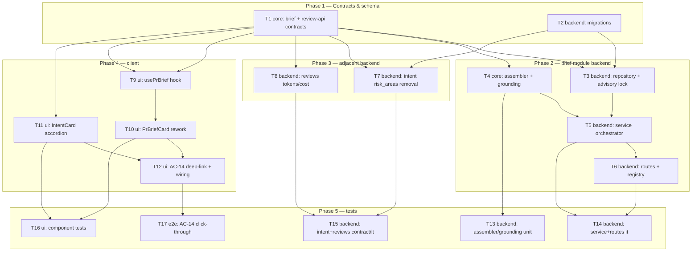

# Implementation Plan: Why+Risk Brief (PR Brief card)

## Overview
Rework the existing (broken) `PrBriefCard` + `usePrBrief` flow into a real **Why+Risk Brief**: a new
`brief` server module owns **POST /pulls/:id/brief**, which gathers already-derived facts (intent,
blast summary, smart-diff group stats, linked issue, Context-Folder specs), makes **exactly one**
structured LLM call, grounds the result against the real path-set, and caches it per-PR by `head_sha`.
The client card renders what/why + a risk-level banner, latest Run-Review metrics (now including
`tokens_in`→`tokens_out`), a Risk Areas accordion inside IntentCard, and a clickable Review-Focus list
that navigates into the code. Sourced from `specs/SPEC-2026-07-07-why-risk-brief.md` (approved,
AC-1..AC-17). No diff bodies are ever sent to the model.

## Execution mode
**multi-agent (parallel)** — mandated by the caller ("non-overlapping owned paths so backend and UI
implementers can run in parallel"). The approved spec has no open questions, so no clarifying round was
needed; the single decision (execution mode) was pre-directed. Tasks are typed (backend / core / ui /
e2e) for dispatch to `implementer-backend` / `implementer-ui`, grouped into phases with an explicit
dependency DAG and **non-overlapping Owned paths** so independent tasks run concurrently on one branch.

## Phased task table (summary)

| ID | Type | Module | Title | Depends-on |
|----|------|--------|-------|-----------|
| T1 | core | shared contracts | Brief/ReviewFocusItem/RiskAreaKind; narrow Risk.kind; remove Intent.risk_areas; delete PrBrief; extend ReviewRecord (tokens/cost) | none |
| T2 | backend | server db | Migrations: add `pr_brief.head_sha`; drop `pr_intent.risk_areas` | none |
| T3 | backend | server/brief | Repository: pr_brief read/upsert by head_sha + per-PR advisory lock | T1, T2 |
| T4 | core | server/brief | Pure helpers: fact assembler (payload, untrusted-wrap, 8k cap) + grounding gate | T1 |
| T5 | backend | server/brief | Service orchestrator: gather facts, 1 LLM call, ground, parse, cache | T3, T4 |
| T6 | backend | server/brief | Routes + registry: POST /pulls/:id/brief (force), error mapping | T5 |
| T7 | backend | server/intent+reviews | Remove risk_areas everywhere; GET intent no longer returns it (AC-16) | T1, T2 |
| T8 | backend | server/reviews | Surface tokens_in/tokens_out/cost_usd on ReviewRecord (AC-11) | T1 |
| T9 | ui | client | Rework `usePrBrief` hook GET→POST + regenerate mutation | T1 |
| T10 | ui | client | Rework PrBriefCard: what/why + risk banner + metrics row + regenerate + review-focus | T1, T9 |
| T11 | ui | client | IntentCard Risk Areas accordion (AC-13) | T1 |
| T12 | ui | client | AC-14 file deep-link into Files tab + OverviewTab/page wiring | T10, T11 |
| T13 | backend | server/brief | Unit tests: assembler payload/8k/no-hunks; grounding | T4 |
| T14 | backend | server/brief | It-tests: service+routes (LLM count, cache, force, fail, concurrency) | T5, T6 |
| T15 | backend | server | Contract/it tests: AC-16 (intent) + AC-11 (reviews tokens) | T7, T8 |
| T16 | ui | client | Component tests: AC-10/12/13/15 + rework PrBriefCard.test fixtures | T10, T11 |
| T17 | e2e | e2e | AC-14 click-through: review-focus → Files tab file highlight | T12 |

<!-- Remaining sections appended below via incremental edits. -->
## Requirements (verified)
Restated from the spec's EARS criteria (AC-1..AC-17; AC-17 sits between AC-12 and AC-13 in the source).
Each is checkable and mapped to a task in the Red-flags check.
- R1 (AC-1): POST /pulls/:id/brief with no cache for the current `head_sha` assembles intent + blast
  summary + smart-diff group stats + linked issue + relevant specs, makes **exactly one** structured LLM
  call, and returns `Brief {what, why, risk_level, risks[], review_focus[]}`. (LLM invocation count = 1.)
- R2 (AC-2): No diff bodies / hunks in the LLM payload — derived facts only (no `@@`, no `+`/`-` rows).
- R3 (AC-3): Assembled input > 8000 tokens -> truncate lowest-priority sections (specs first) so payload <= 8000.
- R4 (AC-4): Any `risks[].file_refs` / `review_focus[].file_refs` naming a file absent from the known-path
  set (Blast union Smart-Diff) is dropped before responding (path-level, no line precision).
- R5 (AC-5): After grounding, a `review_focus` item with no valid `file_ref` is dropped; a `risks` item
  with empty `file_refs` is kept.
- R6 (AC-6): Unchanged `head_sha` + no `force` -> cached Brief, no new LLM call.
- R7 (AC-7): `head_sha` differs from cached -> cache invalid -> regenerate.
- R8 (AC-8): `force` -> new LLM call + overwrite cache even without a `head_sha` change.
- R9 (AC-9): LLM failure -> deterministic error (no stack trace in body); cache not corrupted.
- R10 (AC-10): Client renders the card top block with a banner colour by `risk_level` + the what/why text.
- R11 (AC-11): Where a completed Run Review exists, the client renders latest-review metrics — **all of**
  `findings_count`, `blockers`, `score`, `cost_usd`, `tokens_in`->`tokens_out`. The `reviews` module
  surfaces `tokens_in`/`tokens_out` (from `agent_runs`) onto the metric shape the PR page reads.
- R12 (AC-12): No Run Review yet -> render Brief content + a nudge ("Review not run yet") with a button
  reusing the existing Run Review action, in place of the metrics.
- R13 (AC-17): Generation already in progress for a PR -> no second parallel LLM call; the second request
  waits (Postgres advisory lock by `prId`). Two concurrent POSTs -> LLM count = 1, both get the same Brief.
- R14 (AC-13): `risks[]` render as an accordion inside IntentCard: icon by `kind`, `title`, clickable
  `file_refs`; expanding reveals `explanation`.
- R15 (AC-14): Clicking a `file_ref` in `review_focus` or `risks[].file_refs` switches to the "Files
  changed" tab, scrolls to and highlights the file (and the line if one is specified).
- R16 (AC-15): A dedicated Brief **regenerate** button (distinct from Run Review) sends POST with `force=true`.
- R17 (AC-16): GET /pulls/:id/intent no longer returns `risk_areas`; `Risk.kind` accepts only the
  `RiskAreaKind` enum.

## Open questions & recommendations
No requirement gaps block planning — the spec resolved all seven drafting flags (see *Resolved during
spec review*). The following are **implementation decisions/flags** verified against the codebase; they
do not modify the spec.

- **Rec / flag (edit to existing shared contracts — explicit callout):** T1 is NOT purely additive. It
  **edits** `contracts/brief.ts` (narrow `Risk.kind` free string -> `RiskAreaKind`; remove
  `Intent.risk_areas`; delete composed `PrBrief`) and `contracts/review-api.ts` (add nullable
  `tokens_in`/`tokens_out`/`cost_usd` to `ReviewRecord`). Both are spec-authorized (AC-11, AC-16, "delete
  the composed `PrBrief`"). Applied **lockstep in both vendored mirrors** (server + client). The
  `ReviewRecord` additions are nullable -> non-breaking; the `Risk.kind` narrowing + `PrBrief` deletion
  are intentional breaking changes the spec requires. Flagged here per the hard rule.
- **DECISION (AC-11 metric shape):** the top block reads the latest completed **`review`-kind
  `ReviewRecord`** (via `usePrReviews` -> `GET /pulls/:id/reviews`). `score` is already present;
  `findings` is present (client derives `findings_count` = `findings.length` and `blockers` = count of
  gate-tripping findings). Missing today: `cost_usd`, `tokens_in`, `tokens_out` — these live on
  `agent_runs` (`ReviewRecord.run_id` -> the run row's `costUsd`/`tokensIn`/`tokensOut`). T8 joins
  `agent_runs` in `reviewsForPull`/`reviewToDto`. Chosen over extending `PrMeta` because `PrMeta`'s
  score/cost/findings are **list-endpoint-only**; the PR detail page needs a per-review shape.
- **DECISION (advisory lock — AC-17):** no `pg_advisory*` precedent exists in the repo (new infra, as the
  spec states). Use `pg_advisory_xact_lock(hashtext($prId))` **inside a `db.transaction`** in the
  repository: the lock auto-releases at commit/rollback and stays pinned to the transaction's single
  connection (postgres-js pools — a session lock would need a dedicated connection). Acquire -> **re-read
  cache inside the lock** (double-checked) so the waiter returns the cached Brief with 0 LLM calls.
  Accepted tradeoff for local-first single-instance: the transaction stays open across the LLM call
  (seconds); flagged under Risks.
- **DECIDED (Context-Folder "active-agent attached specs" — user resolution 2026-07-07):** the
  spec wants the `.md` docs attached to the repo's **active review agent**, not every discovered doc.
  `ProjectContextService` exposes `discoverDocuments(wsId, repoId)` + `previewDocument(...)` but **no**
  "attached-to-active-agent" reader. Resolution: **extend `ProjectContextService` with a public
  `readAttachedDocs(wsId, repoId)` method** that resolves the repo's active review agent, reads its
  attached document paths (agent_documents), and returns their contents — T5 owns this addition and
  consumes it, trimming to the residual token budget. Per-doc read failures are skipped; if the repo has
  no active agent or no attachments, specs are simply omitted (spec failure contract: any unavailable
  fact source is omitted, never fatal). Never read all repo docs.
- **Rec / flag (grounding path-set source):** build the known-path set from `BlastRadius`
  (`changed_symbols[].file` union `downstream[].callers[].file`) union `SmartDiff`
  (`groups[].files[].path`). The spec's PROPOSAL to also union `PrDetail.files` is **out of scope**
  (accepted risk: a degraded blast may drop some valid refs).
- **Rec / flag (client barrel):** deleting `PrBrief` from `contracts/brief.ts` breaks
  `client/src/lib/types.ts:35` (`export type { PrBrief, SmartDiff }`). T1 owns that one-line fix so the
  deletion is atomic and client `tsc` stays green. The vendored `index.ts` barrels use `export *`, so they
  need no code change (only a stale comment mentions `PrBrief`).
- **Rec / flag (migrations):** `pr_brief.head_sha` is a pure `ADD COLUMN` and `pr_intent.risk_areas` is a
  `DROP COLUMN` — neither is a rename, so the `db:generate` interactive-rename gate does not apply. The
  0015 snapshot now captures the full schema (`server/INSIGHTS.md` 2026-07-07), so `db:generate` should
  diff cleanly; still verify the generated SQL contains only the intended ALTERs before committing.

## Affected modules & contracts
- **server / brief (new)** — `src/modules/brief/` (routes/service/repository + pure helpers), registered
  in `src/modules/index.ts`. Reads other modules only through public interfaces / `container`.
- **server / intent** — remove `risk_areas` from the prompt, schema-persist, repository, and the GET
  response (AC-16).
- **server / reviews** — surface `tokens_in`/`tokens_out`/`cost_usd` on `ReviewRecord` (AC-11); also drop
  the `risk_areas` field from its hidden intent helper in `repository/pull.repo.ts` + `run-executor.ts`.
- **server / db** — additive `pr_brief.head_sha`; drop `pr_intent.risk_areas`; two migrations.
- **client** — rework `usePrBrief` hook + `PrBriefCard` + `IntentCard`; add AC-14 deep-linking to
  `DiffTab` wired through `page.tsx`/`OverviewTab`; new i18n namespace `prBrief.json`.
- **reviewer-core** — **no change**. `groundFindings()` needs diff hunks (absent by design); the Brief
  grounding gate is a distinct pure path-set check local to the `brief` module.
- **Contracts (both vendored mirrors, lockstep):** `contracts/brief.ts` — add `Brief`, `ReviewFocusItem`,
  `RiskAreaKind`; narrow `Risk.kind`; remove `Intent.risk_areas`; delete `PrBrief`. `contracts/review-api.ts`
  — add nullable `tokens_in`/`tokens_out`/`cost_usd` to `ReviewRecord`. `FeatureModelId "risk_brief"`
  already exists — no change.

## Architecture changes
- `server/src/modules/brief/routes.ts` — Transport. `POST /pulls/:id/brief` (`{ force?: boolean }` body),
  `ZodTypeProvider`; resolve `{ workspaceId }` via `getContext`; map service errors to `5xx { error }`
  with no stack trace (AC-9). Registered before any conflicting literal route in `modules/index.ts`.
- `server/src/modules/brief/service.ts` — Application. Cache check, advisory-locked generation, fact
  gathering via `container` (intent service, `buildBlast(container, wsId, prId)`, `buildSmartDiff(db,
  prId)`, `PrDetail.linked_issue`, `ProjectContextService`), one `container.llm(provider)
  .completeStructured<Brief>` call, grounding gate, `Brief.parse()` re-validation, cache upsert. No
  adapter/SDK imports — interfaces via `container`.
- `server/src/modules/brief/repository.ts` — Infrastructure. Only file touching the `pr_brief` table.
  `read(prId)` returns `{ brief, headSha }`; `upsert(prId, brief, headSha)`; `withPrLock(prId, fn)` wraps a
  `db.transaction` + `pg_advisory_xact_lock(hashtext(prId))`. Also reads `pull_requests.head_sha` for the
  staleness compare (mirrors `pulls/status.ts` `last_reviewed_sha` pattern).
- `server/src/modules/brief/assembler.ts` + `grounding.ts` — pure (Application-pure): payload assembly
  with `wrapUntrusted` + token cap, and the path-set grounding gate. I/O-free; the service passes raw
  facts in.
- `client/.../PrBriefCard/` + `components/IntentCard/` — `"use client"`. Card renders what/why + risk
  banner + metrics row (+ AC-12 nudge) + regenerate + review-focus list; IntentCard gains the Risk Areas
  accordion. `DiffTab` gains a `focusFile?: { path; line? }` prop; `page.tsx` threads it from a
  review-focus/risk click (new `?file`/`?line` params) after switching to the Files tab.

## Phased tasks

### Phase 1 — Contracts & schema (T1, T2 run concurrently)

- **T1**
  - **Action:** In `contracts/brief.ts` (both mirrors): add `RiskAreaKind = z.enum(['security',
    'dependency','performance','data','api_change','other'])`; **narrow** `Risk.kind` from `z.string()`
    to `RiskAreaKind`; add `ReviewFocusItem = { label: string; file_refs: string[] }`; add `Brief = {
    what: string; why: string; risk_level: z.enum(['low','medium','high']); risks: Risk[]; review_focus:
    ReviewFocusItem[] }`; **remove** `risk_areas` from `Intent`; **delete** the composed `PrBrief`
    (and, if left unused after deletion, leave `Risks`/`PrHistory` untouched — out of scope). Export
    schemas + inferred types. In `contracts/review-api.ts` (both mirrors): add nullable
    `tokens_in: z.number().int().nullable()`, `tokens_out: z.number().int().nullable()`,
    `cost_usd: z.number().nullable()` to `ReviewRecord`. Fix `client/src/lib/types.ts:35` to drop the
    `PrBrief` re-export. Do not add `.min()` constraints to `Brief` arrays (0 risks / 0 review_focus are
    valid edge cases).
  - **Module:** shared contracts (server + client) · **Type:** core
  - **Skills to use:** `zod`, `typescript-expert`
  - **Owned paths:** `server/src/vendor/shared/contracts/brief.ts`,
    `client/src/vendor/shared/contracts/brief.ts`, `server/src/vendor/shared/contracts/review-api.ts`,
    `client/src/vendor/shared/contracts/review-api.ts`, `client/src/lib/types.ts`
  - **Depends-on:** none
  - **Covers:** AC-1/AC-4/AC-5 (Brief + ReviewFocus shape), AC-11 (ReviewRecord fields), AC-16 (Risk.kind
    enum + Intent.risk_areas removal)
  - **Risk:** medium
  - **Known gotchas:** vendored shared is **two hand-maintained copies, not auto-synced** — edit both in
    lockstep; adding to one only breaks the other package's `tsc` (`server/INSIGHTS.md` 2026-06-14).
    Narrowing `Risk.kind` and removing `Intent.risk_areas` will surface `tsc` errors in consumers
    (`IntentCard.tsx:114`, `intent`/`reviews` modules, `PrBriefCard`) — those are fixed in T7/T10/T11, so
    T1's own gate is `tsc` on the contract files plus the `lib/types.ts` fix only.
  - **Acceptance:** `Brief`, `ReviewFocusItem`, `RiskAreaKind` importable from `@devdigest/shared` in both
    packages; `PrBrief` no longer exported; `ReviewRecord.parse()` accepts an object with null token/cost
    fields. (Full-package `tsc` goes green once T7/T10/T11 land.)

- **T2**
  - **Action:** In `server/src/db/schema/reviews.ts`: add `headSha: text('head_sha')` (nullable) to the
    `prBrief` table (PK stays `prId`); **remove** the `riskAreas: jsonb('risk_areas')` column from the
    `prIntent` table. Run `npm run db:generate` to emit one/two migrations (ADD COLUMN on `pr_brief`,
    DROP COLUMN on `pr_intent`). Verify the generated SQL contains only those ALTERs and that
    `meta/_journal.json` advanced.
  - **Module:** server · **Type:** backend
  - **Skills to use:** `drizzle-orm-patterns`, `postgresql-table-design`
  - **Owned paths:** `server/src/db/schema/reviews.ts`, `server/src/db/migrations/` (new migration files +
    `meta/_journal.json`/snapshot entries only)
  - **Depends-on:** none
  - **Covers:** AC-6/AC-7 (head_sha storage), AC-16 (risk_areas column drop)
  - **Known gotchas:** the `db:generate` TTY-rename prompt applies only to renames — these are pure
    add/drop, so safe; the 0015 snapshot captures the full schema so the historical re-detection issue is
    resolved (`server/INSIGHTS.md` 2026-07-07). A running dev server does NOT auto-apply migrations — a
    manual `npm run db:migrate` is needed before the routes work (note for verification, not this task).
  - **Acceptance:** migration file(s) exist with the additive `head_sha` and the `risk_areas` drop;
    `cd server && npx tsc --noEmit` passes (schema import compiles).

### Phase 2 — brief module backend (T3, T4 concurrent; then T5; then T6)

- **T3**
  - **Action:** Implement `modules/brief/repository.ts` — the only file touching `pr_brief`. `read(prId)`
    -> `{ brief: Brief | null; headSha: string | null }` (JSON parsed to `Brief`); `currentHead(prId)`
    reads `pull_requests.head_sha`; `upsert(prId, brief, headSha)` writes `{ json, head_sha }`;
    `withPrLock<T>(prId, fn)` opens a `db.transaction`, runs
    `SELECT pg_advisory_xact_lock(hashtext($prId))`, then `fn(tx)` (lock releases on commit/rollback).
    Document that a NULL `head_sha` (legacy row) is treated by the service as a cache miss.
  - **Module:** server · **Type:** backend
  - **Skills to use:** `drizzle-orm-patterns`, `onion-architecture`, `postgresql-table-design`
  - **Owned paths:** `server/src/modules/brief/repository.ts`
  - **Depends-on:** T1, T2
  - **Covers:** AC-6/AC-7 (cache read/compare), AC-9 (upsert only on success -> cache uncorrupted), AC-17
    (advisory lock primitive)
  - **Known gotchas:** advisory locks take a bigint key — hash the uuid via `hashtext(prId)`. Keep the
    lock inside the transaction so it pins to one connection (postgres-js pools). `pr_brief` was
    write-less before this task; tolerate a NULL `head_sha` on read.
  - **Acceptance:** compiles; exercised by T14 (cache hit/miss by head_sha; two concurrent locked calls
    serialize).

- **T4**
  - **Action:** Implement `modules/brief/assembler.ts` + `modules/brief/grounding.ts` (pure, I/O-free).
    `assembler`: given the collected facts (intent text, blast summary, smart-diff per-group stats, linked
    issue metadata, spec texts), build the single structured user message in **priority order** (intent,
    blast, smart-diff, issue, specs). Wrap every third-party region (PR/issue body, spec text, intent
    text) with `wrapUntrusted` from `platform/prompt.js` as **data, never instructions** (AC-7-style).
    Include **no** hunk lines — only summaries/stats (AC-2). Estimate tokens (chars/4, the project
    pattern) and, if > 8000, drop lowest-priority sections **specs-first** until <= 8000 (AC-3). Expose the
    known-path set builder (Blast union Smart-Diff). `grounding`: given the LLM `Brief` + the known-path
    set, drop any `file_ref` whose path (strip `:line` suffix) is not in the set (AC-4); then drop
    `review_focus` items left with no `file_ref`, **keep** `risks` items with empty `file_refs` (AC-5).
  - **Module:** server · **Type:** core (pure)
  - **Skills to use:** `security`, `typescript-expert`, `zod`
  - **Owned paths:** `server/src/modules/brief/assembler.ts`, `server/src/modules/brief/grounding.ts`
  - **Depends-on:** T1
  - **Covers:** AC-2, AC-3, AC-4, AC-5, AC-7 (untrusted wrapping)
  - **Known gotchas:** use server `platform/prompt.js` `wrapUntrusted` (as `intent/service.ts:3` does),
    NOT the reviewer-core copy. `file_refs` may carry a `:line`/`:line-range` suffix — grounding compares
    the **path portion** only. reviewer-core `groundFindings()` is not usable here (needs hunks).
  - **Acceptance:** unit-covered in T13 — payload contains no `@@`/`+`/`-` body rows (AC-2); an inflated
    specs fixture yields <= 8000 tokens with specs dropped first (AC-3); a hallucinated ref is stripped
    (AC-4); an emptied review_focus item is dropped while an empty-refs risk is kept (AC-5); `tsc` passes.

- **T5**
  - **Action:** Implement `modules/brief/service.ts`. (1) Resolve `{ workspaceId }`; look up the PR
    (reuse an existing repo/`PrDetail` path) for `head_sha` + `linked_issue`. (2) `withPrLock(prId, ...)`;
    **inside the lock re-read cache** — unless `force`, if `stored.headSha === currentHead` (non-NULL)
    return the cached `Brief` with **zero** LLM calls (AC-6). (3) Gather facts deterministically, each
    best-effort (omit on failure, never throw): intent via the intent service; blast via
    `buildBlast(container, workspaceId, prId, log)`; smart-diff via `buildSmartDiff(container.db, prId)`;
    linked issue from `PrDetail.linked_issue`; specs via a **new public
    `ProjectContextService.readAttachedDocs(wsId, repoId)`** (T5 adds it: resolve the repo's active
    review agent -> read its attached document paths -> return contents; trimmed to residual budget;
    omitted when no active agent / no attachments / per-doc read failure — see Open questions, DECIDED).
    **Zero LLM calls in this stage** (AC-3 cost). (4) Build the known-path set + assemble the payload
    (T4). (5) Resolve the model via `resolveFeatureModel(container, workspaceId, 'risk_brief')` and make
    **exactly one** `container.llm(provider).completeStructured<Brief>({ model, schema: Brief,
    schemaName: 'Brief', messages })` (AC-1/AC-2). (6) On LLM failure, throw a deterministic error and
    leave the cache intact (AC-9). (7) Run the grounding gate (T4) on the result (AC-4/AC-5). (8)
    **Re-validate with `Brief.parse()` before caching** — trust boundary for untrusted-derived LLM output,
    mirroring `intent/service.ts:117`; a parse failure is treated like an LLM failure (error, cache
    intact). (9) `upsert(prId, brief, currentHead)` then return. `force` skips the cache read but still
    takes the lock and upserts (AC-8). No adapter/SDK imports — interfaces via `container`.
  - **Module:** server · **Type:** backend
  - **Skills to use:** `onion-architecture`, `security`, `typescript-expert`, `fastify-best-practices`
  - **Owned paths:** `server/src/modules/brief/service.ts`, the `ProjectContextService` service file
    (add `readAttachedDocs(wsId, repoId)` only — no other context-module changes)
  - **Depends-on:** T3, T4
  - **Covers:** AC-1, AC-2, AC-3, AC-6, AC-7, AC-8, AC-9, AC-17
  - **Known gotchas:** `buildBlast` signature is `(container, workspaceId, prId, log?)` and throws
    `NotFoundError` itself; `buildSmartDiff(db, prId)` takes the db handle. Reach every other module only
    via `container` / its public function — never import another module's internals (onion rule). Fact
    collection must never throw — degrade each failing source to omitted. The post-grounding `Brief.parse()`
    is mandatory. Keep the LLM call inside the advisory-locked transaction so AC-17 holds.
  - **Acceptance:** compiles; behaviours verified by T14 (LLM count 1 fresh / 0 on head_sha-match / 1 on
    force; malformed structured output -> error + cache intact; two parallel -> 1 identical result).

- **T6**
  - **Action:** Implement `modules/brief/routes.ts` (default Fastify plugin, `ZodTypeProvider`): `POST
    /pulls/:id/brief` with body `{ force?: boolean }`, response `200 -> Brief`. Resolve `{ workspaceId }`
    via `getContext(container, req)`. Map a service/LLM failure to `5xx { error: string }` with **no
    stack trace** (AC-9). Register the module in `src/modules/index.ts` (one import + one registry entry).
  - **Module:** server · **Type:** backend
  - **Skills to use:** `fastify-best-practices`, `zod`, `onion-architecture`
  - **Owned paths:** `server/src/modules/brief/routes.ts`, `server/src/modules/index.ts`
  - **Depends-on:** T5
  - **Covers:** AC-1 (endpoint surface), AC-8 (force via body), AC-9 (error mapping)
  - **Known gotchas:** register the module without shadowing existing `/pulls/:id/*` routes; the body is a
    single optional `force` flag (a body-less POST is valid). No logic/DB/SDK in the route — delegate to
    the service (onion transport rule).
  - **Acceptance:** app boots with the module registered; T14 asserts POST returns a Brief and a forced
    LLM error returns `5xx { error }` with no stack trace.

### Phase 3 — adjacent backend (T7, T8 concurrent; different files in the reviews module)

- **T7**
  - **Action:** Remove `risk_areas` end-to-end. In `intent/service.ts`: drop the `"risk_areas"` clause
    from `SYSTEM_PROMPT` and the `riskAreas` field from the `repo.upsert(...)` call. In `intent/routes.ts`:
    remove `risk_areas` from the GET response mapping (lines ~33, ~53) so `GET /pulls/:id/intent` no longer
    returns it (AC-16). In `intent/repository.ts`: drop the `riskAreas` field from the upsert type + values.
    In `reviews/run-executor.ts:117` and `reviews/repository/pull.repo.ts` (~57/66/79): remove the
    `risk_areas`/`riskAreas` field (the hidden intent helper mirrors the `Intent` shape — easy to miss).
    `Intent.parse(result.data)` stays (untrusted-derived, re-validated at persist).
  - **Module:** server · **Type:** backend
  - **Skills to use:** `typescript-expert`, `zod`, `onion-architecture`
  - **Owned paths:** `server/src/modules/intent/service.ts`, `server/src/modules/intent/routes.ts`,
    `server/src/modules/intent/repository.ts`, `server/src/modules/reviews/run-executor.ts`,
    `server/src/modules/reviews/repository/pull.repo.ts`
  - **Depends-on:** T1 (Intent contract change), T2 (column drop)
  - **Covers:** AC-16 (intent no longer returns risk_areas)
  - **Known gotchas:** `reviews/repository/pull.repo.ts` holds hidden `upsertIntent`/`getIntent` helpers
    that mirror the `Intent` shape — they must be updated alongside the contract or `tsc` fails
    (`server/INSIGHTS.md` 2026-06-25). Does NOT touch `reviews/helpers.ts` or `reviews/service.ts` (owned
    by T8) — no overlap.
  - **Acceptance:** `cd server && npx tsc --noEmit` passes; verified by T15 (GET intent response has no
    `risk_areas`).

- **T8**
  - **Action:** Surface latest-run metrics on `ReviewRecord` (AC-11). In `reviews/service.ts`
    `reviewsForPull(...)`: for each review with a `run_id`, fetch the `agent_runs` row's `costUsd`,
    `tokensIn`, `tokensOut` (one `inArray` over the run ids, JS-joined — same shape as the existing
    per-PR aggregate pattern). In `reviews/helpers.ts` `reviewToDto(...)` (+ the `ReviewDto` type +
    `ReviewRow`): add `cost_usd`, `tokens_in`, `tokens_out` (nullable). `findings_count`/`blockers` are
    derived client-side from `findings[]` — not added here.
  - **Module:** server · **Type:** backend
  - **Skills to use:** `drizzle-orm-patterns`, `onion-architecture`, `typescript-expert`
  - **Owned paths:** `server/src/modules/reviews/service.ts`, `server/src/modules/reviews/helpers.ts`
  - **Depends-on:** T1 (ReviewRecord fields)
  - **Covers:** AC-11 (reviews module surfaces tokens_in/tokens_out/cost_usd)
  - **Known gotchas:** `agent_runs` carries `costUsd` (doublePrecision), `tokensIn`, `tokensOut`
    (`db/schema/runs.ts:19-23`); `ReviewRow.run_id` is the join key and may be null (leave metrics null).
    Reads `db/schema` from the service — that is existing known onion `warn` drift for `reviews`, do not
    introduce a NEW cross-module import. Does NOT touch `run-executor.ts` or `pull.repo.ts` (owned by T7).
  - **Acceptance:** `cd server && npx tsc --noEmit` passes; verified by T15 (a completed review carries
    non-null tokens/cost from its run).

### Phase 4 — client (T9 -> T10; T11 parallel; then T12)

- **T9**
  - **Action:** Rework `client/src/lib/hooks/brief.ts`: change `usePrBrief` from `api.get<PrBrief>(GET
    /pulls/:id/brief)` to `api.post<Brief>('/pulls/:id/brief', { force?: false })` typed against `Brief`
    from `@devdigest/shared`; keep the `["brief", prId]` query key. Add a `useRegenerateBrief(prId)`
    mutation that POSTs `{ force: true }` and invalidates/sets `["brief", prId]`. Keep `retry: false`.
    Leave `usePrBlast`/`usePrWhy` untouched.
  - **Module:** client · **Type:** ui
  - **Skills to use:** `react-best-practices`, `frontend-architecture`, `next-best-practices`, `typescript-expert`
  - **Owned paths:** `client/src/lib/hooks/brief.ts`
  - **Depends-on:** T1
  - **Covers:** AC-1/AC-8/AC-15 (client data path + force)
  - **Known gotchas:** the query hook now issues a POST — TanStack `useQuery` `queryFn` may POST, but a
    body-less/`{force:false}` POST must stay idempotent server-side (it is: cache hit returns without a
    new LLM call). All API access + query keys live in `lib/` per project rule.
  - **Acceptance:** `cd client && npx tsc --noEmit` passes; `usePrBrief` returns `Brief`; regenerate
    mutation posts `force:true`.

- **T10**
  - **Action:** Rework `PrBriefCard/` to the new `Brief`. Remove the old Intent/Blast/History blocks.
    Render: a top block coloured by `risk_level` (map high/medium/low to `--crit`/`--warn`/`--ok` tokens)
    with the `what`/`why` text (AC-10); a **metrics row** beside it from the latest completed `review`-kind
    record (`usePrReviews`) — `findings_count` (= findings.length), `blockers`, `score`, `cost_usd`,
    `tokens_in`->`tokens_out` (AC-11), reusing `formatCost` from `lib/cost.ts`; when no completed review
    exists, an AC-12 nudge ("Review not run yet") with a button reusing the existing Run Review action; a
    **Review Focus** list where each item's `file_refs` are clickable (calls an `onOpenFile({path, line?})`
    prop — navigation itself lands in T12); a dedicated **Regenerate** button wired to `useRegenerateBrief`
    (disabled while in flight; AC-15). Loading = skeleton consistent with the existing card; error = message
    with retry via regenerate (AC-9 client). Add a new i18n namespace `messages/en/prBrief.json` (no
    hardcoded strings). Rework `constants.ts`/`styles.ts`/`index.ts` accordingly; do NOT touch
    `PrBriefCard.test.tsx` (owned by T16).
  - **Module:** client · **Type:** ui
  - **Skills to use:** `react-best-practices`, `frontend-architecture`, `next-best-practices`, `typescript-expert`
  - **Owned paths:** `client/src/app/repos/[repoId]/pulls/[number]/_components/PrBriefCard/PrBriefCard.tsx`,
    `.../PrBriefCard/constants.ts`, `.../PrBriefCard/styles.ts`, `.../PrBriefCard/index.ts`,
    `client/messages/en/prBrief.json`
  - **Depends-on:** T1, T9
  - **Covers:** AC-10, AC-11 (render), AC-12, AC-15; feeds AC-14 via `onOpenFile`
  - **Known gotchas:** design tokens are `--ok`/`--warn`/`--crit` (no `--green`/`--red`/`--amber`), spin is
    `ddspin` (`client/vendor/ui/styles.css`). `user-event` is NOT installed — component tests use
    `fireEvent` (T16). `formatCost` distinguishes null ("—") from 0 ("$0.00"). Verify icon names against
    `vendor/ui/icons.tsx` (wrong name renders nothing). Relative import depth from this dir to `lib/` is
    SEVEN levels — copy a neighbour's import depth, don't count (`client/INSIGHTS.md` 2026-07-05).
  - **Acceptance:** `cd client && npx tsc --noEmit` passes; card renders what/why + banner + metrics when
    data exists and the AC-12 nudge when no review exists; covered by T16.

- **T11**
  - **Action:** In `components/IntentCard/IntentCard.tsx`, **replace** the current
    `intent.risk_areas`-driven block (lines ~114-119, now removed from the contract) with a **Risk Areas
    accordion** fed by a new `risks?: Risk[]` prop: each item shows an icon by `kind`, the `title`, and
    clickable `file_refs` (calls an `onOpenFile({path, line?})` prop); expanding an item reveals its
    `explanation` (AC-13). Render nothing when `risks` is empty/undefined (edge case: 0 risks hides the
    section). Update `styles.ts`; do NOT touch the IntentCard test (owned by T16).
  - **Module:** client · **Type:** ui
  - **Skills to use:** `react-best-practices`, `frontend-architecture`, `typescript-expert`
  - **Owned paths:** `client/src/components/IntentCard/IntentCard.tsx`, `client/src/components/IntentCard/styles.ts`
  - **Depends-on:** T1
  - **Covers:** AC-13; consumed by AC-14 via `onOpenFile`
  - **Known gotchas:** removing the `intent.risk_areas` block is REQUIRED — T1 deletes that field, so
    leaving it breaks `tsc`. IntentCard is a shared `src/components/` component imported by `OverviewTab`;
    it must accept `risks` + `onOpenFile` as props (OverviewTab passes them in T12) rather than fetch the
    Brief itself. Icon names must exist in `vendor/ui/icons.tsx`.
  - **Acceptance:** `cd client && npx tsc --noEmit` passes; accordion renders per-risk with expand -> 
    explanation; empty risks hides the section; covered by T16.

- **T12**
  - **Action:** Wire AC-14 file navigation. Add a `focusFile?: { path: string; line?: number }` prop to
    `DiffTab` (and thread to its `DiffViewer`/`SmartDiffViewer`) that scrolls to and highlights the file
    (and the line when present); DiffTab currently has NO file/line deep-link (`client/INSIGHTS.md`
    2026-07-06). In `page.tsx`: add `?file`/`?line` params (mirroring the existing `?finding` deep-link
    pattern that forces a tab), a handler `onOpenFile({path, line?})` that switches to the "Files changed"
    tab and sets the params, and pass `focusFile` into DiffTab. In `OverviewTab.tsx`: thread
    `onOpenFile` into `PrBriefCard` (review_focus + risk clicks) and pass `brief.risks` + `onOpenFile` into
    `IntentCard`. Add any new i18n keys to `prBrief.json` (owned by T10 — coordinate; T12 consumes).
  - **Module:** client · **Type:** ui
  - **Skills to use:** `react-best-practices`, `frontend-architecture`, `next-best-practices`, `typescript-expert`
  - **Owned paths:** `client/src/app/repos/[repoId]/pulls/[number]/page.tsx`,
    `client/src/app/repos/[repoId]/pulls/[number]/_components/DiffTab/` (DiffTab.tsx + colocated helpers),
    `client/src/app/repos/[repoId]/pulls/[number]/_components/OverviewTab/OverviewTab.tsx`
  - **Depends-on:** T10, T11
  - **Covers:** AC-14 (+ wires AC-13/AC-15 review-focus/risk clicks into navigation)
  - **Known gotchas:** deep-linking precedent: `navigateToFinding` sets tab+param in ONE `router.replace`
    to avoid double navigation (`client/INSIGHTS.md` 2026-06-25); PR detail tabs need only header-array +
    page-branch touch points (no VALID_TABS gate). `file_ref` may lack a `:line` (scroll to file, skip
    line highlight — edge case). Two SmartDiffViewer copies exist — DiffTab imports the enhanced
    `@/components/SmartDiffViewer` (`client/INSIGHTS.md` 2026-06-30).
  - **Acceptance:** `cd client && npx tsc --noEmit` passes; clicking a review-focus/risk file switches to
    Files tab and highlights the file; covered by the T17 E2E.

### Phase 5 — tests derived from AC observables (test tasks own only `*.test.*` files)

> Lean scope per the caller: prioritise the unit/it tests that gate ACs (payload/grounding/cache,
> LLM-call counter, concurrent POSTs) over exhaustive coverage. Test tasks own only test files, so they
> never collide with implementation owned paths.

- **T13**
  - **Action:** Unit tests for the pure helpers, asserting AC observables directly: AC-2 (assembled payload
    contains no `@@`/`+`/`-` body rows), AC-3 (an inflated-specs fixture -> measured payload <= 8000 tokens
    with specs dropped first), AC-4 (a hallucinated `file_ref` is stripped), AC-5 (an emptied `review_focus`
    item dropped; an empty-`file_refs` `risk` kept), AC-7 (each untrusted region is delimited/wrapped).
  - **Module:** server · **Type:** backend
  - **Skills to use:** `typescript-expert`, `zod`
  - **Owned paths:** `server/src/modules/brief/assembler.test.ts`, `server/src/modules/brief/grounding.test.ts`
  - **Depends-on:** T4
  - **Covers:** AC-2, AC-3, AC-4, AC-5, AC-7
  - **Acceptance:** `cd server && npx vitest run src/modules/brief/assembler src/modules/brief/grounding` green.

- **T14**
  - **Action:** Integration tests for service + routes using the no-DB smoke pattern (minimal mock `db` +
    injected `llm` mock via `ContainerOverrides`, with an **LLM invocation counter**), asserting: AC-1 (200
    + Brief; LLM count = 1 fresh), AC-6 (second POST same head_sha -> LLM count 0, cached Brief), AC-7
    (head_sha change -> regenerate), AC-8 (`force` twice -> both fresh LLM calls), AC-9 (forced LLM error ->
    `5xx { error }` no stack trace, cache unchanged; malformed structured output failing `Brief.parse()` ->
    error + cache unchanged), AC-17 (two concurrent POSTs -> LLM count = 1, both receive the same Brief).
  - **Module:** server · **Type:** backend
  - **Skills to use:** `fastify-best-practices`, `typescript-expert`
  - **Owned paths:** `server/src/modules/brief/service.test.ts`, `server/src/modules/brief/routes.test.ts`
  - **Depends-on:** T5, T6
  - **Covers:** AC-1, AC-6, AC-7, AC-8, AC-9, AC-17
  - **Known gotchas:** `buildApp` connects to postgres lazily so a minimal mock `db` needs no real Postgres,
    but the advisory-lock `db.transaction` + raw `pg_advisory_xact_lock` must be stubbed on the mock db
    (or the concurrency test drives two real serialized calls through an injected lock stub); any injected
    interface mock must implement all methods it touches or `tsc` fails (`server/INSIGHTS.md` 2026-07-05).
  - **Acceptance:** `cd server && npx vitest run src/modules/brief` green.

- **T15**
  - **Action:** Contract/it tests for the two adjacent changes: AC-16 — `GET /pulls/:id/intent` response no
    longer contains `risk_areas`, and a `Risk` with an out-of-enum `kind` fails `Risk.parse()`; AC-11 — a
    completed `review`-kind `ReviewRecord` from `reviewsForPull` carries non-null `tokens_in`/`tokens_out`/
    `cost_usd` sourced from its `agent_runs` row.
  - **Module:** server · **Type:** backend
  - **Skills to use:** `typescript-expert`, `fastify-best-practices`
  - **Owned paths:** `server/src/modules/intent/intent.contract.test.ts`,
    `server/src/modules/reviews/reviews-metrics.test.ts`
  - **Depends-on:** T7, T8
  - **Covers:** AC-11 (contract carries tokens for a completed run), AC-16 (intent + Risk.kind enum)
  - **Acceptance:** `cd server && npx vitest run src/modules/intent src/modules/reviews/reviews-metrics` green.

- **T16**
  - **Action:** Component tests (RTL + Vitest, MSW for the API, `fireEvent` — user-event is not installed):
    AC-10 (banner colour by risk_level + what/why text), AC-11 (all five metric fields render for a
    completed review), AC-12 (no review -> nudge + Run Review button), AC-13 (Risk Areas accordion: icon +
    title + clickable refs; expand -> explanation; 0 risks hides section), AC-15 (Regenerate button posts
    force=true and is disabled while in flight). **Rework** `PrBriefCard.test.tsx` fixtures from the old
    composed `PrBrief` to the new `Brief` shape (spec: delete the composed type's client test).
  - **Module:** client · **Type:** ui
  - **Skills to use:** `react-testing-library`
  - **Owned paths:**
    `client/src/app/repos/[repoId]/pulls/[number]/_components/PrBriefCard/PrBriefCard.test.tsx`,
    `client/src/components/IntentCard/IntentCard.test.tsx`
  - **Depends-on:** T10, T11
  - **Covers:** AC-10, AC-11 (render), AC-12, AC-13, AC-15
  - **Known gotchas:** use `fireEvent`, not `userEvent.setup()` (`client/INSIGHTS.md` 2026-07-06); jsdom
    lacks `ResizeObserver` — stub it if any child measures layout. Assert by role/text, not CSS class.
  - **Acceptance:** `cd client && npx vitest run src/app/repos/[repoId]/pulls/[number]/_components/PrBriefCard
    src/components/IntentCard` green.

- **T17**
  - **Action:** One deterministic E2E (agent-browser JSON spec, no LLM) for AC-14: open a PR with a Brief,
    click a `review_focus` (or risk) `file_ref`, assert the UI switches to the "Files changed" tab and the
    target file is scrolled into view / highlighted.
  - **Module:** e2e · **Type:** e2e
  - **Skills to use:** (e2e JSON flow — no code skills)
  - **Owned paths:** `e2e/specs/brief-review-focus-click.json` (+ registration in the spec index if one exists)
  - **Depends-on:** T12
  - **Covers:** AC-14
  - **Known gotchas:** e2e specs are deterministic browser flows driven by JSON via `run.ts`; no LLM calls.
    Seed/select a PR that already has a cached Brief so the flow is deterministic.
  - **Acceptance:** the E2E flow passes via the e2e runner (`e2e` `run.ts`).

## Testing strategy
- **Backend unit (pure helpers):** `cd server && npx vitest run src/modules/brief/assembler
  src/modules/brief/grounding` — oracle = AC-2/3/4/5/7 observables (T13).
- **Backend integration (service+routes):** `cd server && npx vitest run src/modules/brief` — no-DB smoke
  pattern with mock `db` + injected `llm` mock + LLM-call counter + stubbed advisory lock; asserts
  LLM-call counts, cache/head_sha behaviour, force, error/parse-failure, concurrency (T14).
- **Backend contract/it (adjacent):** `cd server && npx vitest run src/modules/intent
  src/modules/reviews/reviews-metrics` — AC-16 (no risk_areas, Risk.kind enum) + AC-11 (tokens on a
  completed review) (T15).
- **Client component:** `cd client && npx vitest run <PrBriefCard> <IntentCard>` — RTL + MSW +
  `fireEvent`; card/metrics/nudge/accordion/regenerate flows (T16).
- **E2E:** the `e2e` runner for the AC-14 click-through (T17).
- **Typecheck (every task's gate):** `cd server && npx tsc --noEmit`; `cd client && npx tsc --noEmit`.
- **Onion boundary (backend):** by source inspection — service imports only via `container`; only
  `repository.ts` touches `pr_brief`; no NEW cross-module import. (`npm run depcruise` does not exist yet —
  `server/INSIGHTS.md` 2026-07-07.)
- **Migrations:** after the schema commit, run `cd server && npm run db:migrate` before the routes work
  (a running dev server does not auto-apply — `server/INSIGHTS.md` 2026-07-07).

## Risks & mitigations
- **Advisory lock held across the LLM call** (transaction open for seconds) -> accepted for local-first
  single-instance DevDigest; the double-checked cache read inside the lock keeps the common path cheap.
  A multi-instance deployment keeps working (Postgres advisory locks are cluster-wide) but the long
  transaction is the tradeoff. (T3/T5)
- **Active-agent attached specs retrieval (DECIDED)** — `ProjectContextService` had no
  attached-to-active-agent reader; T5 adds a public `readAttachedDocs(wsId, repoId)` method and consumes
  it. Specs are omitted (spec failure contract) when there is no active agent / no attachments / a
  per-doc read fails; never read all repo docs. Does not block the other facts. (T5)
- **Degraded blast narrows the grounding path-set** -> some valid refs may be dropped (spec's accepted
  risk; the PROPOSAL to also union `PrDetail.files` is out of scope). (T4/T5)
- **Malformed LLM structured output could poison the cache** -> T5 re-parses with `Brief.parse()` after
  grounding, before upsert (trust boundary, mirrors `intent/service.ts:117`); failure -> error, cache
  intact. (T5)
- **Untrusted third-party text** (PR body, issue body, spec text, persisted intent text) -> wrapped via
  `wrapUntrusted` as data, never instructions; grounding gate is the mandatory second barrier. (T4)
- **Vendored shared drift** (two hand-maintained mirrors) -> T1 edits both in lockstep; per-package `tsc`
  is the gate; the `Risk.kind` narrowing + `Intent.risk_areas` removal ripple into T7/T10/T11 which land
  in the same run. (T1)
- **`reviews` module already has onion `warn` drift** (service touches `db/schema`) -> T8 stays within the
  existing drift (no NEW cross-module edge); T7/T8 own disjoint files in the reviews module. (T7/T8)
- **AC-14 requires new DiffTab deep-linking** (none exists today) -> scoped to T12 with the existing
  `?finding` deep-link pattern as precedent; `file_ref` without a line degrades to file-only highlight.
- **i18n `prBrief.json` shared by T10/T11/T12** -> owned/written by T10; T11/T12 consume keys (a missing
  key renders the raw key, not an error). (T10)
- **Migrations not auto-applied by a running dev server** -> flagged in Testing strategy; `npm run
  db:migrate` after the schema commit. (T2)

## Red-flags check
- [x] Every requirement (AC-1..AC-17) maps to a task (see Requirements + per-task Covers)
- [x] Every AC-N is covered by at least one task's `Covers` and at least one test task (T13-T17)
- [x] No specification was authored or edited — the approved spec is input; the only file written is this
      plan under `docs/plans/`
- [x] Execution mode recorded (multi-agent) and the plan is shaped for it (typed tasks, phases,
      non-overlapping Owned paths, DAG)
- [x] Dependencies form a DAG (no cycles) — see the Mermaid graph
- [x] Concurrent tasks have non-overlapping Owned paths (T1/T2; T3/T4; T7/T8 own disjoint reviews-module
      files; T10/T11 own separate component dirs; T12 owns page/DiffTab/OverviewTab; test tasks own only
      `*.test.*` files)
- [x] Every Acceptance is measurable (a runnable command or an AC observable)
- [x] Edits to existing shared contracts are called out explicitly (T1: `Risk.kind` narrowing,
      `Intent.risk_areas` + `PrBrief` removal, `ReviewRecord` nullable additions) with spec authorization
- [x] Active-agent spec-retrieval path DECIDED (user, 2026-07-07): T5 adds
      `ProjectContextService.readAttachedDocs(wsId, repoId)`; safe degrade (omit specs) kept
