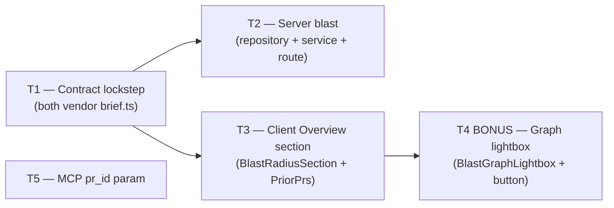

# Plan: Blast Radius v2
> Status: READY
> Date: 2026-07-05
> Author: planner agent

## Overview

Extend the existing Blast Radius feature (v1) with four improvements: server-side prior-PR
discovery (a Drizzle query joining `pull_requests` × `pr_files` on changed paths), a Blast
Radius section on the PR **Overview tab** (summary counters + per-symbol expandable accordion
+ prior-PRs accordion at the bottom), a bonus force-free SVG graph lightbox, and an optional
`pr_id` shortcut parameter on the MCP tool for inspector-friendly demos. No new DB tables,
no LLM calls, no changes to migrations.

---

## Key decisions

| Topic | Decision | Rationale |
|---|---|---|
| Graph visualization | Hand-rolled static layered SVG (symbols → callers/endpoints columns, cubic-bezier edges). **No d3.** | Client has no d3 dep; adding `d3-force` would add ~50 KB for a single bonus feature. Small blast datasets fit a deterministic column layout. |
| Graph edge correctness | Edges derived from `blast.downstream` grouping — each `DownstreamImpact` links its symbol to its own callers and `endpoints_affected`. | Fixes the yudbox defect where ALL endpoints were linked to the first symbol node via `nodes.find(n => n.kind === "symbol")`. |
| Caller click in Overview card | `githubBlobUrl` (same as BlastTab). | DiffTab does **not** read `?file=`/`?line=` query params — in-app deep-linking is impossible without a DiffTab enhancement. Noted under Risks. |
| BlastTab | Unchanged. Overview card calls `usePrBlast` with the same `["blast", prId]` query key — no extra fetch. | Avoids duplication; the Tab is the full-detail view, the Overview card is compact. |
| MCP `prior_prs` | Flows through automatically (tool returns full `BlastRadius` object). | No MCP-specific mapping needed. |
| MCP `pr_id` param | Add `pr_id: z.string().uuid().optional()`; when provided, skip `resolvePullId` and call `client.getBlast(pr_id)` directly. Validate that exactly one of `(repo + pr)` or `pr_id` is provided. | Instructor demo flow: paste internal UUID from `/pulls` network response into MCP Inspector. |

---

## Requirements → Task coverage

### Core requirements

| Requirement | Task(s) |
|---|---|
| Prior PRs touching the same files — `selectDistinct` join, exclude current PR, order by `openedAt desc`, limit 5 | T1, T2 |
| Contract extension: `PriorPr` schema + `prior_prs: z.array(PriorPr).optional()` on `BlastRadius` in BOTH vendored copies, snake_case field names | T1 |
| Blast Radius section on Overview tab | T2, T3 |
| TOP of section: counters for symbols, callers, endpoints (SummaryBar) | T3 |
| MIDDLE: per-symbol expandable accordion (expand/collapse showing callers + endpoints) | T3 |
| BOTTOM: prior PRs accordion | T2, T3 |
| "Graph" button in top-right of section header → opens graph visualization lightbox | T4 (BONUS) |
| Graph edges derived from `downstream` grouping — correct symbol→endpoint mapping | T4 (BONUS) |
| ESC to close graph lightbox, portal rendering, responsive | T4 (BONUS) |
| Design tokens (`--ok`/`--warn`/`--crit` + `-bg` variants), style objects not hardcoded hex | T3, T4 |
| No LLM calls in blast | T2 (unchanged) |
| Empty PR ≠ degraded (keep non-degraded empty state) | T2 (unchanged) |
| MCP optional `pr_id` shortcut param; skip resolvePullId when provided | T5 |
| Tests per task | T1–T5 |

### Homework acceptance criteria

| Acceptance item | Task(s) |
|---|---|
| UI: Overview tab shows Blast Radius block with REAL data | T2, T3 |
| TOP counters row (symbols, callers, endpoints) | T3 |
| MIDDLE: symbol list each with expandable accordion (callers/endpoints) | T3 |
| BOTTOM: prior PRs accordion | T2, T3 |
| Graph button + lightbox (BONUS — not required for acceptance) | T4 (BONUS) |
| MCP demo: call `devdigest_get_blast_radius` with `pr_id` UUID from network response | T5 |

---

## Scope

### Modules affected
- [x] server — new `blast/repository.ts`; update `blast/service.ts` (`buildBlast` adds prior PRs), `blast/routes.ts` (pass `prId`)
- [x] client — new components in `OverviewTab/`; edit `OverviewTab.tsx` and `page.tsx`; edit `blast.json`
- [ ] reviewer-core — no changes
- [ ] e2e — no new tests (blast requires live DB + seeded index; deferred)
- [x] mcp-server — add optional `pr_id` param to `devdigest_get_blast_radius`

### Explicitly out of scope
- No new DB migrations — prior PRs reads existing `pull_requests`/`pr_files` tables
- No LLM calls anywhere in blast
- No changes to `server/src/db/migrations/`
- DiffTab file+line deep-linking — DiffTab does not read `?file=`/`?line=` searchParams
- The existing BlastTab (unchanged — remains full-detail view)
- MCP tool name rename (see Risks)

---

## Engineering Insights from Codebase

### server

- Shared contracts are vendored as TWO hand-maintained copies — `server/src/vendor/shared/` and `client/src/vendor/shared/`. Adding `PriorPr` to `BlastRadius` requires identical edits to both. Only comments may differ. (`server/INSIGHTS.md` 2026-06-14)
- No-DB route smoke tests: pass a minimal `mockDb` to `buildApp` + `ContainerOverrides`. The smoke test returns `[]` for all `select().from().where()`. After T2, `findPriorPrsTouchingSameFiles` calls `db.selectDistinct(...)` — a different method — but the route throws `NotFoundError` (404) before that point because the PR lookup happens first. Existing smoke tests stay green. (`server/INSIGHTS.md` 2026-07-05, `server/test/blast-route.test.ts`)
- Onion architecture: `blast/repository.ts` (infrastructure) is instantiated inside `buildBlast` using `container.db`. This is an acceptable pattern for a module-scoped repository that has no cross-module consumers. (`server/AGENTS.md`, onion-architecture skill)
- `drizzle-orm` `selectDistinct`: different method from `select`; the mock only stubs `select()`. Any smoke test that reaches the repository would fail on `selectDistinct`. Design the 404 path (PR not found) to occur before `findPriorPrsTouchingSameFiles` is called — the existing route structure already guarantees this. (`server/test/blast-route.test.ts`)

### client

- Design system tokens: `--ok`/`--ok-bg`, `--warn`/`--warn-bg`, `--crit`/`--crit-bg`. NO `--green`, `--red`, `--amber`. Hardcoded Tailwind color palette classes (yudbox pattern: `text-indigo-400`, `bg-red-400/15`) must NOT be used. (`client/INSIGHTS.md` 2026-06-25)
- `SectionLabel` accepts a `right?: React.ReactNode` prop that renders flush right inside the label row — use this for the Graph button. (`client/src/vendor/ui/primitives/SectionLabel.tsx`)
- `Zap` icon is confirmed present in `client/src/vendor/ui/icons.tsx` (line 29). Safe to use for the Blast Radius section header.
- Style idiom: all components in this area use style objects (`{ display: "flex", ... }`) — NOT Tailwind utility classes in JSX. Match `BlastRadiusView`, `OverviewTab` etc. (`BlastRadius/styles.ts`, `OverviewTab/styles.ts`)
- Import depth from `pulls/[number]/_components/<Tab>/` to `src/lib/` is **seven levels** up (`../../../../../../../lib/...`). Grep a neighbor's imports before writing — don't count. (`client/INSIGHTS.md` 2026-07-05)
- `usePrBlast` already uses query key `["blast", prId]` with `retry: false`. Calling it in both `BlastTab` and `BlastRadiusSection` shares the same cache. (`client/src/lib/hooks/brief.ts`)
- `OverviewTab` currently receives `{ prId, prBody, onWhy }`. T3 adds `repoFullName: string | null` and `headSha: string | null` to this interface (also add to the `page.tsx` render call — both values are already computed there).

### reviewer-core / e2e
No relevant insights.

---

## Implementation Tasks

---

### T1: Contract lockstep — add `PriorPr` + `prior_prs` to `BlastRadius`  `MODULE: server + client`

| Field | Value |
|---|---|
| **Agent** | `implementer` |
| **Depends on** | none |
| **Parallel with** | T5 (MCP — independent) |

**Files to touch**

| File | Action | Reason |
|---|---|---|
| `server/src/vendor/shared/contracts/brief.ts` | edit (lockstep A) | Add `PriorPr` schema; add `prior_prs` optional field to `BlastRadius` |
| `client/src/vendor/shared/contracts/brief.ts` | edit (lockstep B) | Identical edit — vendored copy must stay in sync |

**Approach**

1. In `server/src/vendor/shared/contracts/brief.ts`, insert a new `PriorPr` schema directly before the `BlastRadius` definition. Follow snake_case naming (existing contract style):
   ```
   PriorPr = z.object({
     id: z.string(),
     number: z.number().int(),
     title: z.string(),
     opened_at: z.string().nullable(),
     status: z.string(),
   })
   ```
   Export both the schema and the inferred type.

2. In the same file, add `prior_prs: z.array(PriorPr).optional()` to the `BlastRadius` schema as the last field. Using `.optional()` (not `.default([])`) means the field is absent from existing fixtures and all current tests pass without modification — the `contracts.test.ts` fixture does not include `prior_prs` so it stays green.

3. Apply the **identical** change to `client/src/vendor/shared/contracts/brief.ts`. The two files must be character-for-character identical in the new schema definitions (comment differences between the copies are acceptable).

4. Run `npx tsc --noEmit` in both `server/` and `client/` to confirm the type change compiles. Any consumer of `BlastRadius` that does an exhaustive spread will typecheck fine since `prior_prs` is optional.

**Tests**

- Existing tests that must stay green: `server/test/contracts.test.ts` (BlastRadius parse fixture omits `prior_prs`; optional field — no change needed)
- New test: add one assertion to `server/test/contracts.test.ts` verifying `BlastRadius.parse({ ..., prior_prs: [{ id: 'x', number: 1, title: 't', opened_at: null, status: 'open' }] })` does not throw and that `BlastRadius.parse({...})` without `prior_prs` also does not throw

**Definition of done**
- [ ] TypeScript compiles with zero errors in `server/` and `client/`
- [ ] `PriorPr` schema and type are exported from both vendor copies
- [ ] `BlastRadius.prior_prs` is `z.array(PriorPr).optional()` in both copies
- [ ] `contracts.test.ts` BlastRadius fixture still passes; new round-trip assertion passes

---

### T2: Server — blast repository + service + route update  `MODULE: server`

| Field | Value |
|---|---|
| **Agent** | `implementer` |
| **Depends on** | T1 |
| **Parallel with** | T3 (different package), T5 (different package) |

**Files to touch**

| File | Action | Reason |
|---|---|---|
| `server/src/modules/blast/repository.ts` | create | New `BlastRepository` with `findPriorPrsTouchingSameFiles` |
| `server/src/modules/blast/service.ts` | edit | Update `buildBlast` signature to accept `prId`; call repository; attach `prior_prs` |
| `server/src/modules/blast/routes.ts` | edit | Pass `pr.id` as new `prId` argument to `buildBlast` |
| `server/src/modules/blast/repository.test.ts` | create | Unit test for early-exit guard |

**Approach**

1. Create `server/src/modules/blast/repository.ts`. Define a `BlastRepository` class with a constructor accepting `private readonly db: Db`. Implement one method, `findPriorPrsTouchingSameFiles(repoId, excludePrId, paths, limit = 5)`:
   - If `paths.length === 0` return `[]` immediately (early exit — no DB call).
   - Call `this.db.selectDistinct({ id: t.pullRequests.id, number: t.pullRequests.number, title: t.pullRequests.title, openedAt: t.pullRequests.openedAt, status: t.pullRequests.status })`.from(`t.pullRequests`).innerJoin(`t.prFiles`, `eq(t.pullRequests.id, t.prFiles.prId)`).where(`and(eq(t.pullRequests.repoId, repoId), ne(t.pullRequests.id, excludePrId), inArray(t.prFiles.path, paths))`).orderBy(`desc(t.pullRequests.openedAt)`).limit(`limit`).
   - Return type is an array of row objects; import `and`, `desc`, `eq`, `inArray`, `ne` from `drizzle-orm`.
   - Import `* as t from '../../db/schema.js'` and `type { Db } from '../../db/client.js'`.

2. In `server/src/modules/blast/service.ts`, update `buildBlast` signature to:
   ```
   buildBlast(container: Container, prId: string, repoId: string, changedFiles: string[]): Promise<BlastRadius>
   ```
   Inside the function body, after the existing `Promise.all` for repo-intel calls:
   - Instantiate `const repo = new BlastRepository(container.db)`.
   - Call `const priorRows = await repo.findPriorPrsTouchingSameFiles(repoId, prId, changedFiles, 5)` wrapped in a `try/catch` that returns `[]` on error (belt-and-suspenders, never throw from blast).
   - Map each row to `PriorPr` shape (snake_case per contract): `{ id: r.id, number: r.number, title: r.title, opened_at: r.openedAt?.toISOString() ?? null, status: r.status }`.
   - Call `mapBlast(result, endpointsBySeed)` (unchanged pure function) and spread the result: `return { ...blast, prior_prs: priorPrs }`.
   - Import `BlastRepository` from `./repository.js` and `PriorPr` from `@devdigest/shared`.

3. In `server/src/modules/blast/routes.ts`, update the `buildBlast` call to include the PR id:
   ```
   return buildBlast(app.container, pr.id, pr.repoId, changedFiles);
   ```

4. Verify `mapBlast` tests in `service.test.ts` still pass — `mapBlast` is not modified; only `buildBlast`'s signature changes.

**Tests**

- Existing tests that must stay green: `server/test/blast-route.test.ts` (smoke tests — 404 path never reaches the repository, stays green), `server/src/modules/blast/service.test.ts` (tests `mapBlast` which is unchanged)
- New tests in `server/src/modules/blast/repository.test.ts`:
  - `findPriorPrsTouchingSameFiles → returns [] when paths is empty` (pure logic, no DB call — verify `findPriorPrsTouchingSameFiles` returns `[]` synchronously when `paths.length === 0` without any DB interaction)

**Definition of done**
- [ ] TypeScript compiles in `server/` with zero errors
- [ ] `BlastRepository.findPriorPrsTouchingSameFiles` exists and returns `[]` for empty paths without touching the DB
- [ ] `buildBlast` signature includes `prId: string` and attaches `prior_prs` to the result
- [ ] `blast/routes.ts` passes `pr.id` as the new `prId` argument
- [ ] `prior_prs` field is snake_case and matches the `PriorPr` contract shape (`id`, `number`, `title`, `opened_at`, `status`)
- [ ] Zero LLM calls
- [ ] All existing blast tests pass

---

### T3: Client — Overview tab Blast Radius section  `MODULE: client`

| Field | Value |
|---|---|
| **Agent** | `implementer` |
| **Depends on** | T1 |
| **Parallel with** | T2 (different package), T5 (different package) |

**Files to touch**

| File | Action | Reason |
|---|---|---|
| `client/src/app/repos/[repoId]/pulls/[number]/_components/OverviewTab/BlastRadiusSection.tsx` | create | Self-contained section: header (Graph button placeholder), BlastRadiusView, PriorPrsAccordion |
| `client/src/app/repos/[repoId]/pulls/[number]/_components/OverviewTab/PriorPrsAccordion.tsx` | create | Collapsible list of prior PRs |
| `client/src/app/repos/[repoId]/pulls/[number]/_components/OverviewTab/OverviewTab.tsx` | edit | Import and render `BlastRadiusSection`; accept new props |
| `client/src/app/repos/[repoId]/pulls/[number]/page.tsx` | edit | Pass `repoFullName` and `headSha` to `OverviewTab` |
| `client/messages/en/blast.json` | edit | Add `prior_prs.*` i18n keys |
| `client/src/app/repos/[repoId]/pulls/[number]/_components/OverviewTab/BlastRadiusSection.test.tsx` | create | Component tests |

**Approach**

1. Add i18n keys to `client/messages/en/blast.json`. Append under the existing object (do NOT remove or rename any existing keys):
   ```json
   "priorPrs": {
     "label": "Prior PRs touching these files",
     "count": "{count} PR(s)",
     "empty": "No prior PRs found."
   },
   "graphBtn": "Graph",
   "graphTitle": "Blast Radius Graph",
   "closeGraph": "Close graph"
   ```
   Note: `graphBtn`, `graphTitle`, `closeGraph` are needed in T4 (BONUS); add them here to keep i18n in one task.

2. Create `PriorPrsAccordion.tsx`. Props: `{ priorPrs: import('@devdigest/shared').PriorPr[] }`.
   - If `priorPrs.length === 0`, render `null` (hidden, not empty state).
   - Render a collapsible block using local `[open, setOpen]` state.
   - Use style objects only; no Tailwind class strings. Use `var(--border)`, `var(--text-muted)`, `var(--text-secondary)` tokens.
   - Collapsed header: "Prior PRs touching these files" label + count badge + toggle indicator (▲/▼).
   - Expanded: list of `{ #number | title | relativeDate(openedAt) }` rows.
   - Extract `relativeDate(iso: string | null): string` as a module-level pure helper (same logic as yudbox's).
   - Do NOT use router.push or any navigation — these are informational rows only.

3. Create `BlastRadiusSection.tsx`. Props:
   ```ts
   {
     prId: string | null;
     repoFullName: string | null;
     headSha: string | null;
   }
   ```
   Inside the component:
   - Call `usePrBlast(prId)` (import from `../../../../../../../lib/hooks/brief` — seven levels up; grep `BlastTab.tsx` for exact path before writing).
   - Show `<Skeleton>` while loading; `<ErrorState>` on error (import from `@devdigest/ui`).
   - When blast data is present, render:
     a. `<SectionLabel icon="Zap">` with `{t("graphTitle")}` as the label text and `right` prop left as `undefined` for T3 (T4 will fill it in with the Graph button).
     b. `<BlastRadiusView blast={blast} onWhy={...} />` where `onWhy` opens a GitHub blob URL:
        ```
        (file, line) => {
          if (!repoFullName || !headSha) return;
          window.open(githubBlobUrl(repoFullName, headSha, file, line), '_blank', 'noopener,noreferrer');
        }
        ```
        Import `BlastRadiusView` from `../_components/BlastRadius` (sibling, not in vendor) — no level counting needed here as it's a relative path within the same route folder.
     c. Below `BlastRadiusView`, render `<PriorPrsAccordion priorPrs={blast.prior_prs ?? []} />`.
   - Use `useTranslations("blast")` for any translated strings.

4. Edit `OverviewTab.tsx`:
   - Add `repoFullName: string | null` and `headSha: string | null` to `OverviewTabProps`.
   - Import and render `<BlastRadiusSection prId={prId} repoFullName={repoFullName} headSha={headSha} />` at the end of the tab content (after the existing sections).
   - No `SectionLabel` wrapping needed in `OverviewTab` — `BlastRadiusSection` renders its own.

5. Edit `page.tsx`: update the `OverviewTab` render call to add:
   ```tsx
   repoFullName={repoFullName}
   headSha={pr.head_sha}
   ```
   Both values are already computed in scope.

**Tests**

- Existing tests that must stay green: all 58 client tests (run `npm test` in `client/`)
- New `BlastRadiusSection.test.tsx` colocated in `OverviewTab/`:
  - Setup: wrap in `NextIntlClientProvider` with `messages={{ blast: blastMessages }}` where `blastMessages` is the current `blast.json` content. Mock `usePrBlast` and `useRepoIntelStatus` via `vi.mock`.
  - `renders Skeleton while loading` — mock `usePrBlast` returns `{ isLoading: true, data: undefined }`.
  - `renders BlastRadiusView when blast data arrives` — mock returns a valid `BlastRadius` fixture (no `prior_prs`); verify at least one symbol name from `blast.downstream[0].symbol` appears in the DOM.
  - `renders PriorPrsAccordion when prior_prs is non-empty` — fixture includes `prior_prs: [{ id:'1', number:42, title:'Fix', opened_at:'2026-01-01T00:00:00.000Z', status:'merged' }]`; verify the PR title appears after clicking the accordion toggle.
  - `does not render prior PRs accordion when prior_prs is absent` — fixture has no `prior_prs`; verify accordion trigger is absent.

**Definition of done**
- [ ] TypeScript compiles in `client/` with zero errors
- [ ] `BlastRadiusSection` renders on the Overview tab with real blast data
- [ ] TOP: summary counters row is visible (from `BlastRadiusView`'s `Summary` sub-component)
- [ ] MIDDLE: symbol accordion expands/collapses per symbol
- [ ] BOTTOM: `PriorPrsAccordion` renders when `prior_prs` is non-empty; hidden when empty
- [ ] Caller click opens a GitHub blob URL (not in-page navigation)
- [ ] Style objects used throughout; no hardcoded hex colors; design tokens only
- [ ] All 58 existing client tests pass; new `BlastRadiusSection` tests pass

---

### T4: Client — BlastGraphLightbox + Graph button (BONUS)  `MODULE: client`

> **Priority: BONUS** — not required for homework acceptance. Nothing depends on this task.
> Skip if time-constrained; T3 is self-contained without it.

| Field | Value |
|---|---|
| **Agent** | `implementer` |
| **Depends on** | T3 |
| **Parallel with** | none (leaf task) |

**Files to touch**

| File | Action | Reason |
|---|---|---|
| `client/src/app/repos/[repoId]/pulls/[number]/_components/OverviewTab/BlastGraphLightbox.tsx` | create | Portal lightbox with ESC-to-close, responsive |
| `client/src/app/repos/[repoId]/pulls/[number]/_components/OverviewTab/BlastRadiusSection.tsx` | edit | Add `[graphOpen, setGraphOpen]` state; Graph button in `SectionLabel right`; render lightbox |

**Approach**

1. Create `BlastGraphLightbox.tsx`. Props: `{ blast: BlastRadius; onClose: () => void }`.
   - Use `createPortal(…, document.body)` to escape any clipping ancestor (matching `FindingsHoverCard` pattern — `client/INSIGHTS.md` 2026-06-17).
   - Fixed-position overlay: `position: 'fixed', inset: 0, zIndex: 50, background: 'rgba(0,0,0,0.8)'`. Click overlay → `onClose`.
   - Inner dialog (`role="dialog"`, `aria-modal="true"`): `position: 'relative', width: '90vw', height: '90vh', borderRadius: 12, background: 'var(--bg-elevated)', overflow: 'hidden'`. Click inside → `e.stopPropagation()`.
   - ESC key: `useEffect` registers/cleans up `document.addEventListener('keydown', handler)`.
   - Close button: top-right, uses `Icon.X` from `@devdigest/ui`.
   - Graph canvas: a `<svg>` element filling the inner dialog; `useRef` + `ResizeObserver` to measure available dimensions.
   - Graph rendering — derive nodes and edges from `blast.downstream` (fixes yudbox defect):
     - Symbols column (left ~20% x): one node per `d.symbol` across all downstream entries.
     - Callers column (middle ~55% x): one node per `d.callers[i]` (deduplicated by `file:line`).
     - Endpoints column (right ~85% x): one node per unique endpoint across all downstream entries.
     - Edges: for each `DownstreamImpact d`, draw `sym:${d.symbol}` → `caller:${c.file}:${c.line}` for each caller, and `sym:${d.symbol}` → `ep:${e}` for each endpoint in `d.endpoints_affected`. This ensures correct per-symbol edge attribution — never linking all endpoints to the first symbol.
     - Y positions: evenly spaced within each column.
     - Edge style: cubic-bezier SVG `<path>` elements (same pattern as existing `BlastGraph` in `BlastRadius.tsx`).
     - Node colors: symbols use `var(--accent)`, callers use `var(--border-strong)`, endpoints use `var(--warn)`.
     - Labels: truncate at 22 chars with "…".
   - Legend: bottom-left, three colored dots + labels.

2. Edit `BlastRadiusSection.tsx`:
   - Add `const [graphOpen, setGraphOpen] = React.useState(false)`.
   - Pass to `<SectionLabel right={blast ? <button onClick={() => setGraphOpen(true)} style={{...button styles...}}>{t('graphBtn')}</button> : undefined}>`.
   - After `PriorPrsAccordion`, conditionally render `{graphOpen && blast && <BlastGraphLightbox blast={blast} onClose={() => setGraphOpen(false)} />}`.

**Tests**

- New `BlastGraphLightbox.test.tsx` colocated in `OverviewTab/`:
  - `renders in a portal when blast data is present` — verify the lightbox dialog appears with `role="dialog"`.
  - `ESC key calls onClose` — fire `keydown` event with `key='Escape'`; verify `onClose` spy is called.
  - `clicking overlay calls onClose` — click the overlay div.

**Definition of done** (BONUS)
- [ ] TypeScript compiles in `client/` with zero errors
- [ ] Graph button appears in the Blast Radius section header when blast data is loaded
- [ ] Clicking Graph button opens the lightbox
- [ ] ESC closes the lightbox
- [ ] Graph edges are derived from `blast.downstream` grouping — each symbol links to its own callers and endpoints
- [ ] All client tests pass

---

### T5: MCP — optional `pr_id` param  `MODULE: mcp-server`

| Field | Value |
|---|---|
| **Agent** | `implementer` |
| **Depends on** | none |
| **Parallel with** | T1, T2, T3 |

**Files to touch**

| File | Action | Reason |
|---|---|---|
| `mcp-server/src/tools/get-blast-radius.ts` | edit | Add optional `pr_id` param; dispatch on presence |

**Approach**

1. Update the tool params schema (follow INSIGHTS: no `.default()`, use `.optional()` + explicit runtime check):
   ```ts
   {
     repo:  z.string().min(1).optional().describe("Repository as 'owner/name'. Required unless pr_id is given."),
     pr:    z.number().int().positive().optional().describe('Pull request number. Required unless pr_id is given.'),
     pr_id: z.string().uuid().optional().describe("Internal PR UUID (skips repo+pr lookup)."),
   }
   ```

2. Update tool description (≤ 50 words): keep under the limit — adjust to mention `pr_id`:
   `"Get the blast radius of a pull request: changed symbols, callers, endpoints. Pass pr_id (internal UUID) OR repo+pr (owner/name + number). Returns changed_symbols, downstream callers, endpoints_affected, and prior_prs."`

3. In the handler, add an early-exit for `pr_id`:
   ```ts
   async ({ repo, pr, pr_id }) => {
     try {
       let pullId: string;
       if (pr_id) {
         pullId = pr_id;
       } else if (repo && pr != null) {
         const pullResult = await resolvePullId(client, repo, pr);
         if ('error' in pullResult) return toolError(pullResult.error);
         pullId = pullResult.pullId;
       } else {
         return toolError('Provide either pr_id or both repo and pr.');
       }
       const blast = await client.getBlast(pullId);
       return toolOk(blast);
     } catch (e) {
       if (e instanceof ApiError)
         return toolError(`DevDigest API unreachable at ${config.apiUrl} — start it with ./scripts/dev.sh.`);
       return toolError(e instanceof Error ? e.message : String(e));
     }
   }
   ```
   Never use `console.*` — existing `log` helper writes to stderr if needed.

4. Run `npx tsc --noEmit` in `mcp-server/` to confirm types compile.

**Tests**

- No dedicated unit tests (thin HTTP facade; correctness depends on the server route tested in T2).
- TypeScript must compile with zero errors in `mcp-server/`.
- Verify the 50-word description limit is met by counting words in the new description.

**Definition of done**
- [ ] TypeScript compiles in `mcp-server/` with zero errors
- [ ] `pr_id` param is `z.string().uuid().optional()` (no `.default()`)
- [ ] When `pr_id` is provided, `resolvePullId` is skipped and `client.getBlast(pr_id)` is called directly
- [ ] When neither `pr_id` nor `(repo + pr)` is provided, returns `toolError`
- [ ] Description is ≤ 50 words
- [ ] No `console.*` calls

---

## Parallelisation map



- **Phase 1 (parallel immediately)**: T1 + T5 — no shared files.
- **Phase 2 (after T1, parallel)**: T2 + T3 — different packages, no shared files.
- **Phase 3 (after T3, bonus)**: T4 (BONUS) — leaf, touches only files T3 created/edited.

**File conflict check (must be clean before Status: READY)**

| File | Assigned to | Parallel tasks | Conflict? |
|---|---|---|---|
| `server/src/vendor/shared/contracts/brief.ts` | T1 | T5 | No — T5 is mcp-server only |
| `client/src/vendor/shared/contracts/brief.ts` | T1 | T5 | No — T5 is mcp-server only |
| `server/src/modules/blast/repository.ts` | T2 | T3, T5 | No — different packages |
| `server/src/modules/blast/service.ts` | T2 | T3, T5 | No — different packages |
| `server/src/modules/blast/routes.ts` | T2 | T3, T5 | No — different packages |
| `server/src/modules/blast/repository.test.ts` | T2 | T3, T5 | No — different packages |
| `OverviewTab/BlastRadiusSection.tsx` | T3 (create) + T4 (edit) | T2, T5 | ✓ resolved — T4 depends on T3 |
| `OverviewTab/PriorPrsAccordion.tsx` | T3 | T2, T4, T5 | No — only T3 creates it; T4 doesn't touch it |
| `OverviewTab/OverviewTab.tsx` | T3 | T2, T4, T5 | No — only T3 edits it; T4 doesn't need to edit it |
| `OverviewTab/BlastGraphLightbox.tsx` | T4 (BONUS) | none | No conflict (leaf) |
| `pulls/[number]/page.tsx` | T3 | T2, T5 | No — different packages |
| `client/messages/en/blast.json` | T3 | T2, T5 | No — different packages |
| `OverviewTab/BlastRadiusSection.test.tsx` | T3 (create) | T4 | No — T4 creates a new `BlastGraphLightbox.test.tsx`, not this file |
| `mcp-server/src/tools/get-blast-radius.ts` | T5 | T1, T2, T3 | No — different package from all |

All parallel groups are clean — no unresolved conflicts.

---

## Risks

- **In-app caller deep-link deferred**: DiffTab does NOT read `?file=`/`?line=` searchParams. In-app linking from the Overview card's caller click to the exact diff line is not feasible without a separate DiffTab enhancement. GitHub blob URL is the fallback. If a future lesson adds DiffTab file+line scrolling, the `onWhy` callback in `BlastRadiusSection` can be swapped to use `router.replace(...?tab=diff&file=...&line=...)` instead of `window.open`.

- **MCP tool prefix mismatch (informational, no task)**: The course instructor's tool list names tools without the `devdigest_` prefix (`get_blast_radius` vs `devdigest_get_blast_radius`). The reference repo also uses unprefixed names. This may come up in the homework demo. It is a naming convention choice; do NOT plan a rename. Surface for the student to decide before recording the demo.

- **`selectDistinct` in smoke test mock**: The `blast-route.test.ts` mock only stubs `db.select()`; `db.selectDistinct()` is unstubbed. The blast route throws 404 (PR not found) before reaching `findPriorPrsTouchingSameFiles`, so the existing smoke tests stay green. If a future test exercises the happy path with a mock DB, it must also stub `selectDistinct`.

- **`BlastRadiusView` view toggle in Overview**: The existing `BlastRadiusView` component (reused in `BlastRadiusSection`) renders a tree/graph toggle. In the Overview card, users can toggle to the inline graph AND (if T4 is done) open the lightbox graph. Two graph entry points is acceptable for a course project; if this causes UX confusion, a future cleanup could pass `hideToggle: true` prop to `BlastRadiusView` — plan that as a follow-up, not part of this plan.

- **contracts.test.ts `PriorPr` assertion (new)**: T1 adds a `PriorPr` round-trip assertion. If the contracts test file imports the fixture inline (not via a separate file), the import list will need `PriorPr` added. The test file currently imports `BlastRadius`, `Intent`, `Risks`, `PrHistory` from `@devdigest/shared` — `PriorPr` must be added to that import.

- **Instructor acceptance demo (`pr_id` param)**: The course instructor demo shows pasting an internal PR UUID from the `/pulls` network response into MCP Inspector. T5 implements this directly. The student should confirm in the demo that `pr_id` resolves correctly by first copying the UUID from the browser's DevTools network panel.

---

## Global definition of done
- [ ] All existing tests pass across all touched modules (`server`: 156 passing; `client`: 58 passing)
- [ ] TypeScript compiles with zero errors in `server/`, `client/`, `mcp-server/`
- [ ] `GET /pulls/:id/blast` response includes `prior_prs` array (empty `[]` for PRs with no overlapping history)
- [ ] Overview tab shows a Blast Radius block with summary counters, symbol accordion, and prior PRs accordion (when prior PRs exist)
- [ ] Clicking a caller `file:line` in the Overview card opens `github.com/{owner}/{repo}/blob/{sha}/{file}#L{line}` in a new tab
- [ ] `devdigest_get_blast_radius` accepts `pr_id` UUID and returns blast radius without calling `resolvePullId`
- [ ] Both vendor copies of `contracts/brief.ts` are identical in the `PriorPr` + `BlastRadius` definitions
- [ ] No hardcoded hex color strings or Tailwind palette classes in new components — design tokens only
- [ ] Requirements → Task coverage table is complete (no uncovered rows)
- [ ] File conflict check table shows no unresolved conflicts
- [ ] Plan marked `Status: READY`
