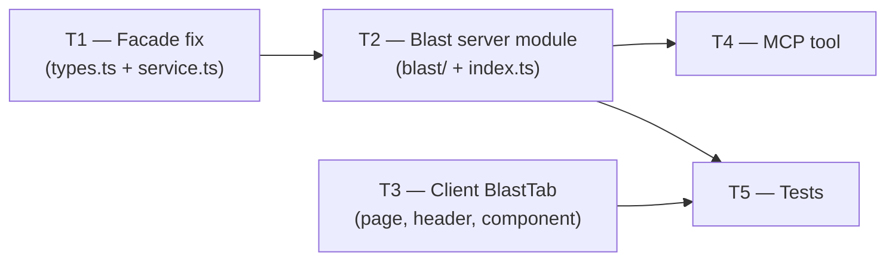

# Plan: Blast Radius (Lesson 04)
> Status: READY
> Date: 2026-07-05
> Author: planner agent

## Overview

Implement the "Blast Radius" feature: a deterministic (zero-LLM) impact-map for a pull
request that shows which symbols changed, who calls them, and which HTTP endpoints become
reachable through the import graph. Surfaces as `GET /pulls/:id/blast` on the server, a
"Blast" tab on the PR detail page in the client, and a real `devdigest_get_blast_radius` MCP
tool (replacing the current stub). Two gaps in the existing repo-intel facade are also fixed:
per-symbol caller capping and depth-2 endpoint reachability.

## Requirements → Task coverage

| Requirement | Task(s) |
|---|---|
| Symbols declared in changed files | T1, T2 |
| Per symbol, callers — max 20 PER symbol, sorted by file rank, declaration file excluded | T1 |
| Import-graph traversal ≤ depth 2 → HTTP endpoints reachable from changed files | T1 |
| Partial/degraded index → badge with explanation, never a blank screen; empty data → empty state | T2, T3 |
| Blast tab renders: changed symbols → callers → endpoints | T3 |
| Clicking a caller (file:line) opens code at that line (GitHub blob deep-link) | T3 |
| Fast response, zero LLM | T2 |
| MCP tool `devdigest_get_blast_radius` implemented (not a stub) | T4 |

## Scope

### Modules affected
- [x] server — repo-intel facade fix (per-symbol cap + `getReachableEndpoints`); new `blast/` module
- [x] client — new `BlastTab` component; Blast tab wired into PR detail page
- [ ] reviewer-core — no changes
- [ ] e2e — no new tests (blast is deterministic but requires a live DB + index; browser E2E deferred)
- [x] mcp-server — replace `get-blast-radius.ts` stub; add `getBlast` to HTTP client

### Explicitly out of scope
- New DB tables or migrations — blast reads from existing `symbols`, `references`, `file_rank`,
  `file_facts`, `file_edges` tables
- LLM calls of any kind
- The `?why=` drawer / `GET /pulls/:id/why` (backend doesn't exist; click-to-code uses GitHub
  blob deep-link instead)
- E2E browser test (would need a seeded index; deferred to a future lesson)
- Editing `server/src/vendor/shared/` or `client/src/vendor/shared/` (wire contract already
  defines `BlastRadius`; no changes needed)

---

## Engineering Insights from Codebase

Pulled from INSIGHTS.md files.

### server
- Shared contracts (`@devdigest/shared`) are vendored as TWO hand-maintained copies in
  `server/src/vendor/shared/` and `client/src/vendor/shared/`. **Do not edit either copy**;
  `BlastRadius` in `contracts/brief.ts` is already correct for this feature.
  (`server/INSIGHTS.md`, 2026-06-14)
- Static routes (`/pulls/:id/blast`) must be registered BEFORE parameterised siblings
  (`/pulls/:id`) to avoid Fastify treating a literal segment as a param value.
  (`server/INSIGHTS.md`, 2026-06-18 pattern re: `/skills/import` vs `/:id`)
- `container.repoIntel` is the only legal entry point to the index — never call the
  pipeline or adapter layer directly from a route/service outside `repo-intel/`.
  (`server/AGENTS.md`)
- `GET /pulls/:id/smart-diff` is the canonical deterministic route template: `ZodTypeProvider`,
  `PrIdParams`, `getContext()` for workspace scope, `NotFoundError` for missing PR,
  zero-LLM service call. (`server/INSIGHTS.md`, 2026-06-25)

### client
- `BarChart2` and `GripVertical` do NOT exist in `@devdigest/ui`'s icon registry.
  Always verify icon names against `client/src/vendor/ui/icons.tsx` before using them.
  (`client/INSIGHTS.md`, 2026-06-18)
- Design system color tokens: `--ok`, `--warn`, `--crit` (and `--*-bg` variants). There is
  NO `--green`, `--red`, `--amber`. Spin animation is `ddspin`, not `spin`.
  (`client/INSIGHTS.md`, 2026-06-25)
- The AgentEditor tab system showed two places to update for tabs; the PR detail page uses
  `search.get("tab") ?? "overview"` with no VALID_TABS gate — only the tabs array in
  `PrDetailHeader` and the conditional branch in `page.tsx` need updating.
  (`client/INSIGHTS.md`, 2026-06-18; `page.tsx` confirmed by source inspection)
- `reviews.ts` hook re-exports were silently missing for intent/smartDiff. Ensure any new
  hook (`usePrBlast`) already exported from `brief.ts` is imported directly from `brief.ts`
  in `page.tsx`, not via `reviews.ts`, to avoid a similar gap.
  (`client/INSIGHTS.md`, 2026-06-30)
- `githubBlobUrl(repoFullName, sha, file, startLine)` already exists in
  `client/src/lib/github-urls.ts`. Use it for caller click-to-code.

### mcp-server
- Any `console.log` call in the stdio MCP transport silently corrupts the JSON-RPC stream.
  Use `log` from `src/log.ts` (writes to `process.stderr`). (`mcp-server/INSIGHTS.md`)
- Zod `.default(N)` on a tool input field makes the value always present, rendering
  `?? fallback` dead code. Prefer `.optional()` + explicit runtime fallback.
  (`mcp-server/INSIGHTS.md`)
- Tool description must be ≤ 50 words (goes into the LLM context window).
  (`mcp-server/INSIGHTS.md`)

### reviewer-core / e2e
- No relevant insights.

---

## Implementation Tasks

---

### T1: Facade — fix per-symbol caller cap + add `getReachableEndpoints`  `MODULE: server`

| Field | Value |
|---|---|
| **Agent** | `implementer` |
| **Depends on** | none |
| **Parallel with** | T3 |

**Files to touch**

| File | Action | Reason |
|---|---|---|
| `server/src/modules/repo-intel/types.ts` | edit | Add `getReachableEndpoints` to `RepoIntel` port |
| `server/src/modules/repo-intel/service.ts` | edit | Fix per-symbol cap; implement `getReachableEndpoints` |

**Approach**

1. In `types.ts`, add the following method to the `RepoIntel` interface after `getBlastRadius`:
   ```
   getReachableEndpoints(
     repoId: string,
     seedFiles: string[],
     depth?: number,
   ): Promise<Record<string, string[]>>;
   ```
   The return type is `Record<changedFile, string[]>` where each value is the deduped
   union of `"METHOD /path"` endpoints found in files that transitively import the seed
   file up to `depth` hops (default `2`). Returns `{}` on any degraded/unavailable path —
   never throws.

2. In `service.ts`, fix the per-symbol caller cap inside `tryPersistentBlast` (currently
   at `:386`). Replace the global `callers.slice(0, MAX_CALLERS_PER_SYMBOL)` with a
   per-`viaSymbol` group cap applied before building the final array:
   - After the `callers.sort((a, b) => b.rank - a.rank)` line, group callers by `viaSymbol`
     using a `Map<string, BlastCallerRow[]>`.
   - For each group, keep at most `MAX_CALLERS_PER_SYMBOL` entries (already sorted by rank).
   - Flatten back to the `callers` array for the returned `BlastResult`.

3. In `service.ts`, implement `getReachableEndpoints`:
   - Guard: return `{}` when `!this.container.config.repoIntelEnabled` or
     `seedFiles.length === 0`.
   - Fetch all edges via `this.repo.getEdges(repoId)`.
   - If `edges.length === 0` return `{}` (no graph).
   - Build a **reverse** adjacency map: `toFile → Set<fromFile>` (who imports this file).
   - For each `seedFile`, run a BFS starting from `{seedFile}` over the REVERSE adjacency
     (i.e., "who imports me"), collecting visited files up to `depth` hops. Exclude
     `seedFile` itself from the results.
   - After collecting all reachable files for all seeds (deduplicated across seeds for the
     DB call), call `this.repo.getFileFacts(repoId, allReachableFiles)`.
   - Build the `Record<seedFile, string[]>` result: for each seed, union the
     `fileFact.endpoints` of all files reachable from that seed.
   - Wrap the entire method body in a `try/catch` that returns `{}` on any error (uphold
     the degraded contract — never throws).

4. Verify `getReachableEndpoints` appears in the `implements RepoIntel` surface of
   `RepoIntelService`. TypeScript will fail to compile otherwise, which is the desired gate.

**Tests**

- Existing tests that must stay green: `server/test/repo-intel-facade-degraded.test.ts`,
  `server/test/repo-intel-symbol-clamp.it.test.ts`
- New test (can be added to `server/test/repo-intel-facade-degraded.test.ts`):
  - `getReachableEndpoints → {} when repoIntelEnabled=false`
  - `getReachableEndpoints → {} when edges list is empty`
  - `getReachableEndpoints → correct hop-1 and hop-2 results with a minimal 3-file graph`
    (stub `getEdges` and `getFileFacts` on the repo object, verify the BFS output)

**Definition of done**
- [ ] TypeScript compiles in `server/` with zero errors
- [ ] `RepoIntel` interface in `types.ts` includes `getReachableEndpoints` with the exact
      signature above
- [ ] `tryPersistentBlast` caps callers per `viaSymbol` group (not globally)
- [ ] `getReachableEndpoints` returns `{}` on degraded/empty-graph path (never throws)
- [ ] Existing `repo-intel-facade-degraded` tests pass

---

### T2: Server blast module (`GET /pulls/:id/blast`)  `MODULE: server`

| Field | Value |
|---|---|
| **Agent** | `implementer` |
| **Depends on** | T1 |
| **Parallel with** | T3 |

**Files to touch**

| File | Action | Reason |
|---|---|---|
| `server/src/modules/blast/routes.ts` | create | Fastify plugin for `GET /pulls/:id/blast` |
| `server/src/modules/blast/service.ts` | create | `mapBlast` pure function + `buildBlast` orchestrator |
| `server/src/modules/index.ts` | edit | Register the blast plugin |

**Approach**

1. Create `server/src/modules/blast/routes.ts` following the `smart-diff/routes.ts` template
   exactly:
   - `FastifyPluginAsync` default export, named `blastRoutes`.
   - Use `ZodTypeProvider`; define `PrIdParams = z.object({ id: z.string().uuid() })`.
   - `GET /pulls/:id/blast` handler:
     a. `const { workspaceId } = await getContext(app.container, req)`.
     b. Select `{ id, repoId } from t.pullRequests` filtering by `workspaceId` AND `id`.
     c. Throw `NotFoundError('Pull request not found')` when the row is absent.
     d. Fetch changed files: import `getPrFiles` from
        `../reviews/repository/pull.repo.js` and call
        `getPrFiles(app.container.db, pr.id)`, then `.map(f => f.path)`.
     e. Call `buildBlast(app.container, pr.repoId, changedFiles)` and return the result.
   - Ensure this route is registered with a path that Fastify won't confuse with
     `GET /pulls/:id`. Since Fastify matches literal segments before params, the
     `/pulls/:id/blast` sub-path is unambiguous.

2. Create `server/src/modules/blast/service.ts` with two exports:

   **`mapBlast(result: BlastResult, endpointsBySeed: Record<string, string[]>): BlastRadius`**
   (pure function, exported for unit tests):
   - For each `changedSymbol` in `result.changedSymbols`:
     - Filter `result.callers` to those with `viaSymbol === changedSymbol.name`.
       (The per-symbol cap was already applied in T1's `tryPersistentBlast`; the
        degraded/ripgrep path has no rank-based cap — apply `slice(0, 20)` here as
        a safety net for the ripgrep path.)
     - Exclude callers whose `file === changedSymbol.file` (declaration file).
     - Map each caller to `BlastCaller { name: c.symbol, file: c.file, line: c.line }`.
     - `endpoints_affected`: union of
         * `result.factsByFile?.[c.file]?.endpoints ?? []` for each caller file
         * `endpointsBySeed[changedSymbol.file] ?? []`
       — dedup with a `Set`.
     - `crons_affected`: union of `result.factsByFile?.[c.file]?.crons ?? []` for each
       caller file — dedup.
     - Build `DownstreamImpact { symbol: changedSymbol.name, callers, endpoints_affected,
       crons_affected }`.
   - Assemble `summary` string deterministically:
     - Non-empty: `"N symbol(s) changed · K caller(s) · E endpoint(s) affected."` where N,
       K, E are total counts across all downstream entries.
     - Empty (no changed symbols): `"No top-level symbols changed."`.
     - Degraded (append when `result.degraded`): append ` Index degraded${result.reason ?
       ' (' + result.reason + ')' : ''} — results may be incomplete.`
   - Return `BlastRadius { changed_symbols: result.changedSymbols, downstream, summary }`.

   **`buildBlast(container, repoId, changedFiles): Promise<BlastRadius>`**
   (async orchestrator, called from the route):
   - Call `await container.repoIntel.getBlastRadius(repoId, changedFiles)`.
   - Call `await container.repoIntel.getReachableEndpoints(repoId, changedFiles, 2)`.
     Catch any error → `{}` (belt-and-suspenders; method should never throw per contract).
   - Call `mapBlast(result, endpointsBySeed)` and return.
   - Both facade calls must complete before `mapBlast`; use `Promise.all` if the calls are
     independent (they are, once `getBlastRadius` and `getReachableEndpoints` are separate
     methods).

3. In `server/src/modules/index.ts`, add:
   ```
   import blast from './blast/routes.js';
   ```
   and add `blast` to the `modules` record.

4. Import types: `BlastRadius`, `BlastCaller`, `DownstreamImpact` from `@devdigest/shared`
   (the Zod schemas in `server/src/vendor/shared/contracts/brief.ts`). Import `BlastResult`
   from `../repo-intel/types.js`. Never re-declare shapes already in the contract.

**Tests**

- Existing tests that must stay green: `server/test/routes-smoke.test.ts`
- New tests in `server/test/blast-route.test.ts` (no-DB smoke via `buildApp` + `app.inject`):
  - `GET /pulls/<nonexistent-uuid>/blast → 404 NotFoundError` (mock `repoIntel` returns
    a valid blast result, but the PR lookup fails at the DB level — use a valid UUID format)
  - `GET /health still returns 200` after blast module registration (guard against accidental
    registration breakage)
- New unit tests in `server/src/modules/blast/service.test.ts`:
  - `mapBlast — full result → correct downstream grouping and endpoint union`
    (inline fixture: 1 changedSymbol, 2 callers, factsByFile for one file, endpointsBySeed
    for the changed file — verify DownstreamImpact.endpoints_affected is the correct union)
  - `mapBlast — degraded result → summary includes "Index degraded"` 
  - `mapBlast — empty result → summary is "No top-level symbols changed."`
  - `mapBlast — caller in declaration file is excluded`

**Definition of done**
- [ ] TypeScript compiles in `server/` with zero errors
- [ ] `GET /pulls/:id/blast` exists and is registered
- [ ] `mapBlast` is a pure exported function (no I/O, no side effects)
- [ ] Degraded `BlastResult` → `BlastRadius.summary` includes the degraded notice
- [ ] Zero LLM calls anywhere in this module
- [ ] All new unit tests pass

---

### T3: Client — BlastTab component + PR detail page wiring  `MODULE: client`

| Field | Value |
|---|---|
| **Agent** | `implementer` |
| **Depends on** | none |
| **Parallel with** | T1 |

**Files to touch**

| File | Action | Reason |
|---|---|---|
| `client/src/app/repos/[repoId]/pulls/[number]/_components/BlastTab/BlastTab.tsx` | create | New tab component |
| `client/src/app/repos/[repoId]/pulls/[number]/_components/BlastTab/index.ts` | create | Barrel export |
| `client/src/app/repos/[repoId]/pulls/[number]/_components/PrDetailHeader/PrDetailHeader.tsx` | edit | Add Blast tab entry to the tabs array |
| `client/src/app/repos/[repoId]/pulls/[number]/page.tsx` | edit | Import BlastTab, add `tab === "blast"` branch, wire hooks |
| `client/messages/en/blast.json` | edit | Add new i18n keys used by BlastTab |

**Approach**

1. Add i18n keys to `client/messages/en/blast.json`. Append (do not remove existing keys):
   ```json
   "tab": {
     "loading": "Calculating blast radius…",
     "error": "Could not load blast radius.",
     "degraded": "Index degraded — results may be incomplete.",
     "degradedReason": "Reason: {reason}"
   }
   ```

2. Create `BlastTab/BlastTab.tsx` following `FindingsTab.tsx` structure:
   - Props: `{ prId: string | null; repoId: string | null; repoFullName: string | null;
     headSha: string | null }`.
   - Inside the component:
     - Call `usePrBlast(prId)` (from `../../../../../lib/hooks/brief`).
     - Call `useRepoIntelStatus(repoId)` (from `../../../../../lib/hooks/repo-intel`).
     - Render a `<Skeleton>` while `isLoading`.
     - Render an `<ErrorState>` while `isError`.
     - Render a `<Badge>` degraded warning when
       `intelStatus?.degraded === true` (use `--warn` / `--warn-bg` tokens, verified
       against `client/src/vendor/ui/icons.tsx` for the icon name — `AlertTriangle`
       already used in `PrDetailHeader`). Show `t("tab.degraded")` and, when
       `intelStatus.degradedReason` is set, append `t("tab.degradedReason", {
       reason: intelStatus.degradedReason })`.
     - When `blast` data is present, render `<BlastRadiusView>` passing `blast` and an
       `onWhy` callback that implements click-to-code:
       ```
       onWhy={(file, line) => {
         if (!repoFullName || !headSha) return;
         window.open(githubBlobUrl(repoFullName, headSha, file, line), '_blank',
           'noopener,noreferrer');
       }}
       ```
     - Import `BlastRadiusView` from
       `../_components/BlastRadius` (already built).
     - Import `githubBlobUrl` from `../../../../../lib/github-urls`.
     - Use `useTranslations("blast")` for i18n strings.

3. Create `BlastTab/index.ts` with a named re-export:
   ```ts
   export { BlastTab } from './BlastTab.js';
   ```

4. In `PrDetailHeader.tsx`, add `{ key: "blast", label: "Blast", icon: "Zap" }` to the
   `tabs` array (after `conformance`). Verify `Zap` exists in
   `client/src/vendor/ui/icons.tsx` before finalising — if not, use `"Activity"` or another
   verified icon.

5. In `page.tsx`:
   - Add import: `import { BlastTab } from "./_components/BlastTab"`.
   - No new hooks are needed — `usePrBlast` is already in `brief.ts` but NOT yet called
     in `page.tsx`. Add: `const { data: blast } = usePrBlast(prId)` (the hook is unused
     at this step; actual rendering happens inside `BlastTab`). Actually, since `BlastTab`
     itself calls `usePrBlast(prId)` internally, no call in `page.tsx` is required.
   - Add tab branch after the `conformance` branch:
     ```tsx
     {tab === "blast" && (
       <BlastTab
         prId={prId}
         repoId={repoId}
         repoFullName={repoFullName}
         headSha={pr.head_sha}
       />
     )}
     ```

**Tests**

- Existing tests that must stay green: all 22 client tests (run `npm test` in `client/`)
- New test `BlastTab.test.tsx` colocated in `BlastTab/`:
  - Setup: `NextIntlClientProvider` with `messages={{ blast: blastMessages }}` wrapper,
    mock `usePrBlast` and `useRepoIntelStatus` with `vi.mock`.
  - `renders Skeleton while loading` — mock returns `{ isLoading: true }`.
  - `renders BlastRadiusView when blast data is present` — mock returns a valid
    `BlastRadius` fixture; verify changed symbol name appears.
  - `renders degraded Badge when intelStatus.degraded = true` — verify degraded text key
    is present.
  - `caller click calls window.open with a GitHub blob URL` — spy on `window.open`;
    verify URL contains the expected file path and line number.

**Definition of done**
- [ ] TypeScript compiles in `client/` with zero errors
- [ ] "Blast" tab appears in the PR detail header
- [ ] Navigating to `?tab=blast` renders the BlastTab
- [ ] Loading / error / empty states all render without crashing
- [ ] Degraded badge appears when `useRepoIntelStatus` returns `degraded: true`
- [ ] Caller click opens a GitHub blob URL in a new tab
- [ ] `BlastRadiusView` `isEmptyBlast` empty state uses `blast.summary` as its message
- [ ] All 22 existing client tests pass plus new BlastTab tests pass

---

### T4: MCP tool — implement `devdigest_get_blast_radius`  `MODULE: mcp-server`

| Field | Value |
|---|---|
| **Agent** | `implementer` |
| **Depends on** | T2 |
| **Parallel with** | T5 |

**Files to touch**

| File | Action | Reason |
|---|---|---|
| `mcp-server/src/http/client.ts` | edit | Add `getBlast(pullId)` method |
| `mcp-server/src/tools/get-blast-radius.ts` | edit | Replace stub with real implementation |
| `mcp-server/src/index.ts` | edit | Pass `client` to `registerGetBlastRadius` |

**Approach**

1. In `mcp-server/src/http/client.ts`, import `BlastRadius` from `@devdigest/shared` and add
   to the returned object:
   ```ts
   getBlast: (pullId: string) => g<BlastRadius>(`/pulls/${pullId}/blast`),
   ```

2. Rewrite `mcp-server/src/tools/get-blast-radius.ts`:
   - Change signature to `registerGetBlastRadius(server: McpServer, client: Client): void`.
   - Tool params (follow `get-findings.ts` pattern, never use `.default()` — see INSIGHTS):
     ```ts
     {
       repo: z.string().min(1).describe("Repository as 'owner/name' (e.g. 'octocat/hello')."),
       pr:   z.number().int().positive().describe('Pull request number (e.g. 42).'),
     }
     ```
   - Description (≤ 50 words): `"Get the blast radius of a pull request: which symbols
     changed, who calls them, and which HTTP endpoints are reachable through the import
     graph. Returns changed_symbols, downstream callers, and endpoints_affected."`.
   - Handler body (mirrors `get-findings.ts`):
     a. `try { const pullResult = await resolvePullId(client, repo, pr); }`
     b. If `'error' in pullResult` → `return toolError(pullResult.error)`.
     c. `const blast = await client.getBlast(pullResult.pullId)`.
     d. Return `toolOk(blast)`.
     e. `catch (e)`: `if (e instanceof ApiError)` → standard unreachable message; else
        `toolError(e instanceof Error ? e.message : String(e))`.
   - Never use `console.*` — use `log` from `../log.js` only if needed.

3. In `mcp-server/src/index.ts`, change:
   ```ts
   registerGetBlastRadius(server);
   ```
   to:
   ```ts
   registerGetBlastRadius(server, client);
   ```

**Tests**

- No dedicated unit tests for the MCP tool (the tool is a thin HTTP facade; its correctness
  depends on the server blast route which is tested in T2/T5).
- Existing tests: verify TypeScript compiles clean (`npx tsc --noEmit` in `mcp-server/`).

**Definition of done**
- [ ] TypeScript compiles in `mcp-server/` with zero errors
- [ ] `devdigest_get_blast_radius` tool description no longer contains "STUB"
- [ ] Tool params are `repo: z.string().min(1)` and `pr: z.number().int().positive()`
      (required, not optional)
- [ ] `client.getBlast` is called with the resolved `pullId`
- [ ] `ApiError` is caught and returned as `toolError`

---

### T5: Tests — server route smoke + `mapBlast` unit tests  `MODULE: server`

| Field | Value |
|---|---|
| **Agent** | `implementer` |
| **Depends on** | T2, T3 |
| **Parallel with** | T4 |

**Files to touch**

| File | Action | Reason |
|---|---|---|
| `server/test/blast-route.test.ts` | create | No-DB blast route smoke tests |
| `server/src/modules/blast/service.test.ts` | create | `mapBlast` pure function unit tests |

**Approach**

1. `server/src/modules/blast/service.test.ts` — pure unit tests, no DB, no `buildApp`:
   ```
   import { mapBlast } from './service.js';
   import type { BlastResult } from '../repo-intel/types.js';
   ```
   - Fixture `RESULT_FULL`: `changedSymbols: [{file:'a.ts', name:'foo', kind:'function'}]`,
     `callers: [{file:'b.ts', symbol:'handler', viaSymbol:'foo', line:10, rank:5}]`,
     `factsByFile: {'b.ts': {endpoints:['GET /api'], crons:[]}}`,
     `impactedEndpoints: ['GET /api'], degraded: false`.
   - `endpointsBySeed = {'a.ts': ['POST /hook']}`.
   - Tests:
     - `mapBlast returns correct downstream entry` — 1 entry, `symbol:'foo'`,
       `callers: [{name:'handler', file:'b.ts', line:10}]`,
       `endpoints_affected: ['GET /api', 'POST /hook']`.
     - `mapBlast summary format` — matches expected template string.
     - `mapBlast degraded → summary includes 'Index degraded'`.
     - `mapBlast empty → summary is 'No top-level symbols changed.'`.
     - `mapBlast caller in declaration file is excluded` — when `callers[0].file ===
       changedSymbols[0].file`, `downstream[0].callers` is empty.
     - `mapBlast per-symbol cap: >20 callers → at most 20 per downstream entry` — build
       a fixture with 25 callers for the same `viaSymbol`; assert
       `downstream[0].callers.length === 20`.

2. `server/test/blast-route.test.ts` — no-DB smoke via `buildApp` + `app.inject` + mock
   `repoIntel`:
   ```
   import { buildApp } from '../src/app.js';
   import { loadConfig } from '../src/platform/config.js';
   ```
   - Build a `mockRepoIntel` stub implementing the `RepoIntel` interface with:
     - `getBlastRadius` → returns a minimal valid `BlastResult`
     - `getReachableEndpoints` → returns `{}`
     - All other methods → return `[]` or valid degraded objects.
   - Tests:
     - `GET /pulls/<valid-uuid>/blast with non-existent PR → 404` — build app with the mock
       repoIntel; inject a request with a valid UUID that no PR row matches; expect 404.
     - Regression: `GET /health → 200` after blast module registration.

**Definition of done**
- [ ] TypeScript compiles in `server/` with zero errors
- [ ] All `mapBlast` unit tests pass
- [ ] Blast route smoke test runs without Docker (no DB connection)
- [ ] All 145 existing server tests remain green

---

## Parallelisation map



- **Phase 1 (parallel):** T1 + T3 — no file overlap; T3 has no compile dependency on T1.
- **Phase 2:** T2 — depends on T1 (uses `getReachableEndpoints` from the updated interface).
- **Phase 3 (parallel):** T4 + T5 — T4 depends on T2; T5 depends on T2 and T3.

**File conflict check (must be clean before Status: READY)**

| File | Assigned to | Parallel tasks that could touch it | Conflict? |
|---|---|---|---|
| `server/src/modules/repo-intel/types.ts` | T1 | T3 (no), T4 (no) | No conflict |
| `server/src/modules/repo-intel/service.ts` | T1 | T3 (no), T4 (no) | No conflict |
| `server/src/modules/index.ts` | T2 | T3 (no), T4 (no) | No conflict |
| `server/src/modules/blast/routes.ts` | T2 | T3, T4 | No overlap — different packages |
| `server/src/modules/blast/service.ts` | T2 | T3, T4 | No overlap |
| `client/.../PrDetailHeader.tsx` | T3 | T1, T2 | No overlap — different packages |
| `client/.../page.tsx` | T3 | T1, T2 | No overlap |
| `client/messages/en/blast.json` | T3 | T1, T2 | No overlap |
| `mcp-server/src/http/client.ts` | T4 | T5 | Different packages — no overlap |
| `mcp-server/src/tools/get-blast-radius.ts` | T4 | T5 | No overlap |
| `mcp-server/src/index.ts` | T4 | T5 | No overlap |
| `server/test/blast-route.test.ts` | T5 | T4 | Different packages — no overlap |
| `server/src/modules/blast/service.test.ts` | T5 | T4 | No overlap |

All parallel groups are clean — no unresolved conflicts.

## Risks

- **Icon availability:** `Zap` is used as the Blast tab icon in the plan. If it is absent
  from `client/src/vendor/ui/icons.tsx`, the implementer must substitute a verified icon
  (e.g. `Activity`, `Radio`, `Crosshair`). Check before writing.

- **`getReachableEndpoints` in degraded path:** The ripgrep / degraded blast path in
  `getBlastRadius` does not populate `factsByFile`. The `mapBlast` function must
  treat `factsByFile` as optional (`result.factsByFile ?? {}`) and fall back gracefully when
  it is absent, which it does by design.

- **Mock completeness for T5:** The `RepoIntel` interface after T1 will have
  `getReachableEndpoints`. Any mock used in T5 must implement this method or TypeScript will
  error. The T5 smoke-test mock must therefore be updated to include it.

- **`usePrBlast` stale query key:** The hook already uses `["blast", prId]` as the query
  key. If the server returns an error (e.g. index not yet built), TanStack Query will
  not cache the error beyond the first request — `retry: false` is already set, which is
  correct for fast degraded responses.

- **BlastRadius component `onWhy` vs "caller" semantics:** The existing `BlastRadiusView`
  uses `onWhy` as the callback name for clicking a caller location. The plan repurposes it
  to open a GitHub blob URL instead of the Why drawer. This is a valid re-use since the Why
  drawer backend (`/pulls/:id/why`) does not exist. If a future lesson adds the Why endpoint,
  this callback will need re-wiring.

- **E2E acceptance test:** The end-to-end demo PR scenario (≥2 callers, ≥1 endpoint visible,
  caller click opens correct line) requires a seeded Postgres index. This cannot be covered
  by no-DB smoke tests. It is deferred and should be verified manually during lesson demo.

## Global definition of done
- [ ] All existing tests pass across all touched modules (`server`: 145; `client`: 22)
- [ ] TypeScript compiles with zero errors in `server/`, `client/`, `mcp-server/`
- [ ] `GET /pulls/:id/blast` returns a valid `BlastRadius` JSON response
- [ ] "Blast" tab is visible on the PR detail page and renders without crashing
- [ ] Clicking a caller `file:line` opens `github.com/{owner}/{repo}/blob/{sha}/{file}#L{line}` in a new tab
- [ ] `devdigest_get_blast_radius` MCP tool description contains no "STUB"
- [ ] Server logs show no LLM provider calls during a blast request
- [ ] Requirements → Task coverage table is complete (no uncovered rows)
- [ ] File conflict check table shows no unresolved conflicts
- [ ] Plan marked `Status: READY`
