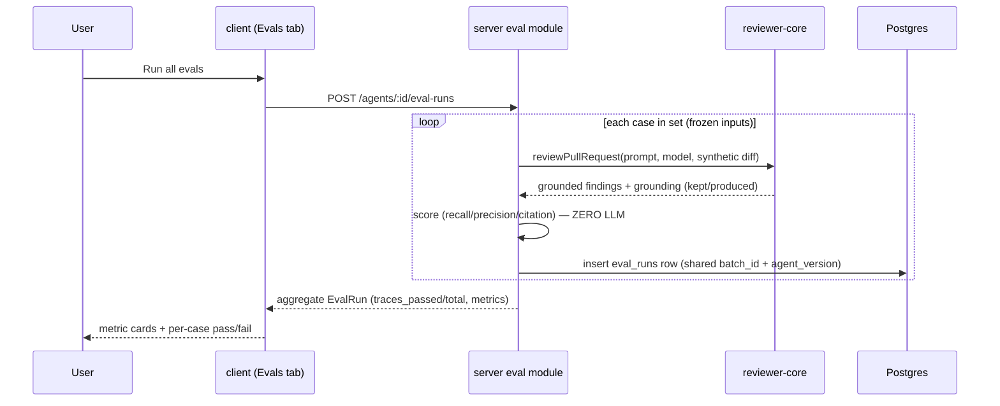

# Spec: Eval Pipeline for reviewer agents   |   Spec ID: SPEC-2026-07-10-eval-pipeline   |   Status: approved
Supersedes: none

## Problem & why
The review agent has no regression net. When someone edits an agent's system prompt, model,
or attached skills, there is no way to tell whether the change made reviews *better* or quietly
*worse* — whether it now misses a bug it used to catch, or re-flags something a human already
dismissed as noise. Reviewers already produce exactly the labelled data this needs every time
they **accept** or **dismiss** a finding: an accepted finding is a "the agent should find this"
example; a dismissed finding is a "the agent should not comment on this" example. This feature
turns those decisions into stored eval cases and lets an agent be re-run against the whole set,
producing deterministic recall / precision / citation metrics so prompt changes become
measurable ("old prompt vs new prompt") instead of guessed at. It ships as Lesson 06.

## Goals / Non-goals
- **Goal:** turn a real finding into an eval case via a **prefilled, reviewable** create flow — an
  *accepted* finding seeds `must_find`, a *dismissed* finding seeds `must_not_flag` — persisted only
  on explicit user confirmation, never a silent insert.
- **Goal:** run an agent against every case in its set with **frozen inputs**, so the only
  variable between two runs is the agent's own config (prompt/model/skills).
- **Goal:** score each run 100% deterministically (**zero LLM calls in the scorer**) into
  recall / precision / citation_accuracy using a fixed match rule.
- **Goal:** an "Evals" tab in the Agent editor (case list + run history) and a workspace-level
  **Eval Dashboard** sidebar page (recent evals across agents).
- **Goal:** compare two runs side by side — metric deltas + system-prompt diff — and promote a
  prompt version from that view.
- **Goal:** a `verify:l06` script that proves the deterministic scorer green with zero network.
- **Non-goal:** redesigning the `eval_cases` / `eval_runs` tables or the existing `eval-ci.ts` /
  `knowledge.ts` contracts. `eval_cases` is **frozen, untouched**. `eval_runs` gets exactly **two
  additive nullable columns** (`batch_id`, `agent_version` — see Contracts/Migration) for explicit
  batch identity; no existing column is changed or removed. This spec otherwise only *defines the
  JSON payloads carried inside the remaining opaque `jsonb` columns*, and may add net-new response
  shapes.
- **Non-goal:** eval cases for **skills** (`owner_kind='skill'`). The tables support it; this
  lesson delivers `owner_kind='agent'` only. Skill evals are a later lesson.
- **Non-goal:** the Conformance (`conformance_checks`) and Compose-Review (`composed_reviews`)
  features that happen to live in the same schema/contract files — out of scope entirely.
- **Non-goal:** the separate top-level `evals/` package (Claude-Code harness-evals CI) — unrelated.
- **Non-goal:** changing `reviewer-core`. The eval run path consumes its existing public exports
  (`reviewPullRequest`, grounding) only; no engine edit.
- **Non-goal:** injecting live repo-intel / callers / repo-map into an eval run (that would make
  runs non-comparable over time) — deliberately excluded, see AC-7.

## User stories
- US1: As a reviewer, I want to turn an **accepted** finding into a `must_find` eval case in one
  click, so the agent is later held to still finding it.
- US2: As a reviewer, I want to turn a **dismissed** finding into a `must_not_flag` eval case in
  one click, so the agent is penalised if it re-raises that noise.
- US3: As an agent author, I want to see all eval cases for an agent with pass/fail state, so I
  know what the agent is measured against.
- US4: As an agent author, I want to run the agent against every case and see recall / precision /
  citation_accuracy, so I can judge its current quality.
- US5: As an agent author, I want to open run history and compare two runs (metric deltas +
  prompt diff) and promote the better prompt version, so I can iterate safely.
- US6: As a user, I want an Eval Dashboard showing the most recent evals across all agents, so I
  can spot regressions at a glance.
- US7: As a course maintainer, I want `pnpm verify:l06` to prove the deterministic scorer, so the
  lesson has an objective green gate.

## Inputs (provenance)
- Finding decision — `accepted_at` / `dismissed_at` timestamps on the `findings` row
  `[reused: reviews module persisted state]`.
- Finding region + enclosing diff fragment — `file` / `start_line` / `end_line` + the PR's stored
  diff for that file `[reused: findings + persisted PR diff]`.
- Eval case inputs — `input_diff` / `input_files` / `input_meta` / `expected_output`
  `[reused: eval_cases rows]`.
- Agent config used for a run — `system_prompt` / `model` / linked skills / `version`
  `[reused: agents + agent_versions]`.
- Grounding result — kept-vs-produced from `reviewer-core` grounding gate
  `[deterministic: reviewer-core, zero LLM]`.
- Recall / precision / citation metrics — pure comparison of actual vs expected regions
  `[deterministic: repo scorer, zero LLM]`.
- Agent findings per case — the agent's review of the frozen case input
  `[new: 1 LLM call per case per batch]`. **Justification:** observing the agent's behaviour under
  its current prompt *is* the feature; this is the same single review call the studio already
  makes, not an added call. Freezing the inputs (AC-7) is what makes those calls comparable
  across prompt versions. The **scorer** that turns their output into metrics adds **zero** calls.

## Acceptance criteria (EARS)
- AC-1: WHEN a user clicks "Turn into eval case" on an **accepted** finding, the system shall call
  `POST /findings/:id/eval-case`, which **builds and returns — without persisting — a draft**
  `EvalCaseInput` with expectation `must_find`: the finding's file diff fragment in `input_diff`,
  the finding region `{file,start_line,end_line,severity,category}` as the expected region in
  `expected_output`, `source_finding_id` in `input_meta`, and `name` defaulted from the finding title.
  _(observable: the call returns 200 with the draft payload; no new `eval_cases` row exists afterwards)_
- AC-2: WHEN a user clicks "Turn into eval case" on a **dismissed** finding, the system shall
  return an equivalent **unpersisted** draft with expectation `must_not_flag`, the same diff
  fragment, and the finding region as the **forbidden** region in `expected_output`.
  _(observable: the returned draft has expectation `must_not_flag` and its forbidden region equals the finding's file:line; no row is persisted)_
- AC-3: WHEN the draft is returned, the client shall open an editable `EvalCaseModal` prefilled
  with it (name, Diff/Files/PR-meta tabs, and a JSON editor over `expected_output`) so the user can
  review or amend the payload before anything is saved; WHERE a finding is neither accepted nor
  dismissed, the "Turn into eval case" button shall be disabled (no expectation can be derived).
  _(observable: the modal opens populated with the draft's file:line; a decision-less finding shows the control disabled)_
- AC-4: WHEN the user clicks **Save** in the modal, the client shall submit the (possibly edited)
  payload via the existing `POST /eval-cases`, which persists the row and returns the created
  `EvalCase`; clicking **Cancel** discards the draft with no persisted side effect. WHERE the "Run
  on save" toggle is enabled, Save shall additionally trigger a run for the newly created case
  (`POST /eval-cases/:id/run`) immediately after creation. The system shall derive the *prefilled*
  expectation from the finding's persisted decision only (`accepted_at` → `must_find`,
  `dismissed_at` → `must_not_flag`) — never from client input — but the modal's saved payload
  (after any user edits) is what is actually persisted and scored.
  _(observable: Save fires exactly one create request [+ one run request when the toggle is on]; Cancel fires no create request; a server test calling the draft endpoint on an accepted vs a dismissed finding yields must_find vs must_not_flag regardless of request body)_
- AC-5: WHEN the Evals tab is opened for an agent, the system shall list every eval case owned by
  that agent showing name, expectation type, region `file:line`, severity/category badge, and the
  case's most recent pass/fail.
  _(observable: the tab renders one row per case with a pass or fail icon reflecting the latest eval_run for that case)_
- AC-6: WHEN a user triggers "Run all evals" (`POST /agents/:id/eval-runs`), the system shall
  execute the agent against every case in its set, persist exactly one `eval_runs` row per case
  **sharing one newly-generated `batch_id`** (uuid column) and stamping each row's `agent_version`
  with the agent's current version, and return the aggregate `EvalRun` (recall / precision /
  citation_accuracy / traces_passed / traces_total / per_trace).
  _(observable: after a run over N cases, N eval_runs rows exist with an identical `batch_id` and the same `agent_version`, and the response aggregate's traces_total = N)_
- AC-7: The eval run shall build each review's input **solely** from the case's stored
  `input_diff` / `input_files` / `input_meta` plus the agent's current prompt / model / linked
  skills, with **no** repo-intel, callers, repo-map, or other live enrichment, so that two runs of
  the same set differ only by the agent's config.
  _(observable: a run executed twice with an unchanged agent produces byte-identical prompt assembly per case; no repo-intel facade call occurs)_
- AC-8: The scorer shall count an actual finding as **matching** an expected or forbidden region
  when the file path is equal AND the `[start_line,end_line]` ranges intersect (inclusive).
  _(observable: unit tests — same file + overlapping range → match; same file + disjoint range → no match; different file → no match)_
- AC-9: The system shall compute `recall` as the share of `must_find` expected regions across the
  set that were matched by at least one actual finding (`must_not_flag` cases contribute nothing
  to the recall denominator).
  _(observable: a set with 3 must_find regions of which 2 are matched yields recall = 2/3)_
- AC-10: The system shall compute `precision` as the share of the agent's actual findings across
  the set that are **not noise**, where a finding is noise if it matches a `must_not_flag`
  forbidden region OR (in a `must_find` case) matches no expected region; when the agent produced
  zero findings, precision shall be 1.
  _(observable: a run where the agent re-raises a must_not_flag region records that finding as noise and drops precision below 1)_
- AC-11: The system shall compute `citation_accuracy` as kept ÷ produced findings from the run's
  **grounding** result (findings that survived the grounding gate), not from any model self-report.
  _(observable: for an agent producing 4 findings of which 3 survive grounding, citation_accuracy = 0.75)_
- AC-12: The scoring step (mapping actual findings + expected/forbidden regions →
  recall / precision / citation_accuracy / pass) shall make **zero** LLM or provider calls.
  _(observable: `verify:l06` runs the scorer with an injected provider that throws on any call and still returns metrics)_
- AC-13: WHEN an agent's `system_prompt` is changed and its set is re-run, the resulting batch's
  recall and/or precision shall be able to differ from the prior batch (metrics are a pure function
  of the produced findings, hence of the prompt).
  _(observable: a fixture test running two distinct prompts — one that finds the seeded bug, one that does not — over the same case yields different recall)_
- AC-14: The system shall expose per-owner run **history** as batches — grouped by the `batch_id`
  column, each batch carrying its aggregate metrics, `ran_at`, and the `agent_version` it ran with
  — and, given two batch ids, shall present the metric deltas and a system-prompt diff between the
  two versions (resolved via `agent_version` → the `agent_versions` table).
  _(observable: the compare view for batch A vs B shows Δrecall/Δprecision/Δcitation and a line diff of the two versions' system_prompt)_
- AC-15: WHEN a user promotes a version from the compare view, the system shall set the agent's
  current configuration (at minimum `system_prompt`) to that version's snapshot.
  _(observable: after "Promote vN", GET /agents/:id returns the vN system_prompt)_
- AC-16: The workspace Eval Dashboard shall render each agent with its current
  recall / precision / citation_accuracy, the delta vs its previous batch, a trend sparkline, and a
  "recent eval runs · all agents" table.
  _(observable: the page maps one `EvalDashboard` row per agent plus a workspace `recent_runs` table)_
- AC-17: WHERE an owner has fewer than 8 eval cases **AND** no regression-flip alert (AC-25)
  applies, the dashboard shall surface a floor-warning `alert` indicating the set is below the
  recommended minimum; the L06 deliverable shall seed ≥ 8 cases for at least one agent.
  _(observable: an owner with 7 cases and no pass-flip shows the floor-warning alert; the seeded demo agent has ≥ 8 cases and no floor alert)_
- AC-25: WHEN comparing an owner's two most recent batches, IF any eval case's `pass` flips from
  `true` to `false` between them, THEN `EvalDashboard.alert` shall name that case in a templated
  regression message (distinguishing a `must_not_flag` case — "new false positive" — from a
  `must_find` case — "regression, no longer finds the expected issue"); this regression alert takes
  **priority** over the floor-warning (AC-17) whenever both would otherwise apply; WHERE more than
  one case flips, the alert shall name the first by case name ascending (deterministic tie-break).
  The reverse flip (`false` → `true`, an improvement) does not raise an alert.
  _(observable: flipping one seeded case's pass between batch A and batch B surfaces an alert naming that case, even when the owner has ≥8 cases; with no flip and <8 cases, the floor-warning from AC-17 shows instead; with no flip and ≥8 cases, alert is null)_
- AC-18: The Eval Dashboard shall be reachable from a left-sidebar item under "Skills Lab" at
  route `/eval`, active-highlighted while on `/eval` paths.
  _(observable: the sidebar shows the item; navigating to /eval marks it active via activeKeyFor)_
- AC-19: `server/package.json` shall define a `verify:l06` script scoped to the deterministic eval
  scorer test(s) only (mirroring `verify:l03`), green with zero network / LLM access.
  _(observable: `cd server && pnpm verify:l06` passes offline; it does not run the whole suite)_
- AC-20: IF a case's `input_diff` or PR body reaches the agent prompt during a run, THEN it shall
  pass through `reviewer-core`'s existing untrusted-input wrapping (`wrapUntrusted` /
  `assemblePrompt`), never interpreted as instructions.
  _(observable: the run path routes case text through the same assembly that wraps untrusted diff/PR body; no raw case text is concatenated into the system prompt)_
- AC-21: The system shall scope every eval-case and eval-run read or write to the caller's
  workspace, and WHEN creating a case from a finding shall verify the finding belongs to the
  caller's workspace, returning 404 otherwise.
  _(observable: a cross-workspace finding id yields 404; a cross-workspace case id is not listed or runnable)_
- AC-22: WHEN `expected_output` (or a hand-edited case payload) is submitted, the system shall
  `safeParse` it against the defined payload schema and reject an invalid payload with a 4xx,
  never persisting unvalidated JSON.
  _(observable: a malformed expected_output body returns 400 and no row is written)_
- AC-23: IF "Run all evals" is invoked on an owner with zero cases, THEN the system shall return an
  empty aggregate (traces_total = 0) without persisting a batch or erroring.
  _(observable: POST on an empty set returns 200 with traces_total 0 and creates no eval_runs rows)_
- AC-24: IF the agent's LLM call fails for one case during a batch, THEN the system shall record
  that case's `eval_runs` row as failed (`pass=null`, metrics null, error retained in
  `actual_output`) and continue the remaining cases, **retaining every case result already scored
  in the same batch**.
  _(observable: a batch where case 2 of 3 throws still persists rows for cases 1 and 3 with their metrics, plus a failed row for case 2)_

## Edge cases
- Owner has zero cases and user runs the set → AC-23.
- Owner has < 8 cases and no case regressed between the last two batches → floor-warning alert, still runnable → AC-17.
- A case regresses (pass true→false) between the last two batches, even with ≥8 cases → regression alert names it, takes priority over any floor-warning → AC-25.
- Fewer than 2 batches exist for an owner → no regression comparison is possible → AC-25 contributes nothing; AC-17's floor-warning still applies if <8 cases.
- Agent LLM call fails on one case mid-batch → isolate + preserve prior results → AC-24.
- Finding is neither accepted nor dismissed → button disabled, no expectation → AC-3.
- Malformed / hand-edited `expected_output` JSON → 400, nothing persisted → AC-22.
- Cross-workspace finding or case id → 404 / not listed → AC-21.
- Oversized `input_diff` reaching the prompt → truncated by `reviewer-core`'s existing prompt
  budget in `assemblePrompt` → accepted: no new handling (relies on the engine's existing cap).
- Case's `input_diff` does not contain the finding's file/hunk (so grounding would drop the
  agent's finding) → the draft-building path (AC-1/AC-2) attempts to capture the finding's own file
  diff fragment; if the file isn't present in the stored PR diff, the draft's `input_diff` comes
  back **empty** rather than falling back to the whole raw diff — the modal (AC-3) surfaces this
  visibly empty so the user can paste/edit the fragment manually before Save, instead of silently
  persisting an unscoreable case.
- Two "run all" batches launched concurrently on one set → each gets its own independently
  generated `batch_id`; "current" = the batch with the newest `ran_at` → accepted: last-write-wins,
  no locking (the explicit `batch_id` column removes the timestamp-collision risk a `ran_at`-only
  proxy would have had).
- Same finding turned into a case twice → duplicate cases allowed (no dedupe) →
  accepted: no handling (a case is cheap; dedupe is a later refinement).
- `must_not_flag` case where the agent produced zero findings → pass, precision contribution 1 → AC-10.
- An `eval_runs` row with `batch_id IS NULL` or `agent_version IS NULL` (the columns are nullable at
  the DB level; every row this feature ever writes sets both, but the schema does not forbid a gap)
  → excluded from batch history/compare grouping (which groups by `batch_id`); still visible as that
  case's own most-recent single-case run for pass/fail (AC-5) → accepted: defensive filtering in the
  repository layer, no `NOT NULL` constraint (avoids a migration-time backfill requirement).

## Non-functional
- **Security / access control (A01):** all eval endpoints are workspace-scoped via the existing
  base-repository guard; no cross-tenant read/write (AC-21). Case creation validates finding
  ownership.
- **Security / injection (A05, prompt):** case `input_diff` and any PR body are **untrusted data**;
  they only ever reach the model through `reviewer-core`'s `wrapUntrusted` / `assemblePrompt`
  hardening (AC-20). The `expected_output` JSON editor is validated with `safeParse` (AC-22),
  never `eval`'d or trusted.
- **Determinism:** the scorer is pure and offline — zero LLM calls (AC-12), enforced by
  `verify:l06` (AC-19).
- **Perf:** a "run all" over N cases fans out N single-pass reviews; the batch shall bound
  concurrency (reuse the existing queued-run mechanism) so a large set does not open N simultaneous
  provider connections. No hard latency budget — runs are user-initiated and progress-reported.
- **Success signal:** editing an agent's system prompt and re-running its set produces a batch
  whose recall/precision **visibly differ** from the previous batch in the compare view (AC-13) —
  i.e. prompt quality became a measurable number.

## Cross-module interactions
- **server** — new `eval` module (`modules/eval/`: routes + service + repository) registered with
  one line in `modules/index.ts`. It owns eval-case CRUD, the batch run endpoint, run history,
  compare, and the dashboard aggregate. The run path is a **DB-free-in-spirit** lightweight
  composition (mirroring `mcp-server/src/cli/review.ts`): it builds a synthetic `UnifiedDiff` from
  the case's stored `input_diff` and calls `reviewPullRequest` (+ its internal grounding) directly,
  rather than reusing `ReviewRunExecutor` (which assembles a real PR row and live repo-intel). The
  deterministic scorer is a pure module unit (no I/O) so it is testable with zero network.
- **reviewer-core** — unchanged; consumed via public exports (`reviewPullRequest`, and grounding
  results already returned by it). The mandatory grounding gate is **not** bypassed —
  citation_accuracy is derived from it (AC-11).
- **client** — three touch points: (1) "Turn into eval case" button on `FindingCard`, which fetches
  a draft via `POST /findings/:id/eval-case` and opens a shared, editable `EvalCaseModal` (also used
  for manual case creation and for re-opening/editing an existing case) — the actual persist happens
  only when the modal's Save is clicked, via the existing `POST /eval-cases`; (2) an
  "Evals" tab in the Agent editor (register in both the editor `TABS` and the page's `VALID_TABS`,
  or the tab silently redirects to config); (3) an "Eval Dashboard" page at `/eval` plus a sidebar
  item under Skills Lab (register in both `vendor/ui/nav.ts` and `activeKeyFor` — the latter already
  maps `/eval` → `"eval"`). New icon names must already exist in `vendor/ui/icons.tsx`
  (e.g. `Target` / `Gauge` / `BarChart` exist; `BarChart2` does not).

## Contracts
Existing frozen prior art (do **not** modify beyond the additive migration below): `eval_cases`
table, unchanged, and `EvalCase` / `EvalRun` / `EvalPerTrace` / `EvalOwnerKind` (`knowledge.ts`);
`EvalCaseInput` / `EvalRunRecord` / `EvalRunResult` / `EvalTrendPoint` / `EvalDashboard`
(`eval-ci.ts`) — no existing field is removed or retyped. Any *new* contract below must be added
**lockstep** to both `server/src/vendor/shared/` and `client/src/vendor/shared/` (no auto-sync).

**Migration (decided 2026-07-10 — explicit columns over a `ran_at`-proxy):** add two **nullable**
columns to `eval_runs` — `batch_id uuid` and `agent_version integer` — plus an index on `batch_id`.
`eval_cases` is untouched. Generated via `pnpm db:generate` (a pure addition, not a rename — no
interactive TTY prompt per the server rename-gate rule) then `pnpm db:migrate`. **Existing-data
note:** verified directly against the codebase that nothing currently writes to `eval_cases` /
`eval_runs` — no seed script, no route, no service exists yet for either table (`server/src/db/
seed.ts` only mentions "eval" in a doc-comment listing tables future lessons will populate) — so
there is **no legacy data to migrate or backfill** in this repo today. The columns are still made
nullable rather than `NOT NULL`, defensively, for the general case (e.g. a manually-inserted test
row in some local DB): this feature's own write path always sets both fields; any row that somehow
lacks them is excluded from batch-grouped views rather than breaking the migration or requiring a
backfill (see Edge cases). `EvalRunRecord` (`eval-ci.ts`) gains matching top-level fields:
`batch_id: z.string().nullable()`, `agent_version: z.number().int().nullable()`.

**Spec-defined JSON payloads (carried inside the remaining opaque `jsonb` / `z.unknown()` columns —
no table or contract change beyond the migration above):**
- `expected_output` (shape only): `{ expectation: 'must_find' | 'must_not_flag', regions:
  [{ file: string, start_line: int, end_line: int, severity?: Severity, category?: FindingCategory }] }`.
  For `must_find` the regions are what must be found; for `must_not_flag` they are what must not be
  flagged. The `expectation` discriminator is stored **explicitly** (see Assumptions — empty-vs-
  non-empty is not a safe discriminator because `must_not_flag` carries a non-empty forbidden region).
- `input_meta` (shape only): `{ source_finding_id: string, pr_number?: int, ... }` — traceability
  back to the finding the case was born from.
- `actual_output` (shape only): `{ findings: [Finding-lite], grounding: { kept: int, produced: int },
  error?: string }` — **no longer carries `agent_version`** now that it is a real `eval_runs` column
  (avoids storing the same fact twice and risking drift between the column and the jsonb copy).

**API surface (behaviour + shape; exact routing is implementation):**
- Draft case from finding (`POST /findings/:id/eval-case`) — identifies the source finding; server
  derives `owner_id`, `expectation`, `input_diff`, `expected_output`, `input_meta` and returns an
  **unpersisted** `EvalCaseInput` (AC-1/2/3). The actual persist reuses the existing
  `POST /eval-cases` (same endpoint a manually-created case uses), submitting the modal's
  (possibly-edited) payload (AC-4).
- List cases for an owner → `EvalCase[]` (AC-5).
- `POST /agents/:id/eval-runs` → aggregate `EvalRun` (AC-6); persists per-case `EvalRunRecord` rows.
- Run history for an owner and Compare-two-batches → **net-new additive contracts (decided, see
  Open questions)**: a per-batch aggregate `EvalRunBatch { ran_at, agent_version, recall, precision,
  citation_accuracy, traces_passed, traces_total }` and an
  `EvalCompare { a: EvalRunBatch, b: EvalRunBatch, prompt_diff: {...}, delta: {...} }`, added
  lockstep to both vendor mirrors.
- Dashboard → existing `EvalDashboard` (workspace-level when `owner_id` is null) (AC-16/17).
- Promote version → reuse the agents update path to set the agent config from a version snapshot
  (AC-15).

**`verify:l06` script (explicitly in scope, per request):** add to `server/package.json`, mirroring
the single-file scope of `verify:l03`:
`"verify:l06": "vitest run src/modules/eval/scoring.test.ts"`. Binding requirement: the script is
**scoped to the deterministic eval scorer test(s)** (not the whole suite) and passes with zero
network / no API key. The exact test filename follows the module convention
(`src/modules/eval/…test.ts`); the implementer may adjust the filename but must keep the scope and
the offline-green guarantee.

## Untrusted inputs
Yes — a case's `input_diff` (a fragment of a real third-party PR diff) and any stored PR body are
untrusted text. During a run they reach the model **only** through `reviewer-core`'s existing
`wrapUntrusted` / `assemblePrompt` hardening, exactly as a normal review does — never concatenated
into the system prompt or interpreted as instructions (AC-20). The `expected_output` JSON authored
in the case modal is validated with `safeParse` against the defined payload schema (AC-22), not
trusted or executed.

## Assumptions
- Assumed **no schema or existing-contract change** is needed: the `expected_output` /
  `input_meta` / `actual_output` columns are `jsonb` (Zod `z.unknown()`), so their internal shapes
  are defined by this feature, not frozen. Say so if the tables/contracts should instead grow typed
  columns/fields.
- Assumed the `expectation` discriminator is stored **explicitly** inside `expected_output` rather
  than inferred from an empty-vs-non-empty regions array, because a `must_not_flag` case must carry
  its (non-empty) forbidden region for scoring — say so if inference is preferred.
- **Decided (2026-07-10): explicit `batch_id` column.** A batch is identified by the new
  `eval_runs.batch_id` (uuid) column, not a shared `ran_at` proxy — rejected the `ran_at`-window
  grouping trick used elsewhere in the codebase (`server/INSIGHTS.md` already flags that proxy as a
  known limitation for PR-list "latest review batch") to avoid repeating the same technical debt here.
- **Decided (2026-07-10): explicit `agent_version` column.** Each run's agent version is captured in
  the new `eval_runs.agent_version` column (not inside `actual_output` jsonb), so the compare
  prompt-diff resolves the two versions via a plain column read + join to `agent_versions`, with no
  JSON parsing and no risk of the jsonb copy drifting from the column.
- **Decided (2026-07-10): aggregation is pooled** (sum of numerators ÷ sum of denominators across
  cases) for recall/precision/citation, not a mean-of-per-case-ratios (macro-average was
  considered and rejected — pooled better reflects total noise/miss volume across the set).
- Assumed an eval run uses the agent's **currently linked enabled skills** plus prompt+model, with
  repo-intel off (AC-7). Say so if skills should also be frozen to the case's creation-time set.
- Assumed the sidebar "Eval Dashboard" icon is an existing icon (`Target` / `Gauge` / `BarChart`);
  the implementer picks one that exists in `vendor/ui/icons.tsx`.

## Proposals (out of scope)
- [PROPOSAL: dedupe cases created from the same `source_finding_id` (warn "already an eval case")
  to keep sets clean once creation is one-click and cheap to spam.]
- [PROPOSAL: a "diff drift" indicator on a case whose `input_diff` no longer matches the current PR
  head, so stale cases are visible.]
- [PROPOSAL: extend the same pipeline to `owner_kind='skill'` once agent evals land — the tables
  already support it.]

## Open questions
All three prior open questions are resolved (orchestrator + user decision, 2026-07-10):
- **Promote vN — RESOLVED, no new endpoint.** `GET /agents/:id/versions/:version` (existing) already
  returns a full config snapshot and `PUT /agents/:id` (existing) already updates the agent's current
  config. "Promote vN" is a client-side compose: GET the version snapshot, then PUT its `system_prompt`
  (and other fields) as the agent's current config. AC-15 requires no agents-module server changes.
- **Compare contracts — RESOLVED: add new contracts.** Net-new `EvalRunBatch` and `EvalCompare`
  response shapes are added, lockstep, to both `server/src/vendor/shared/` and
  `client/src/vendor/shared/`. The server computes deltas and the `system_prompt` diff; the compare
  view consumes `EvalCompare` directly (see Contracts section).
- **Precision noise rule — RESOLVED: extra = noise.** AC-10 stands as specified: any actual finding
  matching no expected region is noise (lowers precision), even in a `must_find`-only set, not only
  findings that hit a `must_not_flag` region.
</content>
</invoke>
