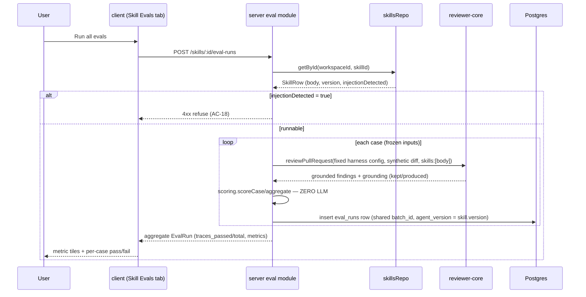
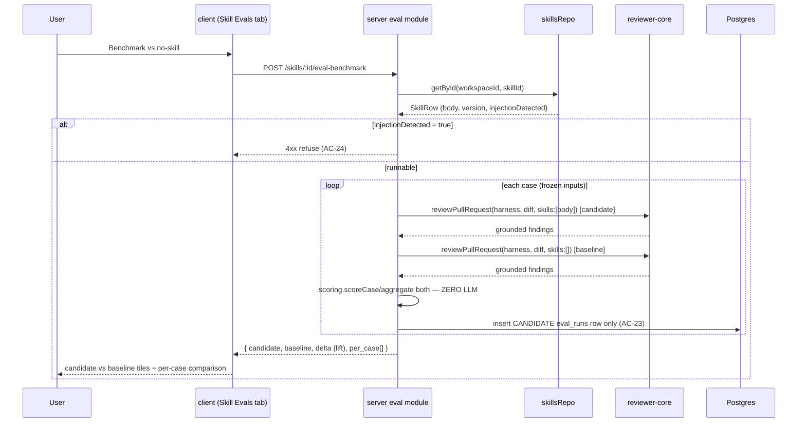

# Spec: Evals tab on the Skill editor   |   Spec ID: SPEC-2026-07-11-skill-evals-tab   |   Status: approved (v1) · amendment approved (2026-07-12)
Supersedes: none

> **v1 (AC-1 – AC-19) is shipped and approved — unchanged by this amendment.** The
> `## Amendment (2026-07-12) — Benchmark & Compare Runs` section at the end adds two new
> capabilities (Goals, AC-20 – AC-34) that extend the same Evals tab. Two v1 items below are
> marked **REVISED by amendment** in place so their original wording stays legible.

## Problem & why
Skills have no regression net. When someone edits a skill's markdown body (tightening a rubric,
adding a convention, fixing a rule), there is no way to tell whether the change made the reviews
that rely on that skill *better* or quietly *worse*. Agents already have exactly this net — the
Eval Pipeline (`specs/SPEC-2026-07-10-eval-pipeline.md`) turns accepted/dismissed findings into
stored eval cases and re-runs an agent against the whole set for deterministic recall / precision /
citation metrics.

That spec deliberately deferred skills: its Non-goal at lines 34–35 reads *"eval cases for skills
(`owner_kind='skill'`). The tables support it; this lesson delivers `owner_kind='agent'` only.
Skill evals are a later lesson."* This spec is that later lesson. It adds an "Evals" tab to the
Skill editor, mirroring the Agent editor's Evals tab, and extends the existing eval module to run
a skill's body against its eval cases. The database, the `eval_cases` / `eval_runs` schema, the
deterministic scorer (`scoring.ts`), the analytics aggregation (`analytics.ts`), and the shared
contracts already support `owner_kind='skill'` today — **no migration and no contract change are
required** (verified: `EvalOwnerKind = z.enum(['skill','agent'])`, and `EvalCase` /
`EvalCaseInput` / `EvalCaseListItem` / `EvalDashboard` are all owner-kind generic).

The core wrinkle solved here: a skill has no `model` / `provider` / `systemPrompt` of its own (it
is pure markdown — `skills` columns are id, workspaceId, name, description, type, source, body,
enabled, injectionDetected, version, evidenceFiles). The existing run primitive `runCase` requires
an `AgentRow`. This spec resolves that with a **fixed reference harness** (see Design decision 1).

## Goals / Non-goals
- **Goal:** an "Evals" tab embedded in the Skill editor mirroring the Agent editor's tab — case
  list with pass/fail/never-run status, per-case run/edit/delete, "Run all evals", "New eval case",
  an "X / Y passing" badge, and metric tiles (recall / precision / citation-accuracy).
- **Goal:** run a skill's `body` against its eval cases through the **existing** `reviewPullRequest`
  pipeline and the **unmodified** deterministic scorer, so recall / precision / citation are
  computed for skills exactly as they are for agents.
- **Goal:** reuse the existing generic UI and server pieces as-is wherever they are already
  owner-kind agnostic (`EvalCaseModal`, `MetricBar`, `POST /eval-cases`, `DELETE /eval-cases/:id`,
  `POST /eval-cases/:id/run`, `EvalRepository.listCases/latestRunPerCase/...`, `scoring.ts`,
  `analytics.aggregateRunRows/history`).
- **Non-goal:** any **DB migration**. `owner_kind='skill'` is already a valid enum value on
  `eval_cases`; `eval_runs.agent_version` (a nullable integer) is repurposed to carry a skill's
  `version` (the column name is legacy, not restrictive).
- **Non-goal:** any change to `server/src/vendor/shared/` or `client/src/vendor/shared/` contract
  files — verified unnecessary (the contracts are already owner-kind generic). If implementation
  discovers a genuinely required contract change, it must be raised, not silently made.
- **Non-goal (Design decision 2) — REVISED by amendment (2026-07-12):** a separate skill eval
  **detail / compare page** — no `/eval/skills/[id]` route, no `SkillEvalDetailView`, no
  run-history view, no two-run Compare modal, no "Promote version". `skill_versions` stores only
  `body` (not a full config snapshot), so the agent detail page's core feature (prompt-diff
  between versions) does not translate yet. `analytics.compare` therefore stays **agent-only**;
  it is not extended for skills.
  **Re-examined 2026-07-12:** the stated blocker was found *resolvable*. For a skill (unlike an
  agent) a full config-diff is unnecessary — a **text diff of `skill_versions.body`** between two
  versions *is* the meaningful comparison, and `skill_versions` already stores exactly that
  (`(skillId, version)` PK, `body` column — verified). Every `eval_runs` row already stamps the
  skill's `version` in the legacy `agent_version` column, so two batches are pairable by version.
  The amendment therefore adds an **in-tab** Compare-Runs capability (metrics delta + body diff,
  view-only) — NOT a separate page and NOT a Promote action. See AC-29 – AC-34. This Non-goal
  stands only for the *separate page / SkillEvalDetailView / Promote* parts.
- **Non-goal:** integrating skills into the workspace-level `/eval` dashboard, `EvalDashboardView`,
  or `AgentEvalCard` list. v1 is tab-only.
- **Non-goal (Design decision 1):** a **carrier-agent picker** — the user does not choose which
  agent's config carries the skill-eval run. A single fixed reference harness is used, avoiding a
  picker UI and avoiding coupling skill-eval results to whichever agent happens to be selected.
- **Non-goal:** the top-level `evals/` package (the Claude-Code Vitest harness) — unrelated
  mechanism, untouched.
- **Non-goal:** changing `reviewer-core`. The skill-eval run consumes its existing public exports
  (`reviewPullRequest`, grounding) only.

## User stories
- US1: As a skill author, I want to see all eval cases for a skill with pass/fail state, so I know
  what the skill is measured against.
- US2: As a skill author, I want to create, edit, and delete eval cases for a skill from its editor,
  so I can curate the set.
- US3: As a skill author, I want to run one case or run the whole set and see recall / precision /
  citation-accuracy, so I can judge the skill's current quality.
- US4: As a skill author, I want re-running the set after I edit the skill body to produce
  measurably different metrics, so a body change becomes a number instead of a guess.

## Inputs (provenance)
- Skill body + version — `skills.body` / `skills.version` for the skill under eval
  `[reused: skills module output via `skillsRepo.getById`]`.
- Fixed reference-harness reviewer config — a constant system prompt + fixed provider/model defined
  once for skill evals `[deterministic: hardcoded constant, no per-run variation]`.
- Eval case inputs — `input_diff` / `input_files` / `input_meta` / `expected_output`
  `[reused: eval_cases rows, owner_kind='skill']`.
- Grounding result (kept-vs-produced) — from the `reviewer-core` grounding gate
  `[deterministic: reviewer-core, zero LLM]`.
- Recall / precision / citation metrics — pure comparison of actual vs expected regions
  `[deterministic: repo scorer `scoring.ts`, zero LLM]`.
- Skill findings per case — the reference harness's review of the frozen case input with the skill
  body as the sole loaded skill `[new: 1 LLM call per case per run]`. **Justification:** observing
  the skill's effect on a review under a fixed harness *is* the feature; it is the same single
  `reviewPullRequest` call the agent eval path already makes (AC-6/AC-7 of the eval-pipeline spec),
  with the only variable being the skill body. The scorer that turns the output into metrics adds
  **zero** calls.

## Acceptance criteria (EARS)
- AC-1: WHERE the Skill editor renders its tab row, the system **shall** include an "Evals" tab
  registered in **both** the editor's `TABS` array and the page's `VALID_TABS` allow-list, appended
  after the existing tabs (`config, preview, versions, stats, context, evals`).
  _(observable: navigating to `?tab=evals` renders the Evals panel and does **not** silently fall
  back to `config`; both registration sites contain `"evals"`)_
- AC-2: WHEN the Evals tab is opened for a skill, the system **shall** call
  `GET /skills/:id/eval-cases` and list every eval case owned by that skill (`owner_kind='skill'`),
  each row showing the case name, a one-line description, the expected region's severity·category
  tag, and a status icon reflecting the case's most recent run (pass = check, fail = X,
  never-run = hollow).
  _(observable: the tab renders one row per `owner_kind='skill'` case for that skill id, with a
  pass / fail / never-run icon derived from `latest_run.pass`)_
- AC-3: WHEN the Evals tab is displayed, the system **shall** show an "X / Y passing" badge where Y
  is the number of cases and X is the number whose latest run passed, plus metric tiles for
  recall / precision / citation-accuracy for the skill.
  _(observable: with 3 of 4 cases' latest run passing, the badge reads "3 / 4 passing"; the tiles
  render the skill's current aggregate metrics)_
- AC-4: WHEN the user clicks "+ New eval case", the system **shall** open the existing
  `EvalCaseModal` (reused as-is) to author a case, and WHEN the user clicks a row's edit control it
  **shall** open the same modal populated with that case.
  _(observable: the modal opens; creating a case submits `POST /eval-cases` with
  `owner_kind:'skill'` and the skill id as `owner_id`; editing pre-fills the modal from the case)_
- AC-5: WHEN the user saves a new skill case, the system **shall** persist it via `POST /eval-cases`
  with `owner_kind:'skill'`, and the create path **shall** verify the target **skill** belongs to
  the caller's workspace (branching on `owner_kind` to `skillsRepo.getById` instead of
  `agentsRepo.getById`), returning 404 for a missing or cross-workspace skill.
  _(observable: a valid skill id persists a row with `owner_kind='skill'`; a foreign/nonexistent
  skill id returns 404 and writes no row)_
- AC-6: WHEN the user clicks a row's delete control, the system **shall** delete the case via the
  existing `DELETE /eval-cases/:id` (run history cascades via the `eval_runs.case_id` FK).
  _(observable: the case row and its runs are gone after the call; the endpoint is unchanged)_
- AC-7: WHEN the user clicks a row's run control, the system **shall** run that single case via the
  existing `POST /eval-cases/:id/run`, executing the skill under the fixed reference harness (AC-9)
  and returning the case's `EvalRunResult`.
  _(observable: the run returns metrics and the row's status icon updates to pass/fail)_
- AC-8: WHEN the user clicks "Run all evals", the system **shall** call `POST /skills/:id/eval-runs`,
  execute the skill against every case in its set, persist one `eval_runs` row per case sharing one
  new `batch_id` and stamping each row's `agent_version` column with the skill's current `version`,
  and return the pooled aggregate `EvalRun` (recall / precision / citation_accuracy /
  traces_passed / traces_total).
  _(observable: after a run over N cases, N `eval_runs` rows exist with one shared `batch_id` and
  the skill's `version` in `agent_version`; the response's `traces_total = N`)_
- AC-9: WHEN a skill eval case runs (single or batch), the system **shall** drive the same
  `reviewPullRequest` pipeline used by agent evals with a **fixed reference-harness reviewer config**
  (a constant system prompt + a fixed provider/model defined once for skill evals) and inject the
  skill's `body` as the **only** loaded skill — never any agent's config and never any agent's
  linked skills — so the run's inputs are `{ frozen case diff, fixed harness config, [skill.body] }`.
  _(observable: the review call is issued with the harness's constant systemPrompt/model and
  `skills:[skill.body]`; no `agentsRepo` lookup and no linked-skill resolution occurs on the skill
  path)_
- AC-10: The skill-eval run **shall** produce the same output shape the existing scorer consumes
  (`findings`, grounding `kept`/`produced`, `costUsd`) and **shall** be scored by the unmodified
  `scoring.ts` (`scoreCase` + `aggregate`), so recall / precision / citation_accuracy are computed
  for skills identically to agents.
  _(observable: `scoring.ts`, `repository.ts`, and the scoring branch of `analytics.ts` are byte-
  unchanged; skill and agent runs go through the same `scoreCase`/`aggregate` calls)_
- AC-11: The skill-eval run **shall** build each review solely from the case's stored `input_diff` /
  `input_files` / `input_meta` plus the fixed harness config and the skill body — with **no**
  repo-intel, callers, repo-map, or other live enrichment — so two runs of the same set differ only
  by the skill's body.
  _(observable: a run executed twice with an unchanged skill body produces identical prompt assembly
  per case; no repo-intel facade call occurs)_
- AC-12: WHEN a skill's `body` is changed and its set is re-run, the resulting batch's recall and/or
  precision **shall** be able to differ from the prior batch (metrics are a pure function of the
  produced findings, hence of the body under a fixed harness).
  _(observable: a fixture running two distinct skill bodies — one that steers the harness to the
  seeded issue, one that does not — over the same case yields different recall)_
- AC-13: The metric tiles and "X / Y passing" badge for a skill **shall** be sourced by extending
  the existing `GET /eval/dashboard` endpoint to accept a skill owner (a `skillId` query variant),
  reusing the owner-kind-agnostic `analytics.history` / `aggregateRunRows` helpers, with the
  owner-kind-specific reads (`listCases`, the response `owner_kind`, and `resolveAlert`) made
  owner-kind aware rather than hardcoded to `'agent'`.
  _(observable: `GET /eval/dashboard?skillId=<id>` returns an `EvalDashboard` with `owner_kind:'skill'`
  and the skill's current metrics; the aggregation math is the same code path agents use)_
- AC-14: The system **shall** scope every skill eval-case and eval-run read or write to the caller's
  workspace (via the existing base-repository guard), so a cross-workspace skill id or case id is
  not listed, not runnable, and returns 404 on direct access.
  _(observable: a cross-workspace skill id yields 404 on list/run; a cross-workspace case id is not
  listed or runnable)_
- AC-15: IF a case's `input_diff` (a fragment of a real third-party PR diff) reaches the model
  during a skill-eval run, THEN it **shall** pass through `reviewer-core`'s existing untrusted-input
  wrapping (`wrapUntrusted` / `assemblePrompt`), never concatenated into the system prompt or
  interpreted as instructions.
  _(observable: the skill run path routes case text through the same `reviewPullRequest` assembly
  that wraps untrusted diff text; no raw case text is hand-concatenated into the harness prompt)_
- AC-16: IF "Run all evals" is invoked on a skill with zero cases, THEN the system **shall** return
  an empty aggregate (`traces_total = 0`) without persisting a batch or erroring.
  _(observable: `POST /skills/:id/eval-runs` on an empty set returns 200 with `traces_total 0` and
  creates no `eval_runs` rows)_
- AC-17: IF the harness LLM call fails for one case during a batch, THEN the system **shall** record
  that case's `eval_runs` row as failed (`pass=null`, metrics null, error retained in
  `actual_output`) and continue the remaining cases, **retaining every case result already scored in
  the same batch**.
  _(observable: a batch where case 2 of 3 throws still persists scored rows for cases 1 and 3 plus a
  failed row for case 2, all sharing the batch_id; the aggregate reflects only successfully-scored
  cases with traces_total = 3)_
- AC-18: WHERE the skill under eval has `injectionDetected = true`, the system **shall** refuse to
  run its eval cases (single or batch) with an actionable error and persist no `eval_runs` row,
  mirroring the agent path's exclusion of injection-flagged skills — rather than injecting a
  known-tainted body into the harness prompt.
  _(observable: running an injection-flagged skill returns a 4xx with a clear message and writes no
  eval_runs row; clearing the flag allows the run)_
- AC-19: The skill Evals tab's own copy strings **shall** live in the `skills` message namespace
  (`client/messages/en/skills.json`), mirroring how the agent tab's strings live under `agents`;
  the reused `EvalCaseModal` continues to draw its strings from the existing `eval` namespace
  unchanged.
  _(observable: skill-tab labels resolve from `skills.json`; `eval.json` is not modified for the
  modal)_

## Edge cases
- Skill has zero cases and the user runs the set → empty zero aggregate, no batch persisted → AC-16.
- Harness LLM call fails on one case mid-batch → isolate + preserve prior scored results → AC-17.
- Skill under eval has `injectionDetected = true` → run refused with actionable error → AC-18.
- Cross-workspace skill id or case id → 404 / not listed / not runnable → AC-14.
- Malformed / hand-edited `expected_output` JSON on save → rejected by the existing `createCase`
  `safeParse` guard (reused unchanged), 400, nothing persisted → covered by reused `POST /eval-cases`
  validation (AC-5 create path); accepted: no new handling.
- Oversized `input_diff` reaching the prompt → truncated by `reviewer-core`'s existing prompt budget
  in `assemblePrompt` → accepted: no new handling (relies on the engine's existing cap, as agents do).
- Two "run all" batches launched concurrently on one skill → each gets its own `batch_id`;
  "current" = the batch with the newest `ran_at` → accepted: last-write-wins, no locking (mirrors the
  agent path's documented behaviour).
- An `eval_runs` row for a skill with `batch_id`/`agent_version` NULL (schema allows it; this
  feature always sets both) → excluded from batch grouping, still visible as the case's most-recent
  single run for pass/fail → accepted: reuses the agent path's defensive repository filtering.
- User opens the skill compare/history that agents have → **REVISED by amendment (2026-07-12):**
  originally "not built in v1 (Design decision 2); accepted: no handling". Now delivered in-tab
  via a body-diff + metrics-delta Compare-Runs (AC-29 – AC-34). The `skillsRepo.getVersion` gap
  the original note cited is closed by a new repository method (AC-30).

## Non-functional
- **Security / access control (A01):** all skill eval endpoints are workspace-scoped via the
  existing base-repository guard; case creation validates skill ownership by branching to
  `skillsRepo.getById` (AC-5, AC-14). No cross-tenant read/write.
- **Security / injection (A05, prompt):** the case `input_diff` is **untrusted data** and reaches
  the model only through `reviewer-core`'s `wrapUntrusted` / `assemblePrompt` hardening (AC-15). The
  skill `body` is workspace-authored/imported content; an injection-flagged body is refused rather
  than injected (AC-18). The `expected_output` JSON is `safeParse`-validated by the reused create
  path, never `eval`'d.
- **Determinism / comparability:** the reference harness config is a single fixed constant, so two
  runs of the same skill set differ only by the skill's body (AC-11, AC-12) — the same guarantee
  AC-7 gives agents. The scorer remains pure and offline (unmodified `scoring.ts`, AC-10).
- **Perf:** a "run all" over N cases fans out N single-pass reviews; no hard latency budget — runs
  are user-initiated. The batch reuses the agent path's sequential execution (no new concurrency
  behaviour introduced).
- **Success signal:** a skill author edits the skill body, re-runs its eval set, and sees
  recall / precision / citation-accuracy **visibly change** in the tab's tiles (AC-12) — skill
  quality became a measurable number, exactly as it did for agents.

## Cross-module interactions
- **server** — the existing `eval` module (`modules/eval/`) is extended, not duplicated:
  - `routes.ts` gains `GET /skills/:id/eval-cases` (mirrors the agent list route) and
    `POST /skills/:id/eval-runs` (mirrors the agent batch route); `GET /eval/dashboard` gains a
    `skillId` variant (AC-13). No skill equivalent of `/eval-batches` or `/eval-compare` (Design
    decision 2).
  - `service.ts` `createCase` branches on `input.owner_kind` (skill → `skillsRepo.getById` guard);
    `listCases` becomes owner-kind aware; a skill run path fetches the `SkillRow` and executes the
    fixed reference harness with `[skill.body]` (AC-9), reusing the same scoring + persistence.
  - `analytics.ts` `_agentDashboard` / `resolveAlert` become owner-kind aware for the dashboard
    variant (AC-13); `aggregateRunRows` / `history` are reused unchanged (already owner-agnostic);
    `compare` stays agent-only.
  - `repository.ts` is reused unchanged — `listCases(workspaceId, ownerKind, ownerId)` already takes
    `ownerKind`; `latestRunPerCase` / `batchRunsWithExpectedForOwner` / `runsForBatch` filter by
    `ownerId` only.
- **reviewer-core** — unchanged; consumed via `reviewPullRequest` + grounding. The mandatory
  grounding gate is not bypassed; citation_accuracy derives from it.
- **client** — a new `EvalsTab` under the Skill editor mirroring the agent one (case list, status
  icons, metric tiles via reused `MetricBar`, Run all / New case / per-row run·edit·delete), minus
  the "View full dashboard →" link (no detail page). `EvalCaseModal` is reused as-is. `api.ts` gains
  skill-scoped fetch helpers (list, run-all, dashboard-by-skill); `createEvalCase` /
  `deleteEvalCase` / `runEvalCase` are reused unchanged. `SkillEditor` `TABS` and the page
  `VALID_TABS` both gain `"evals"` (AC-1).

## Contracts
**No contract change.** Verified against the current vendor files: `EvalOwnerKind`,
`EvalCase`, `EvalCaseInput`, `EvalCaseListItem`, `EvalRun`, `EvalDashboard` are all owner-kind
generic. The new server routes reuse existing response shapes:
- `GET /skills/:id/eval-cases` → `EvalCaseListItem[]` (identical shape to the agent list route).
- `POST /skills/:id/eval-runs` → `EvalRun` (pooled aggregate).
- `GET /eval/dashboard?skillId=<uuid>` → `EvalDashboard` with `owner_kind:'skill'`.
- Reused unchanged: `POST /eval-cases` (with `owner_kind:'skill'`), `DELETE /eval-cases/:id`,
  `POST /eval-cases/:id/run`.

**Persistence note (no migration):** `eval_cases.owner_kind` already accepts `'skill'`;
`eval_runs.agent_version` (nullable integer) carries the skill's `version` — the column name is
legacy, not restrictive. `eval_runs.batch_id` groups a run-all batch as it does for agents.

**Fixed reference harness (shape of the constant, not its wiring):** a single hardcoded
`{ systemPrompt: string, provider, model, strategy }` defined once for skill evals. It is a
constant, not per-run or per-skill state; the only variable across skill-eval runs is the injected
skill `body`.

## Untrusted inputs
Yes — a case's `input_diff` is a fragment of a real third-party PR diff and reaches the model
**only** through `reviewer-core`'s existing `wrapUntrusted` / `assemblePrompt` hardening (AC-15),
never as instructions. The skill `body` is workspace-authored/imported content carrying an
`injectionDetected` flag; a body flagged as injection-detected is **refused**, not injected
(AC-18). The `expected_output` JSON is `safeParse`-validated by the reused create path (AC-5).

## Assumptions
- Assumed the Evals tab is **appended** as the last tab (`config, preview, versions, stats, context,
  evals`) — the design screenshot does not pin an exact position and this minimizes churn. Say so if
  a specific position (e.g. between Preview and Stats) is required.
- Assumed the fixed reference harness uses a **configured** provider/model already available via the
  DI container's `container.llm(provider)` (so the run does not fail on a missing key for the chosen
  provider). The implementer picks a concrete configured provider/model constant. Say so if a
  specific model must be pinned in the spec.
- Assumed the "X / Y passing" badge counts cases whose **latest run** passed (from
  `EvalCaseListItem.latest_run.pass`), Y = total cases — matching the agent tab. Say so if Y should
  instead be the traces_total of the last batch.
- Assumed skill Evals tab copy lives in `skills.json` (AC-19). Say so if a shared `eval.json`
  placement is preferred for consolidation.
- Assumed an `injectionDetected` skill run is **refused** (AC-18) rather than run-with-warning. This
  is the safe default and matches the agent path's filtering; flagged as a question below since it is
  a design point not covered by the two locked decisions.

## Proposals (out of scope)
- [PROPOSAL: a skill eval detail/history page once `skill_versions` snapshots enough to support a
  body-diff compare — the deferred Design-decision-2 feature.]
- [PROPOSAL: fold skill eval cards into the workspace `/eval` dashboard so agents and skills share
  one regression overview.]
- [PROPOSAL: allow choosing the reference harness model per workspace, so skill evals can be run
  against the same model family the workspace actually reviews with.]

## Open questions
None blocking — both resolved by the user:
- `injectionDetected` skill under eval → **refuse the run** (AC-18 stands as written: hard 4xx,
  no `eval_runs` row persisted).
- Fixed reference harness model/provider → **not pinned**; "any configured provider available via
  `container.llm(provider)`" stands as written (Assumptions section).

---

# Amendment (2026-07-12) — Benchmark & Compare Runs

Status: **draft** (extends the approved v1 above; AC-1 – AC-19 are unchanged). This amendment
adds two capabilities to the **same** Skill-editor Evals tab. It was written after re-verifying
the current code (`harness.ts`, `service.ts`, `analytics.ts`, `repository.ts`, `eval-ci.ts`,
`skills.ts`, `skills/repository.ts`, the skill `EvalsTab.tsx`, and the agent `CompareRunsModal.tsx`).

## Problem & why (amendment)
v1 answers "did editing the body move the metric?". It does **not** answer two follow-up
questions a skill author asks next:
1. **Is the skill worth having at all?** — the metric could be high because the bare reference
   harness already catches the issue with no skill loaded. Without a no-skill baseline the tiles
   cannot separate "the skill helped" from "the harness would have caught it anyway".
2. **What changed between two versions of the skill?** — v1 shows only the *current* aggregate.
   The author cannot line up two past runs and see both the metrics delta and *which body edit*
   produced it. v1 deferred this (Design decision 2) on a blocker now found resolvable (a body
   text-diff is the meaningful comparison for a skill, and `skill_versions.body` already stores it).

## Goals / Non-goals (amendment)
- **Goal (Benchmark):** a new "Benchmark vs no-skill" action on the Evals tab that runs each case
  in the skill's set **twice** — once with the skill `body` injected (candidate) and once with an
  empty `skills` array through the *same* fixed reference harness (baseline) — and reports the
  recall / precision / citation-accuracy **lift** (candidate − baseline) plus a per-case
  candidate-vs-baseline pass/fail comparison.
- **Goal (Compare Runs):** a new in-tab capability to pick two of the skill's past eval batches
  (identified by the `version` stamped in `eval_runs.agent_version`) and see (a) the metrics delta
  (recall / precision / citation-accuracy / cost, mirroring the agent `analytics.compare` shape)
  and (b) a **text diff of `skill_versions.body`** between those two versions.
- **Goal:** reuse owner-agnostic server pieces as-is — `analytics.history`,
  `batchRunsWithExpectedForOwner`, `scoring.ts`, the existing `SKILL_EVAL_HARNESS` constant and
  `runSkillCase` — and mirror the agent client (`CompareRunsModal`) rather than inventing new UX.
- **Non-goal:** any **DB migration**. The benchmark's baseline side is not persisted (see AC-23),
  so no new column is introduced; the candidate side reuses the existing `eval_runs` shape.
- **Non-goal:** a "Promote version" action on the skill compare (agents have it; skills do not in
  this amendment — view-only). The separate `/eval/skills/[id]` **page** remains a Non-goal; the
  amendment is **in-tab** only.
- **Non-goal:** changing the **agent** eval or compare path. The baseline execution is an additive
  sibling to `runSkillCase`; `run.ts` (agent path) and `analytics.compare` (agent) are untouched
  (AC-28, AC-34).
- **Non-goal:** modifying the owner-agnostic read helpers `batchRunsWithExpectedForOwner` /
  `latestRunPerCase` / `aggregateRunRows` or the `scoring.ts`/`repository.ts` byte-unchanged
  guarantee of v1 AC-10 — the amendment's default persistence choice (AC-23) is designed
  specifically to avoid this.

## User stories (amendment)
- US5: As a skill author, I want to benchmark the skill against a no-skill baseline, so I know
  whether the skill actually adds value over the bare reference harness.
- US6: As a skill author, I want to compare two past eval batches and see the metrics delta plus
  the body text-diff, so I can attribute a metric change to a specific body edit.

## Inputs (provenance — amendment)
- Candidate findings per case — reference harness review with `skills:[skill.body]`
  `[reused: v1 `runSkillCase`, 1 LLM call per case]`.
- Baseline findings per case — the *same* reference harness review with `skills:[]`
  `[new: 1 LLM call per case per benchmark]`. **Justification:** the no-skill baseline *is* the
  benchmark's control arm; it is the only way to measure lift, and it is the same single
  `reviewPullRequest` shape as the candidate arm with the one variable (the skill body) removed.
  A benchmark therefore costs 2 LLM calls per case; a plain "Run all" still costs 1.
- Body text per version — `skill_versions.body` for the version stamped in each compared batch
  `[reused: skills module data via a new `skillsRepo.getVersion`]`.
- Metrics delta — pure subtraction over pooled aggregates `[deterministic: repo scorer, zero LLM]`.

## Acceptance criteria (EARS — amendment, continuing v1 numbering)

### Benchmark (with/without lift)
- AC-20: WHEN the user clicks "Benchmark vs no-skill" on a skill's Evals tab, the system **shall**
  run every case in the skill's set twice — a **candidate** pass (skill `body` injected as the sole
  skill) and a **baseline** pass (empty `skills` array) through the *same* fixed reference harness —
  and **shall** return both pooled aggregates (recall / precision / citation-accuracy /
  traces_passed / traces_total) plus a per-metric **lift** delta computed as `candidate − baseline`.
  _(observable: the response carries a `candidate` aggregate, a `baseline` aggregate, and a `delta`;
  for a skill that steers the harness to a seeded issue the baseline misses, `delta.recall > 0`)_
- AC-21: WHEN a benchmark's baseline pass runs, the system **shall** drive the identical
  `reviewPullRequest` call as the candidate pass — same `SKILL_EVAL_HARNESS` systemPrompt / model /
  strategy and the same frozen case inputs — differing **only** in that its `skills` array is empty,
  so the delta isolates the skill body's effect and nothing else.
  _(observable: the baseline review is issued with `skills:[]` and the same harness constant; no
  agent config, no linked-skill resolution, and no repo-intel enrichment occur on either pass)_
- AC-22: WHEN a benchmark completes, the system **shall** report a per-case comparison giving each
  case's candidate pass/fail and baseline pass/fail, so the user can see exactly which cases the
  skill changed.
  _(observable: the response lists, per case, `{ case_id, case_name, candidate_pass, baseline_pass }`;
  a case the skill fixes reads `candidate_pass:true, baseline_pass:false`)_
- AC-23: WHEN a benchmark runs, the system **shall** persist the **candidate** side as a normal eval
  batch (one `eval_runs` row per case, one shared `batch_id`, `agent_version` = the skill's current
  `version`) exactly as "Run all evals" (AC-8) does, and **shall NOT** persist any baseline
  `eval_runs` row — the baseline aggregate exists only in the response.
  _(observable: after a benchmark over N cases exactly N new `eval_runs` rows exist, all candidate,
  sharing one `batch_id`; zero baseline rows are written; `latestRunPerCase` and `history` therefore
  reflect only the skill run and the metric tiles are not polluted by a no-skill run)_
  _(NOTE: flagged as `[NEEDS CLARIFICATION]` below — persistence of the baseline is deliberately
  omitted to preserve v1 AC-10 and avoid corrupting per-case latest-run badges; if audit/replay of
  the baseline is required it needs a migration.)_
- AC-24: WHERE the skill under benchmark has `injectionDetected = true`, the system **shall** refuse
  the benchmark with an actionable error and persist **no** `eval_runs` row (neither candidate nor
  baseline), mirroring AC-18.
  _(observable: benchmarking an injection-flagged skill returns a 4xx with a clear message and writes
  no row; clearing the flag allows it)_
- AC-25: IF a benchmark is invoked on a skill with zero cases, THEN the system **shall** return an
  empty comparison (candidate and baseline `traces_total = 0`, zero-value delta, empty per-case list)
  without persisting a batch or erroring, mirroring AC-16.
  _(observable: benchmarking an empty set returns 200 with both `traces_total 0` and creates no rows)_
- AC-26: IF the harness LLM call fails for a case on the candidate pass during a benchmark, THEN the
  system **shall** persist that case's candidate row as failed (`pass=null`, metrics null, error in
  `actual_output`) and continue, AND IF it fails on the baseline pass THEN the system **shall** carry
  that case's `baseline_pass` as null and continue — in both cases **retaining every case result
  already computed in the same benchmark** (candidate rows and returned baseline results for prior
  cases survive).
  _(observable: a benchmark where case 2 of 3 throws on the baseline pass still returns scored
  candidate + baseline results for cases 1 and 3 and a null-baseline entry for case 2; candidate
  persistence matches AC-17's isolation)_
- AC-27: IF a case's `input_diff` (a fragment of a real third-party PR diff) reaches the model on
  either the candidate or the baseline pass, THEN it **shall** pass through `reviewer-core`'s existing
  `wrapUntrusted` / `assemblePrompt` hardening, never concatenated into the harness system prompt or
  interpreted as instructions, mirroring AC-15.
  _(observable: both passes route case text through the same `reviewPullRequest` assembly that wraps
  untrusted diff text)_
- AC-28: The baseline execution **shall** be an additive sibling of the existing `runSkillCase`
  (same call shape, empty `skills`) and **shall NOT** modify the agent eval path (`run.ts`) or the
  agent "Run all" behaviour.
  _(observable: the agent run path and its persisted output are byte-unchanged; the baseline path
  reuses `SKILL_EVAL_HARNESS` and `reviewPullRequest` only)_

### Compare Runs (delta between two skill versions)
- AC-29: WHEN the user selects two of the skill's past eval batches to compare, the system **shall**
  return the metrics delta (recall / precision / citation-accuracy / cost, `b − a`) computed by the
  **same** pooled aggregation used for agents, **and** a text diff of the skill's `body` between the
  two batches' stamped versions.
  _(observable: `GET /skills/:id/eval-compare?a=&b=` returns an `EvalCompare` whose `delta` matches
  the agent formula and whose `prompt_diff` carries the two body strings)_
- AC-30: The body-diff side of a skill comparison **shall** source each batch's body from
  `skill_versions.body` for the `version` stamped in that batch's `eval_runs.agent_version`, via a
  **new** `skillsRepo.getVersion(skillId, version)` read (the repository has `listVersions` /
  `restore` but no single-version fetch today) — never from any agent config.
  _(observable: the compare carries `{ old, new }` body text for the two versions; `agentsRepo.getVersion`
  is not called on the skill path; a new `getVersion` method returns the `(skillId, version)` row)_
- AC-31: IF a compared batch's stamped `version` is absent from `skill_versions` (e.g. pruned/legacy),
  THEN the body-diff side for that batch **shall** be `null` while the metrics delta **shall** still
  render.
  _(observable: comparing against a batch whose version row is missing yields `prompt_diff.old|new =
  null` for that side but a fully computed `delta`)_
- AC-32: The skill Compare-Runs capability **shall** be reachable from **within** the Evals tab by
  selecting two batches from a batch-history list sourced by a new `GET /skills/:id/eval-batches`
  (reusing the owner-agnostic `analytics.history`), because the existing dashboard `trend` carries no
  `batch_id` to select on.
  _(observable: the tab exposes a batch list from `GET /skills/:id/eval-batches` returning
  `EvalRunBatch[]`; picking two opens the compare with those two `batch_id`s)_
- AC-33: The skill Compare-Runs path **shall** be workspace-scoped: a `batch_id` not belonging to the
  caller's workspace/skill returns 404, and a cross-workspace skill id is neither listed nor
  comparable, mirroring AC-14.
  _(observable: a foreign batch id or skill id returns 404 on compare / batch-list)_
- AC-34: The skill Compare-Runs **shall** be view-only in this amendment — it **shall NOT** offer a
  "Promote version" action and **shall NOT** modify the agent compare path (`analytics.compare` for
  agents and the agent `CompareRunsModal` remain as-is).
  _(observable: the skill compare renders metrics delta + body diff with no Promote control; the agent
  compare code is unchanged)_

## Edge cases (amendment)
- Benchmark on a skill with zero cases → empty comparison, nothing persisted → AC-25.
- Candidate or baseline LLM call fails mid-benchmark → isolate the affected configuration, preserve
  prior computed results → AC-26.
- `injectionDetected` skill benchmarked → refused, no rows → AC-24.
- Compared batch's stamped version missing from `skill_versions` → null body-diff side, metrics delta
  still computed → AC-31.
- Cross-workspace skill id / batch id on compare or batch-list → 404 / not listed → AC-33.
- Baseline run would otherwise become a case's "latest run" and flip its status badge → prevented by
  not persisting baseline rows (AC-23) → accepted: no baseline persistence in this amendment.
- Two batches selected that share the same `agent_version` (e.g. body restored to an identical prior
  version) → body diff shows no additions; metrics delta still renders → accepted: no handling
  (the diff is simply empty, matching the agent modal's behaviour).

## Non-functional (amendment)
- **Security / access control (A01):** benchmark, batch-list, and compare endpoints are
  workspace-scoped via the same base-repository guard; the compare's version fetch only resolves
  versions that appear in workspace-scoped batches (AC-33). No cross-tenant read/write.
- **Security / injection (A05, prompt):** the case `input_diff` is untrusted on **both** benchmark
  passes and reaches the model only through `wrapUntrusted` / `assemblePrompt` (AC-27); an
  injection-flagged skill is refused (AC-24). The body text surfaced in the compare diff is rendered
  as text (the agent modal already renders it via a line-diff, not HTML) — no new sink.
- **Determinism / comparability:** both benchmark passes use the single fixed `SKILL_EVAL_HARNESS`
  constant, so the only variable between candidate and baseline is the presence of the skill body
  (AC-21) — the lift is attributable to the skill alone.
- **Cost:** a benchmark costs **2 LLM calls per case** (candidate + baseline); a plain "Run all"
  remains 1 per case. No hard latency budget — user-initiated, sequential (mirrors AC-8).
- **Success signal:** a skill author benchmarks a skill and sees a **non-zero recall/precision lift**
  (or a zero lift that tells them the harness already caught it), and separately compares two past
  batches to read the metrics delta beside the exact body edit that caused it.

## Cross-module interactions (amendment)
- **server** — the existing `eval` module is extended, not duplicated:
  - `harness.ts` gains an additive baseline sibling to `runSkillCase` (same `reviewPullRequest`
    shape, `skills:[]`); `run.ts` (agent path) is untouched (AC-28).
  - `service.ts` gains a `runSkillBenchmark`-style function mirroring `runSkillBatch` but driving the
    candidate + baseline passes per case, persisting only the candidate batch (AC-23), with the same
    injection refusal (AC-24), empty-set (AC-25), and per-case isolation (AC-26) behaviour.
  - `analytics.ts` gains a skill compare behaviour mirroring `compare` but sourcing the body diff from
    `skillsRepo.getVersion` instead of `agentsRepo.getVersion`+`configJson.system_prompt`; the
    owner-agnostic `history` / `aggregateRunRows` are reused unchanged; the agent `compare` is
    untouched (AC-34).
  - `routes.ts` gains `POST /skills/:id/eval-benchmark`, `GET /skills/:id/eval-batches`, and
    `GET /skills/:id/eval-compare?a=&b=` (mirroring the agent routes; the compare maps the
    "not found" Error to 404 as the agent route already does).
  - `skills/repository.ts` gains `getVersion(skillId, version)` returning the `skill_versions` row
    (AC-30) — a new, clearly-scoped read method.
- **reviewer-core** — unchanged; both benchmark passes consume `reviewPullRequest` + grounding; the
  grounding gate is not bypassed.
- **client** — the skill `EvalsTab` gains a "Benchmark vs no-skill" action + a result panel (candidate
  vs baseline tiles, lift deltas, per-case comparison), a batch-history list, and a skill
  Compare-Runs modal mirroring the agent `CompareRunsModal` but rendering a **body** line-diff and
  **without** the Promote action. `api.ts` gains skill-scoped helpers (benchmark, batch-list,
  compare); the agent helpers are reused unchanged. New copy strings live in the `skills` namespace
  (mirroring v1 AC-19).

## Contracts (amendment)
This amendment **does** add contracts (v1 needed none). All additions are **additive** — no existing
owner-generic schema is modified:
- **New — benchmark result** (`POST /skills/:id/eval-benchmark` → 200): shape
  `{ candidate: EvalRun, baseline: EvalRun, delta: { recall, precision, citation_accuracy }, per_case: Array<{ case_id: string, case_name: string, candidate_pass: boolean | null, baseline_pass: boolean | null }> }`.
  `EvalRun` is the existing pooled-aggregate shape reused for both arms. (Shape only — the Zod schema
  lives in the shared contracts; adding it is an additive contract change, unlike v1.)
- **Reused unchanged — batch list** (`GET /skills/:id/eval-batches` → `EvalRunBatch[]`): identical
  shape to the agent route; served by the owner-agnostic `analytics.history`.
- **Reused unchanged — compare** (`GET /skills/:id/eval-compare?a=&b=` → `EvalCompare`): the existing
  `EvalCompare` schema is reused as-is because its `prompt_diff` field is typed `z.unknown()`
  (verified) — the skill path carries `{ old, new }` **body** text there. The field name is legacy
  (like `agent_version`), not restrictive. **No change to `EvalCompare`.**

**Persistence note (no migration):** the candidate benchmark batch reuses the existing `eval_runs`
shape (`batch_id` + `agent_version` = skill version). The baseline side is **not** persisted, so no
`config` column and no migration are introduced (see AC-23 and the clarification below).

## Untrusted inputs (amendment)
Unchanged surface from v1: a case's `input_diff` is untrusted and now reaches the model on **two**
passes per benchmark — both wrapped by `reviewer-core`'s `wrapUntrusted` / `assemblePrompt` (AC-27).
The skill `body` is workspace-authored; an injection-flagged body is refused (AC-24). The
`skill_versions.body` text shown in the compare diff is rendered as text via the same line-diff
component the agent modal uses — no new HTML sink. No new untrusted input is introduced.

## Assumptions (amendment)
- Assumed the benchmark **persists only the candidate batch** and computes the baseline in-memory
  (AC-23) — the safe default that preserves v1 AC-10 and keeps per-case latest-run badges honest.
  Say so if the baseline must be persisted/auditable (that requires a migration — see clarification).
- Assumed the benchmark also runs the candidate as a real persisted "Run all" batch (so the tiles
  update as a side effect), rather than a throwaway candidate pass. Say so if the benchmark must be
  side-effect-free on the metric tiles.
- Assumed the skill Compare-Runs is **view-only** (no Promote), matching the surviving part of Design
  decision 2 (AC-34). Say so if skills should gain a Promote/restore-from-compare action.
- Assumed the compare surfaces the body diff under the existing `EvalCompare.prompt_diff` field
  (typed `z.unknown()`) rather than a renamed field — no contract change. Say so if a dedicated
  `body_diff` field is preferred for clarity.
- Assumed the "Benchmark" and "Compare Runs" copy strings live in the `skills` namespace, mirroring
  v1 AC-19.

## Open questions (amendment)
None blocking — both resolved by the user:
- Baseline persistence → **ephemeral, not persisted** (AC-23 stands as written: zero migration, no
  `eval_runs.config` column; the baseline aggregate exists only in the benchmark response).
- Benchmark scope → **set-level only** (mirrors "Run all evals"); no per-case benchmark control on
  individual rows in this amendment.
