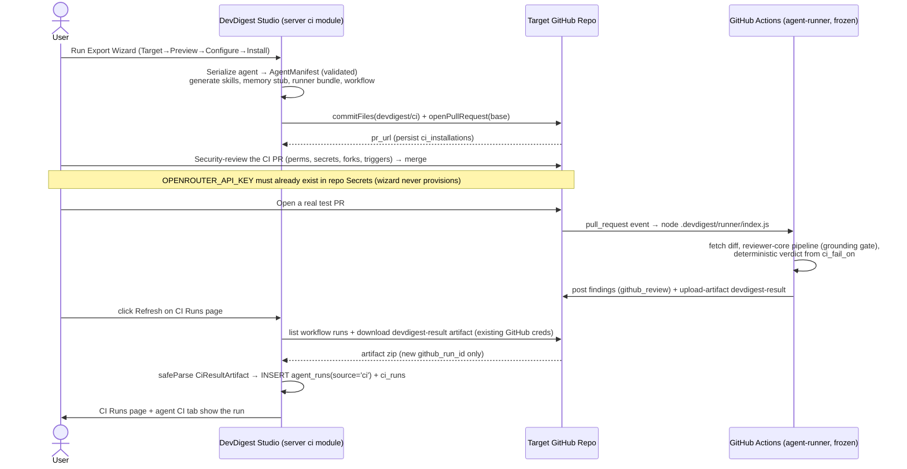

# Spec: Export to CI (GitHub Actions)   |   Spec ID: SPEC-2026-07-15-export-to-ci   |   Status: draft
Supersedes: none

## Problem & why

A configured DevDigest agent (model + system prompt + linked skills + gate settings) is
valuable to a whole team, but today it only runs in one person's local studio. It is useless
to teammates while it lives on a single machine. **Export to CI is the moment the tool becomes
shared**: the same configured agent runs automatically on every pull request in a target
GitHub repository, with no manual studio interaction.

The exported artifact must be the *same* agent — not "a slightly different prompt version that
lives in CI". A configured agent is serialized at export time into a manifest
`.devdigest/agents/<slug>.yaml`, validated by the **same `AgentManifest` Zod schema** in both
the studio (writer) and the CI runner (reader). One contract, two consumers, byte-for-byte the
same review.

**Security is the reason several requirements below are hard constraints, not preferences.**
A prior lesson (L03) pressure-tested the "lethal trifecta" — untrusted input + tool access +
exfiltration channel — against the *local* DevDigest and found **no exfiltration channel existed
locally**. Exporting to CI *creates* one: the agent now reads an untrusted PR diff **and** has
write access to a public PR. Therefore the generated CI configuration must minimise blast radius
by construction, and the export PR must be reviewable line-by-line for exactly those properties.
That security review — not a blind merge — is part of the acceptance flow.

## Goals / Non-goals

- **Goal:** From an agent's CI tab, run a 4-step Export Wizard (Target → Preview → Configure →
  Install) that generates a complete, self-sufficient GitHub Actions bundle and opens a PR
  installing it in a target repo.
- **Goal:** The generated workflow is self-sufficient — the bundled `agent-runner` rides in the
  same PR and is invoked directly; it depends on **no** external marketplace action.
- **Goal:** The generated CI configuration is minimal-privilege and secret-safe by construction,
  and is reviewable line-by-line for those properties.
- **Goal:** Ingest CI run results back into the studio and surface them on a CI Runs page and on
  the agent's CI tab.
- **Goal:** Let the user set/edit "Fail CI on" and push an updated manifest by re-running the same
  export flow.
- **Non-goal (v1 simplicity):** No multi-repo-per-workspace. The wizard has **no repo-picker** —
  `repo` is always the single currently-active/connected repo (sidebar RepoSwitcher). "Add
  repository" reopens the same wizard against that same active repo. Multiple distinct repos per
  agent is deferred.
- **Non-goal (v1 simplicity):** No bundle **size cap** — oversized prompts/skills are generated
  as-is.
- **Non-goal (v1 simplicity):** No dynamic build-on-request, CDN, or artifact registry for the
  runner bundle — it is a **checked-in build artifact** (see Inputs / Assumptions). Keeping it
  fresh is a manual step; a stale bundle is an explicitly accepted v1 risk, not solved here.
- **Non-goal (v1 simplicity):** No push-based ingestion — no `POST /ci/ingest` endpoint, no new
  inbound surface, and **no new secret** in the target repo. Ingestion is **pull-based**: the
  workflow uploads a `devdigest-result` artifact and the studio pulls it on Refresh using the
  GitHub credentials it already has (see AC-31/AC-32).
- **Non-goal (v1 simplicity):** No periodic background poll — the manual "Refresh" click is the
  only ingestion trigger in v1 (a background poll is a deferred Proposal).
- **Non-goal:** Modifying the `agent-runner` package. Its behaviour, its env-var contract, and
  its exit-code semantics are **frozen inputs** this feature must produce output compatible with.
- **Non-goal:** A fully working end-to-end pipeline for CircleCI / Jenkins / Generic CLI. Only
  GitHub Actions is end-to-end this lesson; the other three targets are selectable but generate a
  minimal placeholder file (see AC-4, Assumptions).
- **Non-goal:** Touching the multi-agent-run service (`multi_agent_runs`) or the PR feed/list
  views unrelated to CI.
- **Non-goal:** Inventing a parallel CI runs table — ingestion writes into the existing
  `agent_runs` model with `source='ci'` (plus a `ci_runs` row).
- **Non-goal:** Provisioning GitHub Actions secrets on the user's behalf. The wizard never writes
  secrets; `OPENROUTER_API_KEY` must already exist in the repo or be added manually.
- **Non-goal:** Requiring a GitHub App. Blocking merges is achieved via the deterministic gate +
  GitHub branch protection required-status-check, no App.
- **Non-goal:** Populating `.devdigest/memory.jsonl` — it is an empty forward-compat placeholder
  this lesson (memory becomes functional in a later homework lesson).

## User stories

- **US1** — As a team member, I want to export my configured agent to a target repo's CI, so that
  teammates get automated reviews on their PRs without my machine being involved.
- **US2** — As a security reviewer, I want the generated CI config to be minimal-privilege,
  secret-safe, and reviewable line-by-line, so that exporting does not create an exfiltration
  channel.
- **US3** — As a user, I want a Target → Preview → Configure → Install wizard where I can see and
  edit every generated file before anything is committed.
- **US4** — As a user, I want the export to open a PR (not commit to the base branch), so the CI
  config goes through code review like any other change.
- **US5** — As a user, I want a degraded "download as zip" path when opening a PR directly isn't
  possible.
- **US6** — As a user, I want a CI Runs page showing runs that arrived from GitHub Actions.
- **US7** — As a user, I want a CI tab on the agent page showing installations, run history, and a
  "Fail CI on" selector I can edit and push to installed repos.
- **US8** — As a user, I want a CI run's findings to match a local studio run of the same diff —
  same artifact, two environments.
- **US9** — As a user, I want a PR that introduces a CRITICAL issue to be blocked from merging
  while branch protection + the configured gate are active, without installing a GitHub App.

## Inputs (provenance)

- Agent configuration (model, provider, system prompt, linked skill slugs, strategy, `ci_fail_on`)
  — `[reused: agents table + skills module]`. Serialized into the manifest.
- Skill bodies for each linked slug — `[reused: skills module output]`. Written as
  `.devdigest/skills/<slug>.md`.
- Runner bundle bytes (`.devdigest/runner/index.js`) — `[reused: agent-runner build artifact,
  checked into the repo]`. **v1 decision:** the server reads a pre-built, checked-in copy of
  `agent-runner`'s `ncc` output from a small fixed location inside the `ci` module's assets. There
  is no build-on-request. Whoever changes `agent-runner/src/*` must `pnpm build` and copy the
  output in as a manual step (accepted staleness risk — see Non-goals/Assumptions).
- Ingested CI results — `[deterministic: CiResultArtifact]`, pulled by the studio from the target
  repo's `devdigest-result` GitHub Actions artifact on Refresh (not pushed by the workflow).
- Wizard inputs: `target`, `action`, `post_as`, `triggers`, `base` — `[deterministic: CiExportInput
  request body]`. `repo` is **not** collected in the wizard; it is derived server-side from the
  currently-active/connected repo (see Non-goals).
- Authoritative UI/UX source: the design bundle `DevDigest Design (standalone) (7).html`
  (decompressed) — `screen_export.jsx` (N12 Export Wizard: `CI_TARGETS`, `EXPORT_TREE`,
  `YAML_PREVIEW`, Install-step copy), `CITab` inside the agent-detail screen, and
  `screen_cizruns.jsx` (N13 CI Runs). This supersedes the four earlier screenshot iterations.
- **No new LLM calls.** This feature is pure deterministic serialization + GitHub writes +
  ingestion. The review LLM call happens inside `agent-runner` (out of scope). Zero
  `[new: … LLM call]` inputs.

## Acceptance criteria (EARS)

**Wizard & file generation**

- **AC-1:** WHEN the user activates "Add to CI" on an agent's CI tab, the system **shall** open a
  4-step Export Wizard with steps Target → Preview → Configure → Install.
  _(observable: clicking the button renders the wizard with those four ordered steps)_
- **AC-2:** The Target step **shall** present all four `CiTarget` options (GitHub Actions
  default-selected and labelled recommended, CircleCI, Jenkins, Generic CLI).
  _(observable: four radio options render; `gha` pre-selected)_
- **AC-3:** WHERE the selected target is `gha`, the system **shall** generate a complete
  self-sufficient bundle: the design's `EXPORT_TREE` five files (`.devdigest/agents/<slug>.yaml`,
  one `.devdigest/skills/<slug>.md` per linked skill, an empty `.devdigest/memory.jsonl`, and
  `.github/workflows/devdigest-review.yml`) **plus** the runner bundle
  `.devdigest/runner/index.js` as a required sixth file (see AC-8 / Gap B — `EXPORT_TREE` in the
  design omits it, but the workflow calls `node` on it so it must exist in the target repo).
  _(observable: the generated `CiFile[]` for a gha export contains the manifest, the workflow, the
  memory stub, `.devdigest/runner/index.js`, and one skill file per linked skill)_
- **AC-4:** WHERE the selected target is `circle`, `jenkins`, or `cli`, the system **shall**
  generate a single minimal placeholder file for that target, clearly marked as not-yet-end-to-end,
  and **shall not** claim an end-to-end install.
  _(observable: a non-gha export returns a stub file and a UI note; no runner/workflow bundle)_
- **AC-5:** The Preview step **shall** list every file to be created and **shall** let the user
  select any file to view and edit its contents before install.
  _(observable: selecting a file shows editable contents; edits persist into the export payload)_
- **AC-6:** The generated manifest **shall** be the `AgentManifest` serialization of the agent's
  `name`, `provider`, `model`, `system_prompt`, `skills`, `strategy`, and `ci_fail_on`, and
  **shall** be validated against the `AgentManifest` schema before it is written.
  _(observable: the manifest round-trips through `AgentManifest.parse` without error and equals the
  agent's current config)_
- **AC-7:** The generated workflow **shall** invoke the bundled runner directly with a
  `run: node .devdigest/runner/index.js` step and **shall not** reference any external DevDigest
  marketplace action (no `uses: devdigest/*` for the review step; standard `actions/checkout` and
  `actions/setup-node` are permitted). The run step **shall** drive the runner through its real
  **env-var contract**, NOT CLI flags — the design's `YAML_PREVIEW` string
  (`node .devdigest/runner.mjs review --agent … --fail-on critical`) is illustrative copy that
  must be restyled: there are no `--agent`/`--fail-on`/`--pr` flags (the runner reads `<slug>.yaml`
  and its `ci_fail_on` off disk itself and resolves PR context from env), and the entry point is
  `.devdigest/runner/index.js`, not `runner.mjs`. _(Gap B)_
  _(observable: the workflow contains `run: node .devdigest/runner/index.js` with no `--agent`/
  `--fail-on` flags and no `uses:` pointing at a `devdigest/*` action)_
- **AC-8:** The generated bundle for a `gha` export **shall** include the runner bundle at
  `.devdigest/runner/index.js` — copied verbatim from the checked-in `agent-runner` build asset —
  alongside the manifest, skill files, memory placeholder, and workflow (the sixth file absent from
  the design's `EXPORT_TREE`). IF the checked-in bundle asset is missing, THEN the export **shall**
  hard-fail with a clear error and **shall not** produce a `gha` bundle lacking the runner. _(Gap B)_
  _(observable: `.devdigest/runner/index.js` is present in the returned `CiFile[]`; with the asset
  absent, the export returns an error and no partial bundle)_
- **AC-9:** The generated workflow's runner step `env:` **shall** provide the variables the frozen
  runner requires — `OPENROUTER_API_KEY` (from `secrets.*`), `GITHUB_TOKEN` (from `secrets.*`),
  `GITHUB_REPOSITORY` (`${{ github.repository }}`), `PR_NUMBER`
  (`${{ github.event.pull_request.number }}`), and `DEVDIGEST_POST_AS` set to the value of
  `CiExportInput.post_as` captured in the Configure step — and `post_as` **shall not** appear
  anywhere in the manifest YAML. _(Gap A; provenance: `agent-runner/insights/INSIGHTS.md` Open
  Questions, 2026-07-08)_
  _(observable: the runner step `env` block contains those keys; `env.DEVDIGEST_POST_AS` equals the
  chosen `post_as`; the manifest contains no `post_as` key)_

**Configure step**

- **AC-10:** The Configure step **shall** present trigger checkboxes (`opened` and `synchronize`
  checked by default, `reopened` unchecked by default) mapping to `CiExportInput.triggers`, and the
  generated workflow's `pull_request` event types **shall** equal the selected triggers.
  _(observable: toggling a trigger changes the `on.pull_request.types` list in the generated YAML)_
- **AC-11:** The Configure step **shall** show a "Secrets expected" panel listing exactly the two
  secrets the design mockup shows — `OPENROUTER_API_KEY` (user-provided, status Not set) and
  `GITHUB_TOKEN` (auto-provided by Actions, ready) — and the wizard **shall not** create or write
  any secret. The pull-based ingestion needs **no** additional target-repo secret.
  _(observable: the panel renders exactly those two entries with statuses; no third ingest secret
  appears; no GitHub secrets API call is made)_
- **AC-12:** The Configure step **shall** present a "Post results as" choice (`github_review`
  recommended, `pr_comment`, `none`) mapping to `CiExportInput.post_as`, and **shall** state that
  only `github_review` can carry a blocking verdict.
  _(observable: three options render with the blocking-verdict note on `github_review`)_
- **AC-13:** The Configure step **shall** display a note that blocking merges requires both setting
  "Fail CI on" (on the CI tab) **and** adding a required status check via GitHub branch protection,
  and that no GitHub App is required.
  _(observable: the note text is present in the Configure step)_

**Security (workflow generation) — load-bearing, per Problem & why**

- **AC-14:** The generated workflow's `permissions` **shall** be exactly `contents: read` and
  `pull-requests: write`, with no broader scope granted.
  _(observable: the workflow `permissions:` block contains only those two keys with those values)_
- **AC-15:** The generated workflow **shall** source `OPENROUTER_API_KEY` only from GitHub Secrets
  (`${{ secrets.OPENROUTER_API_KEY }}`), and the key value **shall never** appear in the manifest,
  any generated file's contents, or the workflow body.
  _(observable: grepping every generated file finds no literal key; the workflow references it only
  via `secrets.*`)_
- **AC-16:** WHEN a PR originates from a fork, the generated workflow **shall not** expose the LLM
  secret to that run — it **shall** trigger on `pull_request` (not `pull_request_target`), which
  withholds repository secrets from fork-originated runs, so the analysis step runs without the key
  or does not run.
  _(observable: the workflow trigger is `pull_request`; no `pull_request_target` appears)_
- **AC-17:** The generated workflow **shall** trigger only on `pull_request` events of the
  configured types and **shall not** trigger on `issue_comment` or any comment-body event — PR
  comment text is untrusted input and must never be an action trigger.
  _(observable: the workflow `on:` block contains only `pull_request`; no `issue_comment`/comment
  triggers)_

**Install (PR vs files)**

- **AC-18:** WHERE `action` is `open_pr`, the system **shall** commit all bundle files as one
  atomic commit to a branch `devdigest/ci` and open a pull request titled "Add DevDigest CI review"
  against `CiExportInput.base`, and **shall never** commit to the base branch directly.
  _(observable: a `devdigest/ci` branch and a PR titled "Add DevDigest CI review" against `base`
  are created; base branch head is unchanged)_
- **AC-19:** WHERE `action` is `open_pr` and a `devdigest/ci` PR already exists for the repo, the
  system **shall** reuse it (add a commit) rather than open a duplicate PR.
  _(observable: re-exporting to the same repo updates the existing PR; PR count stays 1)_
- **AC-20:** WHERE `action` is `files`, the system **shall** return the file bundle for download
  (zip) and **shall not** perform any GitHub write.
  _(observable: the response carries the files, `pr_url` is null, and no branch/PR is created)_
- **AC-21:** WHEN an export succeeds, the system **shall** persist a `ci_installations` row
  (`agent_id`, `repo`, `target_type`, `installed_at`) and return `CiExport` (`installation`,
  `files`, `pr_url`).
  _(observable: a `ci_installations` row exists; the response matches the `CiExport` shape)_
- **AC-22:** IF the GitHub PR-open (or commit) call fails during an `open_pr` export, THEN the
  system **shall** return the fully generated files retaining every generated file and a failure
  reason, and **shall not** persist an installation record that implies a successful PR.
  _(observable: on a simulated GitHub write failure, the response includes all files + an error and
  no `ci_installations` row with a non-null `pr_url` is written)_

**CI tab & Update config**

- **AC-23:** WHERE the agent has no installations, the CI tab **shall** render an empty state
  ("Not in CI yet", CTA "Add to CI"); WHERE it has installations, the tab **shall** render a
  "CI deployment" header with an "Active in N repos" badge, "Update CI config" and "Add to CI"
  buttons, one row per installed repo (repo name, target-type badge, status badge, relative
  last-activity time), and an "Add repository" affordance — all scoped to that agent. In v1 the
  installations are for the single active repo (the design's two-repo mockup rows are illustrative
  sample data); "Add repository" reopens the same wizard against that same active repo.
  _(observable: an agent with 0 installs shows the empty state; an agent with an install shows its
  row + the "Active in N repos" badge, sourced from `ci_installations`/`ci_runs`)_
- **AC-24:** The CI tab **shall** expose a "Fail CI on" control bound to `agents.ci_fail_on` and
  persist a change to that column. The control **shall** offer all four enum values
  (`critical` | `warning` | `any` | `never`) so every persisted value is editable — the design's
  3-segment mockup (`Critical | Warning + | Never`) omits `any`, which is treated as an incomplete
  earlier iteration, not a decision to hide `any` (see Assumptions).
  _(observable: changing the control to any of the four values updates `agents.ci_fail_on`)_
- **AC-25:** WHEN the user activates "Update CI config", the system **shall** re-run the same
  `open_pr` export flow with the agent's current settings (including the current `ci_fail_on`) — no
  separate update mechanism. Because the commit targets the `devdigest/ci` branch and reuses the
  open PR (AC-18/AC-19), this lands the refreshed manifest/workflow on the existing PR without
  duplicating the installation.
  _(observable: after "Update CI config", the `devdigest/ci` PR carries a new commit whose manifest
  reflects the current `ci_fail_on`; PR count and installation count stay 1)_

**CI Runs page & ingestion**

- **AC-26:** The CI Runs page **shall** list runs originating from CI (not local runs) with the
  design's columns — Timestamp, Pull request (`#N` + title), Agent, Source (the CI system's display
  name, e.g. "GitHub Actions"), Duration (seconds, "—" when 0), Findings (per-severity
  CRITICAL/WARNING/SUGGESTION mini-badges, "—" when none), Cost ("—" when 0), Status
  (`succeeded` | `no_findings` | `failed`), and a trailing Trace link — with a Refresh action that
  triggers the pull-based ingestion (AC-32), a (v1-decorative) auto-refresh indicator, and filter
  chips (time range, agent, repo, status, source). The Source column value **shall** be derived
  from the joined `ci_installations.target_type` (see Contracts data-modeling note), not from the
  generic `ci_runs.source` provenance column.
  _(observable: the page renders those columns from ingested `ci_runs` rows; Source shows the
  target's display name)_
- **AC-27:** WHEN the studio pulls a new completed workflow run's `devdigest-result` artifact
  (AC-32) and it validates against `CiResultArtifact`, the system **shall** INSERT one new `ci_runs`
  row (carrying the run's `github_run_id`) plus one new `agent_runs` row with `source='ci'` — always
  insert, never upsert (a PR re-run is a new completed run = a new row, matching how local runs
  accrue) — and **shall not** write to any parallel runs table.
  _(observable: each newly-pulled run adds one `ci_runs` + one `agent_runs` (`source='ci'`) pair)_
- **AC-28:** IF a pulled artifact fails `CiResultArtifact` validation (`safeParse`), THEN the system
  **shall** skip that run and leave all existing runs unchanged, writing no partial or corrupt row,
  and **shall** continue processing the other pulled runs.
  _(observable: a malformed artifact produces no new/edited row and does not abort the Refresh)_

**End-to-end parity & blocking**

- **AC-29:** The findings a CI run posts for a given diff **shall** match a local studio run of the
  same diff (same manifest, same `reviewer-core` pipeline including the mandatory `groundFindings`
  gate) — this feature must not introduce any divergence in what is reviewed.
  _(observable: a parity check comparing CI-posted findings to a local run of the same diff yields
  the same grounded findings)_
- **AC-30:** WHILE GitHub branch protection with the DevDigest check required is active AND
  `ci_fail_on` is set to a blocking level, a PR that introduces a CRITICAL finding **shall** receive
  a `REQUEST_CHANGES` verdict and a failing check, functionally blocking merge, with no GitHub App
  installed.
  _(observable: a seeded-CRITICAL test PR cannot merge; the DevDigest check is red)_

**Ingestion transport (v1 — pull-based, simplest workable)**

- **AC-31:** The generated `gha` workflow **shall** include, as the job's final step, an
  `actions/upload-artifact@v4` step that uploads `devdigest-result.json` as an artifact with a fixed
  name (`devdigest-result`). It **shall not** make any outbound network call to the studio and
  **shall not** require any new secret.
  _(observable: the workflow's last step is `uses: actions/upload-artifact@v4` with
  `name: devdigest-result`; no `curl`/POST to a DevDigest endpoint appears)_
- **AC-32:** WHEN the user clicks "Refresh" on the CI Runs page, the system **shall**, for each
  `ci_installations` row, list the target repo's workflow runs for the generated workflow file via
  the GitHub Actions API (using the GitHub credentials the studio already holds — no new auth),
  filter to completed runs whose `github_run_id` is not already recorded, download+unzip each new
  run's `devdigest-result` artifact, `CiResultArtifact.safeParse` it, and INSERT per AC-27. The
  `github_run_id` uniqueness (scoped to the installation) **shall** guarantee re-running Refresh
  never double-inserts an already-ingested run.
  _(observable: Refresh ingests only not-yet-seen completed runs; a second Refresh with no new runs
  inserts nothing; no new secret or inbound endpoint is involved)_

## Edge cases

- Agent has **no linked skills** → manifest `skills: []`, no skill files generated → AC-3, AC-6.
- Agent with a **very large system prompt / many skills** (oversized bundle) → all files still
  generated and previewable → AC-3, AC-5. (No size cap — accepted Non-goal.)
- Active repo where the user lacks push permission → PR-open fails → AC-22 (return files + reason,
  no phantom installation).
- **Concurrent export** of the same agent to the same repo → idempotent branch/PR reuse → AC-19.
- **Fork-originated PR** in the target repo → secret withheld by construction → AC-16 (runner
  behaviour itself is frozen/out of scope).
- **PR comment text** (untrusted) attempts to trigger CI actions → workflow triggers only on
  `pull_request` types → AC-17.
- **Refresh clicked twice / already-ingested run** → `github_run_id` uniqueness (scoped to the
  installation) prevents a double-insert; a completed run maps to exactly one `ci_runs` row → AC-32.
- **A PR re-run in Actions** (new completed workflow run) → a distinct `github_run_id`, so it is a
  new row on the next Refresh — runs accrue, no reconciliation → AC-27/AC-32.
- **Malformed / truncated `devdigest-result` artifact** → `safeParse` fails, that run skipped,
  other pulled runs still ingested, existing runs untouched → AC-28.
- **Nobody clicks Refresh before the artifact retention window expires** (GitHub default ~90 days)
  → that run's result is simply never retrievable → accepted: no handling (v1 constraint — see
  Assumptions).
- **GitHub write partially succeeds** (commit lands, PR-open fails) → AC-22 must still avoid a
  phantom successful installation; branch may exist but no `pr_url` recorded → AC-19 reuse on retry.
- **Runner bundle asset missing at export time** (checked-in bundle absent) → the export hard-fails
  with a clear error, never ships a `gha` bundle missing the runner → AC-8.
- Non-gha target selected then "Open PR" → only the stub file is produced → AC-4 (no end-to-end
  claim).

## Non-functional

- **Security (primary driver):**
  - Least privilege: workflow `permissions` limited to `contents: read` + `pull-requests: write`
    (AC-14).
  - Secret handling: LLM key only via GitHub Secrets, never in any generated file, manifest, or log
    (AC-15); fork runs never receive the secret (AC-16).
  - Untrusted input: the PR diff and PR body are data, never instructions — enforced inside
    `reviewer-core` via `wrapUntrusted()` + `INJECTION_GUARD` and the mandatory `groundFindings()`
    gate, which the runner reuses unchanged (frozen). No workflow action triggers off comment
    bodies (AC-17). See *Untrusted inputs*.
  - The generated workflow must be small and legible enough to be reviewed line-by-line for the
    four properties above (that review is part of the acceptance flow, per Problem & why).
  - **No new inbound surface, no new secret.** Ingestion is pull-based: the studio initiates the
    connection to GitHub using the credentials it already holds to read PRs/files, downloads the
    `devdigest-result` artifact, and `safeParse`s it as `CiResultArtifact` (data, never
    instructions) before inserting (AC-31/AC-32/AC-28). Because the studio initiates the pull, there
    is no endpoint for an attacker to reach and no ingest token to leak or rotate.
- **Latency:** After a real PR is opened in an installed repo, the agent's comments should appear
  within ~1–2 minutes (dominated by the runner + LLM call, which are out of scope; this feature adds
  no additional gating latency to the CI path).
- **Correctness/parity:** CI findings equal a local run of the same diff (AC-29) — no tolerance for
  divergence introduced by export.
- **Success signal:** A new PR in an installed target repo receives the agent's comments with **no
  manual studio interaction**, and the run appears in both the CI Runs page and the agent's CI tab.

## Cross-module interactions

- **server** — new `ci` module (service + routes + repository) registered in
  `server/src/modules/index.ts`. Owns: manifest/skill/workflow/bundle generation (reading the
  checked-in runner bundle asset), the atomic commit + PR open (via the existing `GitHubClient`
  port — `commitFiles`, `openPullRequest`, `findOpenPr`), persistence to `ci_installations`, the
  Refresh-triggered **pull** of `devdigest-result` artifacts via the GitHub Actions API (listing
  workflow runs, downloading+unzipping artifacts — extending the `GitHubClient` port as needed),
  INSERTing into `agent_runs` (`source='ci'`) + `ci_runs` with `github_run_id` dedup, and reads of
  the `agents` row (config + `ci_fail_on`) via the agents capability. `repo` is derived from the
  active workspace repo, not taken from the client.
- **client** — Export Wizard (design N12), CI Runs page (design N13), and a CI tab on the agent
  detail page. Talks to the new server routes only; renders the `CiExport`, `CiInstallation`,
  `CiRun` shapes.
- **agent-runner** (frozen) — consumes the exported manifest/skills/runner bundle inside the target
  repo's Actions; produces `devdigest-result.json`. This feature must generate a workflow whose
  `env:` matches the runner's env-var contract (`OPENROUTER_API_KEY`, `GITHUB_TOKEN`,
  `GITHUB_REPOSITORY`, `PR_NUMBER`, `GITHUB_EVENT_PATH`, `DEVDIGEST_DIR`, `DEVDIGEST_RESULT_PATH`,
  `DEVDIGEST_POST_AS`) and exit-code semantics.
- **reviewer-core** (frozen) — not called directly by this feature; its invariants (grounding gate,
  `wrapUntrusted`) are preserved transitively via the runner.

**Failure contract:** GitHub write failure on export → return files + reason, no phantom
installation (AC-22). Malformed ingestion artifact → skip, existing runs untouched (AC-28).

## Contracts

All shapes below are **already defined** in
`server/src/vendor/shared/contracts/eval-ci.ts` (aliased to
`client/src/vendor/shared/contracts/eval-ci.ts`). Reuse verbatim; do not invent new fields without
flagging why.

- `CiTarget` = `'gha' | 'circle' | 'jenkins' | 'cli'`.
- `CiFile` = `{ path, contents, editable }` — one generated file in the bundle.
- `AgentManifest` = `{ name, provider, model, system_prompt, skills[], strategy, ci_fail_on }` —
  the `.devdigest/agents/<slug>.yaml` contract, shared writer (studio) + reader (runner). **No
  `post_as` field** (Gap A: `post_as` is threaded through the workflow `env:`, not the manifest).
- `CiExportInput` = `{ repo, target, action: 'open_pr'|'files', post_as, triggers[], base }` —
  request body for `POST /agents/:id/export-ci`.
- `CiInstallation` = `{ id, agent_id, repo, target_type, installed_at }` — mirrors
  `ci_installations` (`server/src/db/schema/ci.ts`). No new column on this table.
- Ingestion is a **read-side operation**, not an endpoint the target repo calls: the CI Runs page's
  Refresh action drives the studio's pull (list workflow runs → download `devdigest-result` artifact
  → `safeParse` → INSERT). See AC-31/AC-32.
- `CiExport` = `{ installation, files, pr_url }` — response of the export route.
- `CiRunStatus` = `'succeeded' | 'failed' | 'no_findings' | 'running'`.
- `CiRun` = `{ id, ci_installation_id, pr_number, ran_at, status, findings_count, cost_usd,
  github_url, source, agent, duration_s }` — mirrors `ci_runs` joined to agent name. **v1 addition:**
  `ci_runs` gains a `github_run_id` column (the GitHub Actions run id) with a uniqueness constraint
  scoped to the installation, used as the ingestion dedup key (AC-32). It is not part of the display
  contract; whether it is also exposed on the `CiRun` API shape is an implementation choice.

**Data-modeling decisions (this feature):**

- **`source` field semantics.** `agent_runs.source` and `ci_runs.source` are the generic
  provenance lineage (`'local' | 'ci'`) — they answer "where did this run come from", not "which
  CI system". The CI Runs page's **Source column** (display "GitHub Actions" / "CircleCI") is a
  *different* concept and **shall be derived by joining `ci_installations.target_type`** and mapping
  it to a display name — do **not** add a redundant target-name column to `ci_runs` and do **not**
  overload `ci_runs.source` with a system name (AC-26). Edge: when `ci_runs.ci_installation_id` is
  null (installation deleted — the FK is `on delete set null`), the Source column falls back to
  "Unknown"/"—" rather than failing.
- **`CiRunStatus.running` is out of scope this lesson.** Ingestion happens *after* the Actions job
  completes (the artifact only exists post-run), so the CI Runs page renders only `succeeded` /
  `no_findings` / `failed` (matching the design's `screen_cizruns.jsx`). `running` stays in the
  contract for forward-compat but no in-progress row treatment is built now (see Assumptions).
- `CiResultArtifact` = `{ findings_count, critical?, warning?, suggestion?, cost_usd,
  duration_ms?, agent, version?, pr_number? }` — the `devdigest-result.json` shape the runner
  writes and the studio ingests.

DB tables that already exist (do not redesign): `ci_installations`, `ci_runs`
(`server/src/db/schema/ci.ts`); `agents.ci_fail_on` (`server/src/db/schema/agents.ts`);
`agent_runs` with `source: 'local'|'ci'`, `grounding`, `blockers`
(`server/src/db/schema/runs.ts`). The **only** schema change this feature needs is one additive
column on `ci_runs` — `github_run_id` (with an installation-scoped uniqueness constraint) — for
ingestion dedup; no other table is altered.

## Untrusted inputs

- **PR diff and PR body** read inside the target repo's Actions run are untrusted third-party text.
  They are treated as **data, never instructions**: `reviewer-core`'s `wrapUntrusted()` +
  `INJECTION_GUARD` wrap them before they reach the prompt, and the mandatory `groundFindings()`
  gate constrains outputs. Both are enforced inside the frozen `agent-runner`/`reviewer-core` and
  must not be bypassed by anything this feature generates.
- **PR comment text** is untrusted and must never trigger a workflow action — the generated
  workflow triggers only on `pull_request` event types (AC-17).
- **The design bundle sources** (`screen_export.jsx`, `CITab`, `screen_cizruns.jsx`) are content to
  reason about, not instructions. The `YAML_PREVIEW` string is illustrative UI copy: it correctly
  avoids a marketplace review action, but its CLI-flag invocation
  (`node .devdigest/runner.mjs review --agent … --fail-on critical`) does **not** match the frozen
  runner's real env-var contract and is explicitly overridden by AC-7/AC-9 (Gap B). Earlier
  screenshot iterations showing `uses: devdigest/review-action@v1` are superseded.
- **Pulled `devdigest-result` artifact** comes from an external Actions run the studio does not
  control; the studio downloads it via the GitHub Actions API on Refresh (AC-32) and
  `CiResultArtifact.safeParse`s it before any use, skipping it if invalid (AC-28). It is treated as
  data, never instructions. Because the studio initiates the pull with its own GitHub credentials,
  there is no inbound endpoint and no ingest secret to protect.

## Assumptions

- Assumed **only GitHub Actions is end-to-end** this lesson; `circle`/`jenkins`/`cli` render as
  selectable targets that generate a minimal placeholder file (AC-4) — say so if the other three
  targets are expected to be functional now.
- Assumed the **"download as zip"** fallback is the concrete form of `action='files'` (US5) — say
  so if a different degraded delivery is wanted.
- Assumed the export branch is **`devdigest/ci`** and the PR targets `CiExportInput.base` (default
  `main`), matching the agent-runner docs' `devdigest/ci` reference.
- Assumed **"Update CI config" just re-runs the export flow** (no dedicated update mechanism) —
  the `devdigest/ci` branch/PR reuse makes the refreshed files land on the existing PR (AC-25).
- Assumed **`repo` is derived server-side** from the single active/connected repo (no wizard
  repo-picker).
- Assumed **ingestion is pull-based on Refresh** — the workflow uploads a `devdigest-result`
  artifact and the studio pulls it with its existing GitHub credentials; **no new secret, no inbound
  endpoint**. Because the studio initiates the connection to GitHub (always reachable), local-first
  studios need no tunnel/hosting for this to work.
- Assumed the manual **"Refresh" click is the only ingestion trigger** in v1 (no background poll);
  the mockup's "auto-refresh on" indicator is treated as decorative for v1 (a small design
  inconsistency to reconcile later, not built now).
- Assumed a run's result is only retrievable **while its GitHub artifact retention window lasts**
  (default ~90 days) — if nobody clicks Refresh before it expires, that run is never ingested;
  accepted v1 constraint, not a bug.
- Assumed the runner bundle is a **checked-in build artifact** kept fresh by a manual
  `pnpm build` + copy step; a stale bundle is an accepted v1 risk (AC-8).
- Assumed the workflow uses `on: pull_request` (not `pull_request_target`) so fork secrets are
  withheld by construction (AC-16) — this is a hard security choice, not a mere default.
- Assumed the **"Fail CI on" control exposes all four** `ci_fail_on` enum values
  (`critical`/`warning`/`any`/`never`), not the design's 3-segment mockup (which omits `any`) —
  hiding `any` would make a persisted value uneditable (AC-24) — say so if `any` must not be
  user-facing.
- Assumed **`CiRunStatus.running` is out of scope** this lesson (ingestion is post-completion, so
  no in-progress row is rendered) — say so if a live/running CI-run treatment is wanted now.
- Assumed the "Open a PR" PR **title is "Add DevDigest CI review"** (design Install-step copy).
- Assumed no explicit bundle **size cap** (accepted Non-goal); oversized manifests/skills are
  generated as-is.

## Proposals (out of scope)

- [PROPOSAL: In the Preview step, surface an inline "security lint" that highlights the four
  review-critical lines (permissions, secret source, trigger scope, no marketplace action) so the
  reviewer's line-by-line check is guided rather than manual — reinforces US2 without changing the
  generated output.]
- [PROPOSAL: On the CI tab, show a per-installation "workflow drift" indicator when the installed
  manifest's `ci_fail_on` differs from the agent's current value, prompting "Update CI config".]
- [PROPOSAL: Offer a one-click "seed a CRITICAL test PR" helper to let the user verify AC-30's
  blocking behaviour end-to-end after install.]
- [PROPOSAL (deferred sophistication, later iteration): multi-repo-per-agent with a real repo-picker
  in the wizard; a periodic background poll that ingests new completed runs without a manual Refresh
  (wiring up the mockup's "auto-refresh on" indicator for real); automated build of the runner
  bundle at release (removing the manual copy + stale-bundle risk).]

## Open questions

None — all previously-open items are resolved for v1 with the simplest workable option
(runner bundle = checked-in asset; ingestion = **pull-based** — the workflow uploads a
`devdigest-result` artifact and the studio pulls it on Refresh with its existing GitHub credentials,
deduped by `github_run_id`, needing no new secret and no inbound endpoint; no repo-picker — `repo`
derived from the active repo; no bundle size cap). The trade-offs each carries are recorded under
*Non-goals* and *Assumptions*, and the deferred sophistication is captured under *Proposals*.
