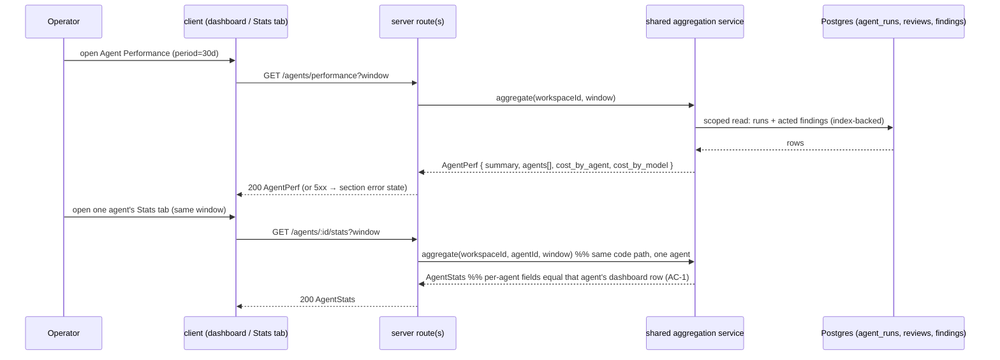

# Spec: Agent Performance dashboard + per-agent Stats tab   |   Spec ID: SPEC-2026-07-17-agent-performance-dashboard   |   Status: approved
Supersedes: none

## Problem & why
DevDigest runs multiple review agents, but there is no place to answer the two questions an
operator actually cares about: **which agents earn their keep, and what do they cost.** Every
run already writes an `agent_runs` row (cost, duration, provider/model, status) and every review
writes `findings` that a human later accepts or dismisses — the data exists, but it is never
aggregated into a decision-making surface. This feature adds a workspace-wide **Agent
Performance** dashboard plus the per-agent **Stats** tab it depends on, both reading only
already-stored rows. Accept rate is the headline quality signal; cost breakdowns expose where
the money goes. Building both on **one shared aggregation implementation** guarantees the two
surfaces agree by construction rather than by coincidence.

## Goals / Non-goals
- Goal: A new **Agent Performance** item in the sidebar `GLOBAL` section and its own
  workspace-wide screen (not scoped to the selected repo), matching the design mock.
- Goal: A new per-agent **Stats** tab in the agent editor, backed by `GET /agents/:id/stats`.
- Goal: A **single backend aggregation** feeding both `GET /agents/:id/stats` (one agent) and
  `GET /agents/performance` (all agents + summary + cost breakdowns), so per-agent numbers are
  identical across the two surfaces for the same period.
- Goal: Period selector — **30 days**, **1 day**, and a **custom date range**.
- Goal: Summary cards, sortable agent table (default accept-rate desc), row-expand inline trend,
  and two cost-breakdown donuts (by agent, by model).
- Goal: Explicit **loading / empty / error** states for every data section; no fabricated
  zero-metrics while loading or on error.
- Non-goal: **No new model/LLM calls anywhere.** This feature never triggers a review run,
  re-scores, or calls any provider — it is a pure read/aggregate/render path.
- Non-goal: **No changes to the fixed wire contracts** in `vendor/shared/contracts/`
  (`AgentStats`, `AgentPerf`, `AgentPerfRow`, `PerfCostSegment`, `StatPoint`). They are
  do-not-touch; this spec designs the route and service *around* them.
- Non-goal: No new persistence, no new columns, no migration. Aggregation is read-only over
  existing `agent_runs` + `reviews`/`findings`.
- Non-goal: No cross-repo drill-down, no per-PR breakdown, no export/download, no scheduled
  reports, no alerting on cost/accept-rate thresholds (record any of these as future work).
- Non-goal: Editing an agent from this screen — the row action only navigates to the agent page.

## User stories
- As an operator, I want a global Agent Performance screen, so that I can see which agents are
  useful and what they cost without opening each agent individually.
- As an operator, I want to switch the reporting period (30 days / 1 day / custom range), so
  that I can compare recent behaviour against a longer baseline.
- As an operator, I want the table sorted by accept rate by default with trend arrows, so that
  the lowest-quality agents surface without manual sorting.
- As an operator, I want to expand a table row to see an agent's recent-run trend inline, so
  that I can judge whether a low accept rate is improving or worsening.
- As an operator, I want cost broken down by agent and by model, so that I can see where spend
  concentrates.
- As an operator, I want to open a single agent's Stats tab and see the exact same numbers as
  that agent's row on the dashboard, so that I trust the data.
- As an operator, I want clear loading / empty / error states, so that I never mistake a
  still-loading or failed panel for a real "zero" reading.

## Inputs (provenance)
- Per-run facts — `agent_runs` rows: `agentId, ranAt, provider, model, durationMs, costUsd
  (nullable), status, findingsCount, score`. [deterministic: repo-intel] (already-stored DB rows)
- Finding outcomes — `findings` rows joined via `reviews` (`agentId, runId`): `acceptedAt`,
  `dismissedAt`, `severity`. [deterministic: repo-intel] (already-stored DB rows)
- Agent identity — `agents` rows (`id, name`, workspace-scoped). [deterministic: repo-intel]
- Selected period — client-supplied window (preset `30d` / `1d`, or custom `{from, to}`).
  [deterministic: request parameter]
- **New LLM calls: none.** This feature is explicitly read-only over stored rows; any
  `[new: LLM call]` here would be a defect (see AC-7, AC-15).

## Acceptance criteria (EARS)

### Aggregation correctness
- AC-1: WHEN the dashboard renders an agent's row and that same agent's Stats tab is opened for
  the identical period, the system **shall** show equal values for `runs`, `avg_cost_usd`,
  `avg_latency_ms`, and `accept_rate`, because both are produced by one shared aggregation over
  the same filtered rows. _(observable: an integration test calling `GET /agents/performance`
  and `GET /agents/:id/stats` for the same window asserts field-by-field equality for a seeded
  agent.)_
- AC-2: The system **shall** compute `summary.total_cost_usd` as the sum of `cost_usd` over the
  priced runs (`cost_usd` not null) of all attributed agents in the period, and **shall** make
  `cost_by_agent` and `cost_by_model` each sum to that same total (within floating-point
  tolerance). _(observable: unit test asserts `sum(cost_by_agent.value) == sum(cost_by_model.value)
  == summary.total_cost_usd` on seeded rows.)_
- AC-3: The system **shall** set `summary.most_active_agent` to the attributed agent with the
  highest `runs` count in the period; IF two agents tie on run count, THEN the system **shall**
  break the tie deterministically by higher `total_cost_usd`, then by `agent_name` ascending.
  _(observable: unit test with a tie asserts the documented winner.)_
- AC-4: WHERE an agent has zero runs in the selected period, the system **shall** still include
  it as a table row with `runs = 0`, `accept_rate = null`, and cost/duration fields shown as
  "—", and **shall not** emit `NaN`, `undefined`, or a divide-by-zero value. _(observable: unit
  test on a zero-run agent asserts null/`"—"` fields, never NaN.)_
- AC-16: IF an agent (or the whole workspace) has no acted-on findings in the period
  (`accepted + dismissed == 0`), THEN the system **shall** set the corresponding `accept_rate` /
  `avg_accept_rate` to `null` rather than `0`, and the UI **shall** render it as a distinct
  "no data" affordance, not `0%`. _(observable: unit test asserts `null`; UI test asserts the
  no-data glyph, not "0%".)_
- AC-11: WHERE a run is unpriced (`cost_usd` is null, e.g. a failed or un-priceable run), the
  system **shall** exclude it from cost sums and render any resulting all-null cost figure as
  "—", never "$0". _(observable: unit test with all-null costs asserts `total_cost_usd = null`;
  UI shows "—".)_

### Period & sorting
- AC-10: WHEN the operator selects a period (`30 days`, `1 day`, or a custom range), the system
  **shall** re-request both summary and table data for that window and re-render every section;
  the default period on first load **shall** be `30 days`. _(observable: UI test switching
  period issues a new request with the new window and updates the cards/table.)_
- AC-9: The system **shall** sort the agent table by `accept_rate` descending by default, placing
  rows with `accept_rate = null` last, and **shall** allow the operator to re-sort by other
  columns without refetching. _(observable: UI test asserts initial order is accept-rate desc,
  nulls last; clicking a header re-sorts client-side with no network call.)_

### Interaction
- AC-13: WHEN the operator activates a row's **View** action (or clicks the row body), the
  system **shall** navigate to that agent's page opened on its Stats tab; WHEN the operator
  toggles a row's disclosure control, the system **shall** expand/collapse an inline trend of
  that agent's recent runs without navigating. _(observable: UI test asserts View navigates to
  the agent Stats tab and the disclosure toggle expands the inline trend in place.)_
- AC-13a: WHEN a dashboard row's inline trend is expanded, the system **shall** render it from
  `AgentPerfRow.trend` (`number[]`, oldest→newest) using ordinal run positions as the x-axis,
  since that array carries no labels; the per-agent Stats tab **shall** render its own trend
  from `AgentStats.trend` (`StatPoint[]`, labelled). Both trends **shall** be derived from the
  same underlying recent-run series so their values agree. _(observable: unit test asserts the
  dashboard row's `trend` numbers equal the `value`s of the Stats tab's `trend` points for the
  same agent/period.)_
- AC-7: WHEN the operator reloads the page, changes the sort, or expands/collapses a row, the
  system **shall not** trigger a review run or any model/LLM call. _(observable: these
  interactions issue only read requests to the two GET endpoints; no run/provider call is made —
  asserted by absence of any write/run request in a UI test.)_
- AC-15: The system **shall** implement `GET /agents/performance` and `GET /agents/:id/stats` as
  read-only aggregations over `agent_runs` and `findings`/`reviews`, invoking no LLM provider,
  no review executor, and no write path. _(observable: the service has no dependency on the
  run-executor or any `LLMProvider` port; a test injecting a throwing LLM mock still returns a
  full response.)_

### States
- AC-6: WHILE data for any section (cards, table, or a donut) is loading or has errored, the
  system **shall** show a loading or error affordance for that section and **shall not** render a
  fabricated numeric metric (no "0", "0%", or "$0.00" standing in for unknown data). _(observable:
  UI test forces loading and error and asserts no numeric metric text is present in the affected
  section.)_
- AC-5: WHERE the workspace has zero attributed agent runs across all agents (in any period), the
  system **shall** render a single distinct dashboard-level empty state instead of empty cards,
  an empty table, and empty donuts. _(observable: UI test with an empty dataset asserts the
  whole-dashboard empty state renders and the cards/table/donuts do not.)_

### Structure & access
- AC-8: The system **shall** render the sections in the mock's structure: a row of four summary
  cards (Total runs, Total cost, Avg accept rate, Most-active agent), the agent table
  (Agent, Runs, Avg cost, Avg dur., Accept, Last run, View), and a Cost Breakdown section with
  two donuts (By agent, By model). _(observable: component test asserts presence and order of
  these regions.)_
- AC-12: The system **shall** scope both endpoints to the caller's workspace via the
  base-repository guard; IF `:id` in `GET /agents/:id/stats` names an agent that is not in the
  caller's workspace, THEN the system **shall** respond `404` and **shall not** disclose that
  agent's data. _(observable: an integration test requesting another workspace's agent id gets
  404 and no body leakage.)_

## Edge cases
- Empty workspace / zero runs in period → distinct dashboard empty state → AC-5.
- Agent present but zero runs in the selected period → row still rendered, null/`"—"` fields → AC-4.
- No acted findings (all pending) → `accept_rate = null`, not `0%` → AC-16.
- All runs unpriced (`cost_usd` null) → `total_cost_usd = null`, cost shown "—" → AC-11.
- Run with `agentId = null` (agent deleted; FK is `ON DELETE SET NULL`) → **excluded** from all
  dashboard/Stats aggregates so breakdowns still sum to the total → accepted: no handling (see
  Assumptions) → covered by AC-2's summation invariant.
- Failed / cancelled runs (`status != 'done'`, null cost/score) → excluded from aggregates per
  the `done`-only convention → accepted: no handling (see Assumptions).
- Large history (many runs per agent) → recent-run/last-run queries must use the existing
  `(agent_id, status, ran_at)` index, not a full scan → Non-functional (perf).
- DB unavailable / query failure → section-level error state, no fabricated metrics → AC-6.
- Concurrent loads / rapid period switching → read-only, idempotent; last response wins, stale
  responses discarded → accepted: no handling (read-only, no mutation).
- Custom range with `from > to` → request rejected (400), not auto-swapped; range wider than
  365 days → request rejected (400) → resolved per Open questions Q4.
- Agent name containing markup/script characters → rendered as text via JSX escaping, never as
  HTML and never fed to a prompt → Untrusted inputs.

## Non-functional
- **Performance:** the per-agent recent-run and last-run lookups **shall** be served by the
  existing composite index `agent_runs_agent_id_status_ran_at_idx` (`DISTINCT ON (agent_id)`
  pattern already used by `getMostRecentDoneRunsForAgents`), not a per-agent full scan. Target
  p95 latency for `GET /agents/performance` **< 800 ms** for a workspace with ≤ 50 agents and
  ≤ 100k `agent_runs` rows.
- **Access control (A01):** both endpoints deny-by-default and are workspace-scoped via the
  base-repository guard; `GET /agents/:id/stats` verifies the agent belongs to the caller's
  workspace before returning data (AC-12). No IDOR across workspaces.
- **Cost:** zero incremental LLM cost — no provider calls on any code path (AC-7, AC-15).
- **Accessibility:** the screen meets **WCAG 2.1 AA** — trend arrows and donut segments convey
  meaning by text/label as well as colour (green/red/amber arrows are paired with an
  up/down glyph and the numeric value, not colour alone); the period control and sortable
  headers are keyboard-operable with visible focus.
- **Determinism:** donut segment colours are assigned client-side by a deterministic mapping
  (segment label → colour) so the legend is stable across renders; the contract carries no
  colour field.
- Success signal: an operator can, in one screen, identify the lowest-accept-rate agent and the
  highest-cost agent for a chosen period, and the numbers match that agent's Stats tab exactly.

## Cross-module interactions
- **server** gains one new module exposing `GET /agents/performance` and `GET /agents/:id/stats`,
  registered with one line in `src/modules/index.ts`. Both routes call **one** aggregation
  service; the service reads through a repository that touches `agent_runs` + `reviews`/`findings`
  and returns domain rows shaped to the fixed `AgentPerf` / `AgentStats` contracts. The service
  depends on no `LLMProvider` and no run-executor.
- **client** gains: a nav entry in the `GLOBAL` group; a new global route/page for the dashboard;
  a new **Stats** tab in the agent editor; both fetch through `client/src/lib/api.ts` using types
  from `@devdigest/shared`. No contract is hand-duplicated.
- **Failure contract:** if either endpoint returns non-2xx, the client renders the section-level
  error state (AC-6); it never substitutes zeros. A per-workspace empty dataset is a **200 with
  empty aggregates**, which the client maps to the dashboard empty state (AC-5) — distinct from
  an error.

## Contracts
These wire shapes are **already fixed** in `vendor/shared/contracts/` and MUST NOT be changed;
listed here only so downstream agents design around them (both `server/` and `client/` vendored
copies must stay in lock-step — they are hand-maintained, not auto-synced).

- `GET /agents/:id/stats` → **`AgentStats`** (`observability.ts`): `agent_id, agent_name, runs,
  findings_total, accepted, dismissed, pending, accept_rate (nullable), dismiss_rate (nullable),
  avg_findings_per_run (nullable), total_cost_usd (nullable), avg_cost_usd (nullable),
  avg_latency_ms (nullable), findings_by_severity{CRITICAL,WARNING,SUGGESTION},
  trend: StatPoint[]` where `StatPoint = {label, value}`.
- `GET /agents/performance` → **`AgentPerf`** (`productionize.ts`):
  `summary{runs, total_cost_usd (nullable), avg_accept_rate (nullable), most_active_agent
  (nullable)}, agents: AgentPerfRow[], cost_by_agent: PerfCostSegment[], cost_by_model:
  PerfCostSegment[]`.
- `AgentPerfRow`: adds `provider (nullable), model (nullable), last_run_at (nullable)` and uses
  `trend: number[]` (unlabelled) — distinct from `AgentStats.trend: StatPoint[]`. The dashboard
  row-expand renders the `number[]`; the Stats tab renders the labelled `StatPoint[]` (AC-13a).
- `PerfCostSegment = {label, value}` — **no colour field**; the client assigns colours (see
  Non-functional / Determinism). The existing `Donut` component additionally needs a `color`
  per segment, injected client-side.
- **Request window** (query params): a preset (`30d` / `1d`) or a custom `{from, to}`. The exact
  param names/format are an implementation detail for the planner, but must express these three
  modes and default to `30d`.

## Untrusted inputs
No third-party text reaches any prompt in this feature — it makes **no** LLM calls. The only
user-controlled text rendered is **agent names** (workspace-owned configuration, not attacker
third-party content); they are displayed as text through React/JSX escaping, never via
`dangerouslySetInnerHTML` and never concatenated into a prompt or SQL string (queries are
parameterised). Period/query parameters are validated (Zod) at the route boundary and used only
to compute a time window — never interpolated into raw SQL. Net: **none** reaching a prompt;
standard output-escaping + input-validation apply.

## Assumptions
- Assumed both endpoints count **only successfully completed runs** (`status = 'done'`) in
  `runs`, cost, duration, and accept aggregates — matching the existing
  `getMostRecentDoneRunsForAgents` convention and avoiding null-cost/null-score skew from failed
  runs — say so if wrong (failed runs should be counted separately).
- Assumed runs with `agentId = null` (deleted agent) are **excluded** from all aggregates rather
  than bucketed into a synthetic "Unknown agent" row, so `cost_by_agent`/`cost_by_model` still
  sum to `summary.total_cost_usd` (AC-2) — say so if a "Deleted agents" bucket is wanted.
- Assumed a finding counts toward a period by the **run's `ran_at`** (the run that produced it),
  not by its `accepted_at`/`dismissed_at` timestamp — so `runs`, cost, and accept share one
  filter window and AC-1 holds by construction — say so if accept rate should follow the
  action date instead.
- Assumed `total_cost_usd`/`avg_cost_usd` are `null` only when there are **no priced runs** in
  the window; otherwise null-priced runs contribute 0 to the sum (per the `?? 0` convention).
- Assumed the dashboard is workspace-wide (sidebar `GLOBAL`, like CI Runs / Multi-Agent Review)
  and ignores the top-left repo switcher, since `agents` are workspace-scoped, not repo-scoped.
- Assumed the row **View** action and row-body click both navigate to the agent page's Stats
  tab, while a **separate disclosure control** performs the inline expand — reconciling
  requirement 6's "click navigates" with "expand shows trend" without a gesture conflict.
- Assumed the sidebar icon is `Activity` (closest to the mock's waveform); the planner may pick
  `TrendingUp`/`BarChart` if preferred.
- Assumed each preset period is a **rolling/trailing** window anchored at "now" (the mock labels
  it "30D"); `1 day` = trailing 24h and the custom range is `[from 00:00, to 23:59:59]` inclusive
  in UTC, per the resolved Q3/Q4 (see Open questions).

## Proposals (out of scope)
- [PROPOSAL: A cost/accept-rate threshold badge or alert (e.g. flag agents below a target accept
  rate or above a spend ceiling) — the dashboard surfaces the data but does not yet act on it.]
- [PROPOSAL: Period-over-period delta on every column (the mock already shows a `-$1.20` delta on
  Total Cost) generalised to runs/accept/duration, so trends are visible without expanding rows.]
- [PROPOSAL: CSV/JSON export of the table for finance/reporting.]
- [PROPOSAL: Deep-link the dashboard period into the URL so a shared link reproduces the view.]

## Open questions
All four blocking questions below were resolved by the requester on 2026-07-17; each decision is
now normative (see the affected AC/Assumption where noted) and no contract changed as a result.

- ~~Q1: `summary.avg_accept_rate` formula.~~ **Resolved: pooled overall** = total accepted /
  (total accepted + dismissed) across all attributed agents' acted findings (volume-weighted),
  consistent with the AC-2 summation invariant. Implements the spec's stated default.
- ~~Q2: dashboard row-expand trend semantics.~~ **Resolved:** `AgentPerfRow.trend` =
  **findings-per-run** over the last **N = 10** `done` runs, oldest→newest, rendered with ordinal
  x positions (no labels). Normative for AC-13a.
- ~~Q3: `1 day` boundary.~~ **Resolved: trailing 24 hours** from now (rolling), consistent with
  treating `30 days` as a rolling window too. No timezone handling required. Normative for AC-10
  and the period-window computation.
- ~~Q4: custom date-range picker behaviour.~~ **Resolved:** inclusive `[from 00:00, to 23:59:59]`
  UTC, `from > to` is **rejected** (not auto-swapped), maximum span **capped at 365 days**.
  Normative for AC-10 and the "Custom range with `from > to`" edge case.
