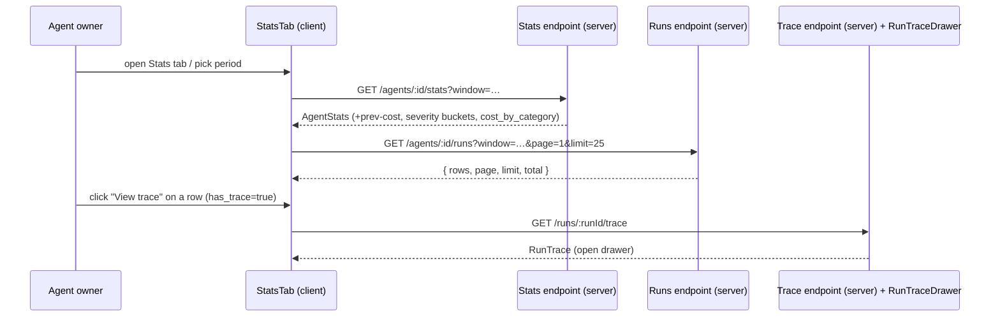

# Spec: Agent Stats tab enrichment   |   Spec ID: SPEC-2026-07-17-agent-stats-tab-enrichment   |   Status: approved
Supersedes: none

## Problem & why
The per-agent **Stats** tab (`client/.../AgentEditor/_components/StatsTab`, backed by
`GET /agents/:id/stats` → the `AgentStats` contract) already ships and works, but it renders
its data in the thinnest possible form: summary cards are plain numbers, "Findings by
Severity" is three flat count boxes with no time dimension, and "Run Trend" is a hard-to-scan
vertical list of raw ISO timestamps. The reviewed design mock for "Security Reviewer" calls
for a richer, more scannable dashboard: sparklines/deltas/a radial gauge on the summary cards,
a weekly stacked severity chart, a findings-by-category donut, and a proper Run History table
with per-row trace access. This is a **targeted enrichment of an existing, working tab** — the
summary cards, period picker (30d/1d/custom), severity data, and run-trend data must keep
working and be visually upgraded in place, not torn out and rebuilt.

All the data needed already exists in stored `agent_runs` / `findings` / `reviews` rows; this
is a pure read/aggregate/render enrichment with **no new LLM or model calls**.

## Goals / Non-goals
- **Goal:** Upgrade the four summary cards — inline sparkline on TOTAL RUNS (from existing
  `trend`), a small cost delta vs the previous comparable period on AVG COST/RUN, and a
  radial/ring gauge for ACCEPT RATE — while preserving the existing metrics and period picker.
- **Goal:** Replace the flat severity boxes with a **stacked bar chart bucketed over the
  selected window** (Critical/Warning/Suggestion segments, legend).
- **Goal:** Add a **Findings-by-Category donut** sized by cost per the decided per-finding
  formula (below), with a legend of category + dollar amount.
- **Goal:** Add a **Run History table** (Timestamp, PR link, Tokens, Cost, Findings, Source
  badge, "View trace" action) fed by a new agent-scoped, paginated endpoint, reusing the
  existing `RunTraceDrawer`.
- **Goal:** All new blocks scope to the **same period-picker window** as the rest of the tab.
- **Non-goal:** "Most-Used Skills" and "Most-Pulled Memory" blocks from the mock — explicitly
  deferred by the requester (no per-finding skill attribution, no per-run memory-pull
  tracking exists; both need new instrumentation/schema and are separate initiatives).
- **Non-goal:** Any new LLM/model call, prompt change, or re-scoring of runs.
- **Non-goal:** A new trace viewer — the Run History "View trace" action reuses the existing
  `RunTraceDrawer` + `GET /runs/:id/trace`.
- **Non-goal:** A new page, route, or nav surface — this is one tab plus its backing endpoint(s).
- **Non-goal:** Backfilling or altering `agent_runs`/`findings` columns — the table needs no
  new columns.

## User stories
- As an agent owner, I want the summary cards to show a trend sparkline, a cost delta, and an
  accept-rate gauge, so that I can read direction and health at a glance without doing mental math.
- As an agent owner, I want findings-by-severity shown over time (weekly buckets), so that I can
  see whether the agent's critical output is rising or falling within the period.
- As an agent owner, I want a findings-by-category donut with dollar amounts, so that I can see
  where this agent spends its review budget (security vs bug vs style, …).
- As an agent owner, I want a Run History table with PR links and per-row trace access, so that I
  can jump from an aggregate number to the individual run that produced it.
- As an agent owner, when an agent has no runs in the selected window, I want each block to show a
  sensible empty state rather than fabricated zeros or a crash.

## Inputs (provenance)
- Summary metrics (`runs`, `accept_rate`, `avg_cost_usd`, `avg_latency_ms`, `trend`) —
  `[reused: existing AgentStats response]`.
- Sparkline series — `[reused: AgentStats.trend]` (no new data; pure client rendering).
- Radial gauge value — `[reused: AgentStats.accept_rate]` (pure client rendering).
- Previous-period avg cost for the delta — `[deterministic: repo-intel]` aggregate over
  `agent_runs.cost_usd` in the immediately-preceding equal-length window (new `AgentStats` field).
- Weekly-bucketed severity series — `[deterministic: repo-intel]` aggregate over
  `findings` joined to `agent_runs` within the window (new `AgentStats` field).
- Findings-by-category cost breakdown — `[deterministic: repo-intel]` per the formula below
  (new `AgentStats` field).
- Run History rows — `[deterministic: repo-intel]` over `agent_runs` (+ `pullRequests` for the
  PR link), via a new paginated endpoint.
- Trace document — `[reused: GET /runs/:id/trace` + `RunTraceDrawer]`.
- **No `[new: LLM call]` inputs.** This feature adds zero model calls.

### Decided cost-by-category formula (from the requester — do not re-derive)
For each **priced run with `findings_total > 0`**, `cost_per_finding = run.cost_usd /
run.findings_total`. Then, across every finding in the selected window, sum `cost_per_finding`
grouped by `finding.category`. This sums to the window's total cost modulo unpriced/zero-finding
runs, which contribute nothing (same "exclude, don't zero" convention as the rest of the tab).
The alternative (splitting a run's cost evenly across its distinct categories) was explicitly
rejected.

## Design decision — where the new data lives (extend `AgentStats` vs a new endpoint)
Two shapes with different cardinality, so they get split deliberately:

- **Fixed-size aggregates ride the existing `AgentStats` response.** The previous-period cost
  comparison, the weekly severity buckets (bounded — a handful of buckets per window), and the
  category cost breakdown (at most 5 categories) are all small and share the tab's single
  window; adding them to `GET /agents/:id/stats` keeps the tab to one aggregate fetch.
- **The unbounded Run History row list gets its own paginated endpoint** —
  `GET /agents/:id/runs`. A run-history list can be long; folding many run rows into the one
  `AgentStats` response would bloat it and couple pagination to the aggregate fetch. A dedicated
  agent-scoped, windowed, paginated endpoint (mirroring the PR-scoped precedent
  `GET /pulls/:id/runs`, "all runs incl. failures") is the right shape.

The exact owning module/file is an implementation-planner decision; per `server/CLAUDE.md`
("new feature = new module + one line in `src/modules/index.ts`") this is an *enrichment of an
existing capability* (the module that already serves `/agents/:id/stats`), so extending that
module's repository/routes is expected rather than a brand-new module — the planner confirms.

## Acceptance criteria (EARS)
- **AC-1:** WHEN the Stats tab renders the TOTAL RUNS summary card, the system **shall** draw an
  inline sparkline from `AgentStats.trend` (oldest→newest) without any new backend field.
  _(observable: sparkline path renders from the same `trend` array the endpoint already returns;
  no new request is made for it.)_
- **AC-2:** WHEN the ACCEPT RATE card renders and `accept_rate` is non-null, the system **shall**
  display it as a radial/ring gauge showing the percentage; IF `accept_rate` is null THEN the card
  **shall** show a distinct empty/"no acted findings" state, not a 0% gauge.
  _(observable: gauge fill = `accept_rate`; null renders the empty state, never 0%.)_
- **AC-3:** WHEN the AVG COST/RUN card renders, the system **shall** show a delta versus the
  previous comparable period computed as `avg_cost_usd − <previous-period avg cost>`; IF either
  value is null (unpriced) THEN the delta **shall** render as "—", not "$0.00".
  _(observable: delta equals the difference of the two period averages; unpriced → "—".)_
- **AC-4:** The system **shall** continue to render the existing four summary metrics (RUNS,
  ACCEPT RATE, AVG COST/RUN, AVG DURATION/LATENCY) and the existing 30d/1d/custom period picker
  with their current behaviour — the enrichment is additive, not a rebuild.
  _(observable: the pre-existing card values and the period picker still function after the change.)_
- **AC-5:** WHILE a period is selected, the system **shall** scope every new block — weekly
  severity chart, category donut, and Run History — to that same window, not to all-time data.
  _(observable: changing the picker re-fetches/re-renders all new blocks against the new window.)_
- **AC-6:** WHEN the Findings-by-Severity block renders, the system **shall** draw a stacked bar
  chart over time buckets within the window, each bar split into Critical/Warning/Suggestion
  segments with a legend, fed by a bucketed severity series on `AgentStats`.
  _(observable: bar segments equal the per-bucket CRITICAL/WARNING/SUGGESTION counts for the window.)_
- **AC-7:** WHEN the Findings-by-Category block renders, the system **shall** draw a donut whose
  segments are sized by `cost_by_category` computed per the decided per-finding formula, with a
  legend of category name + dollar amount, and **shall** exclude unpriced and zero-finding runs
  (contribute nothing, not a zero slice).
  _(observable: each segment = summed `cost_per_finding` for that category; excluded runs add nothing;
  segment sum equals window total cost modulo excluded runs.)_
- **AC-8:** WHEN the Run History table renders, the system **shall** show one row per agent run in
  the window with columns Timestamp, PR, Tokens, Cost, Findings, Source, and a View-trace action,
  sorted by `ran_at` descending.
  _(observable: rows map 1:1 to `agent_runs` for the agent in the window, newest first.)_
- **AC-9:** WHEN a Run History row has a linked PR, the system **shall** render the PR cell as a
  link to that PR's page (`/repos/:repoId/pulls/:number`); IF the run has no linked PR (nullable
  `pr_id`, e.g. PR deleted) THEN the cell **shall** render "—" and no link.
  _(observable: PR cell links to the internal PR route when present; "—" when `pr_id`/number is null.)_
- **AC-10:** WHEN a Cost or Findings value is null for a run (unpriced / failed run), the system
  **shall** render "—" for that cell, never "$0" or "0".
  _(observable: null `cost_usd`/`findings_count` → "—".)_
- **AC-11:** WHEN the user activates a row's View-trace action AND the run has a persisted trace,
  the system **shall** open the existing `RunTraceDrawer` for that `run_id`; IF the run has no
  persisted trace (`has_trace` false) THEN the action **shall** be disabled/absent for that row.
  _(observable: action opens `RunTraceDrawer` with the row's run id; disabled when `has_trace` is false.)_
- **AC-12:** WHEN the Run History endpoint is requested, the system **shall** return a bounded,
  paginated page of rows scoped to the window and ordered newest-first, capping the page size.
  _(observable: response is a single bounded page; over-large `limit` is clamped.)_
- **AC-13:** The system **shall** serve `GET /agents/:id/runs` and the enriched
  `GET /agents/:id/stats` scoped to the caller's workspace and **shall** verify the agent belongs
  to that workspace; IF the agent is outside the caller's workspace THEN the system **shall** not
  return its runs or stats.
  _(observable: a request for another workspace's agent id returns not-found/forbidden, never its rows.)_
- **AC-14:** WHILE any block's data is loading, the system **shall** show a loading/skeleton state
  and **shall not** render fabricated zero metrics or empty charts as if they were real values.
  _(observable: loading shows skeletons; real zeros appear only after data resolves.)_
- **AC-15:** IF fetching the stats or the run-history page fails, THEN the system **shall** show an
  error state for the affected block, **retaining every already-rendered block that loaded
  successfully**, and **shall not** substitute fabricated zeros.
  _(observable: a failed run-history fetch shows an error in that block only; already-loaded cards/charts remain.)_
- **AC-16:** WHEN an agent has zero runs in the selected window, the system **shall** render an
  empty state for each block (empty Run History table, empty donut, zero-height severity buckets,
  flat/absent sparkline, gauge empty state) without crashing.
  _(observable: zero-run agent renders empty states across all blocks, no runtime error.)_
- **AC-17:** WHEN the Run History table renders PR titles (third-party text originating from
  GitHub), the system **shall** render them as inert text (escaped) and build the PR link from the
  internal `repoId`/`number`, never from attacker-influenceable raw URL content.
  _(observable: a PR title containing markup renders as literal text; the link target is the internal route.)_

## Edge cases
- Agent with zero runs in the window → AC-16 (empty states, no crash).
- All runs unpriced (`cost_usd` null) → AVG COST delta "—" (AC-3), donut empty (AC-7), Run History Cost "—" (AC-10).
- Runs with `findings_total = 0` → excluded from the cost-per-finding formula → AC-7.
- Failed/cancelled run rows → shown with status; Cost/Findings "—" (AC-10); View trace disabled when no trace (AC-11).
- Run whose PR was deleted (`pr_id` set null on delete) → PR cell "—", no link → AC-9.
- Very large run history → paginated, bounded page size → AC-12; other aggregates stay fixed-size.
- Trace deleted between list render and click (race: `has_trace` true but `GET /runs/:id/trace` 404) → drawer must degrade gracefully to a not-found state → AC-11 / accepted: drawer handles 404.
- DB/endpoint failure → per-block error state, other blocks retained → AC-15.
- Concurrent invocation → reads are idempotent/read-only → accepted: no special handling.
- Window shorter than one bucket (e.g. 1d) → severity bucket granularity is ambiguous, see Open questions (`[NEEDS CLARIFICATION]`).
- Request for an agent id outside the caller's workspace → AC-13 (not-found/forbidden).

## Non-functional
- **Perf:** `GET /agents/:id/runs` is served from the existing composite index
  `agent_runs_agent_id_status_ran_at_idx` (agent_id, status, ran_at); p95 latency for one page
  **< 300 ms** on a workspace with ≤ 10k agent runs. Page size default **25**, hard cap **100**.
  The enriched `GET /agents/:id/stats` must not regress its current p95 by more than **50 ms**.
- **Security (A01/IDOR):** both endpoints are workspace-scoped by the base-repository guard and
  additionally verify agent→workspace ownership (AC-13). PR titles are untrusted GitHub text
  rendered as escaped inert text; PR links are built from internal ids (AC-17). No secrets or
  cross-workspace data cross the boundary.
- **A11y:** the radial gauge, sparkline, stacked bars, and donut each expose a text/numeric
  equivalent (accessible label or adjacent value) so the metric is not conveyed by shape/colour
  alone; target **WCAG 2.1 AA** for colour contrast on the severity/category palettes.
- **Success signal:** an agent owner can, from the Stats tab, identify the highest-cost finding
  category and open the trace of a specific run in the window in **≤ 2 interactions**, with the
  numbers reconciling to the summary cards (category cost sum ≈ total cost modulo excluded runs).

## Cross-module interactions
- **client (`StatsTab`)** ↔ **server (stats module)**: the tab fetches the enriched `AgentStats`
  (one call) and pages the new `GET /agents/:id/runs`. All API access goes through
  `client/src/lib/api.ts`; types come from `@devdigest/shared` (never hand-duplicated).
- **client (Run History)** ↔ **server (reviews module)**: the View-trace action reuses the
  existing `GET /runs/:id/trace` + `RunTraceDrawer` — no new trace transport.
- **Failure contract:** each fetch fails independently; a failure in one degrades only that block
  (AC-15). Server errors are workspace-scoped and never leak cross-tenant rows (AC-13).

## Contracts
Shapes only — field names/types are the crossing surface; Zod/TS implementation and vendoring
sync are the planner's concern. Existing `AgentStats` fields are unchanged; the following are
**added**:

**`AgentStats` additions (on `GET /agents/:id/stats`)**

| Field | Shape | Notes |
|---|---|---|
| `avg_cost_usd_prev` | `number \| null` | Avg run cost over the immediately-preceding equal-length window; null when unpriced. Client computes the delta. |
| `severity_by_bucket` | `Array<{ label: string; CRITICAL: int; WARNING: int; SUGGESTION: int }>` | Ordered oldest→newest buckets within the window; bucket granularity per Open questions. |
| `cost_by_category` | `Array<{ category: FindingCategory; cost_usd: number }>` | `FindingCategory ∈ {bug, security, perf, style, test}`; per the decided per-finding formula; excludes unpriced/zero-finding runs. |

**`GET /agents/:id/runs` (new, paginated)**

Query: `window`/period (same preset+custom range the tab already uses) · `page` (default 1) ·
`limit` (default 25, cap 100). Response:

| Field | Shape | Notes |
|---|---|---|
| `rows` | `RunHistoryRow[]` | newest-first (`ran_at` desc), scoped to window + page |
| `page` | `int` | echoed page |
| `limit` | `int` | echoed/clamped page size |
| `total` | `int` | total rows in the window (for pager) |

`RunHistoryRow`:

| Field | Shape | Notes |
|---|---|---|
| `run_id` | `string` | opens `RunTraceDrawer` |
| `ran_at` | `string` (ISO) | Timestamp column |
| `pr_number` | `number \| null` | null when PR unlinked/deleted → "—" |
| `pr_title` | `string \| null` | untrusted GitHub text; rendered escaped |
| `pr_repo_id` | `string \| null` | builds `/repos/:repoId/pulls/:number` |
| `tokens_in` | `number \| null` | Tokens column (in/out) |
| `tokens_out` | `number \| null` | |
| `cost_usd` | `number \| null` | null → "—" |
| `findings_count` | `number \| null` | null → "—" |
| `source` | `'local' \| 'ci'` | badge |
| `status` | `string \| null` | run status (incl. failed) |
| `has_trace` | `boolean` | gates the View-trace action |

## Untrusted inputs
Run History renders **PR titles**, which originate from GitHub (third-party). They are treated
as **data, not commands/markup**: rendered as escaped inert text (React JSX escaping is the
boundary), and the PR link target is constructed from internal `pr_repo_id` + `pr_number`, never
from any externally-supplied URL. No diff/PR-body text reaches any prompt in this feature (no LLM
calls), so `wrapUntrusted()`/`groundFindings()` are not on this path.

## Assumptions
- Assumed the previous-period comparison for the cost delta is the equal-length window
  immediately preceding the selected one (e.g. previous 30d for a 30d selection) — say so if wrong.
- Assumed Run History **includes all run statuses** (incl. failed/cancelled), matching the
  PR-scoped precedent `GET /pulls/:id/runs` ("incl. failures") — say so if failed runs should be hidden.
- Assumed offset pagination (`page`/`limit`, default 25, cap 100) rather than cursor pagination,
  since the list is windowed and bounded — say so if cursor pagination is required.
- Assumed sparkline/delta/gauge appear only where the mock shows them (sparkline on TOTAL RUNS,
  delta on AVG COST/RUN, gauge on ACCEPT RATE), not on every card — say so if all cards should carry them.
- Assumed the enriched aggregates extend the existing vendored `AgentStats` contract (additive
  fields) rather than a parallel contract — say so if a separate contract is preferred.

## Proposals (out of scope)
- [PROPOSAL: extend the sparkline/delta treatment to the AVG DURATION card too (trend + delta),
  for symmetry across all four cards — benefit: consistent at-a-glance direction on every metric.]
- [PROPOSAL: make Run History rows filterable by source (local/CI) and status (failed only) —
  benefit: faster triage of CI vs local regressions without leaving the tab.]

## Open questions
Both resolved by the requester on 2026-07-17; both are now normative.

- ~~Severity-bucket granularity.~~ **Resolved: adaptive.** Bucket unit scales to window length
  targeting ≈6-8 buckets for a readable chart (e.g. hourly/daily granularity for a 1d window,
  weekly for 30d, scaled proportionally for a custom range) — never degenerates to a single bar
  for short windows. Normative for AC-6 and the `severity_by_bucket` field.
- ~~Cost delta percentage/colour.~~ **Resolved: show both.** The AVG COST/RUN card renders the
  absolute dollar delta AND a percentage change (e.g. "-$0.01 (-8%)"), colour-coded by direction
  (cheaper = green/positive, more expensive = red/negative). Normative for AC-3 — the percentage
  is computed client-side from `avg_cost_usd` and `avg_cost_usd_prev` (no new field needed beyond
  what's already specified).
